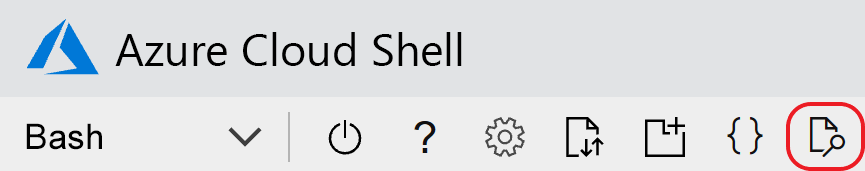

# <a name="quickstart-add-feature-flags-to-an-aspnet-core-app"></a>Schnellstart: Hinzufügen von Featureflags zu einer ASP.NET Core-App

In dieser Schnellstartanleitung erzielen Sie eine End-to-End-Implementierung der Featureverwaltung in einer ASP.NET Core-App mithilfe von Azure App Configuration. Mit dem App Configuration-Dienst speichern Sie alle Featureflags zentral und steuern ihren jeweiligen Zustand. 

Die .NET Core-Bibliotheken für die Featureverwaltung erweitern das Framework um umfassende Unterstützung für Featureflags. Diese Bibliotheken bauen auf dem .NET Core-Konfigurationssystem auf. Über ihren .NET Core-Konfigurationsanbieter lassen sie sich nahtlos in App Configuration integrieren.

## <a name="prerequisites"></a>Voraussetzungen

* Azure-Abonnement – [Erstellen eines kostenlosen Kontos](https://azure.microsoft.com/free/dotnet)
* [.NET Core SDK](https://dotnet.microsoft.com/download)

## <a name="create-an-app-configuration-store"></a>Erstellen eines App Configuration-Speichers

[!INCLUDE[Azure App Configuration resource creation steps](../../includes/azure-app-configuration-create.md)]

7. Wählen Sie **Vorgänge** > **Feature-Manager** > **Hinzufügen** aus, um ein Featureflag namens *Beta* hinzuzufügen.

    > [!div class="mx-imgBorder"]
    > 

    Lassen Sie das Feld **Bezeichnung** vorerst leer. Wählen Sie **Übernehmen** aus, um das neue Featureflag zu speichern.

## <a name="create-an-aspnet-core-web-app"></a>Erstellen einer ASP.NET Core-Web-App

Verwenden Sie die [.NET Core-Befehlszeilenschnittstelle (CLI)](/dotnet/core/tools), um ein neues Projekt vom Typ „ASP.NET Core MVC“ zu erstellen. Die .NET Core-CLI bietet gegenüber Visual Studio den Vorteil, dass sie für alle Windows-, macOS- und Linux-Plattformen verfügbar ist.

Führen Sie den folgenden Befehl aus, um ein Projekt vom Typ „ASP.NET Core MVC“ in einem neuen Ordner *TestFeatureFlags* zu erstellen:

```dotnetcli
dotnet new mvc --no-https --output TestFeatureFlags
```

[!INCLUDE[Add Secret Manager support to an ASP.NET Core project](../../includes/azure-app-configuration-add-secret-manager.md)]

## <a name="connect-to-an-app-configuration-store"></a>Herstellen einer Verbindung mit einem App Configuration-Speicher

1. Installieren Sie die NuGet-Pakete [Microsoft.Azure.AppConfiguration.AspNetCore](https://www.nuget.org/packages/Microsoft.Azure.AppConfiguration.AspNetCore) und [Microsoft.FeatureManagement.AspNetCore](https://www.nuget.org/packages/Microsoft.FeatureManagement.AspNetCore), indem Sie die folgenden Befehle ausführen:

    ```dotnetcli
    dotnet add package Microsoft.Azure.AppConfiguration.AspNetCore
    ```

    ```dotnetcli
    dotnet add package Microsoft.FeatureManagement.AspNetCore
    ```

1. Führen Sie den folgenden Befehl im selben Verzeichnis aus wie die *.csproj*-Datei. Der Befehl verwendet den Geheimnis-Manager, um ein Geheimnis namens `ConnectionStrings:AppConfig` zu speichern, das die Verbindungszeichenfolge für Ihren App Configuration-Speicher speichert. Ersetzen Sie den Platzhalterwert `<your_connection_string>` durch die Verbindungszeichenfolge Ihres App Configuration-Speichers. Die Verbindungszeichenfolge finden Sie im Azure-Portal unter **Zugriffsschlüssel**.

    ```dotnetcli
    dotnet user-secrets set ConnectionStrings:AppConfig "<your_connection_string>"
    ```

    Der Geheimnis-Manager wird nur verwendet, um die Web-App lokal zu testen. Nach dem Bereitstellen der App in [Azure App Service](https://azure.microsoft.com/services/app-service/web) verwenden Sie die Anwendungseinstellung **Verbindungszeichenfolgen** in App Service statt des Geheimnis-Managers, um die Verbindungszeichenfolge zu speichern.

    Greifen Sie mithilfe der .NET Core-Konfigurations-API auf dieses Geheimnis zu. Ein Doppelpunkt (`:`) kann im Konfigurationsnamen mit der Konfigurations-API auf allen unterstützten Plattformen verwendet werden. Weitere Informationen finden Sie unter [Konfigurationsschlüssel und -werte](/aspnet/core/fundamentals/configuration#configuration-keys-and-values).

1. Aktualisieren Sie in *Program.cs* die Methode `CreateWebHostBuilder` für die Verwendung von App Configuration durch Aufrufen der Methode `AddAzureAppConfiguration`.

    > [!IMPORTANT]
    > `CreateHostBuilder` ersetzt `CreateWebHostBuilder` in .NET Core 3.x. Wählen Sie auf der Grundlage ihrer Umgebung die richtige Syntax aus.

    #### <a name="net-core-3x"></a>[.NET Core 3.x](#tab/core3x)

    ```csharp
    public static IHostBuilder CreateHostBuilder(string[] args) =>
        Host.CreateDefaultBuilder(args)
            .ConfigureWebHostDefaults(webBuilder =>
                webBuilder.ConfigureAppConfiguration(config =>
                {
                    var settings = config.Build();
                    var connection = settings.GetConnectionString("AppConfig");
                    config.AddAzureAppConfiguration(options =>
                        options.Connect(connection).UseFeatureFlags());
                }).UseStartup<Startup>());
    ```

    #### <a name="net-core-2x"></a>[.NET Core 2.x](#tab/core2x)

    ```csharp
    public static IWebHostBuilder CreateWebHostBuilder(string[] args) =>
        WebHost.CreateDefaultBuilder(args)
               .ConfigureAppConfiguration(config =>
               {
                   var settings = config.Build();
                   var connection = settings.GetConnectionString("AppConfig");
                   config.AddAzureAppConfiguration(options =>
                       options.Connect(connection).UseFeatureFlags());
               }).UseStartup<Startup>();
    ```

    ---

    Mit der vorherigen Änderung wurde der [Konfigurationsanbieter für App Configuration](https://go.microsoft.com/fwlink/?linkid=2074664) bei der .NET Core-Konfigurations-API registriert.

1. Fügen Sie in *Startup.cs* einen Verweis auf den .NET Core-Feature-Manager hinzu:

    ```csharp
    using Microsoft.FeatureManagement;
    ```

1. Aktualisieren Sie die `Startup.ConfigureServices`-Methode, und fügen Sie Unterstützung für Featureflags hinzu, indem Sie die `AddFeatureManagement`-Methode aufrufen. Optional können Sie durch Aufrufen von `AddFeatureFilter<FilterType>()` auch Filter einschließen, die mit Featureflags verwendet werden sollen:

    #### <a name="net-core-3x"></a>[.NET Core 3.x](#tab/core3x)

    ```csharp    
    public void ConfigureServices(IServiceCollection services)
    {
        services.AddControllersWithViews();
        services.AddFeatureManagement();
    }
    ```

    #### <a name="net-core-2x"></a>[.NET Core 2.x](#tab/core2x)

    ```csharp
    public void ConfigureServices(IServiceCollection services)
    {
        services.AddMvc()
            .SetCompatibilityVersion(CompatibilityVersion.Version_2_2);
        services.AddFeatureManagement();
    }
    ```

    ---

1. Fügen Sie dem Stammprojektverzeichnis eine Datei *MyFeatureFlags.cs* mit folgendem Code hinzu:

    ```csharp
    namespace TestFeatureFlags
    {
        public enum MyFeatureFlags
        {
            Beta
        }
    }
    ```

1. Fügen Sie dem Verzeichnis *Controllers* eine Datei *BetaController.cs* mit folgendem Code hinzu:

    ```csharp
    using Microsoft.AspNetCore.Mvc;
    using Microsoft.FeatureManagement;
    using Microsoft.FeatureManagement.Mvc;

    namespace TestFeatureFlags.Controllers
    {
        public class BetaController: Controller
        {
            private readonly IFeatureManager _featureManager;

            public BetaController(IFeatureManagerSnapshot featureManager) =>
                _featureManager = featureManager;

            [FeatureGate(MyFeatureFlags.Beta)]
            public IActionResult Index() => View();
        }
    }
    ```

1. Registrieren Sie in *Views/_ViewImports.cshtml* das Taghilfsprogramm für den Feature-Manager mithilfe einer `@addTagHelper`-Anweisung:

    ```cshtml
    @addTagHelper *, Microsoft.FeatureManagement.AspNetCore
    ```

    Der vorangehende Code ermöglicht die Verwendung des `<feature>`-Taghilfsprogramms in den *.cshtml*-Dateien des Projekts.

1. Ersetzen Sie in *Views/Shared/_Layout.cshtml* den `<nav>`-Barcode unter `<body>` > `<header>` durch folgendes Markup:

    ```cshtml
    <nav class="navbar navbar-expand-sm navbar-toggleable-sm navbar-light bg-white border-bottom box-shadow mb-3">
        <div class="container">
            <a class="navbar-brand" asp-area="" asp-controller="Home" asp-action="Index">TestFeatureFlags</a>
            <button class="navbar-toggler" type="button" data-toggle="collapse" data-target=".navbar-collapse" aria-controls="navbarSupportedContent"
            aria-expanded="false" aria-label="Toggle navigation">
            <span class="navbar-toggler-icon"></span>
            </button>
            <div class="navbar-collapse collapse d-sm-inline-flex flex-sm-row-reverse">
                <ul class="navbar-nav flex-grow-1">
                    <li class="nav-item">
                        <a class="nav-link text-dark" asp-area="" asp-controller="Home" asp-action="Index">Home</a>
                    </li>
                    <feature name="Beta">
                    <li class="nav-item">
                        <a class="nav-link text-dark" asp-area="" asp-controller="Beta" asp-action="Index">Beta</a>
                    </li>
                    </feature>
                    <li class="nav-item">
                        <a class="nav-link text-dark" asp-area="" asp-controller="Home" asp-action="Privacy">Privacy</a>
                    </li>
                </ul>
            </div>
        </div>
    </nav>
    ```

    Beachten Sie im vorangehenden Markup das `<feature>`-Taghilfsprogramm, das das *Beta*-Listenelement umgibt.

1. Erstellen Sie ein Verzeichnis *Views/Beta* und eine Datei *Index.cshtml*, die das folgende Markup enthält:

    ```cshtml
    @{
        ViewData["Title"] = "Beta Home Page";
    }

    <h1>This is the beta website.</h1>
    ```

## <a name="build-and-run-the-app-locally"></a>Lokales Erstellen und Ausführen der App

1. Führen Sie den folgenden Befehl in der Befehlsshell aus, um die App mithilfe der .NET Core-CLI zu erstellen:

    ```dotnetcli
    dotnet build
    ```

1. Führen Sie nach erfolgreicher Erstellung den folgenden Befehl aus, um die Web-App lokal auszuführen:

    ```dotnetcli
    dotnet run
    ```

1. Öffnen Sie ein Browserfenster, und navigieren Sie zu `http://localhost:5000`. Dies ist die Standard-URL für die lokal gehostete Web-App. Wenn Sie in der Azure Cloud Shell arbeiten, wählen Sie die Schaltfläche **Webvorschau** und dann **Konfigurieren** aus. Wählen Sie bei entsprechender Aufforderung Port 5000 aus.

    

    In Ihrem Browser sollte eine Seite angezeigt werden, die in etwa wie die folgende Abbildung aussieht:

    :::image type="content" source="media/quickstarts/aspnet-core-feature-flag-local-before.png" alt-text="Lokale Schnellstart-App vor der Änderung" border="true":::

1. Melden Sie sich beim [Azure-Portal](https://portal.azure.com) an. Klicken Sie auf **Alle Ressourcen**, und wählen Sie dann die Instanz des App Configuration-Speichers aus, die Sie in der Schnellstartanleitung erstellt haben.

1. Wählen Sie **Feature-Manager** aus, und ändern Sie den Zustand des *Beta*-Schlüssels in **Ein**.

1. Kehren Sie zur Befehlsshell zurück. Brechen Sie den ausgeführten `dotnet`-Prozess ab, indem Sie <kbd>STRG+C</kbd> drücken. Starten Sie Ihre App mithilfe von `dotnet run` neu.

1. Aktualisieren Sie die Browserseite, um die neuen Konfigurationseinstellungen anzuzeigen.

    :::image type="content" source="media/quickstarts/aspnet-core-feature-flag-local-after.png" alt-text="Lokale Schnellstart-App vor der Änderung" border="true":::

## <a name="clean-up-resources"></a>Bereinigen von Ressourcen

[!INCLUDE[Azure App Configuration cleanup](../../includes/azure-app-configuration-cleanup.md)]

## <a name="next-steps"></a>Nächste Schritte

In dieser Schnellstartanleitung haben Sie einen neuen App Configuration-Speicher erstellt und diesen zur Verwaltung von Features in einer ASP.NET Core-Web-App über die [Feature-Manager-Bibliotheken](https://go.microsoft.com/fwlink/?linkid=2074664) verwendet.

* Weitere Informationen über die [Featureverwaltung](./concept-feature-management.md)
* [Verwalten von Featureflags](./manage-feature-flags.md)
* [Verwenden von Featureflags in einer ASP.NET Core-App](./use-feature-flags-dotnet-core.md)
* [Verwenden der dynamischen Konfiguration in einer ASP.NET Core-App](./enable-dynamic-configuration-aspnet-core.md)
