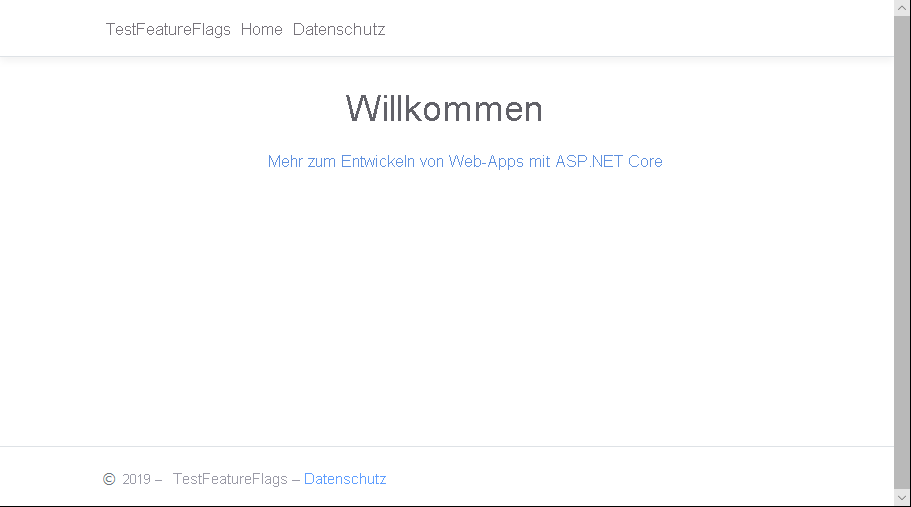
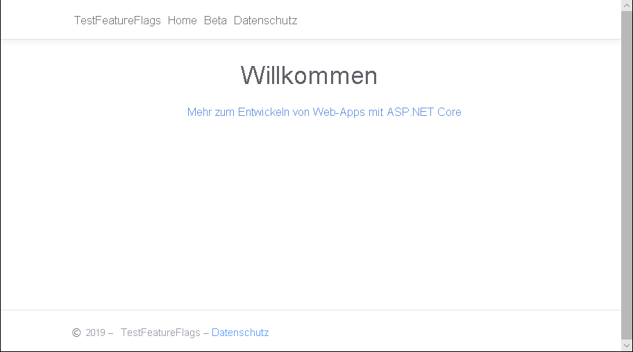

# <a name="quickstart-add-feature-flags-to-an-aspnet-core-app"></a>Schnellstart: Hinzufügen von Featureflags zu einer ASP.NET Core-App

In dieser Schnellstartanleitung erzielen Sie eine End-to-End-Implementierung der Featureverwaltung in einer ASP.NET Core-Anwendung mithilfe von Azure App Configuration. Mit dem App Configuration-Dienst speichern Sie alle Featureflags zentral und steuern ihren jeweiligen Zustand. 

Die .NET Core-Bibliotheken für die Featureverwaltung erweitern das Framework um umfassende Unterstützung für Featureflags. Diese Bibliotheken bauen auf dem .NET Core-Konfigurationssystem auf. Über ihren .NET Core-Konfigurationsanbieter lassen sie sich nahtlos in App Configuration integrieren.

## <a name="prerequisites"></a>Voraussetzungen

- Azure-Abonnement – [Erstellen eines kostenlosen Kontos](https://azure.microsoft.com/free/)
- [.NET Core SDK](https://dotnet.microsoft.com/download).

## <a name="create-an-app-configuration-store"></a>Erstellen eines App Configuration-Speichers

[!INCLUDE [azure-app-configuration-create](../../includes/azure-app-configuration-create.md)]

6. Wählen Sie **Feature-Manager** >  **+Hinzufügen** aus, um ein Featureflag namens `Beta` hinzuzufügen.

    > [!div class="mx-imgBorder"]
    > 

    Definieren Sie `label` vorerst nicht. Wählen Sie **Übernehmen** aus, um das neue Featureflag zu speichern.

## <a name="create-an-aspnet-core-web-app"></a>Erstellen einer ASP.NET Core-Web-App

Verwenden Sie die [.NET Core-Befehlszeilenschnittstelle (CLI)](https://docs.microsoft.com/dotnet/core/tools/), um ein neues Projekt vom Typ „ASP.NET Core MVC-Web-App“ zu erstellen. Die .NET Core-CLI bietet gegenüber Visual Studio den Vorteil, dass sie für alle Windows-, macOS- und Linux-Plattformen verfügbar ist.

1. Erstellen Sie einen neuen Ordner für Ihr Projekt. Verwenden Sie für diese Schnellstartanleitung den Namen *TestFeatureFlags*.

1. Führen Sie im neuen Ordner den folgenden Befehl aus, um ein neues Projekt vom Typ „ASP.NET Core MVC-Web-App“ zu erstellen:

   ```    
   dotnet new mvc --no-https
   ```

## <a name="add-secret-manager"></a>Hinzufügen des Geheimnis-Managers

Fügen Sie der *CSPROJ*-Datei ein `UserSecretsId`-Element hinzu, um des Geheimnis-Manager zu verwenden.

1. Öffnen Sie die Datei *.csproj*.

1.  Fügen Sie ein `UserSecretsId`-Element hinzu, wie hier gezeigt. Sie können dieselbe GUID verwenden, oder Sie können diesen Wert durch ihre eigenen Werte ersetzen.

    > [!IMPORTANT]
    > `CreateHostBuilder` ersetzt `CreateWebHostBuilder` in .NET Core 3.0.  Wählen Sie auf der Grundlage ihrer Umgebung die richtige Syntax aus.

    #### <a name="net-core-2x"></a>[.NET Core 2.x](#tab/core2x)

    ```xml
    <Project Sdk="Microsoft.NET.Sdk.Web">

        <PropertyGroup>
            <TargetFramework>netcoreapp2.1</TargetFramework>
            <UserSecretsId>79a3edd0-2092-40a2-a04d-dcb46d5ca9ed</UserSecretsId>
        </PropertyGroup>

        <ItemGroup>
            <PackageReference Include="Microsoft.AspNetCore.App" />
            <PackageReference Include="Microsoft.AspNetCore.Razor.Design" Version="2.1.2" PrivateAssets="All" />
        </ItemGroup>

    </Project>
    ```

    #### <a name="net-core-3x"></a>[.NET Core 3.x](#tab/core3x)

    ```xml
    <Project Sdk="Microsoft.NET.Sdk.Web">

        <PropertyGroup>
            <TargetFramework>netcoreapp3.1</TargetFramework>
            <UserSecretsId>79a3edd0-2092-40a2-a04d-dcb46d5ca9ed</UserSecretsId>
        </PropertyGroup>

    </Project>
    ```
    ---

1. Speichern Sie die *CSPROJ*-Datei.

Im Geheimnis-Manager-Tool werden sensible Daten für die Entwicklungsarbeit außerhalb Ihrer Projektstruktur gespeichert. Mit diesem Ansatz können Sie verhindern, dass App-Geheimnisse versehentlich im Quellcode angegeben werden.

> [!TIP]
> Weitere Informationen zum Geheimnis-Manager finden Sie unter [Sichere Speicherung von App-Geheimnissen in der Entwicklung in ASP.NET Core](https://docs.microsoft.com/aspnet/core/security/app-secrets).

## <a name="connect-to-an-app-configuration-store"></a>Herstellen einer Verbindung mit einem App Configuration-Speicher

1. Führen Sie die folgenden Befehle aus, um Verweise auf die NuGet-Pakete `Microsoft.Azure.AppConfiguration.AspNetCore` und `Microsoft.FeatureManagement.AspNetCore` hinzuzufügen:

    ```dotnetcli
    dotnet add package Microsoft.Azure.AppConfiguration.AspNetCore
    dotnet add package Microsoft.FeatureManagement.AspNetCore
    ```

1. Führen Sie den folgenden Befehl aus, um Pakete für Ihr Projekt wiederherzustellen:

    ```dotnetcli
    dotnet restore
    ```

1. Fügen Sie dem Geheimnis-Manager ein Geheimnis mit dem Namen **ConnectionStrings:AppConfig** hinzu.

    Dieses Geheimnis enthält die Verbindungszeichenfolge für den Zugriff auf Ihren App Configuration-Speicher. Ersetzen Sie den Wert `<your_connection_string>` im folgenden Befehl durch die Verbindungszeichenfolge für Ihren App Configuration-Speicher. Die Verbindungszeichenfolge finden Sie im Azure-Portal unter **Zugriffsschlüssel**.

    Dieser Befehl muss in dem Verzeichnis ausgeführt werden, in dem die *.csproj*-Datei enthalten ist.

    ```dotnetcli
    dotnet user-secrets set ConnectionStrings:AppConfig <your_connection_string>
    ```

    Sie verwenden den Geheimnis-Manager nur zum lokalen Testen der Web-App. Wenn Sie die App z.B. in [Azure App Service](https://azure.microsoft.com/services/app-service) bereitstellen, verwenden Sie statt des Geheimnis-Managers eine Anwendungseinstellung namens **Verbindungszeichenfolgen** in App Service, um die Verbindungszeichenfolge zu speichern.

    Sie können mit der App Configuration-API auf dieses Geheimnis zugreifen. Ein Doppelpunkt (:) funktioniert bei der App Configuration-API im Konfigurationsnamen auf allen unterstützten Plattformen. Siehe [Konfiguration nach Umgebung](https://docs.microsoft.com/aspnet/core/fundamentals/configuration).

1. Aktualisieren Sie in *Program.cs* die Methode `CreateWebHostBuilder` für die Verwendung von App Configuration durch Aufrufen der Methode `config.AddAzureAppConfiguration()`.

    > [!IMPORTANT]
    > `CreateHostBuilder` ersetzt `CreateWebHostBuilder` in .NET Core 3.0.  Wählen Sie auf der Grundlage ihrer Umgebung die richtige Syntax aus.

    #### <a name="net-core-2x"></a>[.NET Core 2.x](#tab/core2x)

    ```csharp
    public static IWebHostBuilder CreateWebHostBuilder(string[] args) =>
        WebHost.CreateDefaultBuilder(args)
            .ConfigureAppConfiguration((hostingContext, config) =>
            {
                var settings = config.Build();
                config.AddAzureAppConfiguration(options => {
                    options.Connect(settings["ConnectionStrings:AppConfig"])
                        .UseFeatureFlags();
                });
            })
            .UseStartup<Startup>();
    ```

    #### <a name="net-core-3x"></a>[.NET Core 3.x](#tab/core3x)

    ```csharp
    public static IHostBuilder CreateHostBuilder(string[] args) =>
        Host.CreateDefaultBuilder(args)
        .ConfigureWebHostDefaults(webBuilder =>
        webBuilder.ConfigureAppConfiguration((hostingContext, config) =>
        {
            var settings = config.Build();
            config.AddAzureAppConfiguration(options => {
                options.Connect(settings["ConnectionStrings:AppConfig"])
                    .UseFeatureFlags();
            });
        })
        .UseStartup<Startup>());
    ```
    ---

1. Öffnen Sie *Startup.cs*, und fügen Sie Verweise auf den .NET Core-Feature-Manager hinzu:

    ```csharp
    using Microsoft.FeatureManagement;
    ```

1. Aktualisieren Sie die `ConfigureServices`-Methode, und fügen Sie Unterstützung für Featureflags hinzu, indem Sie die `services.AddFeatureManagement()`-Methode aufrufen. Optional können Sie durch Aufrufen von `services.AddFeatureFilter<FilterType>()` auch Filter einschließen, die mit Featureflags verwendet werden sollen:

    #### <a name="net-core-2x"></a>[.NET Core 2.x](#tab/core2x)
    ```csharp
    public void ConfigureServices(IServiceCollection services)
    {
        services.AddMvc().SetCompatibilityVersion(CompatibilityVersion.Version_2_2);        
        services.AddFeatureManagement();
    }
    ```
    #### <a name="net-core-3x"></a>[.NET Core 3.x](#tab/core3x)
    ```csharp    
    public void ConfigureServices(IServiceCollection services)
    {
        services.AddControllersWithViews();
        services.AddSingleton(Configuration).AddFeatureManagement();
    }

    ---

1. Update the `Configure` method to add a middleware to allow the feature flag values to be refreshed at a recurring interval while the ASP.NET Core web app continues to receive requests.

    #### [.NET Core 2.x](#tab/core2x)
    ```csharp
    public void Configure(IApplicationBuilder app, IHostingEnvironment env)
    {
            if (env.IsDevelopment())
            {
                app.UseDeveloperExceptionPage();
            }
            else
            {
                app.UseExceptionHandler("/Home/Error");
            }

            app.UseStaticFiles();
            app.UseCookiePolicy();
            app.UseAzureAppConfiguration();
            app.UseMvc(routes =>
            {
                routes.MapRoute(
                    name: "default",
                    template: "{controller=Home}/{action=Index}/{id?}");
            });
    }
    ```
    #### <a name="net-core-3x"></a>[.NET Core 3.x](#tab/core3x)
    ```csharp
    public void Configure(IApplicationBuilder app, IHostingEnvironment env)
    {
            if (env.IsDevelopment())
            {
                app.UseDeveloperExceptionPage();
            }
            else
            {
                app.UseExceptionHandler("/Home/Error");
            }
            app.UseStaticFiles();
            app.UseRouting();
            app.UseAuthorization();
            app.UseEndpoints(endpoints =>
            {
                endpoints.MapControllerRoute(
                    name: "default",
                    pattern: "{controller=Home}/{action=Index}/{id?}");
            });
            app.UseAzureAppConfiguration();
    }
    ```
    ---

1. Fügen Sie eine *MyFeatureFlags.cs*-Datei hinzu:

    ```csharp
    namespace TestFeatureFlags
    {
        public enum MyFeatureFlags
        {
            Beta
        }
    }
    ```

1. Fügen Sie dem Verzeichnis *Controllers* die Datei *BetaController.cs* hinzu:

    ```csharp
    using Microsoft.AspNetCore.Mvc;
    using Microsoft.FeatureManagement;
    using Microsoft.FeatureManagement.Mvc;

    namespace TestFeatureFlags.Controllers
    {
        public class BetaController: Controller
        {
            private readonly IFeatureManager _featureManager;

            public BetaController(IFeatureManagerSnapshot featureManager)
            {
                _featureManager = featureManager;
            }

            [FeatureGate(MyFeatureFlags.Beta)]
            public IActionResult Index()
            {
                return View();
            }
        }
    }
    ```

1. Öffnen Sie *_ViewImports.cshtml* im Verzeichnis *Views*, und fügen Sie das Taghilfsprogramm für den Feature-Manager hinzu:

    ```html
    @addTagHelper *, Microsoft.FeatureManagement.AspNetCore
    ```

1. Öffnen Sie die Datei *_Layout.cshtml*“ im Verzeichnis *Views*\\*Shared*, und ersetzen Sie den `<nav>`-Code für die Navigationsleiste unter `<body>` > `<header>` durch den folgenden Code:

    ```html
    <nav class="navbar navbar-expand-sm navbar-toggleable-sm navbar-light bg-white border-bottom box-shadow mb-3">
        <div class="container">
            <a class="navbar-brand" asp-area="" asp-controller="Home" asp-action="Index">TestFeatureFlags</a>
            <button class="navbar-toggler" type="button" data-toggle="collapse" data-target=".navbar-collapse" aria-controls="navbarSupportedContent"
            aria-expanded="false" aria-label="Toggle navigation">
            <span class="navbar-toggler-icon"></span>
            </button>
            <div class="navbar-collapse collapse d-sm-inline-flex flex-sm-row-reverse">
                <ul class="navbar-nav flex-grow-1">
                    <li class="nav-item">
                        <a class="nav-link text-dark" asp-area="" asp-controller="Home" asp-action="Index">Home</a>
                    </li>
                    <feature name="Beta">
                    <li class="nav-item">
                        <a class="nav-link text-dark" asp-area="" asp-controller="Beta" asp-action="Index">Beta</a>
                    </li>
                    </feature>
                    <li class="nav-item">
                        <a class="nav-link text-dark" asp-area="" asp-controller="Home" asp-action="Privacy">Privacy</a>
                    </li>
                </ul>
            </div>
        </div>
    </nav>
    ```

1. Erstellen Sie unter *Views* das Verzeichnis *Beta*, und fügen Sie diesem Verzeichnis die Datei *Index.cshtml* hinzu:

    ```html
    @{
        ViewData["Title"] = "Beta Home Page";
    }

    <h1>
        This is the beta website.
    </h1>
    ```

## <a name="build-and-run-the-app-locally"></a>Lokales Erstellen und Ausführen der App

1. Führen Sie den folgenden Befehl in der Befehlsshell aus, um die App mithilfe der .NET Core-CLI zu erstellen:

    ```
    dotnet build
    ```

1. Führen Sie nach erfolgreicher Erstellung den folgenden Befehl aus, um die Web-App lokal auszuführen:

    ```
    dotnet run
    ```

1. Öffnen Sie ein Browserfenster, und navigieren Sie zu `https://localhost:5000`. Dies ist die Standard-URL für die lokal gehostete Web-App.
    Wenn Sie in der Azure Cloud Shell arbeiten, wählen Sie die Schaltfläche *Webvorschau* und dann *Konfigurieren* aus.  Wählen Sie bei entsprechender Aufforderung Port 5000 aus.

    

    In Ihrem Browser sollte eine Seite angezeigt werden, die in etwa wie die folgende Abbildung aussieht:
    

1. Melden Sie sich beim [Azure-Portal](https://portal.azure.com) an. Klicken Sie auf **Alle Ressourcen**, und wählen Sie dann die Instanz des App Configuration-Speichers aus, die Sie in der Schnellstartanleitung erstellt haben.

1. Wählen Sie **Feature-Manager** aus, und ändern Sie den Status des **Beta**-Schlüssels in **Ein**.

1. Kehren Sie zur Eingabeaufforderung zurück, und brechen Sie den ausgeführten `dotnet`-Prozess ab, indem Sie `Ctrl-C` drücken.  Starten Sie Ihre Anwendung mit `dotnet run` neu.

1. Aktualisieren Sie die Browserseite, um die neuen Konfigurationseinstellungen anzuzeigen.

    

## <a name="clean-up-resources"></a>Bereinigen von Ressourcen

[!INCLUDE [azure-app-configuration-cleanup](../../includes/azure-app-configuration-cleanup.md)]

## <a name="next-steps"></a>Nächste Schritte

In dieser Schnellstartanleitung haben Sie einen neuen App Configuration-Speicher erstellt und diesen zur Verwaltung von Features in einer ASP.NET Core-Web-App über die [Feature-Manager-Bibliotheken](https://go.microsoft.com/fwlink/?linkid=2074664) verwendet.

- Weitere Informationen über die [Featureverwaltung](./concept-feature-management.md)
- [Verwalten von Featureflags](./manage-feature-flags.md)
- [Verwenden von Featureflags in einer ASP.NET Core-App](./use-feature-flags-dotnet-core.md)
- [Verwenden der dynamischen Konfiguration in einer ASP.NET Core-App](./enable-dynamic-configuration-aspnet-core.md)
