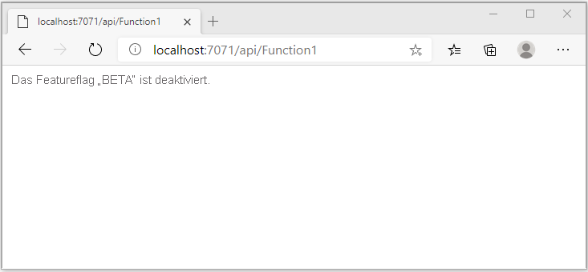

# <a name="quickstart-add-feature-flags-to-an-azure-functions-app"></a>Schnellstart: Hinzufügen von Featureflags zu einer Azure Functions-App

In dieser Schnellstartanleitung erzielen Sie eine Implementierung der Featureverwaltung in einer Azure Functions-App mithilfe von Azure App Configuration. Mit dem App Configuration-Dienst speichern Sie alle Featureflags zentral und steuern ihren jeweiligen Zustand. 

Die .NET-Bibliotheken für die Featureverwaltung erweitern das Framework um Unterstützung für Featureflags. Diese Bibliotheken bauen auf dem .NET-Konfigurationssystem auf. Über ihren .NET-Konfigurationsanbieter lassen sie sich in App Configuration integrieren.

## <a name="prerequisites"></a>Voraussetzungen

- Azure-Abonnement – [Erstellen eines kostenlosen Kontos](https://azure.microsoft.com/free/)
- [Visual Studio 2019](https://visualstudio.microsoft.com/vs) mit der Workload **Azure-Entwicklung**.
- [Azure Functions-Tools](../azure-functions/functions-develop-vs.md#check-your-tools-version)

## <a name="create-an-app-configuration-store"></a>Erstellen eines App Configuration-Speichers

[!INCLUDE [azure-app-configuration-create](../../includes/azure-app-configuration-create.md)]

6. Wählen Sie **Feature-Manager** >  **+Hinzufügen** aus, um ein Featureflag namens `Beta` hinzuzufügen.

    > [!div class="mx-imgBorder"]
    > 

    Definieren Sie `label` und `Description` vorerst nicht.

7. Wählen Sie **Übernehmen** aus, um das neue Featureflag zu speichern.

## <a name="create-a-functions-app"></a>Erstellen einer Functions-App

[!INCLUDE [Create a project using the Azure Functions template](../../includes/functions-vstools-create.md)]

## <a name="connect-to-an-app-configuration-store"></a>Herstellen einer Verbindung mit einem App Configuration-Speicher

1. Klicken Sie mit der rechten Maustaste auf Ihr Projekt, und wählen Sie **NuGet-Pakete verwalten** aus. Suchen Sie auf der Registerkarte **Durchsuchen** die folgenden NuGet-Pakete, und fügen Sie sie Ihrem Projekt hinzu. Überprüfen Sie für `Microsoft.Extensions.DependencyInjection`, ob Sie ein aktuelles stabiles Build verwenden. 

    ```
    Microsoft.Extensions.DependencyInjection
    Microsoft.Extensions.Configuration
    Microsoft.FeatureManagement
    ```


1. Öffnen Sie *Function1.cs*, und fügen Sie die Namespaces dieser Pakete hinzu.

    ```csharp
    using Microsoft.Extensions.Configuration;
    using Microsoft.FeatureManagement;
    using Microsoft.Extensions.DependencyInjection;
    ```

1. Fügen Sie den folgenden statischen Konstruktor `Function1` hinzu, um das Bootstrapping des Azure App Configuration-Anbieters auszuführen. Fügen Sie anschließend zwei `static`-Member hinzu: ein Feld mit dem Namen `ServiceProvider` zum Erstellen einer Singletoninstanz von `ServiceProvider` und eine Eigenschaft mit dem Namen `FeatureManager` unterhalb von `Function1` zum Erstellen einer Singletoninstanz von `IFeatureManager`. Stellen Sie dann eine Verbindung mit App Configuration in `Function1` her, indem Sie `AddAzureAppConfiguration()` aufrufen. Bei diesem Vorgang wird die Konfiguration beim Anwendungsstart geladen. Dieselbe Konfigurationsinstanz wird später für alle Funktionsaufrufe verwendet. 

    ```csharp
        // Implements IDisposable, cached for life time of function
        private static ServiceProvider ServiceProvider; 

        static Function1()
        {
            IConfigurationRoot configuration = new ConfigurationBuilder()
                .AddAzureAppConfiguration(options =>
                {
                    options.Connect(Environment.GetEnvironmentVariable("ConnectionString"))
                           .UseFeatureFlags();
                }).Build();

            var services = new ServiceCollection();                                                                             
            services.AddSingleton<IConfiguration>(configuration).AddFeatureManagement();

            ServiceProvider = services.BuildServiceProvider(); 
        }

        private static IFeatureManager FeatureManager => ServiceProvider.GetRequiredService<IFeatureManager>();
    ```

1. Aktualisieren Sie die Methode `Run`, um den Wert der angezeigten Meldung abhängig vom Status des Featureflags zu ändern.

    ```csharp
        [FunctionName("Function1")]
        public static async Task<IActionResult> Run(
                [HttpTrigger(AuthorizationLevel.Anonymous, "get", "post", Route = null)] HttpRequest req,
                ILogger log)
            {
                string message = await FeatureManager.IsEnabledAsync("Beta")
                     ? "The Feature Flag 'Beta' is turned ON"
                     : "The Feature Flag 'Beta' is turned OFF";
                
                return (ActionResult)new OkObjectResult(message); 
            }
    ```

## <a name="test-the-function-locally"></a>Lokales Testen der Funktion

1. Legen Sie eine Umgebungsvariable mit dem Namen **ConnectionString** fest. Der Wert ist dabei der Zugriffsschlüssel, den Sie zuvor in Ihrem App Configuration-Speicher unter **Zugriffsschlüssel** abgerufen haben. Führen Sie bei Verwendung einer Windows-Eingabeaufforderung den folgenden Befehl aus, und starten Sie die Eingabeaufforderung neu, damit die Änderung wirksam wird:

    ```cmd
        setx ConnectionString "connection-string-of-your-app-configuration-store"
    ```

    Führen Sie bei Verwendung von Windows PowerShell den folgenden Befehl aus:

    ```azurepowershell
        $Env:ConnectionString = "connection-string-of-your-app-configuration-store"
    ```

    Führen Sie bei Verwendung von macOS oder Linux den folgenden Befehl aus:

    ```bash
        export ConnectionString='connection-string-of-your-app-configuration-store'
    ```

1. Drücken Sie F5, um Ihre Funktion zu testen. Akzeptieren Sie die entsprechende Aufforderung von Visual Studio zum Herunterladen und Installieren der **Azure Functions Core (CLI)** -Tools. Sie müssen möglicherweise auch eine Firewallausnahme aktivieren, damit die Tools HTTP-Anforderungen verarbeiten können.

1. Kopieren Sie die URL Ihrer Funktion aus der Azure Functions-Laufzeitausgabe.

    

1. Fügen Sie die URL zu der HTTP-Anforderung in die Adressleiste Ihres Browsers ein. Die folgende Abbildung zeigt die Antwort, die angibt, dass das Featureflag `Beta` deaktiviert ist. 

    

1. Melden Sie sich beim [Azure-Portal](https://portal.azure.com) an. Wählen Sie **Alle Ressourcen** und dann die Instanz des App Configuration-Speichers aus, die Sie erstellt haben.

1. Wählen Sie **Feature-Manager** aus, und ändern Sie den Status des **Beta**-Schlüssels in **Ein**.

1. Kehren Sie zur Eingabeaufforderung zurück, und brechen Sie den ausgeführten Prozess ab, indem Sie `Ctrl-C` drücken.  Starten Sie die Anwendung durch Drücken der Taste F5 neu. 

1. Kopieren Sie die URL Ihrer Funktion aus der Azure Functions-Laufzeitausgabe genau wie in Schritt 3. Fügen Sie die URL zu der HTTP-Anforderung in die Adressleiste Ihres Browsers ein. Die Browserantwort sollte sich geändert haben, um anzugeben, dass das Featureflag `Beta` aktiviert ist, wie in der folgenden Abbildung dargestellt:
 
    

## <a name="clean-up-resources"></a>Bereinigen von Ressourcen

[!INCLUDE [azure-app-configuration-cleanup](../../includes/azure-app-configuration-cleanup.md)]

## <a name="next-steps"></a>Nächste Schritte

In dieser Schnellstartanleitung haben Sie über den [App Configuration-Anbieter](https://go.microsoft.com/fwlink/?linkid=2074664) ein Featureflag erstellt und mit einer Azure Functions-App verwendet.

- Weitere Informationen über die [Featureverwaltung](./concept-feature-management.md)
- [Verwalten von Featureflags](./manage-feature-flags.md)
- [Verwenden der dynamischen Konfiguration in einer Azure Functions-App](./enable-dynamic-configuration-azure-functions-csharp.md)
