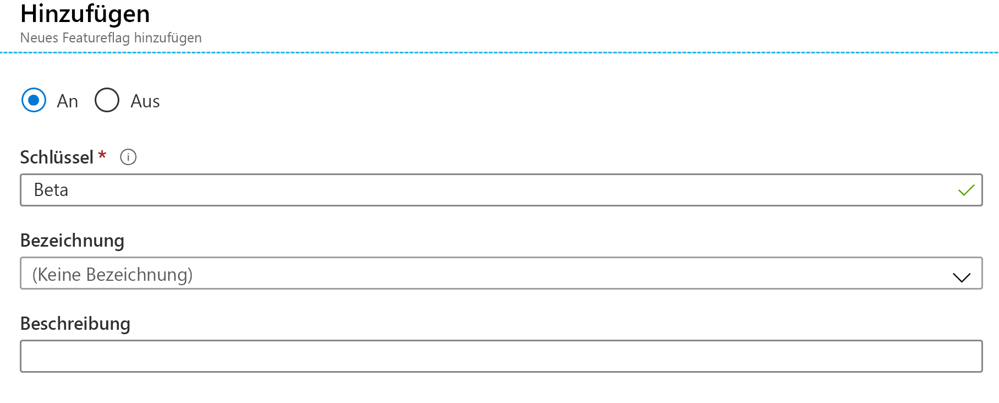

# <a name="quickstart-add-feature-flags-to-a-net-framework-app"></a>Schnellstart: Hinzufügen von Featureflags zu einer .NET Framework-App

In dieser Schnellstartanleitung integrieren Sie Azure App Configuration in eine .NET Framework-App, um eine End-to-End-Implementierung der Featureverwaltung zu erzielen. Mit diesem App Configuration-Dienst können Sie alle Featureflags zentral speichern und ihren jeweiligen Zustand steuern. 

Die .NET-Bibliotheken für die Featureverwaltung erweitern das Framework um Unterstützung für Featureflags. Diese Bibliotheken bauen auf dem .NET-Konfigurationssystem auf. Über ihren .NET-Konfigurationsanbieter lassen sie sich in App Configuration integrieren.

## <a name="prerequisites"></a>Voraussetzungen

- Azure-Abonnement – [Erstellen eines kostenlosen Kontos](https://azure.microsoft.com/free/dotnet)
- [Visual Studio 2019](https://visualstudio.microsoft.com/vs)
- [.NET Framework 4.8](https://dotnet.microsoft.com/download)

## <a name="create-an-app-configuration-store"></a>Erstellen eines App Configuration-Speichers

[!INCLUDE [azure-app-configuration-create](../../includes/azure-app-configuration-create.md)]

7. Wählen Sie **Feature-Manager** >  **+Hinzufügen** aus, um ein Featureflag namens `Beta` hinzuzufügen.

    > [!div class="mx-imgBorder"]
    > 

    Definieren Sie `label` vorerst nicht.

## <a name="create-a-net-console-app"></a>Erstellen einer .NET-Konsolen-App

1. Starten Sie Visual Studio, und wählen Sie **Datei** > **Neu** > **Projekt** aus.

1. Filtern Sie unter **Neues Projekt erstellen** nach dem Projekttyp **Konsole**, und klicken Sie auf **Console App (.NET Framework)** (Konsolen-App (.NET Framework)). Klicken Sie auf **Weiter**.

1. Geben Sie unter **Neues Projekt konfigurieren** einen Projektnamen ein. Wählen Sie unter **Framework** die Option **.NET Framework 4.8** oder höher aus. Klicken Sie auf **Erstellen**.

## <a name="connect-to-an-app-configuration-store"></a>Herstellen einer Verbindung mit einem App Configuration-Speicher

1. Klicken Sie mit der rechten Maustaste auf Ihr Projekt, und wählen Sie **NuGet-Pakete verwalten** aus. Suchen Sie auf der Registerkarte **Durchsuchen** die folgenden NuGet-Pakete, und fügen Sie sie Ihrem Projekt hinzu. Wenn Sie sie nicht finden können, aktivieren Sie das Kontrollkästchen **Vorabversion einbeziehen**.

    ```
    Microsoft.Extensions.DependencyInjection
    Microsoft.Extensions.Configuration.AzureAppConfiguration
    Microsoft.FeatureManagement
    ```

1. Öffnen Sie *Program.cs*, und fügen Sie die folgenden Anweisungen hinzu:

    ```csharp
    using Microsoft.Extensions.DependencyInjection;
    using Microsoft.Extensions.Configuration;
    using Microsoft.Extensions.Configuration.AzureAppConfiguration;
    using Microsoft.FeatureManagement;
    using System.Threading.Tasks;
    ```

1. Aktualisieren Sie die Methode `Main`, um eine Verbindung mit App Configuration herzustellen. Geben Sie dabei die Option `UseFeatureFlags` an, sodass Featureflags abgerufen werden. Zeigen Sie dann eine Meldung an, wenn das `Beta`-Featureflag aktiviert ist.

    ```csharp
        public static async Task Main(string[] args)
        {         
            IConfigurationRoot configuration = new ConfigurationBuilder()
                .AddAzureAppConfiguration(options =>
                {
                    options.Connect(Environment.GetEnvironmentVariable("ConnectionString"))
                           .UseFeatureFlags();
                }).Build();

            IServiceCollection services = new ServiceCollection();

            services.AddSingleton<IConfiguration>(configuration).AddFeatureManagement();

            using (ServiceProvider serviceProvider = services.BuildServiceProvider())
            {
                IFeatureManager featureManager = serviceProvider.GetRequiredService<IFeatureManager>();

                if (await featureManager.IsEnabledAsync("Beta"))
                {
                    Console.WriteLine("Welcome to the beta!");
                }
            }

            Console.WriteLine("Hello World!");
            Console.WriteLine("Press any key to continue ...");
            Console.Read();
        }
    ```

## <a name="build-and-run-the-app-locally"></a>Lokales Erstellen und Ausführen der App

1. Legen Sie eine Umgebungsvariable mit dem Namen **ConnectionString** auf die Verbindungszeichenfolge Ihres App Configuration-Speichers fest. Führen Sie bei Verwendung der Windows-Eingabeaufforderung den folgenden Befehl aus:

    ```console
        setx ConnectionString "connection-string-of-your-app-configuration-store"
    ```

    Führen Sie bei Verwendung von Windows PowerShell den folgenden Befehl aus:

    ```powershell
        $Env:ConnectionString = "connection-string-of-your-app-configuration-store"
    ```

1. Starten Sie Visual Studio, damit die Änderung wirksam wird. 

1. Drücken Sie STRG+F5, um die Konsolen-App zu erstellen und auszuführen.

    

## <a name="clean-up-resources"></a>Bereinigen von Ressourcen

[!INCLUDE [azure-app-configuration-cleanup](../../includes/azure-app-configuration-cleanup.md)]

## <a name="next-steps"></a>Nächste Schritte

In dieser Schnellstartanleitung haben Sie ein Featureflag in App Configuration erstellt und mit einer .NET Framework-Konsolen-App verwendet. Fahren Sie mit dem nächsten Tutorial fort, um zu erfahren, wie Sie Featureflags und andere Konfigurationswerte dynamisch aktualisieren, ohne die Anwendung neu zu starten.

> [!div class="nextstepaction"]
> [Tutorial: Verwenden der dynamischen Konfiguration in einer .NET Framework-App](./enable-dynamic-configuration-dotnet.md)
