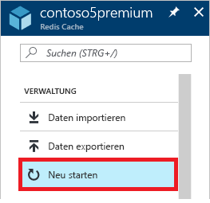
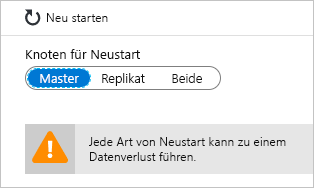
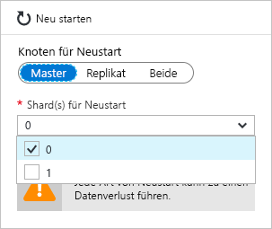

# Verwalten von Azure Cache for Redis
In diesem Thema erfahren Sie, wie Verwaltungsaufgaben wie das [Neustarten](#reboot) und [Planen von Updates](#schedule-updates) für Ihre Azure Cache for Redis-Instanzen erfolgen.

[!INCLUDE [updated-for-az](../../includes/updated-for-az.md)]

## Reboot
Auf dem Blatt **Neustart** können Sie einen oder mehrere Knoten Ihres Caches neu starten. Mit dieser Neustartfunktion können Sie Ihre Anwendung bei einem Ausfall eines Cacheknotens auf Resilienz testen.

Wählen Sie die Knoten, die neu gestartet werden sollen, und klicken Sie auf **Neustart**.

Wenn Sie über einen Premium-Cache mit aktiviertem Clustering verfügen, können Sie die Shards des Caches auswählen, die neu gestartet werden sollen.

Zum Neustarten eines oder mehrerer Knoten Ihres Caches wählen Sie die gewünschten Knoten aus und klicken auf **Neustart**. Wenn Sie über einen Premium-Cache mit aktiviertem Clustering verfügen, wählen Sie die gewünschten Shards aus, die neu gestartet werden sollen, und klicken Sie dann auf **Neu starten**. Nach einigen Minuten werden die ausgewählten Knoten neu gestartet, die nur wenige Minuten später wieder online sind.

Die Auswirkungen auf Clientanwendungen hängen von den Knoten ab, die Sie neu starten.

* **Master** : Wenn der primäre Knoten neu gestartet wird, führt Azure Cache for Redis ein Failover auf den Replikatknoten durch, der zum primären Knoten hochgestuft wird. Während dieses Failovers gibt es möglicherweise ein kurzes Intervall, in dem keine Verbindungen mit dem Cache aufgebaut werden können.
* **Replikat**: Wenn der Replikatknoten neu gestartet wird, hat dies meist keine Auswirkungen auf Cacheclients.
* **Primär und Replikat**: Wenn beide Cacheknoten neu gestartet werden, gehen alle Daten im Cache verloren, und es können erst wieder Verbindungen mit dem Cache hergestellt werden, wenn der primäre Knoten wieder online ist. Wenn Sie [Datenpersistenz](cache-how-to-premium-persistence.md) konfiguriert haben, wird die letzte Sicherung wiederhergestellt, sobald der Cache wieder online ist. Allerdings gehen alle Cacheschreibvorgänge verloren, die nach der letzten Sicherung durchgeführt wurden.
* **Knoten eines Premium-Caches mit aktiviertem Clustering:** Wenn Sie einen oder mehrere Knoten eines Premium-Caches mit aktiviertem Clustering neu starten, entspricht das Verhalten für die ausgewählten Knoten dem Neustart des oder der entsprechenden Knoten eines nicht gruppierten Caches.

## Häufig gestellte Fragen zum Neustart
* [Welche Knoten sollte ich neu starten, um meine Anwendung zu testen?](#which-node-should-i-reboot-to-test-my-application)
* [Kann ich den Cache neu starten, um Clientverbindungen zu löschen?](#can-i-reboot-the-cache-to-clear-client-connections)
* [Gehen beim Neustart Daten aus dem Cache verloren?](#will-i-lose-data-from-my-cache-if-i-do-a-reboot)
* [Kann ich meinen Cache mithilfe von PowerShell, CLI oder anderen Verwaltungstools neu starten?](#can-i-reboot-my-cache-using-powershell-cli-or-other-management-tools)

### Welche Knoten sollte ich neu starten, um meine Anwendung zu testen?
Um die Stabilität Ihrer Anwendung bei Ausfall des primären Knotens Ihres Caches zu testen, starten Sie den **Master** -Knoten neu. Um die Stabilität Ihrer Anwendung bei Ausfall des Replikatknotens zu testen, starten Sie den **Replikatknoten** neu. Um die Stabilität Ihrer Anwendung bei Ausfall Ihres gesamten Caches zu testen, starten Sie den **beide** Knoten neu.

### Kann ich den Cache neu starten, um Clientverbindungen zu löschen?
Ja, wenn Sie den Cache neu starten, werden alle Clientverbindungen gelöscht. Ein Neustart kann sinnvoll sein, wenn alle Clientverbindungen aufgrund eines Logikfehlers oder eines Fehlers in der Clientanwendung belegt sind. Jeder Tarif weist verschiedene [Grenzwerte für Clientverbindungen](cache-configure.md#default-redis-server-configuration) für die verschiedenen Größen auf. Sobald diese Grenzwerte erreicht sind, werden keine weiteren Clientverbindungen akzeptiert. Das Neustarten des Caches bietet eine Möglichkeit, alle Clientverbindungen zu löschen.

> [!IMPORTANT]
> Wenn Sie Ihren Cache neu starten, um Clientverbindungen zu löschen, stellt StackExchange.Redis automatisch wieder eine Verbindung her, sobald der Redis-Knoten wieder online ist. Wenn das zugrunde liegende Problem nicht behoben wird, kann es weiterhin passieren, dass die Clientverbindungen aufgebraucht werden.
> 
> 

### Gehen beim Neustart Daten aus dem Cache verloren?
Wenn Sie sowohl den **Master**- als auch den **Replikat**-Knoten neu starten, gehen möglicherweise alle Daten im Cache (oder im jeweiligen Shard, wenn Sie einen Premium-Cache mit aktiviertem Clustering nutzen) verloren, doch dies ist auch nicht sicher. Wenn Sie [Datenpersistenz](cache-how-to-premium-persistence.md) konfiguriert haben, wird die letzte Sicherung wiederhergestellt, sobald der Cache wieder online ist. Allerdings gehen alle Cacheschreibvorgänge verloren, die nach der Sicherung durchgeführt wurden.

Wenn Sie nur einen der Knoten neu starten, gehen Daten in der Regel nicht verloren, möglicherweise aber doch. Wenn z. B. der primäre Knoten neu gestartet und ein Cacheschreibvorgang ausgeführt wird, gehen die Daten des Cacheschreibvorgangs verloren. Ein weiteres Szenario für Datenverlust ist der Fall, in dem Sie einen Knoten neu starten und der andere Knoten aufgrund eines Fehlers gleichzeitig ausfällt. Weitere Informationen zu den möglichen Ursachen für den Datenverlust finden Sie unter [Was ist mit meinen Daten in Redis passiert?](https://gist.github.com/JonCole/b6354d92a2d51c141490f10142884ea4#file-whathappenedtomydatainredis-md).

### Kann ich meinen Cache mithilfe von PowerShell, CLI oder anderen Verwaltungstools neu starten?
Ja. Anweisungen für PowerShell finden Sie unter [So starten Sie einen Azure Cache for Redis neu](cache-how-to-manage-redis-cache-powershell.md#to-reboot-an-azure-cache-for-redis).

## Planen von Updates
Auf dem Blatt **Updates planen** können Sie ein Wartungsfenster für Ihre Cache-Instanz bestimmen. Mithilfe eines Wartungsfensters können Sie Tage und die Uhrzeiten einer Woche steuern, an denen die VMs, auf denen der Cache gehostet wird, aktualisiert werden können. Azure Cache for Redis versucht nach Möglichkeit, die Redis-Serversoftware innerhalb des definierten Zeitfensters zu starten und zu beenden.

> [!NOTE] 
> Das Wartungsfenster gilt für Redis-Serverupdates und Updates des Betriebssystems der virtuellen Computer, die den Cache hosten. Das Wartungsfenster gilt nicht für Updates des Hostbetriebssystems auf den Hosts, die die Cache-VMs oder andere Azure-Netzwerkkomponenten hosten. In seltenen Fällen, in denen Caches auf älteren Modellen gehostet werden (Sie können erkennen, ob sich Ihr Cache auf einem älteren Modell befindet, wenn der DNS-Name des Caches in ein Suffix von „cloudapp.net“, „chinacloudapp.cn“, „usgovcloudapi.net“ oder „cloudapi.de“ aufgelöst wird), gilt das Wartungsfenster auch nicht für Gastbetriebssystemupdates.
>

Aktivieren Sie zum Angeben eines Wartungsfensters die Kontrollkästchen der gewünschten Tage, geben Sie jeweils die Startzeit des Wartungsfensters an, und klicken Sie auf **OK**. Beachten Sie, dass die Zeit im Wartungsfenster als UTC angegeben ist. 

Das Standardwartungsfenster für Updates beträgt fünf Stunden (Mindestdauer). Der Wert kann nicht über das Azure-Portal konfiguriert werden. Sie können ihn jedoch in PowerShell mithilfe des `MaintenanceWindow`-Parameters des Cmdlets [New-AzRedisCacheScheduleEntry](/powershell/module/az.rediscache/new-azrediscachescheduleentry) konfigurieren. Weitere Informationen finden Sie unter „Kann ich geplante Updates mit PowerShell, der CLI oder anderen Verwaltungstools verwalten?“.

## Häufig gestellte Fragen zum Planen von Updates
* [Wann erfolgen Updates, wenn nicht das Feature zum Planen von Updates verwendet wird?](#when-do-updates-occur-if-i-dont-use-the-schedule-updates-feature)
* [Welche Art von Updates erfolgen während des geplanten Wartungsfensters?](#what-type-of-updates-are-made-during-the-scheduled-maintenance-window)
* [Kann ich geplante Updates mit PowerShell, der CLI oder anderen Verwaltungstools verwalten?](#can-i-managed-scheduled-updates-using-powershell-cli-or-other-management-tools)

### Wann erfolgen Updates, wenn nicht das Feature zum Planen von Updates verwendet wird?
Wenn Sie kein Wartungsfenster angeben, können Updates jederzeit erfolgen.

### Welche Art von Updates erfolgen während des geplanten Wartungsfensters?
Nur Updates des Redis-Servers erfolgen während des geplanten Wartungsfensters. Das Wartungsfenster gilt nicht für Azure-Updates oder Updates des Betriebssystems virtueller Computer.

### Kann ich geplante Updates mit Powershell, der CLI oder anderen Verwaltungstools verwalten?
Ja, Sie können Ihre geplanten Updates mit den folgenden PowerShell-Cmdlets verwalten:

* [Get-AzRedisCachePatchSchedule](/powershell/module/az.rediscache/get-azrediscachepatchschedule)
* [New-AzRedisCachePatchSchedule](/powershell/module/az.rediscache/new-azrediscachepatchschedule)
* [New-AzRedisCacheScheduleEntry](/powershell/module/az.rediscache/new-azrediscachescheduleentry)
* [Remove-AzRedisCachePatchSchedule](/powershell/module/az.rediscache/remove-azrediscachepatchschedule)

## Nächste Schritte
Erfahren Sie mehr über Azure Cache for Redis-Features.

* [Azure Cache for Redis-Dienstebenen](cache-overview.md#service-tiers)

