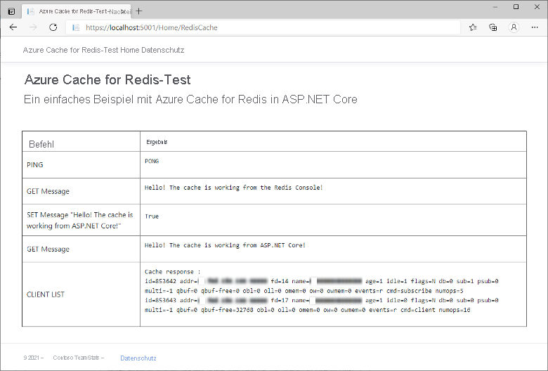

# <a name="quickstart-use-azure-cache-for-redis-with-an-aspnet-core-web-app"></a>Schnellstart: Verwenden von Azure Cache for Redis mit einer ASP.NET Core-Web-App 

In dieser Schnellstartanleitung binden Sie Azure Cache for Redis in eine ASP.NET Core-Webanwendung ein, die eine Verbindung mit Azure Cache for Redis herstellt, um Daten aus dem Cache zu speichern und abzurufen.

## <a name="skip-to-the-code-on-github"></a>Direktes Navigieren zum Code auf GitHub

Wenn Sie direkt mit dem Code fortfahren möchten, finden Sie im [ASP.NET Core-Schnellstart](https://github.com/Azure-Samples/azure-cache-redis-samples/tree/main/quickstart/aspnet-core) auf GitHub weitere Informationen.

## <a name="prerequisites"></a>Voraussetzungen

- Azure-Abonnement – [Erstellen eines kostenlosen Kontos](https://azure.microsoft.com/free/)
- [.NET Core SDK](https://dotnet.microsoft.com/download)

## <a name="create-a-cache"></a>Erstellen eines Caches

[!INCLUDE [redis-cache-create](../../includes/redis-cache-create.md)]

[!INCLUDE [redis-cache-access-keys](../../includes/redis-cache-access-keys.md)]

Notieren Sie sich den **HOSTNAMEN** und den **primären** Zugriffsschlüssel. Sie verwenden diese Werte später, um das *CacheConnection*-Geheimnis zu erstellen.

## <a name="create-an-aspnet-core-web-app"></a>Erstellen einer ASP.NET Core-Web-App

Öffnen Sie ein neues Befehlsfenster, und führen Sie den folgenden Befehl aus, um eine neue ASP.NET Core-Web-App (Model View Controller) zu erstellen:

```dotnetcli
dotnet new mvc -o ContosoTeamStats
```

Wechseln Sie im Befehlsfenster zum neuen Projektverzeichnis *ContosoTeamStats*.

[!INCLUDE[Add Secret Manager support to an ASP.NET Core project](../../includes/azure-app-configuration-add-secret-manager.md)]

Führen Sie den folgenden Befehl aus, um dem Projekt das Paket *Microsoft.Extensions.Configuration.UserSecrets* hinzuzufügen:

```dotnetcli
dotnet add package Microsoft.Extensions.Configuration.UserSecrets
```

Führen Sie den folgenden Befehl aus, um Ihre Pakete wiederherzustellen:

```dotnetcli
dotnet restore
```

Führen Sie im Befehlsfenster den folgenden Befehl aus, um ein neues Geheimnis mit dem Namen *CacheConnection* zu speichern, nachdem Sie die Platzhalter (einschließlich der Winkelklammern) durch Ihren Cachenamen und den Primärschlüssel ersetzt haben:

```dotnetcli
dotnet user-secrets set CacheConnection "<cache name>.redis.cache.windows.net,abortConnect=false,ssl=true,allowAdmin=true,password=<primary-access-key>"
```

## <a name="configure-the-cache-client"></a>Konfigurieren des Cacheclients

In diesem Abschnitt konfigurieren Sie die Anwendung zur Verwendung des [StackExchange.Redis](https://github.com/StackExchange/StackExchange.Redis)-Clients für .NET.

Führen Sie im Befehlsfenster im Projektverzeichnis *ContosoTeamStats* den folgenden Befehl aus:

```dotnetcli
dotnet add package StackExchange.Redis
```

Nach Abschluss der Installation kann der *StackExchange.Redis*-Cacheclient für Ihr Projekt verwendet werden.

## <a name="update-the-homecontroller-and-layout"></a>Aktualisieren von HomeController und Layout

Fügen Sie *Controllers\HomeController.cs* die folgenden `using`-Anweisungen hinzu:

```csharp
using System.Net.Sockets;
using System.Text;
using System.Threading;

using Microsoft.Extensions.Configuration;

using StackExchange.Redis;
```

Ersetzen Sie:

```csharp
private readonly ILogger<HomeController> _logger;

public HomeController(ILogger<HomeController> logger)
{
    _logger = logger;
}
```

Durch:

```csharp
private readonly ILogger<HomeController> _logger;
private static IConfiguration Configuration { get; set; }

public HomeController(ILogger<HomeController> logger, IConfiguration configuration)
{
    _logger = logger;
    if (Configuration == null)
        Configuration = configuration;
}
```

Fügen Sie der `HomeController`-Klasse die folgenden Member hinzu, um eine neue `RedisCache`-Aktion zu unterstützen, die einige Befehle für den neuen Cache ausführt:

```csharp
public ActionResult RedisCache()
{
    ViewBag.Message = "A simple example with Azure Cache for Redis on ASP.NET Core.";

    IDatabase cache = GetDatabase();

    // Perform cache operations using the cache object...

    // Simple PING command
    ViewBag.command1 = "PING";
    ViewBag.command1Result = cache.Execute(ViewBag.command1).ToString();

    // Simple get and put of integral data types into the cache
    ViewBag.command2 = "GET Message";
    ViewBag.command2Result = cache.StringGet("Message").ToString();

    ViewBag.command3 = "SET Message \"Hello! The cache is working from ASP.NET Core!\"";
    ViewBag.command3Result = cache.StringSet("Message", "Hello! The cache is working from ASP.NET Core!").ToString();

    // Demonstrate "SET Message" executed as expected...
    ViewBag.command4 = "GET Message";
    ViewBag.command4Result = cache.StringGet("Message").ToString();

    // Get the client list, useful to see if connection list is growing...
    // Note that this requires allowAdmin=true in the connection string
    ViewBag.command5 = "CLIENT LIST";
    StringBuilder sb = new StringBuilder();
    var endpoint = (System.Net.DnsEndPoint)GetEndPoints()[0];
    IServer server = GetServer(endpoint.Host, endpoint.Port);
    ClientInfo[] clients = server.ClientList();

    sb.AppendLine("Cache response :");
    foreach (ClientInfo client in clients)
    {
        sb.AppendLine(client.Raw);
    }

    ViewBag.command5Result = sb.ToString();

    return View();
}

private const string SecretName = "CacheConnection";

private static long lastReconnectTicks = DateTimeOffset.MinValue.UtcTicks;
private static DateTimeOffset firstErrorTime = DateTimeOffset.MinValue;
private static DateTimeOffset previousErrorTime = DateTimeOffset.MinValue;

private static readonly object reconnectLock = new object();

// In general, let StackExchange.Redis handle most reconnects,
// so limit the frequency of how often ForceReconnect() will
// actually reconnect.
public static TimeSpan ReconnectMinFrequency => TimeSpan.FromSeconds(60);

// If errors continue for longer than the below threshold, then the
// multiplexer seems to not be reconnecting, so ForceReconnect() will
// re-create the multiplexer.
public static TimeSpan ReconnectErrorThreshold => TimeSpan.FromSeconds(30);

public static int RetryMaxAttempts => 5;

private static Lazy<ConnectionMultiplexer> lazyConnection = CreateConnection();

public static ConnectionMultiplexer Connection
{
    get
    {
        return lazyConnection.Value;
    }
}

private static Lazy<ConnectionMultiplexer> CreateConnection()
{
    return new Lazy<ConnectionMultiplexer>(() =>
    {
        string cacheConnection = Configuration[SecretName];
        return ConnectionMultiplexer.Connect(cacheConnection);
    });
}

private static void CloseConnection(Lazy<ConnectionMultiplexer> oldConnection)
{
    if (oldConnection == null)
        return;

    try
    {
        oldConnection.Value.Close();
    }
    catch (Exception)
    {
        // Example error condition: if accessing oldConnection.Value causes a connection attempt and that fails.
    }
}

/// <summary>
/// Force a new ConnectionMultiplexer to be created.
/// NOTES:
///     1. Users of the ConnectionMultiplexer MUST handle ObjectDisposedExceptions, which can now happen as a result of calling ForceReconnect().
///     2. Don't call ForceReconnect for Timeouts, just for RedisConnectionExceptions or SocketExceptions.
///     3. Call this method every time you see a connection exception. The code will:
///         a. wait to reconnect for at least the "ReconnectErrorThreshold" time of repeated errors before actually reconnecting
///         b. not reconnect more frequently than configured in "ReconnectMinFrequency"
/// </summary>
public static void ForceReconnect()
{
    var utcNow = DateTimeOffset.UtcNow;
    long previousTicks = Interlocked.Read(ref lastReconnectTicks);
    var previousReconnectTime = new DateTimeOffset(previousTicks, TimeSpan.Zero);
    TimeSpan elapsedSinceLastReconnect = utcNow - previousReconnectTime;

    // If multiple threads call ForceReconnect at the same time, we only want to honor one of them.
    if (elapsedSinceLastReconnect < ReconnectMinFrequency)
        return;

    lock (reconnectLock)
    {
        utcNow = DateTimeOffset.UtcNow;
        elapsedSinceLastReconnect = utcNow - previousReconnectTime;

        if (firstErrorTime == DateTimeOffset.MinValue)
        {
            // We haven't seen an error since last reconnect, so set initial values.
            firstErrorTime = utcNow;
            previousErrorTime = utcNow;
            return;
        }

        if (elapsedSinceLastReconnect < ReconnectMinFrequency)
            return; // Some other thread made it through the check and the lock, so nothing to do.

        TimeSpan elapsedSinceFirstError = utcNow - firstErrorTime;
        TimeSpan elapsedSinceMostRecentError = utcNow - previousErrorTime;

        bool shouldReconnect =
            elapsedSinceFirstError >= ReconnectErrorThreshold // Make sure we gave the multiplexer enough time to reconnect on its own if it could.
            && elapsedSinceMostRecentError <= ReconnectErrorThreshold; // Make sure we aren't working on stale data (e.g. if there was a gap in errors, don't reconnect yet).

        // Update the previousErrorTime timestamp to be now (e.g. this reconnect request).
        previousErrorTime = utcNow;

        if (!shouldReconnect)
            return;

        firstErrorTime = DateTimeOffset.MinValue;
        previousErrorTime = DateTimeOffset.MinValue;

        Lazy<ConnectionMultiplexer> oldConnection = lazyConnection;
        CloseConnection(oldConnection);
        lazyConnection = CreateConnection();
        Interlocked.Exchange(ref lastReconnectTicks, utcNow.UtcTicks);
    }
}

// In real applications, consider using a framework such as
// Polly to make it easier to customize the retry approach.
private static T BasicRetry<T>(Func<T> func)
{
    int reconnectRetry = 0;
    int disposedRetry = 0;

    while (true)
    {
        try
        {
            return func();
        }
        catch (Exception ex) when (ex is RedisConnectionException || ex is SocketException)
        {
            reconnectRetry++;
            if (reconnectRetry > RetryMaxAttempts)
                throw;
            ForceReconnect();
        }
        catch (ObjectDisposedException)
        {
            disposedRetry++;
            if (disposedRetry > RetryMaxAttempts)
                throw;
        }
    }
}

public static IDatabase GetDatabase()
{
    return BasicRetry(() => Connection.GetDatabase());
}

public static System.Net.EndPoint[] GetEndPoints()
{
    return BasicRetry(() => Connection.GetEndPoints());
}

public static IServer GetServer(string host, int port)
{
    return BasicRetry(() => Connection.GetServer(host, port));
}
```

Öffnen Sie *Views\Shared\\_Layout.cshtml*.

Ersetzen Sie:

```cshtml
<a class="navbar-brand" asp-area="" asp-controller="Home" asp-action="Index">ContosoTeamStats</a>
```

Durch:

```cshtml
<a class="navbar-brand" asp-area="" asp-controller="Home" asp-action="RedisCache">Azure Cache for Redis Test</a>
```

## <a name="add-a-new-rediscache-view-and-update-the-styles"></a>Hinzufügen einer neuen RedisCache-Ansicht und Aktualisieren der Stile

Erstellen Sie die neue Datei *Views\Home\RedisCache.cshtml* mit folgendem Inhalt:

```cshtml
@{
    ViewBag.Title = "Azure Cache for Redis Test";
}

<h2>@ViewBag.Title.</h2>
<h3>@ViewBag.Message</h3>
<br /><br />
<table border="1" cellpadding="10" class="redis-results">
    <tr>
        <th>Command</th>
        <th>Result</th>
    </tr>
    <tr>
        <td>@ViewBag.command1</td>
        <td><pre>@ViewBag.command1Result</pre></td>
    </tr>
    <tr>
        <td>@ViewBag.command2</td>
        <td><pre>@ViewBag.command2Result</pre></td>
    </tr>
    <tr>
        <td>@ViewBag.command3</td>
        <td><pre>@ViewBag.command3Result</pre></td>
    </tr>
    <tr>
        <td>@ViewBag.command4</td>
        <td><pre>@ViewBag.command4Result</pre></td>
    </tr>
    <tr>
        <td>@ViewBag.command5</td>
        <td><pre>@ViewBag.command5Result</pre></td>
    </tr>
</table>
```

Fügen Sie *wwwroot\css\site.css* die folgenden Zeilen hinzu:

```css
.redis-results pre {
  white-space: pre-wrap;
}
```

## <a name="run-the-app-locally"></a>Lokales Ausführen der App

Führen Sie in Ihrem Befehlsfenster den folgenden Befehl aus, um die App zu erstellen:

```dotnetcli
dotnet build
```

Führen Sie die App anschließend mit dem folgenden Befehl aus:

```dotnetcli
dotnet run
```

Navigieren Sie in Ihrem Webbrowser zu `https://localhost:5001`.

Wählen Sie auf der Navigationsleiste der Webseite **Azure Cache for Redis Test** (Azure Cache for Redis-Test) aus, um den Cachezugriff zu testen.

Im folgenden Beispiel können Sie sehen, dass der `Message`-Schlüssel zuvor einen zwischengespeicherten Wert aufgewiesen hat, der im Azure-Portal über die Redis-Konsole festgelegt wurde. Die App hat diesen zwischengespeicherten Wert aktualisiert. Außerdem hat die App die Befehle `PING` und `CLIENT LIST` ausgeführt.



## <a name="clean-up-resources"></a>Bereinigen von Ressourcen

Falls Sie mit dem nächsten Tutorial fortfahren möchten, können Sie die in dieser Schnellstartanleitung erstellten Ressourcen beibehalten und wiederverwenden.

Wenn Sie die Schnellstart-Beispielanwendung nicht mehr benötigen, können Sie die in dieser Schnellstartanleitung erstellten Azure-Ressourcen löschen, um das Anfallen von Kosten zu vermeiden.

> [!IMPORTANT]
> Das Löschen einer Ressourcengruppe kann nicht rückgängig gemacht werden. Beim Löschen einer Ressourcengruppe werden alle darin enthaltenen Ressourcen unwiderruflich gelöscht. Achten Sie daher darauf, dass Sie nicht versehentlich die falsche Ressourcengruppe oder die falschen Ressourcen löschen. Falls Sie die Ressourcen zum Hosten dieses Beispiels in einer vorhandenen Ressourcengruppe erstellt haben, die beizubehaltende Ressourcen enthält, können Sie die Ressourcen einzeln über das jeweilige Blatt löschen, statt die Ressourcengruppe zu löschen.

### <a name="to-delete-a-resource-group"></a>So löschen Sie eine Ressourcengruppe

1. Melden Sie sich beim [Azure-Portal](https://portal.azure.com) an, und wählen Sie anschließend **Ressourcengruppen** aus.

2. Geben Sie im Feld **Nach Name filtern...** den Namen Ihrer Ressourcengruppe ein. In diesem Artikel wurde eine Ressourcengruppe mit dem Namen *TestResources* verwendet. Wählen Sie in Ihrer Ressourcengruppe in der Ergebnisliste **...** und anschließend **Ressourcengruppe löschen** aus.

    

Sie werden aufgefordert, das Löschen der Ressourcengruppe zu bestätigen. Geben Sie den Namen Ihrer Ressourcengruppe ein, und wählen Sie **Löschen** aus.

Daraufhin werden die Ressourcengruppe und alle darin enthaltenen Ressourcen gelöscht.

## <a name="next-steps"></a>Nächste Schritte

Informationen zur Bereitstellung in Azure:

> [!div class="nextstepaction"]
> [Tutorial: Erstellen einer ASP.NET Core- und SQL-Datenbank-App in Azure App Service](../app-service/tutorial-dotnetcore-sqldb-app.md)

Informationen zum Speichern des Cacheverbindungsgeheimnisses in Azure Key Vault:

> [!div class="nextstepaction"]
> [Azure Key Vault-Konfigurationsanbieter in ASP.NET Core](/aspnet/core/security/key-vault-configuration)

Sie möchten Ihren Cache von einem niedrigen Tarif auf einen höheren Tarif skalieren?

> [!div class="nextstepaction"]
> [How to Scale Azure Cache for Redis](./cache-how-to-scale.md) (Skalieren von Azure Cache for Redis)

Möchten Sie Ihre Cloudausgaben optimieren und dabei sparen?

> [!div class="nextstepaction"]
> [Beginnen mit der Kostenanalyse mit Cost Management](../cost-management-billing/costs/quick-acm-cost-analysis.md?WT.mc_id=costmanagementcontent_docsacmhorizontal_-inproduct-learn)