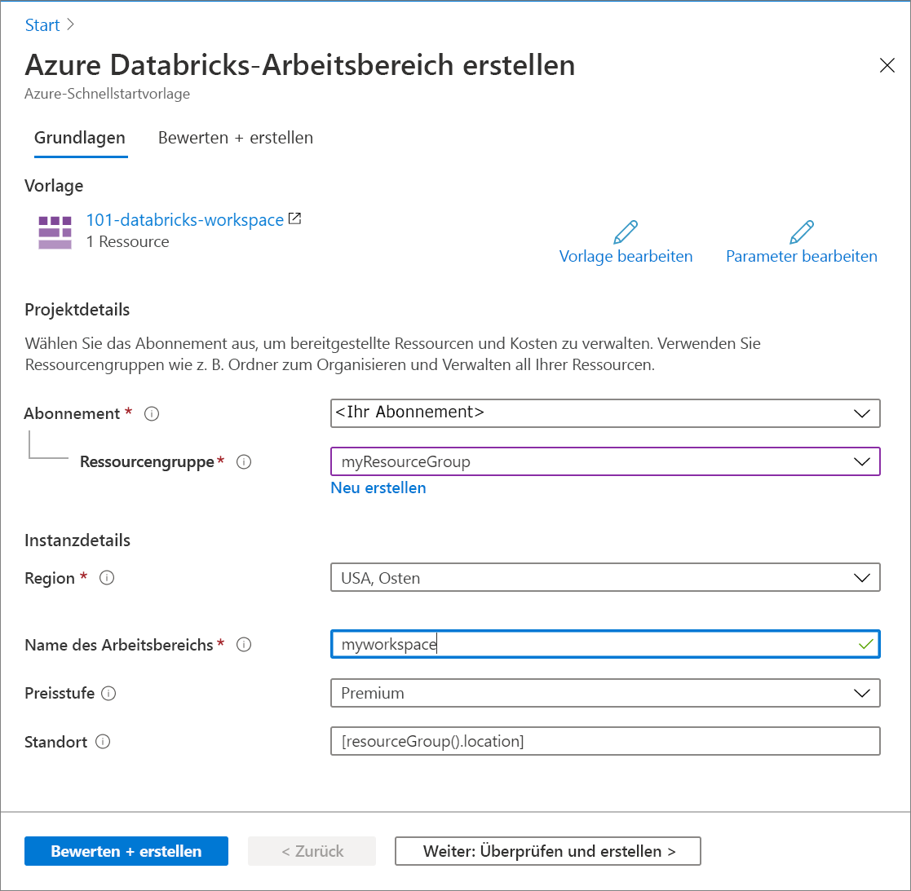

# <a name="quickstart-create-an-azure-databricks-workspace-by-using-the-azure-resource-manager-template"></a>Schnellstart: Erstellen eines Azure Databricks-Arbeitsbereichs mit einer Azure Resource Manager-Vorlage

In diesem Schnellstart verwenden Sie eine Azure Resource Manager-Vorlage, um einen Azure Databricks-Arbeitsbereich zu erstellen. Nach dem Erstellen des Arbeitsbereichs überprüfen Sie die Bereitstellung.

[!INCLUDE [About Azure Resource Manager](../../includes/resource-manager-quickstart-introduction.md)]

## <a name="prerequisites"></a>Voraussetzungen

Damit Sie die Anweisungen in diesem Artikel ausführen können, benötigen Sie Folgendes:

* Ein Azure-Abonnement ([kostenloses Abonnement erstellen](https://azure.microsoft.com/free/))

## <a name="create-an-azure-databricks-workspace"></a>Erstellen eines Azure Databricks-Arbeitsbereichs

### <a name="review-the-template"></a>Überprüfen der Vorlage

Die in dieser Schnellstartanleitung verwendete Vorlage stammt von der Seite mit den [Azure-Schnellstartvorlagen](https://azure.microsoft.com/resources/templates/101-databricks-workspace/).

:::code language="json" source="~/quickstart-templates/101-databricks-workspace/azuredeploy.json" range="1-53" highlight="33-46":::

Die in der Vorlage definierte Azure-Ressource lautet [Microsoft.Databricks/workspaces](/azure/templates/microsoft.databricks/workspaces): Erstellen eines Azure Databricks-Arbeitsbereichs.

### <a name="deploy-the-template"></a>Bereitstellen der Vorlage

In diesem Abschnitt erstellen Sie mithilfe der Azure Resource Manager-Vorlage einen Azure Databricks-Arbeitsbereich.

1. Klicken Sie auf das folgende Bild, um sich bei Azure anzumelden und eine Vorlage zu öffnen. Mit dieser Vorlage wird ein Azure Databricks-Arbeitsbereich erstellt.

   [](https://portal.azure.com/#create/Microsoft.Template/uri/https%3A%2F%2Fraw.githubusercontent.com%2FAzure%2Fazure-quickstart-templates%2Fmaster%2F101-databricks-workspace%2Fazuredeploy.json)

2. Geben Sie die erforderlichen Werte für die Erstellung des Azure Databricks-Arbeitsbereichs an:

   

   Geben Sie außerdem die folgenden Werte an:

   |Eigenschaft  |BESCHREIBUNG  |
   |---------|---------|
   |**Abonnement**     | Wählen Sie in der Dropdownliste Ihr Azure-Abonnement aus.        |
   |**Ressourcengruppe**     | Geben Sie an, ob Sie eine neue Ressourcengruppe erstellen oder eine vorhandene Ressourcengruppe verwenden möchten. Eine Ressourcengruppe ist ein Container, der verwandte Ressourcen für eine Azure-Lösung enthält. Weitere Informationen finden Sie in der [Übersicht über den Azure Resource Manager](../azure-resource-manager/management/overview.md). |
   |**Location**     | Wählen Sie **USA, Osten 2** aus. Informationen zu weiteren verfügbaren Regionen finden Sie unter [Verfügbare Produkte nach Region](https://azure.microsoft.com/regions/services/).        |
   |**Arbeitsbereichsname**     | Geben Sie einen Namen für Ihren Databricks-Arbeitsbereich an.        |
   |**Tarif**     |  Wählen Sie zwischen **Standard** und **Premium**. Weitere Informationen zu diesen Tarifen, finden Sie unter [Azure Databricks – Preise](https://azure.microsoft.com/pricing/details/databricks/).       |

3. Wählen Sie **Überprüfen + erstellen** und danach **Erstellen** aus.

4. Die Erstellung des Arbeitsbereichs dauert einige Minuten. Wenn bei der Bereitstellung eines Arbeitsbereichs ein Fehler auftritt, wird der Arbeitsbereich mit dem Fehlerzustand trotzdem erstellt. Löschen Sie den fehlerhaften Arbeitsbereich, und erstellen Sie einen neuen, um die Bereitstellungsfehler zu beheben. Wenn Sie den fehlerhaften Arbeitsbereich löschen, werden auch die verwaltete Ressourcengruppe und alle Ressourcen gelöscht, für die die Bereitstellung erfolgreich war.

## <a name="review-deployed-resources"></a>Überprüfen der bereitgestellten Ressourcen

Sie können im Azure-Portal den Azure Stream Analytics-Auftrag überprüfen oder mit den unten angegebenen Azure CLI- und Azure PowerShell-Skripts die Ressource auflisten.

### <a name="azure-cli"></a>Azure CLI

```azurecli-interactive
echo "Enter your Azure Databricks workspace name:" &&
read databricksWorkspaceName &&
echo "Enter the resource group where the Azure Databricks workspace exists:" &&
read resourcegroupName &&
az databricks workspace show -g $resourcegroupName -n $databricksWorkspaceName
```

### <a name="azure-powershell"></a>Azure PowerShell

```azurepowershell-interactive
$resourceGroupName = Read-Host -Prompt "Enter the resource group name where your Azure Databricks workspace exists"
(Get-AzResource -ResourceType "Microsoft.Databricks/workspaces" -ResourceGroupName $resourceGroupName).Name
 Write-Host "Press [ENTER] to continue..."
```

## <a name="clean-up-resources"></a>Bereinigen von Ressourcen

Falls Sie mit weiteren Tutorials fortfahren möchten, empfiehlt es sich ggf., diese Ressourcen nicht zu bereinigen. Wenn Sie die Ressourcen nicht mehr benötigen, löschen Sie die Ressourcengruppe. Dadurch werden der Azure Databricks-Arbeitsbereich und die zugehörigen verwalteten Ressourcen gelöscht. Die Ressourcengruppe kann über die Azure-Befehlszeilenschnittstelle oder mithilfe von Azure PowerShell gelöscht werden:

### <a name="azure-cli"></a>Azure CLI

```azurecli-interactive
echo "Enter the Resource Group name:" &&
read resourceGroupName &&
az group delete --name $resourceGroupName &&
echo "Press [ENTER] to continue ..."
```

### <a name="azure-powershell"></a>Azure PowerShell

```azurepowershell-interactive
$resourceGroupName = Read-Host -Prompt "Enter the Resource Group name"
Remove-AzResourceGroup -Name $resourceGroupName
Write-Host "Press [ENTER] to continue..."
```

## <a name="next-steps"></a>Nächste Schritte

In diesem Schnellstart haben Sie mithilfe einer Azure Resource Manager-Vorlage einen Azure Databricks-Arbeitsbereich erstellt und die Bereitstellung überprüft. Im nächsten Artikel erfahren Sie, wie Sie unter Verwendung von Azure Databricks einen ETL-Vorgang zum Extrahieren, Transformieren und Laden von Daten ausführen.

> [!div class="nextstepaction"]
> [Extrahieren, Transformieren und Laden von Daten mithilfe von Azure Databricks](databricks-extract-load-sql-data-warehouse.md)
