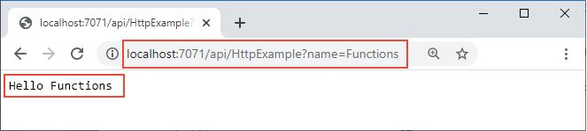

# <a name="quickstart-create-a-c-function-in-azure-from-the-command-line"></a>Schnellstart: Erstellen einer C#-Funktion über die Befehlszeile in Azure

> [!div class="op_single_selector" title1="Wählen Sie Ihre Funktionssprache aus: "]
> - [C#](create-first-function-cli-csharp-ieux.md)
> - [Java](create-first-function-cli-java.md)
> - [JavaScript](create-first-function-cli-node.md)
> - [PowerShell](create-first-function-cli-powershell.md)
> - [Python](create-first-function-cli-python.md)
> - [TypeScript](create-first-function-cli-typescript.md)

In diesem Artikel wird mithilfe von Befehlszeilentools eine auf der C#-Klassenbibliothek basierende Funktion erstellt, die auf HTTP-Anforderungen reagiert. Stellen Sie den Code nach lokalen Tests in folgender Umgebung bereit: <abbr title="Eine Runtimecomputingumgebung, in der alle Serverdetails für Anwendungsentwickler transparent sind. Dies vereinfacht den Prozess der Bereitstellung sowie die Codeverwaltung.">Serverlos</abbr> Umgebung in <abbr title="Hierbei handelt es sich um den Dienst von Azure, der eine kostengünstige Umgebung für serverloses Computing für Anwendungen bietet.">Azure-Funktionen</abbr>.

Im Rahmen dieser Schnellstartanleitung fallen in Ihrem Azure-Konto ggf. geringfügige Kosten im Centbereich an.

Es gibt auch eine [Visual Studio Code-basierte Version](create-first-function-vs-code-csharp.md) dieses Artikels.

## <a name="1-prepare-your-environment"></a>1. Vorbereiten der Umgebung

+ Beziehen Sie ein Azure- <abbr title="Das Profil, mit dem Abrechnungsinformationen zur Azure-Nutzung verwaltet werden.">Azure-Konto</abbr> mit einem aktiven <abbr title="Die grundlegende Organisationsstruktur, in der Sie Ressourcen in Azure verwalten. Diese wird in der Regel einer Einzelperson oder Abteilung innerhalb einer Organisation zugeordnet.">Abonnement</abbr>. Sie können [kostenlos ein Konto erstellen](https://azure.microsoft.com/free/?ref=microsoft.com&utm_source=microsoft.com&utm_medium=docs&utm_campaign=visualstudio).

+ Installation des [.NET Core SDK 3.1](https://www.microsoft.com/net/download)

+ Installation von Version 3.x der [Azure Functions Core Tools](functions-run-local.md#v2).

+ Entweder die <abbr title="Eine Reihe plattformübergreifender Befehlszeilentools für die Verwendung von Azure-Ressourcen auf Ihrem lokalen Entwicklungscomputer (als Alternative zur Verwendung des Azure-Portals).">Azure CLI</abbr> oder <abbr title="Ein PowerShell-Modul, das Befehle für die Verwendung von Azure-Ressourcen auf Ihrem lokalen Entwicklungscomputer bereitstellt (als Alternative zur Verwendung des Azure-Portals).">Azure PowerShell</abbr> zum Erstellen von Azure-Ressourcen:

    + [Azure CLI, Version  2.4 oder höher](/cli/azure/install-azure-cli).

    + [Azure PowerShell](/powershell/azure/install-az-ps), Version 5.0 oder höher.

---

### <a name="2-verify-prerequisites"></a>2. Überprüfen der Voraussetzungen

Überprüfen Sie Ihre Voraussetzungen, die davon abhängig sind, ob Sie die Azure CLI oder Azure PowerShell zum Erstellen von Azure-Ressourcen verwenden:

# <a name="azure-cli"></a>[Azure-Befehlszeilenschnittstelle](#tab/azure-cli)

+ Führen Sie in einem Terminal- oder Befehlsfenster `func --version` aus, um sich zu vergewissern, dass von <abbr title="Die Befehlszeilentools für die Arbeit mit Azure Functions auf dem lokalen Computer.">Azure Functions Core Tools</abbr> Version 3.x installiert ist.

+ **Führen Sie `az --version` aus**, um zu überprüfen, ob die Version 2.4 oder höher der Azure CLI verwendet wird.

+ **Führen Sie `az login` aus**, um sich bei Azure anzumelden und zu überprüfen, ob ein aktives Abonnement vorhanden ist.

+ **Führen Sie `dotnet --list-sdks` aus**, um zu überprüfen, ob Version 3.1.x des .NET Core SDK installiert ist.

# <a name="azure-powershell"></a>[Azure PowerShell](#tab/azure-powershell)

+**Führen Sie `func --version` aus**, um zu überprüfen, ob mindestens Version 3.x der Azure Functions Core Tools verwendet wird.

+ **Führen Sie `(Get-Module -ListAvailable Az).Version` aus**, und stellen Sie sicher, dass Version 5.0 oder höher ausgeführt wird. 

+ **Führen Sie `Connect-AzAccount` aus**, um sich bei Azure anzumelden und zu überprüfen, ob ein aktives Abonnement vorhanden ist.

+ **Führen Sie `dotnet --list-sdks` aus**, um zu überprüfen, ob Version 3.1.x des .NET Core SDK installiert ist.

---

## <a name="3-create-a-local-function-project"></a>3. Erstellen eines lokalen Funktionsprojekts

In diesem Abschnitt erstellen Sie ein lokales <abbr title="Ein logischer Container für eine oder mehrere einzelne Funktionen, die zusammen bereitgestellt und verwaltet werden können.">Azure Functions-Projekt</abbr> in C#. Jede Funktion im Projekt reagiert auf einen bestimmten <abbr title="Ein Ereignis, das den Funktionscode aufruft, etwa eine HTTP-Anforderung, eine Warteschlangennachricht oder eine bestimmte Uhrzeit">Trigger (trigger)</abbr>.

1. Führen Sie den Befehl `func init` aus, um in einem Ordner mit dem Namen *LocalFunctionProj* ein Funktionsprojekt mit der angegebenen Runtime zu erstellen:  

    ```csharp
    func init LocalFunctionProj --dotnet
    ```

1. **Führen Sie „cd LocalFunctionProj“ aus**, um zum <abbr title="Dieser Ordner enthält verschiedene Dateien für das Projekt, z. B. die Konfigurationsdateien local.settings.json und host.json. Da local.settings.json aus Azure heruntergeladene Geheimnisse enthalten kann, wird die Datei in der GITIGNORE-Datei standardmäßig aus der Quellcodeverwaltung ausgeschlossen.">Projektordner</abbr>.

    ```console
    cd LocalFunctionProj
    ```
    <br/>

1. Fügen Sie Ihrem Projekt mithilfe des folgenden Befehls eine Funktion hinzu:
    
    ```console
    func new --name HttpExample --template "HTTP trigger" --authlevel "anonymous"
    ``` 
    Das Argument `--name` ist der eindeutige Name Ihrer Funktion (HttpExample).

    Das Argument `--template` gibt den Trigger (HTTP) der Funktion an.

    
    <br/>   
    <details>  
    <summary><strong>Optional: Code für HttpExample.cs</strong></summary>  
    
    *HttpExample.cs* enthält eine `Run`-Methode, die Anforderungsdaten über die Variable `req` empfängt. Hier ist dies eine Anforderung vom Typ [HttpRequest](/dotnet/api/microsoft.aspnetcore.http.httprequest), die durch das **HttpTriggerAttribute** zum Definieren des Triggerverhaltens ergänzt wird.

    :::code language="csharp" source="~/functions-docs-csharp/http-trigger-template/HttpExample.cs":::
        
    Das Rückgabeobjekt ist ein [ActionResult](/dotnet/api/microsoft.aspnetcore.mvc.actionresult)-Element, das eine Antwortnachricht entweder als [OkObjectResult](/dotnet/api/microsoft.aspnetcore.mvc.okobjectresult) (200) oder [BadRequestObjectResult](/dotnet/api/microsoft.aspnetcore.mvc.badrequestobjectresult) (400) zurückgibt. Weitere Informationen finden Sie unter [HTTP-Trigger und -Bindungen in Azure Functions](./functions-bindings-http-webhook.md?tabs=csharp).  
    </details>

<br/>

---

## <a name="4-run-the-function-locally"></a>4. Lokales Ausführen der Funktion

1. Führen Sie Ihre Funktion aus, indem Sie den lokalen Azure Functions-Runtimehost im Ordner *LocalFunctionProj* starten:

    ```
    func start
    ```

    Gegen Ende der Ausgabe sollten die folgenden Zeilen angezeigt werden: 

    <pre class="is-monospace is-size-small has-padding-medium has-background-tertiary has-text-tertiary-invert">
    ...

    Now listening on: http://0.0.0.0:7071
    Application started. Press Ctrl+C to shut down.

    Http Functions:

            HttpExample: [GET,POST] http://localhost:7071/api/HttpExample
    ...

    </pre>

    <br/>
    <details>
    <summary><strong>„HttpExample“ wird in der Ausgabe nicht angezeigt.</strong></summary>

    Sollte „HttpExample“ nicht angezeigt werden, haben Sie den Host wahrscheinlich außerhalb des Stammordners des Projekts gestartet. Drücken Sie in diesem Fall <kbd>STRG+C</kbd>, um den Host zu beenden. Navigieren Sie anschließend zum Stammordner des Projekts, und führen Sie den vorherigen Befehl erneut aus.
    </details>

1. Kopieren Sie die URL Ihrer **HttpExample**-Funktion aus dieser Ausgabe in einen Browser, und fügen Sie die Abfragezeichenfolge **?name=<IHR_NAME>** an. Die vollständige URL lautet dann wie folgt: **http://localhost:7071/api/HttpExample?name=Functions** . Im Browser sollte eine Meldung wie **Hello Functions** angezeigt werden:

    


1. Drücken Sie <kbd>STRG+C</kbd>, und wählen Sie <kbd>y</kbd>, um den Funktionshost zu beenden.

<br/>

---
    
## <a name="5-create-supporting-azure-resources-for-your-function"></a>5. Erstellen von unterstützenden Azure-Ressourcen für Ihre Funktion

Zum Bereitstellen Ihres Funktionscodes in Azure müssen Sie drei Ressourcen erstellen: eine <abbr title="Ein logischer Container für verwandte Azure-Ressourcen, die Sie als Einheit verwalten können.">Ressourcengruppe</abbr>, ein <abbr title="Ein Konto, das alle Azure-Speicherdatenobjekte enthält. Das Speicherkonto bietet einen eindeutigen Namespace für Ihre Speicherdaten.">Speicherkonto</abbr>und eine <abbr title="Die Cloudressource, die serverlose Funktionen in Azure hostet und die zugrunde liegende Compute-Umgebung für die Ausführung von Funktionen bereitstellt.">Funktions-App.</abbr> Verwenden Sie dazu die folgenden Befehle:

1. Melden Sie sich bei Azure an, falls dies noch nicht geschehen ist:

    # <a name="azure-cli"></a>[Azure-Befehlszeilenschnittstelle](#tab/azure-cli)
    ```azurecli
    az login
    ```


    # <a name="azure-powershell"></a>[Azure PowerShell](#tab/azure-powershell) 
    ```azurepowershell
    Connect-AzAccount
    ```


    ---

1. Erstellen Sie eine Ressourcengruppe mit dem Namen `AzureFunctionsQuickstart-rg` in der Region `westeurope`. 

    # <a name="azure-cli"></a>[Azure-Befehlszeilenschnittstelle](#tab/azure-cli)

    ```azurecli
    az group create --name AzureFunctionsQuickstart-rg --location westeurope
    ```

    Mit dem Befehl [az group create](/cli/azure/group#az-group-create) wird eine Ressourcengruppe erstellt. Im Allgemeinen erstellen Sie Ressourcengruppen und Ressourcen in einer <abbr title="Ein geografischer Verweis auf ein bestimmtes Azure-Rechenzentrum, in dem Ressourcen zugeordnet werden.">region</abbr> in Ihrer Nähe, indem Sie eine verfügbare Region verwenden, die vom Befehl `az account list-locations` zurückgegeben wird.

    # <a name="azure-powershell"></a>[Azure PowerShell](#tab/azure-powershell)

    ```azurepowershell
    New-AzResourceGroup -Name AzureFunctionsQuickstart-rg -Location westeurope
    ```


    ---

    In derselben Ressourcengruppe können nicht gleichzeitig Linux- und Windows-Apps gehostet werden. Wenn Sie über eine bestehende Ressourcengruppe mit dem Namen `AzureFunctionsQuickstart-rg` und einer Windows-Funktions-App oder -Web-App verfügen, müssen Sie eine andere Ressourcengruppe verwenden.
    
1. Erstellen Sie in Ihrer Ressourcengruppe und Region ein universelles Azure Storage-Konto:

    # <a name="azure-cli"></a>[Azure-Befehlszeilenschnittstelle](#tab/azure-cli)

    ```azurecli
    az storage account create --name <STORAGE_NAME> --location westeurope --resource-group AzureFunctionsQuickstart-rg --sku Standard_LRS
    ```


    # <a name="azure-powershell"></a>[Azure PowerShell](#tab/azure-powershell)

    ```azurepowershell
    New-AzStorageAccount -ResourceGroupName AzureFunctionsQuickstart-rg -Name <STORAGE_NAME> -SkuName Standard_LRS -Location westeurope
    ```


    ---

    Ersetzen Sie `<STORAGE_NAME>` durch einen Namen, der für Sie geeignet und <abbr title="Der Name muss für alle Speicherkonten, die von allen Azure-Kunden global genutzt werden, eindeutig sein. Sie können beispielsweise eine Kombination aus Ihrem persönlichen Namen oder Organisationsnamen, dem Anwendungsnamen und einem numerischen Bezeichner verwenden, etwa „contosobizappstorage20“.">eindeutig in Azure Storage ist</abbr>. Namen dürfen nur 3 bis 24 Zeichen und ausschließlich Kleinbuchstaben enthalten. Mit `Standard_LRS` wird ein universelles Konto angegeben, das [von Functions unterstützt](storage-considerations.md#storage-account-requirements) wird.


1. Erstellen Sie die Funktions-App in Azure.
**Ersetzen** Sie „<STORAGE_NAME>“ durch den Namen im vorherigen Schritt.
**Ersetzen** Sie „<APP_NAME>“ durch einen global eindeutigen Namen.

    # <a name="azure-cli"></a>[Azure-Befehlszeilenschnittstelle](#tab/azure-cli)
        
    ```azurecli
    az functionapp create --resource-group AzureFunctionsQuickstart-rg --consumption-plan-location westeurope --runtime dotnet --functions-version 3 --name <APP_NAME> --storage-account <STORAGE_NAME>
    ```
    
    
    # <a name="azure-powershell"></a>[Azure PowerShell](#tab/azure-powershell)
    
    ```azurepowershell
    New-AzFunctionApp -Name <APP_NAME> -ResourceGroupName AzureFunctionsQuickstart-rg -StorageAccount <STORAGE_NAME> -Runtime dotnet -FunctionsVersion 3 -Location 'West Europe'
    ```
    
    
    ---
    
    Ersetzen Sie `<STORAGE_NAME>` durch den Namen des Kontos, das Sie im vorherigen Schritt verwendet haben.

    Ersetzen Sie `<APP_NAME>` durch einen <abbr title="Ein Name, der für alle Azure-Kunden auf der ganzen Welt eindeutig sein muss. Sie können beispielsweise eine Kombination aus Ihrem persönlichen Namen oder Organisationsnamen, dem Anwendungsnamen und einem numerischen Bezeichner verwenden, etwa „contoso-bizapp-func-20“.">eindeutigen Namen</abbr>. `<APP_NAME>` ist gleichzeitig die DNS-Standarddomäne für die Funktions-App. 

    <br/>
    <details>
    <summary><strong>Welche Kosten fallen für die in Azure bereitgestellten Ressourcen an?</strong></summary>

    Mit diesem Befehl wird eine Funktions-App erstellt, die in der von Ihnen angegebenen Language Runtime unter dem [Azure Functions-Verbrauchstarif](consumption-plan.md) ausgeführt wird. Dies ist für die Nutzungsmenge, die in diesem Fall anfällt, kostenlos. Darüber hinaus wird mit dem Befehl auch eine zugeordnete Azure Application Insights-Instanz in derselben Ressourcengruppe bereitgestellt, mit der Sie Ihre Funktions-App überwachen und Protokolle anzeigen können. Weitere Informationen finden Sie unter [Überwachen von Azure Functions](functions-monitoring.md). Für die Instanz fallen erst Kosten an, wenn Sie sie aktivieren.
    </details>

<br/>

---

## <a name="6-deploy-the-function-project-to-azure"></a>6. Bereitstellen des Funktionsprojekts in Azure


**Kopieren** Sie „func azure funtionapp publish <APP_NAME>“ in Ihr Terminal. **Ersetzen** Sie `<APP_NAME>` durch den Namen Ihrer App.
**Ausführen**

```console
func azure functionapp publish <APP_NAME>
```

Mit dem Befehl `publish` werden Ergebnisse wie in der folgenden (gekürzten) Ausgabe angezeigt:

<pre class="is-monospace is-size-small has-padding-medium has-background-tertiary has-text-tertiary-invert">
...

Getting site publishing info...
Creating archive for current directory...
Performing remote build for functions project.

...

Deployment successful.
Remote build succeeded!
Syncing triggers...
Functions in msdocs-azurefunctions-qs:
    HttpExample - [httpTrigger]
        Invoke url: https://msdocs-azurefunctions-qs.azurewebsites.net/api/httpexample
</pre>

<br/>

---

## <a name="7-invoke-the-function-on-azure"></a>7. Aufrufen der Funktion in Azure

Kopieren Sie die vollständige **Aufruf-URL**, die in der Ausgabe des Befehls `publish` angezeigt wird, in eine Browseradressleiste. Sie müssen den Parameter **&name=Functions** an die Abfragezeichenfolge **anfügen**. 


<br/>

---

## <a name="8-clean-up-resources"></a>8. Bereinigen von Ressourcen

Wenn Sie mit dem [nächsten Schritt](#next-steps) fortfahren und eine Azure Storage-Warteschlangenausgabe <abbr title="Eine deklarative Verbindung zwischen einer Funktion und anderen Ressourcen. Eine Eingabebindung stellt Daten für die Funktion bereit. Eine Ausgabebindung stellt Daten aus der Funktion für andere Ressourcen bereit.">bindung</abbr>hinzufügen, müssen alle Ihre Ressourcen erhalten bleiben, um darauf aufbauen zu können.

Verwenden Sie andernfalls den unten angegebenen Befehl, um die Ressourcengruppe und alle darin enthaltenen Ressourcen zu löschen, damit keine weiteren Kosten anfallen.

# <a name="azure-cli"></a>[Azure-Befehlszeilenschnittstelle](#tab/azure-cli)

```azurecli
az group delete --name AzureFunctionsQuickstart-rg
```

# <a name="azure-powershell"></a>[Azure PowerShell](#tab/azure-powershell)

```azurepowershell
Remove-AzResourceGroup -Name AzureFunctionsQuickstart-rg
```

---

<br/>

---

## <a name="next-steps"></a>Nächste Schritte

> [!div class="nextstepaction"]
> [Herstellen einer Verbindung mit einer Azure Storage-Warteschlange](functions-add-output-binding-storage-queue-cli.md?pivots=programming-language-csharp)
