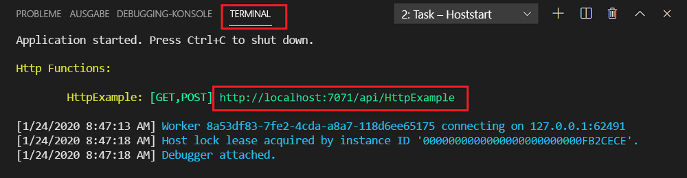

# Schnellstart: Erstellen einer JavaScript-Funktion in Azure mit Visual Studio Code

> [!div class="op_single_selector" title1="Wählen Sie Ihre Funktionssprache aus: "]
> - [JavaScript](create-first-function-vs-code-node.md)
> - [C#](create-first-function-vs-code-csharp.md)
> - [Java](create-first-function-vs-code-java.md)
> - [PowerShell](create-first-function-vs-code-powershell.md)
> - [Python](create-first-function-vs-code-python.md)
> - [TypeScript](create-first-function-vs-code-typescript.md)
> - [Sonstiges (Go/Rust)](create-first-function-vs-code-other.md)

Verwenden Sie Visual Studio Code zum Erstellen einer JavaScript-Funktion, die auf HTTP-Anforderungen reagiert. Testen Sie den Code lokal, und stellen Sie ihn anschließend in der serverlosen Umgebung von Azure Functions bereit.

Dieser Schnellstart umfasst geringe Kosten im Centbereich für Ihr <abbr title="Das Azure-Konto ist eine eindeutige, globale Entität, über die Sie auf Azure-Dienste und Ihre Azure-Abonnements zugreifen können.">Azure-Konto</abbr>.

## 1. Vorbereiten der Umgebung

Vergewissern Sie sich zunähst, dass Folgendes vorhanden ist:

+ Ein Azure-Konto mit einem <abbr title="Ein Azure-Abonnement ist ein logischer Container zur Bereitstellung von Ressourcen in Azure. Es enthält Details zu all Ihren Ressourcen, z. B. zu Ihren virtuellen Computern, Datenbanken usw.">aktiven Abonnement</abbr>. Sie können [kostenlos ein Konto erstellen](https://azure.microsoft.com/free/?ref=microsoft.com&utm_source=microsoft.com&utm_medium=docs&utm_campaign=visualstudio).

+ [Node.js 10.14.1 und höher](https://nodejs.org/)

+ [Visual Studio Code](https://code.visualstudio.com/)

+ [Azure Functions-Erweiterung](https://marketplace.visualstudio.com/items?itemName=ms-azuretools.vscode-azurefunctions) für Visual Studio Code

+ [Azure Functions Core Tools](functions-run-local.md?tabs=linux%2Ccsharp%2Cbash#install-the-azure-functions-core-tools)

 

## 2. Erstellen eines lokalen Azure Functions-Projekts

1. Klicken Sie auf das Azure-Symbol in der <abbr title="">Aktivitätsleiste</abbr>und dann im Bereich **Azure: Functions** auf das Symbol **Neues Projekt erstellen...** .

    

1. **Wählen Sie einen Verzeichnisspeicherort** für Ihren Projektarbeitsbereich aus, und klicken Sie dann auf **Auswählen**. 

1. Geben Sie nach entsprechender Aufforderung Folgendes ein:

    + **Select a language for your function project** (Wählen Sie eine Sprache für Ihr Funktionsprojekt aus.): Wählen Sie die Option `JavaScript`.

    + **Select a template for your project's first function** (Wählen Sie die Vorlage für die erste Funktion Ihres Projekts aus.): Wählen Sie die Option `HTTP trigger`.

    + **Provide a function name** (Geben Sie einen Funktionsnamen an.): Geben Sie `HttpExample`ein.

    + **Autorisierungsstufe:** Wählen Sie `Anonymous` aus, damit Ihr Funktionsendpunkt von jedem Benutzer aufgerufen werden kann.

    + **Select how you would like to open your project** (Wählen Sie aus, wie Sie Ihr Projekt öffnen möchten.): Wählen Sie die Option `Add to workspace`.

 

<strong>Sie können kein Azure Functions-Projekt erstellen?</strong>

Dies sind die häufigsten Probleme, die beim Erstellen eines lokalen Functions-Projekts gelöst werden müssen:
* Die Azure Functions-Erweiterung ist nicht installiert. 

 

## 3. Lokales Ausführen der Funktion

1. Drücken Sie <kbd>F5</kbd>, um das Funktions-App-Projekt zu starten. 

1. Im **Terminal** wird der URL-Endpunkt Ihrer lokal ausgeführten Funktion angezeigt.

    

1. Kopieren Sie die folgende URL, fügen Sie sie in einen Webbrowser ein, und drücken Sie die EINGABETASTE.

    `http://localhost:7071/api/HttpExample?name=Functions`

1. Daraufhin wird eine Antwort zurückgegeben.

    

1. Im **Terminal** werden Informationen zur Anforderung angezeigt.

    

1. Drücken Sie <kbd>STRG+C</kbd>, um die Core Tools zu beenden und die Verbindung mit dem Debugger zu trennen.

 

<strong>Kann die Funktion nicht lokal ausgeführt werden?</strong>

Dies sind die häufigsten Probleme, die beim Ausführen eines lokalen Functions-Projekts gelöst werden müssen:
* Azure Functions Core Tools ist nicht installiert. 
*  Sollten bei der Ausführung unter Windows Probleme auftreten, vergewissern Sie sich, dass die Standardterminalshell für Visual Studio Code nicht auf „WSL Bash“ festgelegt ist. 

 

## 4. Anmelden bei Azure

Melden Sie sich zum Veröffentlichen Ihrer App bei Azure an. Sollten Sie bereits angemeldet sein, fahren Sie mit dem nächsten Abschnitt fort.

1. Klicken Sie in der Aktivitätsleiste auf das Azure-Symbol, und klicken Sie dann im Bereich **Azure: Functions** auf **Bei Azure anmelden...** .

    

1. **Wählen Sie Ihr Azure-Konto aus**, und **melden Sie sich mit Ihren Azure-Kontoanmeldeinformationen** an, wenn Sie im Browser dazu aufgefordert werden.

1. Nachdem Sie sich erfolgreich angemeldet haben, schließen Sie das neue Browserfenster, und kehren Sie zu Visual Studio Code zurück. 

 

## 5. Veröffentlichen des Projekts in Azure

Die erste Bereitstellung Ihres Codes umfasst das Erstellen einer Azure Functions-Ressource in Ihrem Azure-Abonnement. 

1. Wählen Sie auf der Aktivitätsleiste das Azure-Symbol und anschließend im Bereich **Azure: Funktionen** die Schaltfläche **Deploy to function app...** (In Funktions-App bereitstellen...) aus.

    

1. Geben Sie nach entsprechender Aufforderung Folgendes ein:

    + **Ordner auswählen:** Wählen Sie den Ordner aus, der Ihre Funktions-App enthält. 

    + **Wählen Sie das Abonnement aus:** Wählen Sie das zu verwendende Abonnement aus. Wenn Sie nur über ein Abonnement verfügen, wird diese Option nicht angezeigt.

    + **Select Function App in Azure:** (Wählen Sie die Funktions-App in Azure aus:) Wählen Sie die Option `+ Create new Function App`.

    + **Enter a globally unique name for the function app** (Global eindeutigen Namen für die Funktions-App eingeben): Geben Sie einen in Azure eindeutigen Namen in einen URL-Pfad ein. Die globale Eindeutigkeit des eingegebenen Namens wird überprüft.

    + **Select a runtime:** (Wählen Sie eine Runtime aus:) Wählen Sie die lokal ausgeführte Node.js-Version aus. Sie können den Befehl `node --version` ausführen, um Ihre Version zu überprüfen.

    + **Wählen Sie einen Speicherort für neue Ressourcen aus:**  Wählen Sie eine [Region](https://azure.microsoft.com/regions/) in Ihrer Nähe aus, um eine bessere Leistung zu erzielen. 

1. Nach der Erstellung der Funktions-App wird eine Benachrichtigung angezeigt, und das Bereitstellungspaket wird angewendet. Klicken Sie auf **Ausgabe anzeigen**, um die Ergebnisse der Erstellung und Bereitstellung anzuzeigen. 
    
    

 

<strong>Kann die Funktion nicht veröffentlicht werden?</strong>

In diesem Abschnitt haben Sie die Azure-Ressourcen erstellt und Ihren lokalen Code in der Funktions-App bereitgestellt. Wenn dies nicht erfolgreich war:

* Überprüfen Sie die Ausgabe auf Fehlerinformationen. Das Glockensymbol in der unteren rechten Ecke ist eine weitere Möglichkeit zum Anzeigen der Ausgabe. 
* Haben Sie die Veröffentlichung in einer vorhandenen Funktions-App durchgeführt? Diese Aktion überschreibt den Inhalt dieser App in Azure.

 

<strong>Welche Ressourcen wurden erstellt?</strong>

Nach Abschluss des Vorgangs werden in Ihrem Abonnement die folgenden Azure-Ressourcen erstellt, deren Namen auf dem Namen Ihrer Funktions-App basieren: 
* **Ressourcengruppe:** Eine Ressourcengruppe ist ein logischer Container für verwandte Ressourcen in der gleichen Region.
* **Azure Storage-Konto:** Mit einer Azure Storage-Ressource werden Statusinformationen und andere Informationen zu Ihren Projekten verwaltet.
* **Verbrauchsplan:** Ein Verbrauchsplan definiert den zugrunde liegenden Host für Ihre serverlose Funktions-App.
* **Funktions-App:** Eine Funktions-App stellt die Umgebung zum Ausführen des Funktionscodes und der Gruppenfunktionen als logische Einheit zur Verfügung.
* **Application Insights:** Application Insights überwacht die Verwendung Ihrer serverlosen Funktion.

 

## 6. Ausführen der Funktion in Azure
1. Erweitern Sie die neue Funktions-App in der Seitenleiste **Azure: Functions**. 
1. Erweitern Sie **Functions**, klicken Sie mit der rechten Maustaste auf **HttpExample**, und wählen Sie dann **Execute Function Now...** (Funktion jetzt ausführen) aus.

    

1. **Drücken Sie die EINGABETASTE**, um eine Standardanforderungsnachricht an Ihre Funktion zu übermitteln. 

1. In Visual Studio Code wird eine Benachrichtigung ausgelöst, wenn die Funktionsausführung abgeschlossen wird.

 

<strong>Konnte die cloudbasierte Funktions-App nicht ausgeführt werden?</strong>

* Haben Sie vergessen, die Abfragezeichenfolge zum Ende der URL hinzuzufügen?

 

## 7. Bereinigen von Ressourcen

Löschen Sie die Funktions-App und die zugehörigen Ressourcen, um weitere Kosten zu vermeiden.

1. Klicken Sie in Visual Studio Code in der Aktivitätsleiste auf das Azure-Symbol, und klicken Sie dann auf den Azure Functions-Bereich in der Seitenleiste. 
1. Wählen Sie die Funktions-App aus, klicken Sie mit der rechten Maustaste auf diese, und wählen Sie dann die Option **Delete Function app...** (Funktions-App löschen...) aus.

 

## Nächste Schritte

Erweitern Sie die Funktion durch Hinzufügen einer <abbr title="Die Bindung an eine Funktion ist eine Möglichkeit, eine andere Ressource deklarativ mit der Funktion zu verknüpfen.">Ausgabebindung</abbr>. Diese Bindung schreibt die Zeichenfolge aus der HTTP-Anforderung in eine Nachricht in einer Azure Queue Storage-Warteschlange. 

> [!div class="nextstepaction"]
> [Herstellen einer Verbindung mit einer Azure Storage-Warteschlange](functions-add-output-binding-storage-queue-vs-code.md?pivots=programming-language-javascript)

[Azure Functions Core Tools]: functions-run-local.md
[Azure Functions extension for Visual Studio Code]: https://marketplace.visualstudio.com/items?itemName=ms-azuretools.vscode-azurefunctions
