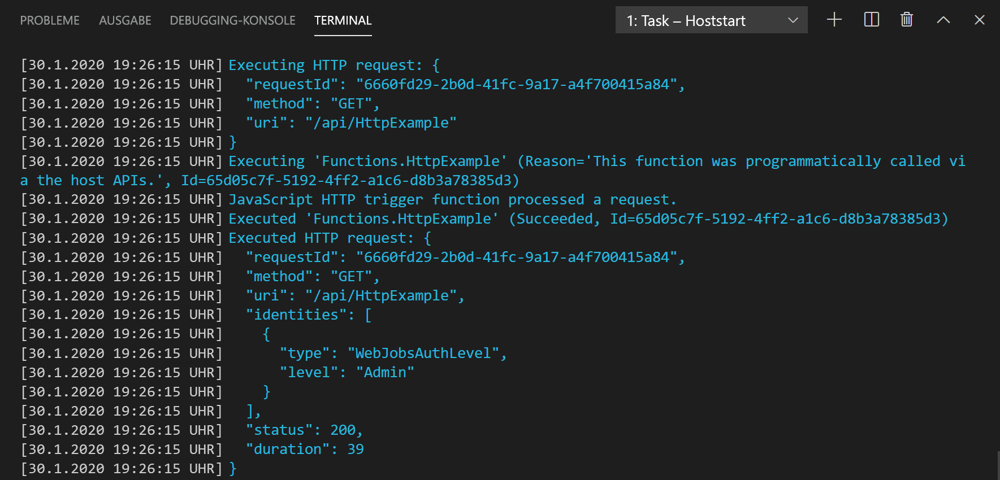
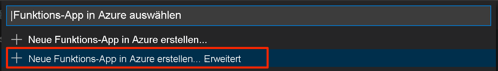

# <a name="quickstart-create-a-go-or-rust-function-in-azure-using-visual-studio-code"></a>Schnellstart: Erstellen einer Go- oder Rust-Funktion in Azure mit Visual Studio Code

[!INCLUDE [functions-language-selector-quickstart-vs-code](../../includes/functions-language-selector-quickstart-vs-code.md)]

In diesem Artikel erstellen Sie mit Visual Studio Code eine Funktion mit einem [benutzerdefinierten Handler](functions-custom-handlers.md) zum Antworten auf HTTP-Anforderungen. Der Code wird lokal getestet und anschließend in der serverlosen Umgebung von Azure Functions bereitgestellt.

Benutzerdefinierte Handler können eingesetzt werden, um Funktionen mit einer beliebigen Sprache oder Runtime zu erstellen, indem ein HTTP-Serverprozess ausgeführt wird. In diesem Artikel wird sowohl [Go](create-first-function-vs-code-other.md?tabs=go) als auch [Rust](create-first-function-vs-code-other.md?tabs=rust) unterstützt.

Im Rahmen dieser Schnellstartanleitung fallen in Ihrem Azure-Konto ggf. geringfügige Kosten im Centbereich an.

## <a name="configure-your-environment"></a>Konfigurieren Ihrer Umgebung

Vergewissern Sie sich zunähst, dass Folgendes vorhanden ist:

# <a name="go"></a>[Go](#tab/go)

+ Ein Azure-Konto mit einem aktiven Abonnement. Sie können [kostenlos ein Konto erstellen](https://azure.microsoft.com/free/?ref=microsoft.com&utm_source=microsoft.com&utm_medium=docs&utm_campaign=visualstudio).

+ [Visual Studio Code](https://code.visualstudio.com/) auf einer der [unterstützten Plattformen](https://code.visualstudio.com/docs/supporting/requirements#_platforms)

+ [Azure Functions-Erweiterung](https://marketplace.visualstudio.com/items?itemName=ms-azuretools.vscode-azurefunctions) für Visual Studio Code

+ [Azure Functions Core Tools](./functions-run-local.md#v2), Version 3.x. Verwenden Sie den Befehl `func --version`, um die Richtigkeit der Installation zu überprüfen.

+ [Go](https://golang.org/doc/install) (aktuelle Version empfohlen). Verwenden Sie den Befehl `go version`, um Ihre Version zu überprüfen.

# <a name="rust"></a>[Rust](#tab/rust)

+ Ein Azure-Konto mit einem aktiven Abonnement. Sie können [kostenlos ein Konto erstellen](https://azure.microsoft.com/free/?ref=microsoft.com&utm_source=microsoft.com&utm_medium=docs&utm_campaign=visualstudio).

+ [Visual Studio Code](https://code.visualstudio.com/) auf einer der [unterstützten Plattformen](https://code.visualstudio.com/docs/supporting/requirements#_platforms)

+ [Azure Functions-Erweiterung](https://marketplace.visualstudio.com/items?itemName=ms-azuretools.vscode-azurefunctions) für Visual Studio Code

+ [Azure Functions Core Tools](./functions-run-local.md#v2), Version 3.x. Verwenden Sie den Befehl `func --version`, um die Richtigkeit der Installation zu überprüfen.

+ Rust-Toolkette mit [rustup](https://www.rust-lang.org/tools/install). Verwenden Sie den Befehl `rustc --version`, um Ihre Version zu überprüfen.

---

## <a name="create-your-local-project"></a><a name="create-an-azure-functions-project"></a>Erstellen Ihres lokalen Projekts

In diesem Abschnitt wird mit Visual Studio Code ein lokales Azure Functions-Projekt mit benutzerdefinierten Handlern erstellt. Weiter unten in diesem Artikel wird der Funktionscode in Azure veröffentlicht.

1. Wählen Sie auf der Aktivitätsleiste das Azure-Symbol und anschließend im Bereich **Azure: Funktionen** das Symbol **Neues Projekt erstellen** aus.

    

1. Wählen Sie einen Verzeichnisspeicherort für Ihren Projektarbeitsbereich und anschließend **Auswählen** aus.

    > [!NOTE]
    > Diese Schritte sollten außerhalb eines Arbeitsbereichs ausgeführt werden. Wählen Sie in diesem Fall keinen Projektordner aus, der Teil eines Arbeitsbereichs ist.

1. Geben Sie nach entsprechender Aufforderung Folgendes ein:

    + **Select a language for your function project** (Wählen Sie eine Sprache für Ihr Funktionsprojekt aus.): Wählen Sie die Option `Custom`.

    + **Select a template for your project's first function** (Wählen Sie die Vorlage für die erste Funktion Ihres Projekts aus.): Wählen Sie die Option `HTTP trigger`.

    + **Provide a function name** (Geben Sie einen Funktionsnamen an.): Geben Sie `HttpExample`ein.

    + **Autorisierungsstufe:** Wählen Sie `Anonymous` aus, damit Ihr Funktionsendpunkt von jedem Benutzer aufgerufen werden kann. Weitere Informationen zur Autorisierungsstufe finden Sie unter [Autorisierungsschlüssel](functions-bindings-http-webhook-trigger.md#authorization-keys).

    + **Select how you would like to open your project** (Wählen Sie aus, wie Sie Ihr Projekt öffnen möchten.): Wählen Sie die Option `Add to workspace`.

1. Auf der Grundlage dieser Informationen generiert Visual Studio Code ein Azure Functions-Projekt mit einer HTTP-Triggerfunktion. Die lokalen Projektdateien können im Explorer angezeigt werden. Weitere Informationen zu den erstellten Dateien finden Sie unter [Generierte Projektdateien](functions-develop-vs-code.md#generated-project-files). 

## <a name="create-and-build-your-function"></a>Erstellen und Kompilieren Ihrer Funktion

Mit der Datei *function.json* im Ordner *HttpExample* wird eine HTTP-Triggerfunktion deklariert. Sie erstellen die Funktion, indem Sie einen Handler hinzufügen und die Kompilierung in eine ausführbare Datei durchführen.

# <a name="go"></a>[Go](#tab/go)

1. Drücken Sie <kbd>STRG+N</kbd> (macOS: <kbd>BEFEHLSTASTE+N</kbd>), um eine neue Datei zu erstellen. Speichern Sie sie als *handler.go* im Stammverzeichnis der Funktions-App (in demselben Ordner wie *host.json*).

1. Fügen Sie in *handler.go* den folgenden Code hinzu, und speichern Sie die Datei. Dies ist Ihr benutzerdefinierter Go-Handler.

    ```go
    package main

    import (
        "fmt"
        "log"
        "net/http"
        "os"
    )

    func helloHandler(w http.ResponseWriter, r *http.Request) {
        message := "This HTTP triggered function executed successfully. Pass a name in the query string for a personalized response.\n"
        name := r.URL.Query().Get("name")
        if name != "" {
            message = fmt.Sprintf("Hello, %s. This HTTP triggered function executed successfully.\n", name)
        }
        fmt.Fprint(w, message)
    }

    func main() {
        listenAddr := ":8080"
        if val, ok := os.LookupEnv("FUNCTIONS_CUSTOMHANDLER_PORT"); ok {
            listenAddr = ":" + val
        }
        http.HandleFunc("/api/HttpExample", helloHandler)
        log.Printf("About to listen on %s. Go to https://127.0.0.1%s/", listenAddr, listenAddr)
        log.Fatal(http.ListenAndServe(listenAddr, nil))
    }
    ```

1. Drücken Sie <kbd>STRG+UMSCHALT+`</kbd>, oder wählen Sie im Menü *Terminal* die Option *Neues Terminal* aus, um in VS Code ein neues integriertes Terminal zu öffnen.

1. Kompilieren Sie Ihren benutzerdefinierten Handler mit dem folgenden Befehl. Im Stammverzeichnis der Funktions-App wird eine ausführbare Datei mit dem Namen `handler` (Windows: `handler.exe`) ausgegeben.

    ```bash
    go build handler.go
    ```

    

# <a name="rust"></a>[Rust](#tab/rust)

1. Drücken Sie <kbd>STRG+UMSCHALT+`</kbd>, oder wählen Sie im Menü *Terminal* die Option *Neues Terminal* aus, um in VS Code ein neues integriertes Terminal zu öffnen.

1. Initialisieren Sie im Stammverzeichnis der Funktions-App (derselbe Ordner wie *host.json*) ein Rust-Projekt mit dem Namen `handler`.

    ```bash
    cargo init --name handler
    ```

1. Fügen Sie in *Cargo.toml* die folgenden Abhängigkeiten hinzu, die für die Durcharbeitung dieser Schnellstartanleitung benötigt werden. Im Beispiel wird das [warp](https://docs.rs/warp/)-Webserver-Framework verwendet.

    ```toml
    [dependencies]
    warp = "0.2"
    tokio = { version = "0.2", features = ["full"] }
    ```

1. Fügen Sie in *src/main.rs* den folgenden Code hinzu, und speichern Sie die Datei. Dies ist Ihr benutzerdefinierter Rust-Handler.

    ```rust
    use std::collections::HashMap;
    use std::env;
    use std::net::Ipv4Addr;
    use warp::{http::Response, Filter};

    #[tokio::main]
    async fn main() {
        let example1 = warp::get()
            .and(warp::path("api"))
            .and(warp::path("HttpExample"))
            .and(warp::query::<HashMap<String, String>>())
            .map(|p: HashMap<String, String>| match p.get("name") {
                Some(name) => Response::builder().body(format!("Hello, {}. This HTTP triggered function executed successfully.", name)),
                None => Response::builder().body(String::from("This HTTP triggered function executed successfully. Pass a name in the query string for a personalized response.")),
            });

        let port_key = "FUNCTIONS_CUSTOMHANDLER_PORT";
        let port: u16 = match env::var(port_key) {
            Ok(val) => val.parse().expect("Custom Handler port is not a number!"),
            Err(_) => 3000,
        };

        warp::serve(example1).run((Ipv4Addr::UNSPECIFIED, port)).await
    }
    ```

1. Kompilieren Sie eine Binärdatei für Ihren benutzerdefinierten Handler. Im Stammverzeichnis der Funktions-App wird eine ausführbare Datei mit dem Namen `handler` (Windows: `handler.exe`) ausgegeben.

    ```bash
    cargo build --release
    cp target/release/handler .
    ```

    

---

## <a name="configure-your-function-app"></a>Konfigurieren Ihrer Funktions-App

Der Funktionshost muss so konfiguriert werden, dass beim Starten die Binärdatei mit Ihrem benutzerdefinierten Handler ausgeführt wird.

1. Öffnen Sie *host.json*.

1. Legen Sie im Abschnitt `customHandler.description` den Wert von `defaultExecutablePath` auf `handler` fest (Windows: `handler.exe`).

1. Fügen Sie im Abschnitt `customHandler` eine Eigenschaft mit dem Namen `enableForwardingHttpRequest` hinzu, und legen Sie den Wert dafür auf `true` fest. Für Funktionen, die nur einen HTTP-Trigger umfassen, wird mit dieser Einstellung die Programmierung vereinfacht. Hierfür wird es Ihnen ermöglicht, anstelle der [Anforderungsnutzdaten](functions-custom-handlers.md#request-payload) des benutzerdefinierten Handlers eine normale HTTP-Anforderung zu verwenden.

1. Vergewissern Sie sich, dass der Abschnitt `customHandler` wie in diesem Beispiel aussieht. Speichern Sie die Datei.

    ```
    "customHandler": {
      "description": {
        "defaultExecutablePath": "handler",
        "workingDirectory": "",
        "arguments": []
      },
      "enableForwardingHttpRequest": true
    }
    ```

Die Funktions-App ist so konfiguriert, dass die ausführbare Datei für Ihren benutzerdefinierten Handler gestartet wird.

## <a name="run-the-function-locally"></a>Lokales Ausführen der Funktion

Sie können dieses Projekt auf Ihrem lokalen Entwicklungscomputer ausführen, bevor Sie es in Azure veröffentlichen.

1. Starten Sie im integrierten Terminal die Funktions-App mit Azure Functions Core Tools.

    ```bash
    func start
    ```

1. Navigieren Sie zur folgenden URL, während die Core Tools ausgeführt werden, um eine GET-Anforderung mit der Abfragezeichenfolge `?name=Functions` auszuführen.

    `http://localhost:7071/api/HttpExample?name=Functions`

1. Die zurückgegebene Antwort sieht in einem Browser in etwa wie folgt aus:

    

1. Informationen zur Anforderung werden in Bereich **Terminal** angezeigt.

    

1. Drücken Sie <kbd>STRG+C</kbd>, um Core Tools zu beenden.

Nachdem Sie sich vergewissert haben, dass die Funktion auf Ihrem lokalen Computer korrekt ausgeführt wird, können Sie das Projekt mithilfe von Visual Studio Code direkt in Azure veröffentlichen.

[!INCLUDE [functions-sign-in-vs-code](../../includes/functions-sign-in-vs-code.md)]

## <a name="compile-the-custom-handler-for-azure"></a>Kompilieren des benutzerdefinierten Handlers für Azure

In diesem Abschnitt veröffentlichen Sie Ihr Projekt in Azure über eine Funktions-App unter Linux. In den meisten Fällen müssen Sie die Binärdatei erneut kompilieren und die Konfiguration an die Zielplattform anpassen, bevor Sie sie in Azure veröffentlichen.

# <a name="go"></a>[Go](#tab/go)

1. Kompilieren Sie den Handler im integrierten Terminal unter Linux/x64. Im Stammverzeichnis der Funktions-App wird eine Binärdatei mit dem Namen `handler` erstellt.

    # <a name="macos"></a>[macOS](#tab/macos)

    ```bash
    GOOS=linux GOARCH=amd64 go build handler.go
    ```

    # <a name="linux"></a>[Linux](#tab/linux)

    ```bash
    GOOS=linux GOARCH=amd64 go build handler.go
    ```

    # <a name="windows"></a>[Windows](#tab/windows)
    ```cmd
    set GOOS=linux
    set GOARCH=amd64
    go build handler.go
    ```

    Ändern Sie `defaultExecutablePath` in der Datei *host.json* von `handler.exe` in `handler`. Hiermit wird die Funktions-App angewiesen, die Linux-Binärdatei auszuführen.
    
    ---

# <a name="rust"></a>[Rust](#tab/rust)

1. Erstellen Sie eine Datei unter *.cargo/config*. Fügen Sie den folgenden Inhalt hinzu, und speichern Sie die Datei.

    ```
    [target.x86_64-unknown-linux-musl]
    linker = "rust-lld"
    ```

1. Kompilieren Sie den Handler im integrierten Terminal unter Linux/x64. Eine Binärdatei mit dem Namen `handler` wird erstellt. Kopieren Sie sie in das Stammverzeichnis der Funktions-App.

    ```bash
    rustup target add x86_64-unknown-linux-musl
    cargo build --release --target=x86_64-unknown-linux-musl
    cp target/x86_64-unknown-linux-musl/release/handler .
    ```

1. Gehen Sie bei Verwendung von Windows wie folgt vor: Ändern Sie `defaultExecutablePath` in der Datei *host.json* von `handler.exe` in `handler`. Hiermit wird die Funktions-App angewiesen, die Linux-Binärdatei auszuführen.

1. Fügen Sie am Ende der Datei *.funcignore* die folgende Zeile hinzu:

    ```
    target
    ```

    Hiermit wird verhindert, dass der Inhalt des Ordners *target* veröffentlicht wird.

---

## <a name="publish-the-project-to-azure"></a>Veröffentlichen des Projekts in Azure

In diesem Abschnitt erstellen Sie eine Funktions-App sowie zugehörige Ressourcen in Ihrem Azure-Abonnement und stellen anschließend Ihren Code bereit. 

> [!IMPORTANT]
> Beim Veröffentlichen in einer vorhandenen Funktions-App wird der Inhalt dieser App in Azure überschrieben. 


1. Wählen Sie auf der Aktivitätsleiste das Azure-Symbol und anschließend im Bereich **Azure: Funktionen** die Schaltfläche **Deploy to function app...** (In Funktions-App bereitstellen...) aus.

    

1. Geben Sie nach entsprechender Aufforderung Folgendes ein:

    + **Wählen Sie einen Ordner aus:** Wählen Sie einen Ordner in Ihrem Arbeitsbereich aus, oder navigieren Sie zu einem Ordner, der Ihre Funktions-App enthält. Diese Option wird nicht angezeigt, wenn Sie bereits eine gültige Funktions-App geöffnet haben.

    + **Wählen Sie das Abonnement aus:** Wählen Sie das zu verwendende Abonnement aus. Wenn Sie nur über ein Abonnement verfügen, wird diese Option nicht angezeigt.

    + **Select Function App in Azure:** (Wählen Sie die Funktions-App in Azure aus:) Wählen Sie die Option `+ Create new Function App (advanced)`. 
    
        > [!IMPORTANT]
        > Mit der Option `advanced` können Sie das spezifische Betriebssystem auswählen, unter dem Ihre Funktions-App in Azure ausgeführt wird. In diesem Fall wird Linux verwendet.

        

    + **Enter a globally unique name for the function app:** (Geben Sie einen global eindeutigen Namen für die Funktions-App ein:) Geben Sie einen Namen ein, der in einem URL-Pfad gültig ist. Der eingegebene Name wird überprüft, um sicherzustellen, dass er in Azure Functions eindeutig ist.

    + **Wählen Sie einen Runtimestapel aus**: Wählen Sie die Option `Custom Handler`.

    + **Wählen Sie ein Betriebssystem aus**: Wählen Sie die Option `Linux`.

    + **Wählen Sie einen Hostingplan aus**: Wählen Sie die Option `Consumption`.

    + **Wählen Sie eine Ressourcengruppe aus**: Wählen Sie die Option `+ Create new resource group`. Geben Sie einen Namen für die Ressourcengruppe ein. Dieser Name muss in Ihrem Azure-Abonnement eindeutig sein. Sie können den Namen verwenden, der in der Eingabeaufforderung vorgeschlagen wird.

    + **Wählen Sie ein Speicherkonto aus**: Wählen Sie die Option `+ Create new storage account`. Dieser Name muss in Azure global eindeutig sein. Sie können den Namen verwenden, der in der Eingabeaufforderung vorgeschlagen wird.

    + **Wählen Sie eine Application Insights-Ressource aus**: Wählen Sie die Option `+ Create Application Insights resource`. Dieser Name muss in Azure global eindeutig sein. Sie können den Namen verwenden, der in der Eingabeaufforderung vorgeschlagen wird.

    + **Wählen Sie einen Speicherort für neue Ressourcen aus:**  Wählen Sie eine [Region](https://azure.microsoft.com/regions/) in Ihrer Nähe aus, um eine bessere Leistung zu erzielen. Die Erweiterung zeigt den Status einzelner Ressourcen an, während diese in Azure im Benachrichtigungsbereich erstellt werden.

    :::image type="content" source="../../includes/media/functions-publish-project-vscode/resource-notification.png" alt-text="Benachrichtigung über die Erstellung von Azure-Ressourcen":::

1. Nach Abschluss des Vorgangs werden in Ihrem Abonnement die folgenden Azure-Ressourcen erstellt:

    [!INCLUDE [functions-vs-code-created-resources](../../includes/functions-vs-code-created-resources.md)]

    Nach der Erstellung der Funktions-App wird eine Benachrichtigung angezeigt, und das Bereitstellungspaket wird angewendet. 

4. Wählen Sie in dieser Benachrichtigungen **Ausgabe anzeigen** aus, um die Erstellungs- und Bereitstellungsergebnisse (auch für die von Ihnen erstellten Azure-Ressourcen) anzuzeigen. Wenn Sie die Benachrichtigung übersehen haben, wählen Sie das Glockensymbol in der unteren rechten Ecke aus, um sie erneut anzuzeigen.

    

[!INCLUDE [functions-vs-code-run-remote](../../includes/functions-vs-code-run-remote.md)]

[!INCLUDE [functions-cleanup-resources-vs-code.md](../../includes/functions-cleanup-resources-vs-code.md)]

## <a name="next-steps"></a>Nächste Schritte

> [!div class="nextstepaction"]
> Informieren Sie sich über [benutzerdefinierte Azure Functions-Handler](functions-custom-handlers.md).
