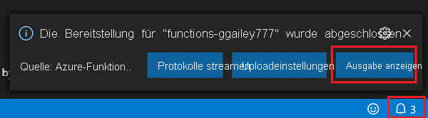

# Schnellstart: Erstellen einer Funktion in Azure mit TypeScript mithilfe von Visual Studio Code

[!INCLUDE [functions-language-selector-quickstart-vs-code](../../includes/functions-language-selector-quickstart-vs-code.md)]

In diesem Artikel wird mithilfe von Visual Studio Code eine TypeScript-Funktion erstellt, die auf HTTP-Anforderungen reagiert. Der Code wird lokal getestet und anschließend in der serverlosen Umgebung von Azure Functions bereitgestellt.

Im Rahmen dieser Schnellstartanleitung fallen in Ihrem Azure-Konto ggf. geringfügige Kosten im Centbereich an. 

Es gibt auch eine [CLI-basierte Version](create-first-function-cli-typescript.md) dieses Artikels.

## Konfigurieren Ihrer Umgebung

Vergewissern Sie sich zunähst, dass Folgendes vorhanden ist:

+ Ein Azure-Konto mit einem aktiven Abonnement. Sie können [kostenlos ein Konto erstellen](https://azure.microsoft.com/free/?ref=microsoft.com&utm_source=microsoft.com&utm_medium=docs&utm_campaign=visualstudio).

+ [Node.js](https://nodejs.org/): Active LTS- und Maintenance LTS-Versionen (Empfehlung: 10.14.1). Verwenden Sie den Befehl `node --version`, um Ihre Version zu überprüfen.  

+ [Visual Studio Code](https://code.visualstudio.com/) auf einer der [unterstützten Plattformen](https://code.visualstudio.com/docs/supporting/requirements#_platforms)

+ [Azure Functions-Erweiterung](https://marketplace.visualstudio.com/items?itemName=ms-azuretools.vscode-azurefunctions) für Visual Studio Code

## Erstellen Ihres lokalen Projekts

In diesem Abschnitt wird mithilfe von Visual Studio Code ein lokales Azure Functions-Projekt in TypeScript erstellt. Weiter unten in diesem Artikel wird der Funktionscode in Azure veröffentlicht. 

1. Wählen Sie auf der Aktivitätsleiste das Azure-Symbol und anschließend im Bereich **Azure: Funktionen** das Symbol **Neues Projekt erstellen** aus.

    

1. Wählen Sie einen Verzeichnisspeicherort für Ihren Projektarbeitsbereich und anschließend **Auswählen** aus.

    > [!NOTE]
    > Diese Schritte sollten außerhalb eines Arbeitsbereichs ausgeführt werden. Wählen Sie in diesem Fall keinen Projektordner aus, der Teil eines Arbeitsbereichs ist.

1. Geben Sie nach entsprechender Aufforderung Folgendes ein:

    + **Select a language for your function project** (Wählen Sie eine Sprache für Ihr Funktionsprojekt aus.): Wählen Sie die Option `TypeScript`.

    + **Select a template for your project's first function** (Wählen Sie die Vorlage für die erste Funktion Ihres Projekts aus.): Wählen Sie die Option `HTTP trigger`.

    + **Provide a function name** (Geben Sie einen Funktionsnamen an.): Geben Sie `HttpExample`ein.

    + **Autorisierungsstufe:** Wählen Sie `Anonymous` aus, damit Ihr Funktionsendpunkt von jedem Benutzer aufgerufen werden kann. Weitere Informationen zur Autorisierungsstufe finden Sie unter [Autorisierungsschlüssel](functions-bindings-http-webhook-trigger.md#authorization-keys).

    + **Select how you would like to open your project** (Wählen Sie aus, wie Sie Ihr Projekt öffnen möchten.): Wählen Sie die Option `Add to workspace`.

1. Auf der Grundlage dieser Informationen generiert Visual Studio Code ein Azure Functions-Projekt mit einem HTTP-Trigger. Die lokalen Projektdateien können im Explorer angezeigt werden. Weitere Informationen zu den erstellten Dateien finden Sie unter [Generierte Projektdateien](functions-develop-vs-code.md#generated-project-files). 

[!INCLUDE [functions-run-function-test-local-vs-code](../../includes/functions-run-function-test-local-vs-code.md)]

Nachdem Sie sich vergewissert haben, dass die Funktion auf Ihrem lokalen Computer korrekt ausgeführt wird, können Sie das Projekt mithilfe von Visual Studio Code direkt in Azure veröffentlichen.

[!INCLUDE [functions-sign-in-vs-code](../../includes/functions-sign-in-vs-code.md)]

## Veröffentlichen des Projekts in Azure

In diesem Abschnitt erstellen Sie eine Funktions-App sowie zugehörige Ressourcen in Ihrem Azure-Abonnement und stellen anschließend Ihren Code bereit.

> [!IMPORTANT]
> Beim Veröffentlichen in einer vorhandenen Funktions-App wird der Inhalt dieser App in Azure überschrieben. 

1. Wählen Sie auf der Aktivitätsleiste das Azure-Symbol und anschließend im Bereich **Azure: Funktionen** die Schaltfläche **Deploy to function app...** (In Funktions-App bereitstellen...) aus.

    

1. Geben Sie nach entsprechender Aufforderung Folgendes ein:

    + **Wählen Sie einen Ordner aus:** Wählen Sie einen Ordner in Ihrem Arbeitsbereich aus, oder navigieren Sie zu einem Ordner, der Ihre Funktions-App enthält. Diese Option wird nicht angezeigt, wenn Sie bereits eine gültige Funktions-App geöffnet haben.

    + **Wählen Sie das Abonnement aus:** Wählen Sie das zu verwendende Abonnement aus. Wenn Sie nur über ein Abonnement verfügen, wird diese Option nicht angezeigt.

    + **Select Function App in Azure:** (Wählen Sie die Funktions-App in Azure aus:) Wählen Sie die Option `+ Create new Function App`. (Wählen Sie nicht die Option `Advanced` aus, diese wird im vorliegenden Artikel nicht behandelt.)

    + **Enter a globally unique name for the function app:** (Geben Sie einen global eindeutigen Namen für die Funktions-App ein:) Geben Sie einen Namen ein, der in einem URL-Pfad gültig ist. Der eingegebene Name wird überprüft, um sicherzustellen, dass er in Azure Functions eindeutig ist. 

    + **Select a runtime:** (Wählen Sie eine Runtime aus:) Wählen Sie die lokal ausgeführte Node.js-Version aus. Sie können den Befehl `node --version` ausführen, um Ihre Version zu überprüfen.

    + **Wählen Sie einen Speicherort für neue Ressourcen aus:**  Wählen Sie eine [Region](https://azure.microsoft.com/regions/) in Ihrer Nähe aus, um eine bessere Leistung zu erzielen.

    Die Erweiterung zeigt den Status einzelner Ressourcen an, während diese in Azure im Benachrichtigungsbereich erstellt werden.

    :::image type="content" source="../../includes/media/functions-publish-project-vscode/resource-notification.png" alt-text="Benachrichtigung über die Erstellung von Azure-Ressourcen":::

1. Nach Abschluss des Vorgangs werden in Ihrem Abonnement die folgenden Azure-Ressourcen erstellt, deren Namen auf dem Namen Ihrer Funktions-App basieren:

    [!INCLUDE [functions-vs-code-created-resources](../../includes/functions-vs-code-created-resources.md)]

    Nach der Erstellung der Funktions-App wird eine Benachrichtigung angezeigt, und das Bereitstellungspaket wird angewendet. 

    [!INCLUDE [functions-vs-code-create-tip](../../includes/functions-vs-code-create-tip.md)]

4. Wählen Sie in dieser Benachrichtigungen **Ausgabe anzeigen** aus, um die Erstellungs- und Bereitstellungsergebnisse (auch für die von Ihnen erstellten Azure-Ressourcen) anzuzeigen. Wenn Sie die Benachrichtigung übersehen haben, wählen Sie das Glockensymbol in der unteren rechten Ecke aus, um sie erneut anzuzeigen.

    

[!INCLUDE [functions-vs-code-run-remote](../../includes/functions-vs-code-run-remote.md)]

[!INCLUDE [functions-cleanup-resources-vs-code.md](../../includes/functions-cleanup-resources-vs-code.md)]

## Nächste Schritte

Sie haben [Visual Studio Code](functions-develop-vs-code.md?tabs=javascript) genutzt, um eine Funktions-App mit einer einfachen Funktion zu erstellen, die über HTTP ausgelöst wird. Im nächsten Artikel erweitern Sie diese Funktion, indem Sie eine Verbindung mit Azure Storage herstellen. Weitere Informationen zum Herstellen einer Verbindung mit anderen Azure-Diensten finden Sie unter [Hinzufügen von Bindungen zu einer vorhandenen Funktion in Azure Functions](add-bindings-existing-function.md?tabs=typescript).   

> [!div class="nextstepaction"]
> [Herstellen einer Verbindung mit einer Azure Storage-Warteschlange](functions-add-output-binding-storage-queue-vs-code.md?pivots=programming-language-typescript)

[Azure Functions Core Tools]: functions-run-local.md
[Azure Functions extension for Visual Studio Code]: https://marketplace.visualstudio.com/items?itemName=ms-azuretools.vscode-azurefunctions
