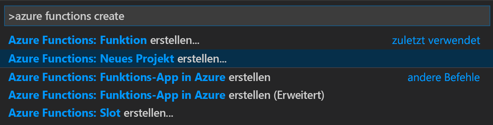
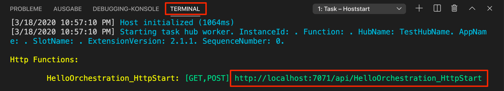
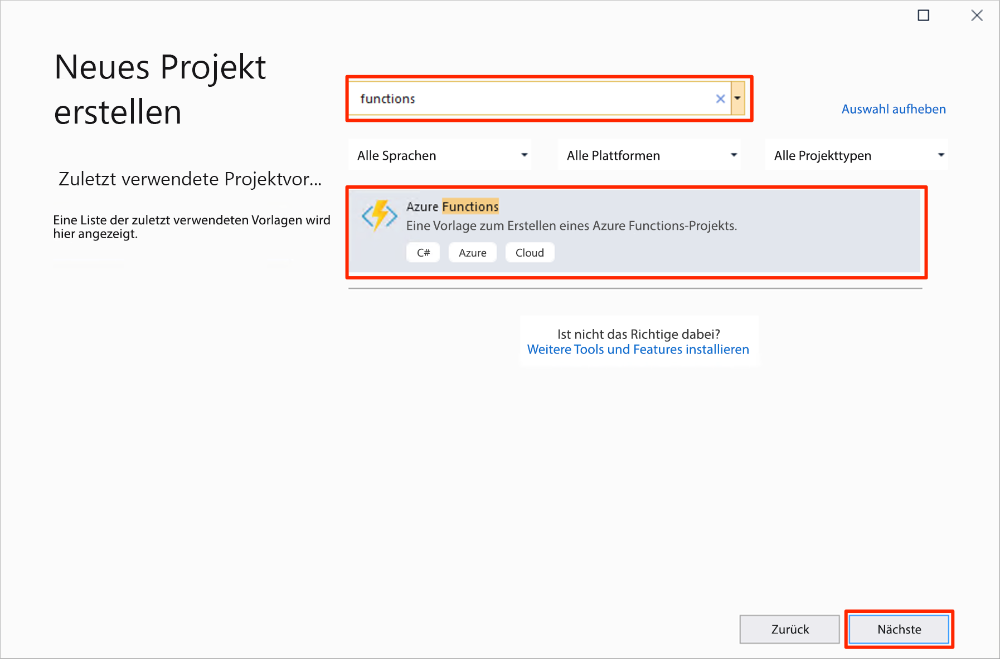
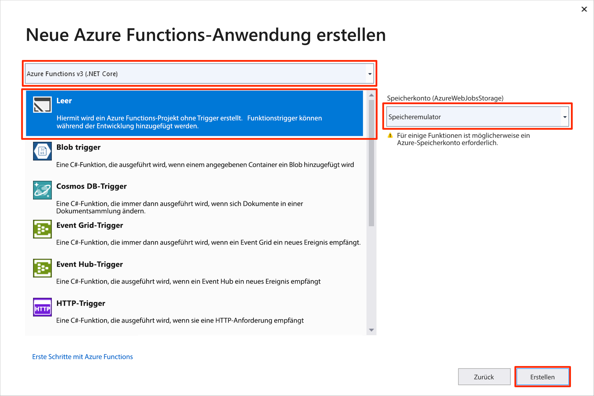
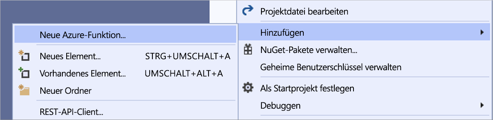

# <a name="create-your-first-durable-function-in-c"></a>Erstellen Ihrer ersten dauerhaften Funktion in C\#

*Durable Functions* ist eine Erweiterung von [Azure Functions](../functions-overview.md), mit der Sie zustandsbehaftete Funktionen in einer serverlosen Umgebung schreiben können. Die Erweiterung verwaltet Status, Prüfpunkte und Neustarts für Sie.

::: zone pivot="code-editor-vscode"

In diesem Artikel erfahren Sie, wie Sie Visual Studio Code verwenden, um eine dauerhafte Funktion vom Typ „hello world“ lokal zu erstellen und zu testen.  Mit dieser Funktion werden Aufrufe anderer Funktionen orchestriert und miteinander verkettet. Anschließend veröffentlichen Sie den Funktionscode in Azure. Diese Tools sind Teil der [Azure Functions-Erweiterung](https://marketplace.visualstudio.com/items?itemName=ms-azuretools.vscode-azurefunctions) für VS Code.


## <a name="prerequisites"></a>Voraussetzungen

Für dieses Tutorial benötigen Sie Folgendes:

* Installieren Sie [Visual Studio Code](https://code.visualstudio.com/download).

* Installieren Sie die folgenden VS Code-Erweiterungen:
    - [Azure-Funktionen](https://marketplace.visualstudio.com/items?itemName=ms-azuretools.vscode-azurefunctions)
    - [C#](https://marketplace.visualstudio.com/items?itemName=ms-dotnettools.csharp)

* Stellen Sie sicher, dass Sie über die neueste Version der [Azure Functions Core Tools](../functions-run-local.md) verfügen.

* Für Durable Functions ist ein Azure-Speicherkonto erforderlich. Sie benötigen ein Azure-Abonnement.

* Vergewissern Sie sich, dass bei Ihnen mindestens die Version 3.1 des [.NET Core SDK](https://dotnet.microsoft.com/download) installiert ist.

[!INCLUDE [quickstarts-free-trial-note](../../../includes/quickstarts-free-trial-note.md)]

## <a name="create-your-local-project"></a><a name="create-an-azure-functions-project"></a>Erstellen Ihres lokalen Projekts 

In diesem Abschnitt wird mithilfe von Visual Studio Code ein lokales Azure Functions-Projekt erstellt. 

1. Drücken Sie in Visual Studio Code F1 (oder STRG+UMSCHALT+P bzw. BEFEHL+UMSCHALT-P), um die Befehlspalette zu öffnen. Suchen Sie in der Befehlspalette den Befehl `Azure Functions: Create New Project...`, und wählen Sie ihn aus.

    

1. Wählen Sie einen leeren Ordner für Ihr Projekt und anschließend **Auswählen** aus.

1. Geben Sie gemäß der Eingabeaufforderungen die folgenden Informationen ein:

    | Aufforderung | Wert | Beschreibung |
    | ------ | ----- | ----------- |
    | Auswählen einer Sprache für Ihr Funktions-App-Projekt | C# | Erstellen Sie ein lokales C#-Functions-Projekt. |
    | „Select a version“ (Wählen Sie eine Version aus.) | Azure Functions v3 | Diese Option wird nur angezeigt, wenn die Core Tools noch nicht installiert sind. In diesem Fall werden die Core Tools beim erstmaligen Ausführen der App installiert. |
    | Auswählen einer Vorlage für die erste Funktion Ihres Projekts | Vorerst überspringen | |
    | Auswählen, wie Sie Ihr Projekt öffnen möchten | Im aktuellen Fenster | Öffnet VS Code wieder im ausgewählten Ordner. |

Von Visual Studio Code werden bei Bedarf die Azure Functions Core Tools installiert. Außerdem wird ein Funktions-App-Projekt in einem Ordner erstellt. Dieses Projekt enthält die Konfigurationsdateien [host.json](../functions-host-json.md) und [local.settings.json](../functions-run-local.md#local-settings-file).

## <a name="add-functions-to-the-app"></a>Hinzufügen von Funktionen zur App

In den folgenden Schritten wird eine Vorlage zum Erstellen des dauerhaften Funktionscodes in Ihrem Projekt verwendet.

1. Suchen Sie in der Befehlspalette den Befehl `Azure Functions: Create Function...`, und wählen Sie ihn aus.

1. Geben Sie gemäß der Eingabeaufforderungen die folgenden Informationen ein:

    | Aufforderung | Wert | Beschreibung |
    | ------ | ----- | ----------- |
    | „Select a template for your function“ (Wählen Sie eine Vorlage für Ihre Funktion aus.) | DurableFunctionsOrchestration | Erstellen Sie eine Orchestrierung für Durable Functions. |
    | Angeben eines Funktionsnamens | HelloOrchestration | Der Name der Klasse, in der Funktionen erstellt werden. |
    | Angeben eines Namespaces | Company.Function | Der Namespace für die generierte Klasse. |

1. Wenn Sie von VS Code zum Auswählen eines Speicherkontos aufgefordert werden, wählen Sie **Speicherkonto auswählen** aus. Geben Sie bei den Eingabeaufforderungen die folgenden Informationen an, um ein neues Speicherkonto in Azure zu erstellen:

    | Aufforderung | Wert | Beschreibung |
    | ------ | ----- | ----------- |
    | Auswählen des Abonnements | *Name Ihres Abonnements* | Auswählen des Azure-Abonnements |
    | Auswählen eines Speicherkontos | Erstellen eines neuen Speicherkontos |  |
    | „Enter the name of the new storage account“ (Geben Sie den Namen des neuen Speicherkontos ein.) | *Eindeutiger Name* | Der Name des zu erstellenden Speicherkontos. |
    | Auswählen einer Ressourcengruppe | *Eindeutiger Name* | Der Name der zu erstellenden Ressourcengruppe. |
    | Standort auswählen | *Region* | Wählen Sie eine Region in Ihrer Nähe aus. |

Dem Projekt wird eine Klasse mit den neuen Funktionen hinzugefügt. Von VS Code wird außerdem die Verbindungszeichenfolge des Speicherkontos zu *local.settings.json* und ein Verweis auf das NuGet-Paket [`Microsoft.Azure.WebJobs.Extensions.DurableTask`](https://www.nuget.org/packages/Microsoft.Azure.WebJobs.Extensions.DurableTask) zur *CSPROJ*-Projektdatei hinzugefügt.

Öffnen Sie die neue Datei *HelloOrchestration.cs*, um den Inhalt anzuzeigen. Diese dauerhafte Funktion ist ein einfaches Beispiel für eine Funktionsverkettung mit den folgenden Methoden:  

| Methode | FunctionName | Beschreibung |
| -----  | ------------ | ----------- |
| **`RunOrchestrator`** | `HelloOrchestration` | Verwaltet die dauerhafte Orchestrierung. In diesem Fall wird die Orchestrierung gestartet, es wird eine Liste erstellt, und das Ergebnis der drei Funktionsaufrufe wird der Liste hinzugefügt.  Wenn die drei Funktionsaufrufe abgeschlossen sind, wird die Liste zurückgegeben. |
| **`SayHello`** | `HelloOrchestration_Hello` | Die Funktion gibt „Hello“ zurück. Es ist die Funktion mit der Geschäftslogik, die orchestriert wird. |
| **`HttpStart`** | `HelloOrchestration_HttpStart` | Eine [per HTTP ausgelöste Funktion](../functions-bindings-http-webhook.md), mit der eine Instanz der Orchestrierung gestartet und eine Antwort zur Überprüfung des Status zurückgegeben wird. |

Nachdem Sie nun Ihr Funktionsprojekt und eine dauerhafte Funktion erstellt haben, können Sie sie auf Ihrem lokalen Computer testen.

## <a name="test-the-function-locally"></a>Lokales Testen der Funktion

Mit Azure Functions Core-Tools können Sie ein Azure Functions-Projekt auf dem lokalen Entwicklungscomputer ausführen. Sie werden beim ersten Starten einer Funktion in Visual Studio Code zum Installieren dieser Tools aufgefordert.

1. Legen Sie zum Testen der Funktion einen Breakpoint im Funktionscode der Aktivität `SayHello` fest, und drücken Sie F5, um das Funktions-App-Projekt zu starten. Die Ausgabe der Core Tools wird im Bereich **Terminal** angezeigt.

    > [!NOTE]
    > Weitere Informationen zum Debuggen finden Sie unter [Diagnose in Durable Functions in Azure](durable-functions-diagnostics.md#debugging).

1. Kopieren Sie im Bereich **Terminal** den URL-Endpunkt Ihrer über HTTP ausgelösten Funktion.

    

1. Senden Sie mit einem Tool wie [Postman](https://www.getpostman.com/) oder [cURL](https://curl.haxx.se/) eine HTTP-POST-Anforderung an den URL-Endpunkt.

   Die Antwort ist das erste Ergebnis der HTTP-Funktion, um mitzuteilen, dass die dauerhafte Orchestrierung erfolgreich gestartet wurde. Es ist noch nicht das Endergebnis der Orchestrierung. Die Antwort enthält einige nützliche URLs. Zunächst fragen wir den Status der Orchestrierung ab.

1. Kopieren Sie den URL-Wert für `statusQueryGetUri`, fügen Sie ihn in die Adressleiste des Browsers ein, und führen Sie anschließend die Anforderung aus. Alternativ können Sie auch weiter Postman verwenden, um die GET-Anforderung auszuführen.

   Mit der Anforderung wird für die Orchestrierungsinstanz der Status abgefragt. Sie sollten schließlich eine Antwort erhalten, die zeigt, dass die Instanz abgeschlossen wurde, und die die Ausgaben oder Ergebnisse der dauerhaften Funktion enthält. Er sieht wie folgt aus: 

    ```json
    {
        "name": "HelloOrchestration",
        "instanceId": "9a528a9e926f4b46b7d3deaa134b7e8a",
        "runtimeStatus": "Completed",
        "input": null,
        "customStatus": null,
        "output": [
            "Hello Tokyo!",
            "Hello Seattle!",
            "Hello London!"
        ],
        "createdTime": "2020-03-18T21:54:49Z",
        "lastUpdatedTime": "2020-03-18T21:54:54Z"
    }
    ```

1. Drücken Sie in VS Code **UMSCHALT+F5**, um das Debuggen zu beenden.

Nachdem Sie sichergestellt haben, dass die Funktion auf Ihrem lokalen Computer richtig ausgeführt wird, können Sie das Projekt in Azure veröffentlichen.

[!INCLUDE [functions-create-function-app-vs-code](../../../includes/functions-sign-in-vs-code.md)]

[!INCLUDE [functions-publish-project-vscode](../../../includes/functions-publish-project-vscode.md)]

## <a name="test-your-function-in-azure"></a>Testen der Funktion in Azure

1. Kopieren Sie die URL des HTTP-Triggers im Bereich **Ausgabe**. Die URL, über die Ihre per HTTP ausgelöste Funktion aufgerufen wird, sollte das folgende Format haben:

    `https://<functionappname>.azurewebsites.net/api/HelloOrchestration_HttpStart`

1. Fügen Sie diese neue URL für die HTTP-Anforderung in die Adresszeile des Browsers ein. Sie sollten die gleiche Statusantwort wie zuvor erhalten, als Sie die veröffentlichte App verwendet haben.

## <a name="next-steps"></a>Nächste Schritte

Sie haben Visual Studio Code verwendet, um eine dauerhafte C#-Funktions-App zu erstellen und zu veröffentlichen.

> [!div class="nextstepaction"]
> [Informationen zu gängigen Mustern für dauerhafte Funktionen](durable-functions-overview.md#application-patterns)

::: zone-end

::: zone pivot="code-editor-visualstudio"

In diesem Artikel erfahren Sie, wie Sie Visual Studio 2019 verwenden, um eine dauerhafte Funktion vom Typ „hello world“ lokal zu erstellen und zu testen.  Mit dieser Funktion werden Aufrufe anderer Funktionen orchestriert und miteinander verkettet. Anschließend veröffentlichen Sie den Funktionscode in Azure. Diese Tools sind als Teil der Azure-Entwicklungsworkload in Visual Studio 2019 verfügbar.


## <a name="prerequisites"></a>Voraussetzungen

Für dieses Tutorial benötigen Sie Folgendes:

* Installieren Sie [Visual Studio 2019](https://visualstudio.microsoft.com/vs/). Vergewissern Sie sich, dass auch die Workload **Azure-Entwicklung** installiert ist. Visual Studio 2017 unterstützt auch die Durable Functions-Entwicklung, die Benutzeroberfläche und die Schritte unterscheiden sich jedoch.

* Vergewissern Sie sich, dass der [Azure-Speicheremulator](../../storage/common/storage-use-emulator.md) installiert ist und ausgeführt wird.

[!INCLUDE [quickstarts-free-trial-note](../../../includes/quickstarts-free-trial-note.md)]

## <a name="create-a-function-app-project"></a>Erstellen eines Funktionen-App-Projekts

Mit der Azure Functions-Vorlage wird ein Projekt erstellt, das in einer Funktions-App in Azure veröffentlicht werden kann. Sie können mit einer Funktions-App Funktionen zu logischen Einheiten gruppieren. Dies erleichtert die Verwaltung, Bereitstellung, Skalierung und Freigabe von Ressourcen.

1. Wählen Sie in Visual Studio im Menü **Datei** die Optionen **Neu** > **Projekt**.

1. Suchen Sie im Dialogfeld **Neues Projekt erstellen** nach `functions`, und wählen Sie die Vorlage **Azure Functions** und dann **Weiter** aus. 

    

1. Geben Sie einen **Projektnamen** für Ihr Projekt ein, und wählen Sie **OK** aus. Der Projektname muss als C#-Namespace gültig sein, verwenden Sie daher keine Unterstriche, Bindestriche oder andere nicht alphanumerische Zeichen.

1. Verwenden Sie unter **Neue Azure Functions-Anwendung erstellen** die Einstellungen, die in der Tabelle unterhalb der Abbildung angegeben sind.

    

    | Einstellung      | Vorgeschlagener Wert  | Beschreibung                      |
    | ------------ |  ------- |----------------------------------------- |
    | **Version** | Azure Functions 3.0 <br />(.NET Core) | Erstellt ein Funktionsprojekt mit der Version 3.0 der Runtime von Azure Functions, die .NET Core 3.1 unterstützt. Weitere Informationen finden Sie unter [Einstellen von Runtimeversionen von Azure Functions als Ziel](../functions-versions.md).   |
    | **Vorlage** | Leer | Erstellt eine leere Funktions-App. |
    | **Speicherkonto**  | Speicheremulator | Für die Zustandsverwaltung für dauerhafte Funktionen ist ein Speicherkonto erforderlich. |

4. Wählen Sie **Erstellen** aus, um ein leeres Projekt für Funktionen zu erstellen. Dieses Projekt enthält die grundlegenden Konfigurationsdateien, die zum Ausführen Ihrer Funktionen benötigt werden.

## <a name="add-functions-to-the-app"></a>Hinzufügen von Funktionen zur App

In den folgenden Schritten wird eine Vorlage zum Erstellen des dauerhaften Funktionscodes in Ihrem Projekt verwendet.

1. Klicken Sie in Visual Studio mit der rechten Maustaste auf das Projekt, und wählen Sie **Hinzufügen** > **Neue Azure-Funktion**.

    

1. Vergewissern Sie sich, dass im Menü „Hinzufügen“ die Option **Azure-Funktion** ausgewählt ist, geben Sie einen Namen für Ihre C#-Datei ein, und wählen Sie dann **Hinzufügen** aus.

1. Wählen Sie die Vorlage **Orchestrierung für Durable Functions** und anschließend **OK** aus.

    

Der App wird eine neue dauerhafte Funktion hinzugefügt.  Öffnen Sie die neue CS-Datei, um den Inhalt anzuzeigen. Diese dauerhafte Funktion ist ein einfaches Beispiel für eine Funktionsverkettung mit den folgenden Methoden:  

| Methode | FunctionName | Beschreibung |
| -----  | ------------ | ----------- |
| **`RunOrchestrator`** | `<file-name>` | Verwaltet die dauerhafte Orchestrierung. In diesem Fall wird die Orchestrierung gestartet, es wird eine Liste erstellt, und das Ergebnis der drei Funktionsaufrufe wird der Liste hinzugefügt.  Wenn die drei Funktionsaufrufe abgeschlossen sind, wird die Liste zurückgegeben. |
| **`SayHello`** | `<file-name>_Hello` | Die Funktion gibt „Hello“ zurück. Es ist die Funktion mit der Geschäftslogik, die orchestriert wird. |
| **`HttpStart`** | `<file-name>_HttpStart` | Eine [per HTTP ausgelöste Funktion](../functions-bindings-http-webhook.md), mit der eine Instanz der Orchestrierung gestartet und eine Antwort zur Überprüfung des Status zurückgegeben wird. |

Nachdem Sie nun Ihr Funktionsprojekt und eine dauerhafte Funktion erstellt haben, können Sie sie auf Ihrem lokalen Computer testen.

## <a name="test-the-function-locally"></a>Lokales Testen der Funktion

Mit Azure Functions Core-Tools können Sie ein Azure Functions-Projekt auf dem lokalen Entwicklungscomputer ausführen. Sie werden beim ersten Starten einer Funktion in Visual Studio zum Installieren dieser Tools aufgefordert.

1. Drücken Sie F5, um Ihre Funktion zu testen. Akzeptieren Sie die entsprechende Aufforderung von Visual Studio zum Herunterladen und Installieren der Azure Functions Core (CLI)-Tools. Sie müssen möglicherweise auch eine Firewallausnahme aktivieren, damit die Tools HTTP-Anforderungen verarbeiten können.

2. Kopieren Sie die URL Ihrer Funktion aus der Azure Functions-Laufzeitausgabe.

    

3. Fügen Sie die URL der HTTP-Anforderung in die Adresszeile des Browsers ein, und führen Sie die Anforderung aus. Hier ist die Antwort des Browsers auf die von der Funktion zurückgegebene lokale GET-Anforderung abgebildet:

    

    Die Antwort ist das erste Ergebnis der HTTP-Funktion, um mitzuteilen, dass die dauerhafte Orchestrierung erfolgreich gestartet wurde.  Es ist noch nicht das Endergebnis der Orchestrierung.  Die Antwort enthält einige nützliche URLs.  Zunächst fragen wir den Status der Orchestrierung ab.

4. Kopieren Sie den URL-Wert für `statusQueryGetUri`, und fügen Sie ihn in die Adressleiste des Browsers ein. Führen Sie die Anforderung anschließend aus.

    Mit der Anforderung wird für die Orchestrierungsinstanz der Status abgefragt. Sie sollten schließlich eine Antwort erhalten, die wie unten angegeben aussieht.  Diese Ausgabe zeigt, dass die Instanz abgeschlossen wurde, und enthält die Ausgaben bzw. Ergebnisse der dauerhaften Funktion.

    ```json
    {
        "instanceId": "d495cb0ac10d4e13b22729c37e335190",
        "runtimeStatus": "Completed",
        "input": null,
        "customStatus": null,
        "output": [
            "Hello Tokyo!",
            "Hello Seattle!",
            "Hello London!"
        ],
        "createdTime": "2019-11-02T07:07:40Z",
        "lastUpdatedTime": "2019-11-02T07:07:52Z"
    }
    ```

5. Drücken Sie **UMSCHALT+F5**, um das Debuggen zu beenden.

Nachdem Sie sichergestellt haben, dass die Funktion auf Ihrem lokalen Computer richtig ausgeführt wird, können Sie das Projekt in Azure veröffentlichen.

## <a name="publish-the-project-to-azure"></a>Veröffentlichen des Projekts in Azure

Sie müssen in Ihrem Azure-Abonnement über eine Funktions-App verfügen, bevor Sie Ihr Projekt veröffentlichen können. Sie können eine Funktions-App direkt in Visual Studio erstellen.

[!INCLUDE [Publish the project to Azure](../../../includes/functions-vstools-publish.md)]

## <a name="test-your-function-in-azure"></a>Testen der Funktion in Azure

1. Kopieren Sie die Basis-URL der Funktions-App von der Seite „Veröffentlichungsprofil“. Ersetzen Sie den Teil `localhost:port` der URL, die Sie beim lokalen Testen der Funktion verwendet haben, durch die neue Basis-URL.

    Die URL, über die der HTTP-Trigger der dauerhaften Funktion aufgerufen wird, sollte das folgende Format haben:

    `https://<APP_NAME>.azurewebsites.net/api/<FUNCTION_NAME>_HttpStart`

2. Fügen Sie diese neue URL für die HTTP-Anforderung in die Adresszeile des Browsers ein. Sie sollten die gleiche Statusantwort wie zuvor erhalten, als Sie die veröffentlichte App verwendet haben.

## <a name="next-steps"></a>Nächste Schritte

Sie haben Visual Studio verwendet, um eine dauerhafte C#-Funktions-App zu erstellen und zu veröffentlichen.

> [!div class="nextstepaction"]
> [Informationen zu gängigen Mustern für dauerhafte Funktionen](durable-functions-overview.md#application-patterns)

::: zone-end
