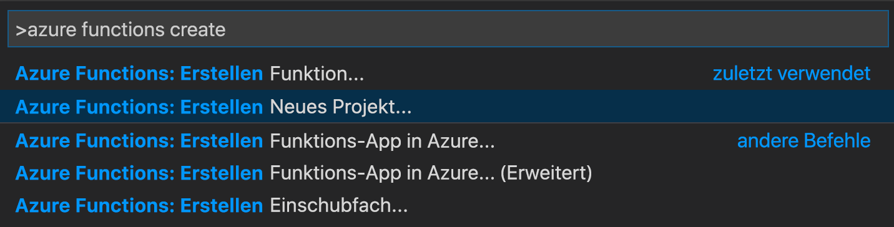

# <a name="create-your-first-durable-function-in-python"></a>Erstellen Ihrer ersten dauerhaften Funktion in Python

*Durable Functions* ist eine Erweiterung von [Azure Functions](../functions-overview.md), mit der Sie zustandsbehaftete Funktionen in einer serverlosen Umgebung schreiben können. Die Erweiterung verwaltet Status, Prüfpunkte und Neustarts für Sie.

In diesem Artikel erfahren Sie, wie Sie die Azure Functions-Erweiterung von Visual Studio Code verwenden, um lokal eine dauerhafte Funktion namens „hello world“ zu erstellen und zu testen.  Mit dieser Funktion werden Aufrufe anderer Funktionen orchestriert und miteinander verkettet. Anschließend veröffentlichen Sie den Funktionscode in Azure.


## <a name="prerequisites"></a>Voraussetzungen

Für dieses Tutorial benötigen Sie Folgendes:

* Installieren Sie [Visual Studio Code](https://code.visualstudio.com/download).

* Installieren Sie die VS Code-Erweiterung [Azure Functions](https://marketplace.visualstudio.com/items?itemName=ms-azuretools.vscode-azurefunctions).

* Stellen Sie sicher, dass Sie über die neueste Version der [Azure Functions Core Tools](../functions-run-local.md) verfügen.

* Für Durable Functions ist ein Azure-Speicherkonto erforderlich. Sie benötigen ein Azure-Abonnement.

* Vergewissern Sie sich, dass bei Ihnen die Version 3.6, 3.7 oder 3.8 von [Python](https://www.python.org/) installiert ist.

[!INCLUDE [quickstarts-free-trial-note](../../../includes/quickstarts-free-trial-note.md)]

## <a name="create-your-local-project"></a><a name="create-an-azure-functions-project"></a>Erstellen Ihres lokalen Projekts 

In diesem Abschnitt wird mithilfe von Visual Studio Code ein lokales Azure Functions-Projekt erstellt. 

1. Drücken Sie in Visual Studio Code F1 (oder <kbd>STRG/BEFEHLSTASTE+UMSCHALT+P</kbd>), um die Befehlspalette zu öffnen. Suchen Sie in der Befehlspalette den Befehl `Azure Functions: Create New Project...`, und wählen Sie ihn aus.

    

1. Wählen Sie einen leeren Ordner für Ihr Projekt und anschließend **Auswählen** aus.

1. Geben Sie gemäß der Eingabeaufforderungen die folgenden Informationen ein:

    | Prompt | Wert | Beschreibung |
    | ------ | ----- | ----------- |
    | Auswählen einer Sprache für Ihr Funktions-App-Projekt | Python | Erstellen Sie ein lokales Python-Functions-Projekt. |
    | „Select a version“ (Wählen Sie eine Version aus.) | Azure Functions v3 | Diese Option wird nur angezeigt, wenn die Core Tools noch nicht installiert sind. In diesem Fall werden die Core Tools beim erstmaligen Ausführen der App installiert. |
    | Python-Version | Python 3.6, 3.7 oder 3.8 | VS Code erstellt eine virtuelle Umgebung mit der von Ihnen ausgewählten Version. |
    | Auswählen einer Vorlage für die erste Funktion Ihres Projekts | Vorerst überspringen | |
    | Auswählen, wie Sie Ihr Projekt öffnen möchten | Im aktuellen Fenster | Öffnet VS Code wieder im ausgewählten Ordner. |

Von Visual Studio Code werden bei Bedarf die Azure Functions Core Tools installiert. Außerdem wird ein Funktions-App-Projekt in einem Ordner erstellt. Dieses Projekt enthält die Konfigurationsdateien [host.json](../functions-host-json.md) und [local.settings.json](../functions-run-local.md#local-settings-file).

Außerdem wird die Datei *requirements.txt* im Stammordner erstellt. Darin sind die Python-Pakete angegeben, die zum Ausführen ihrer Funktions-App erforderlich sind.

## <a name="install-azure-functions-durable-from-pypi"></a>Installieren von „azure-functions-durable“ aus Pypi

Beim Erstellen des Projekts hat die VS Code-Erweiterung von Azure Functions automatisch eine virtuelle Umgebung mit der von Ihnen ausgewählten Python-Version erstellt. Aktivieren Sie die virtuelle Umgebung in einem Terminal, und installieren Sie einige Abhängigkeiten, die von Azure Functions und Durable Functions benötigt werden.

1. Öffnen Sie die Datei *requirements.txt* im Editor, und ändern Sie ihren Inhalt wie folgt:

    ```
    azure-functions
    azure-functions-durable
    ```

1. Öffnen Sie das integrierte Terminal des Editors im aktuellen Ordner (<kbd>STRG+UMSCHALT+`</kbd>).

1. Aktivieren Sie im integrierten Terminal die virtuelle Umgebung im aktuellen Ordner:

    **Linux oder macOS**

    ```bash
    source .venv/bin/activate
    ```

    **Windows**

    ```powershell
    .venv\scripts\activate
    ```

    

1. Verwenden Sie in dem integrierten Terminal, in dem die virtuelle Umgebung aktiviert ist, pip, um die soeben definierten Pakete zu installieren:

    ```bash
    python -m pip install -r requirements.txt
    ```

## <a name="create-your-functions"></a>Erstellen Ihrer Funktionen

Eine einfache Durable Functions-App enthält drei Funktionen:

* *Orchestratorfunktion:* Beschreibt einen Workflow, der andere Funktionen orchestriert.
* *Aktivitätsfunktion:* Wird von der Orchestratorfunktion aufgerufen, führt die Aufgabe aus und gibt optional einen Wert zurück.
* *Clientfunktion:* Eine reguläre Azure-Funktion, die eine Orchestratorfunktion startet. In diesem Beispiel wird eine per HTTP ausgelöste Funktion verwendet.

### <a name="orchestrator-function"></a>Orchestratorfunktion

Sie verwenden eine Vorlage, um den Code Ihrer dauerhaften Funktion in Ihrem Projekt zu erstellen.

1. Suchen Sie in der Befehlspalette den Befehl `Azure Functions: Create Function...`, und wählen Sie ihn aus.

1. Geben Sie gemäß der Eingabeaufforderungen die folgenden Informationen ein:

    | Prompt | Wert | Beschreibung |
    | ------ | ----- | ----------- |
    | „Select a template for your function“ (Wählen Sie eine Vorlage für Ihre Funktion aus.) | Orchestrator für Durable Functions | Erstellen Sie eine Orchestrierung für Durable Functions. |
    | Angeben eines Funktionsnamens | HelloOrchestrator | Der Name Ihrer dauerhaften Funktion. |

Sie haben einen Orchestrator für die Koordinierung von Aktivitätsfunktionen hinzugefügt. Öffnen Sie *HelloOrchestrator/\_\_init__.py*, um die Orchestratorfunktion anzuzeigen. Mit jedem Aufruf von `context.call_activity` wird eine Aktivitätsfunktion namens `Hello` aufgerufen.

Fügen Sie als Nächstes die referenzierte Aktivitätsfunktion `Hello` hinzu.

### <a name="activity-function"></a>Aktivitätsfunktion

1. Suchen Sie in der Befehlspalette den Befehl `Azure Functions: Create Function...`, und wählen Sie ihn aus.

1. Geben Sie gemäß der Eingabeaufforderungen die folgenden Informationen ein:

    | Prompt | Wert | Beschreibung |
    | ------ | ----- | ----------- |
    | „Select a template for your function“ (Wählen Sie eine Vorlage für Ihre Funktion aus.) | Aktivität für Durable Functions | Erstellen Sie eine Aktivitätsfunktion. |
    | Angeben eines Funktionsnamens | Hallo | Der Name Ihrer Aktivitätsfunktion. |

Sie haben die Aktivitätsfunktion `Hello` hinzugefügt, die vom Orchestrator aufgerufen wird. Öffnen Sie *Hello/\_\_init__.py*, um zu sehen, dass sie einen Namen als Eingabe akzeptiert und eine Begrüßung zurückgibt. Eine Aktivitätsfunktion dient zum Ausführen von Aktionen wie Datenbankaufrufen oder Berechnungen.

Abschließend fügen Sie noch eine per HTTP ausgelöste Funktion hinzu, durch die die Orchestrierung gestartet wird.

### <a name="client-function-http-starter"></a>Clientfunktion (HTTP-Starter)

1. Suchen Sie in der Befehlspalette den Befehl `Azure Functions: Create Function...`, und wählen Sie ihn aus.

1. Geben Sie gemäß der Eingabeaufforderungen die folgenden Informationen ein:

    | Prompt | Wert | Beschreibung |
    | ------ | ----- | ----------- |
    | „Select a template for your function“ (Wählen Sie eine Vorlage für Ihre Funktion aus.) | HTTP-Starter für Durable Functions | Erstellen Sie eine HTTP-Startfunktion. |
    | Angeben eines Funktionsnamens | DurableFunctionsHttpStart | Der Name Ihrer Aktivitätsfunktion. |
    | Autorisierungsstufe | Anonym | Lassen Sie zu Demonstrationszwecken das Aufrufen der Funktion ohne Authentifizierung zu. |

Sie haben eine per HTTP ausgelöste Funktion hinzugefügt, durch die eine Orchestrierung gestartet wird. Öffnen Sie *DurableFunctionsHttpStart/\_\_init__.py*, um zu sehen, dass `client.start_new` zum Starten einer neuen Orchestrierung verwendet wird. Anschließend wird `client.create_check_status_response` verwendet, um eine HTTP-Antwort mit URLs zurückzugeben, die zum Überwachen und Verwalten der neuen Orchestrierung verwendet werden können.

Sie verfügen nun über eine Durable Functions-App, die lokal ausgeführt und in Azure bereitgestellt werden kann.

## <a name="test-the-function-locally"></a>Lokales Testen der Funktion

Mit Azure Functions Core-Tools können Sie ein Azure Functions-Projekt auf dem lokalen Entwicklungscomputer ausführen. Wenn Sie sie nicht installiert haben, werden Sie beim ersten Starten einer Funktion in Visual Studio Code zum Installieren dieser Tools aufgefordert.

1. Legen Sie zum Testen der Funktion einen Breakpoint im Code der Aktivitätsfunktion `Hello` (*Hello/\_\_init__.py*) fest. Drücken Sie F5, oder wählen Sie über die Befehlspalette den Befehl `Debug: Start Debugging` aus, um das Funktions-App-Projekt zu starten. Die Ausgabe der Core Tools wird im Bereich **Terminal** angezeigt.

    > [!NOTE]
    > Weitere Informationen zum Debuggen finden Sie unter [Diagnose in Durable Functions in Azure](durable-functions-diagnostics.md#debugging).

1. Zum Ausführen von Durable Functions ist ein Azure-Speicherkonto erforderlich. Wenn Sie von VS Code zum Auswählen eines Speicherkontos aufgefordert werden, wählen Sie **Speicherkonto auswählen** aus.

    

1. Geben Sie bei den Eingabeaufforderungen die folgenden Informationen an, um ein neues Speicherkonto in Azure zu erstellen:

    | Prompt | Wert | Beschreibung |
    | ------ | ----- | ----------- |
    | Auswählen des Abonnements | *Name Ihres Abonnements* | Auswählen des Azure-Abonnements |
    | Auswählen eines Speicherkontos | Erstellen eines neuen Speicherkontos |  |
    | „Enter the name of the new storage account“ (Geben Sie den Namen des neuen Speicherkontos ein.) | *Eindeutiger Name* | Der Name des zu erstellenden Speicherkontos. |
    | Auswählen einer Ressourcengruppe | *Eindeutiger Name* | Der Name der zu erstellenden Ressourcengruppe. |
    | Standort auswählen | *Region* | Wählen Sie eine Region in Ihrer Nähe aus. |

1. Kopieren Sie im Bereich **Terminal** den URL-Endpunkt Ihrer über HTTP ausgelösten Funktion.

    

1. Senden Sie mit Ihrem Browser oder einem Tool wie [Postman](https://www.getpostman.com/) oder [cURL](https://curl.haxx.se/) eine HTTP-Anforderung an den URL-Endpunkt. Ersetzen Sie das letzte Segment durch den Namen der Orchestratorfunktion (`HelloOrchestrator`). Die URL sollte in etwa wie folgt lauten: `http://localhost:7071/api/orchestrators/HelloOrchestrator`.

   Die Antwort ist das erste Ergebnis der HTTP-Funktion, um mitzuteilen, dass die dauerhafte Orchestrierung erfolgreich gestartet wurde. Es ist noch nicht das Endergebnis der Orchestrierung. Die Antwort enthält einige nützliche URLs. Zunächst fragen wir den Status der Orchestrierung ab.

1. Kopieren Sie den URL-Wert für `statusQueryGetUri`, fügen Sie ihn in die Adressleiste des Browsers ein, und führen Sie anschließend die Anforderung aus. Alternativ können Sie auch weiter Postman verwenden, um die GET-Anforderung auszuführen.

   Mit der Anforderung wird für die Orchestrierungsinstanz der Status abgefragt. Sie sollten schließlich eine Antwort erhalten, die zeigt, dass die Instanz abgeschlossen wurde, und die die Ausgaben oder Ergebnisse der dauerhaften Funktion enthält. Er sieht wie folgt aus: 

    ```json
    {
        "name": "HelloOrchestrator",
        "instanceId": "9a528a9e926f4b46b7d3deaa134b7e8a",
        "runtimeStatus": "Completed",
        "input": null,
        "customStatus": null,
        "output": [
            "Hello Tokyo!",
            "Hello Seattle!",
            "Hello London!"
        ],
        "createdTime": "2020-03-18T21:54:49Z",
        "lastUpdatedTime": "2020-03-18T21:54:54Z"
    }
    ```

1. Drücken Sie in VS Code<kbd>UMSCHALT+F5</kbd>, um das Debuggen zu beenden.

Nachdem Sie sichergestellt haben, dass die Funktion auf Ihrem lokalen Computer richtig ausgeführt wird, können Sie das Projekt in Azure veröffentlichen.

[!INCLUDE [functions-create-function-app-vs-code](../../../includes/functions-sign-in-vs-code.md)]

[!INCLUDE [functions-publish-project-vscode](../../../includes/functions-publish-project-vscode.md)]

## <a name="test-your-function-in-azure"></a>Testen der Funktion in Azure

1. Kopieren Sie die URL des HTTP-Triggers im Bereich **Ausgabe**. Die URL, über die Ihre per HTTP ausgelöste Funktion aufgerufen wird, muss das folgende Format haben: `http://<functionappname>.azurewebsites.net/orchestrators/HelloOrchestrator`

2. Fügen Sie diese neue URL für die HTTP-Anforderung in die Adresszeile des Browsers ein. Sie sollten die gleiche Statusantwort wie zuvor erhalten, als Sie die veröffentlichte App verwendet haben.

## <a name="next-steps"></a>Nächste Schritte

Sie haben Visual Studio Code verwendet, um eine dauerhafte Python-Funktions-App zu erstellen und zu veröffentlichen.

> [!div class="nextstepaction"]
> [Informationen zu gängigen Mustern für dauerhafte Funktionen](durable-functions-overview.md#application-patterns)
