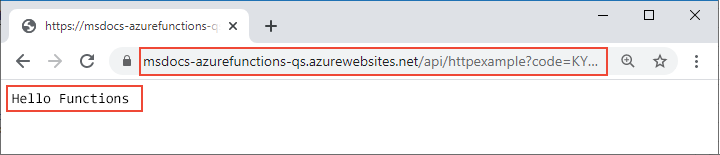

# <a name="connect-azure-functions-to-azure-storage-using-command-line-tools"></a>Verbinden von Azure Functions mit Azure Storage über Befehlszeilentools

In diesem Artikel integrieren Sie eine Azure Storage-Warteschlange in die Funktion und das Speicherkonto, die bzw. das Sie im vorherigen Schnellstartartikel erstellt haben. Sie erzielen diese Integration mit einer *Ausgabebindung*, mit der Daten aus einer HTTP-Anforderung in eine Nachricht der Warteschlange geschrieben werden. Beim Durcharbeiten dieses Artikels fallen keine zusätzlichen Kosten an, die über die wenigen US-Cent aus der vorherigen Schnellstartanleitung hinausgehen. Weitere Informationen zu Bindungen finden Sie unter [Azure Functions-Trigger und Bindungskonzepte](functions-triggers-bindings.md).

## <a name="configure-your-local-environment"></a>Konfigurieren Ihrer lokalen Umgebung

::: zone pivot="programming-language-csharp"  
Zunächst müssen Sie den Artikel [Schnellstart: Erstellen Ihrer ersten Funktion über die Befehlszeile mithilfe der Azure-Befehlszeilenschnittstelle](create-first-function-cli-csharp.md) durcharbeiten. Falls Sie die Ressourcen am Ende dieses Artikels bereits bereinigt haben, sollten Sie die Schritte erneut ausführen, um die Funktions-App und die zugehörigen Ressourcen neu zu erstellen.  
::: zone-end  
::: zone pivot="programming-language-javascript"  
Zunächst müssen Sie den Artikel [Schnellstart: Erstellen Ihrer ersten Funktion über die Befehlszeile mithilfe der Azure-Befehlszeilenschnittstelle](create-first-function-cli-node.md) durcharbeiten. Falls Sie die Ressourcen am Ende dieses Artikels bereits bereinigt haben, sollten Sie die Schritte erneut ausführen, um die Funktions-App und die zugehörigen Ressourcen neu zu erstellen.  
::: zone-end   
::: zone pivot="programming-language-java"  
Zunächst müssen Sie den Artikel [Schnellstart: Erstellen Ihrer ersten Funktion über die Befehlszeile mithilfe der Azure-Befehlszeilenschnittstelle](create-first-function-cli-java.md) durcharbeiten. Falls Sie die Ressourcen am Ende dieses Artikels bereits bereinigt haben, sollten Sie die Schritte erneut ausführen, um die Funktions-App und die zugehörigen Ressourcen neu zu erstellen.  
::: zone-end   
::: zone pivot="programming-language-typescript"  
Zunächst müssen Sie den Artikel [Schnellstart: Erstellen Ihrer ersten Funktion über die Befehlszeile mithilfe der Azure-Befehlszeilenschnittstelle](create-first-function-cli-typescript.md) durcharbeiten. Falls Sie die Ressourcen am Ende dieses Artikels bereits bereinigt haben, sollten Sie die Schritte erneut ausführen, um die Funktions-App und die zugehörigen Ressourcen neu zu erstellen.  
::: zone-end   
::: zone pivot="programming-language-python"  
Zunächst müssen Sie den Artikel [Schnellstart: Erstellen Ihrer ersten Funktion über die Befehlszeile mithilfe der Azure-Befehlszeilenschnittstelle](create-first-function-cli-python.md) durcharbeiten. Falls Sie die Ressourcen am Ende dieses Artikels bereits bereinigt haben, sollten Sie die Schritte erneut ausführen, um die Funktions-App und die zugehörigen Ressourcen neu zu erstellen.  
::: zone-end   
::: zone pivot="programming-language-powershell"  
Zunächst müssen Sie den Artikel [Schnellstart: Erstellen Ihrer ersten Funktion über die Befehlszeile mithilfe der Azure-Befehlszeilenschnittstelle](create-first-function-cli-powershell.md) durcharbeiten. Falls Sie die Ressourcen am Ende dieses Artikels bereits bereinigt haben, sollten Sie die Schritte erneut ausführen, um die Funktions-App und die zugehörigen Ressourcen neu zu erstellen.  
::: zone-end   

[!INCLUDE [functions-cli-get-storage-connection](../../includes/functions-cli-get-storage-connection.md)]

[!INCLUDE [functions-register-storage-binding-extension-csharp](../../includes/functions-register-storage-binding-extension-csharp.md)]

[!INCLUDE [functions-add-output-binding-cli](../../includes/functions-add-output-binding-cli.md)]

::: zone pivot="programming-language-csharp"  
[!INCLUDE [functions-add-storage-binding-csharp-library](../../includes/functions-add-storage-binding-csharp-library.md)]  
::: zone-end  
::: zone pivot="programming-language-java" 
[!INCLUDE [functions-add-output-binding-java-cli](../../includes/functions-add-output-binding-java-cli.md)]
::: zone-end   

Weitere Informationen zu den Details von Bindungen finden Sie unter [Konzepte für Azure Functions-Trigger und -Bindungen](functions-triggers-bindings.md) und [Ausgabe: Konfiguration](functions-bindings-storage-queue-output.md#configuration).

## <a name="add-code-to-use-the-output-binding"></a>Hinzufügen von Code für die Verwendung der Ausgabebindung

Nachdem die Warteschlangenbindung definiert wurde, können Sie Ihre Funktion nun so aktualisieren, dass sie den Ausgabeparameter `msg` empfängt und Nachrichten in die Warteschlange geschrieben werden.

::: zone pivot="programming-language-python"     
[!INCLUDE [functions-add-output-binding-python](../../includes/functions-add-output-binding-python.md)]
::: zone-end  

::: zone pivot="programming-language-javascript"  
[!INCLUDE [functions-add-output-binding-js](../../includes/functions-add-output-binding-js.md)]
::: zone-end  

::: zone pivot="programming-language-typescript"  
[!INCLUDE [functions-add-output-binding-ts](../../includes/functions-add-output-binding-ts.md)]
::: zone-end  

::: zone pivot="programming-language-powershell"  
[!INCLUDE [functions-add-output-binding-powershell](../../includes/functions-add-output-binding-powershell.md)]  
::: zone-end

::: zone pivot="programming-language-csharp"  
[!INCLUDE [functions-add-storage-binding-csharp-library-code](../../includes/functions-add-storage-binding-csharp-library-code.md)]
::: zone-end 

::: zone pivot="programming-language-java"
[!INCLUDE [functions-add-output-binding-java-code](../../includes/functions-add-output-binding-java-code.md)]

[!INCLUDE [functions-add-output-binding-java-test-cli](../../includes/functions-add-output-binding-java-test-cli.md)]
::: zone-end

Beachten Sie, dass Sie den Code für das Durchführen der Authentifizierung, das Abrufen eines Warteschlangenverweises oder das Schreiben von Daten *nicht* erstellen müssen. Diese Integrationsaufgaben werden allesamt bequem über die Azure Functions-Runtime und die Warteschlangen-Ausgabebindung verarbeitet.

[!INCLUDE [functions-run-function-test-local-cli](../../includes/functions-run-function-test-local-cli.md)]

[!INCLUDE [functions-extension-bundles-info](../../includes/functions-extension-bundles-info.md)]

## <a name="view-the-message-in-the-azure-storage-queue"></a>Anzeigen der Nachricht in der Azure Storage-Warteschlange

[!INCLUDE [functions-add-output-binding-view-queue-cli](../../includes/functions-add-output-binding-view-queue-cli.md)]

## <a name="redeploy-the-project-to-azure"></a>Erneutes Bereitstellen des Projekts in Azure

Nachdem Sie nun lokal sichergestellt haben, dass von der Funktion eine Nachricht in die Azure Storage-Warteschlange geschrieben wurde, können Sie Ihr Projekt erneut bereitstellen, um den in Azure ausgeführten Endpunkt zu aktualisieren.

::: zone pivot="programming-language-javascript,programming-language-typescript,programming-language-python,programming-language-powershell,programming-language-csharp" 
Verwenden Sie im Ordner *LocalFunctionsProj* den Befehl [`func azure functionapp publish`](functions-run-local.md#project-file-deployment), um das Projekt erneut bereitzustellen, indem Sie `<APP_NAME>` durch den Namen Ihrer App ersetzen.

```
func azure functionapp publish <APP_NAME>
```
::: zone-end  

::: zone pivot="programming-language-java" 

Verwenden Sie im lokalen Projektordner den folgenden Maven-Befehl, um Ihr Projekt erneut zu veröffentlichen:
```
mvn azure-functions:deploy
```
::: zone-end

## <a name="verify-in-azure"></a>Überprüfen in Azure

1. Verwenden Sie wie in der vorherigen Schnellstartanleitung einen Browser oder curl, um die erneut bereitgestellte Funktion zu testen.

    # <a name="browser"></a>[Browser](#tab/browser)
    
    Kopieren Sie die vollständige **Aufruf-URL**, die in der Ausgabe des Befehls zum Veröffentlichen (publish) angezeigt wird, in eine Browseradressleiste, und fügen Sie den Abfrageparameter `&name=Functions` an. Im Browser sollte eine ähnliche Ausgabe wie bei der lokalen Ausführung der Funktion angezeigt werden.

    

    # <a name="curl"></a>[curl](#tab/curl)
    
    Führen Sie [`curl`](https://curl.haxx.se/) mit der **Aufruf-URL** aus, und fügen Sie den Parameter `&name=Functions` an. Die Ausgabe des Befehls sollte der Text „Hello Functions“ sein.
    
    

    --- 

1. Untersuchen Sie die Storage-Warteschlange erneut (wie im vorherigen Abschnitt beschrieben), um zu überprüfen, ob sie die neu geschriebene Nachricht enthält.

## <a name="clean-up-resources"></a>Bereinigen von Ressourcen

Verwenden Sie nach Abschluss des Vorgangs den unten angegebenen Befehl, um die Ressourcengruppe und alle darin enthaltenen Ressourcen zu löschen, damit keine weiteren Kosten anfallen.

```azurecli
az group delete --name AzureFunctionsQuickstart-rg
```

## <a name="next-steps"></a>Nächste Schritte

Sie haben Ihre mittels HTTP ausgelöste Funktion so aktualisiert, dass sie Daten in eine Speicherwarteschlange schreibt. Nun können Sie sich weiter über die Entwicklung von Functions über die Befehlszeile mit Core Tools und der Azure CLI informieren:

+ [Arbeiten mit Azure Functions Core Tools](functions-run-local.md)  

+ [Trigger und Bindungen in Azure Functions](functions-triggers-bindings.md)

::: zone pivot="programming-language-csharp"  
+ [Beispiele für vollständige Functions-Projekte in C#](/samples/browse/?products=azure-functions&languages=csharp).

+ [C#-Entwicklerreferenz zu Azure Functions](functions-dotnet-class-library.md)  

[previous-quickstart]: create-first-function-cli-csharp.md

::: zone-end 
::: zone pivot="programming-language-javascript"  
+ [Beispiele für vollständige Functions-Projekte in JavaScript](/samples/browse/?products=azure-functions&languages=javascript).

+ [JavaScript-Entwicklerhandbuch für Azure Functions](functions-reference-node.md)  

[previous-quickstart]: create-first-function-cli-javascript.md
::: zone-end  
::: zone pivot="programming-language-typescript"  
+ [Beispiele für vollständige Functions-Projekte in TypeScript](/samples/browse/?products=azure-functions&languages=typescript).

+ [TypeScript-Entwicklerhandbuch für Azure Functions](functions-reference-node.md#typescript)  

[previous-quickstart]: create-first-function-cli-typescript.md
::: zone-end  
::: zone pivot="programming-language-python"  
+ [Beispiele für vollständige Functions-Projekte in Python](/samples/browse/?products=azure-functions&languages=python).

+ [Python-Entwicklerhandbuch für Azure Functions](functions-reference-python.md)  

[previous-quickstart]: create-first-function-cli-python.md
::: zone-end  
::: zone pivot="programming-language-powershell"  
+ [Beispiele für vollständige Functions-Projekte in PowerShell](/samples/browse/?products=azure-functions&languages=azurepowershell).

+ [PowerShell-Entwicklerhandbuch für Azure Functions](functions-reference-powershell.md) 

[previous-quickstart]: create-first-function-cli-powershell.md
::: zone-end
