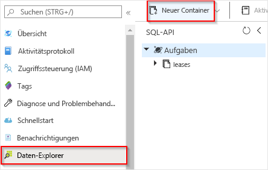
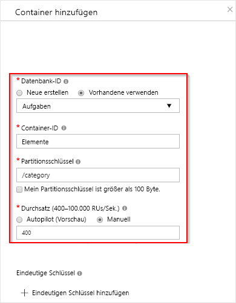
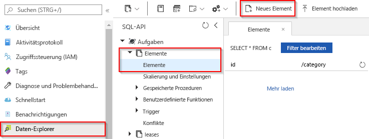

# Erstellen einer durch Azure Cosmos DB ausgelösten Funktion

Informationen zum Erstellen einer Funktion, die ausgelöst wird, wenn in Azure Cosmos DB einer Datenbank Daten hinzugefügt oder Daten in ihr geändert werden. Weitere Informationen zu Azure Cosmos DB finden Sie unter [Azure Cosmos DB: Serverloses Datenbank-Computing mithilfe von Azure Functions](../cosmos-db/serverless-computing-database.md).

## Voraussetzungen

Für dieses Tutorial benötigen Sie Folgendes:

+ Wenn Sie kein Azure-Abonnement besitzen, erstellen Sie ein [kostenloses Konto](https://azure.microsoft.com/free/?WT.mc_id=A261C142F), bevor Sie beginnen.

> [!NOTE]
> [!INCLUDE [SQL API support only](../../includes/functions-cosmosdb-sqlapi-note.md)]

## Erstellen eines Azure Cosmos DB-Kontos

Sie müssen über ein Azure Cosmos DB-Konto verfügen, für das die SQL-API verwendet wird, um den Trigger erstellen zu können.

[!INCLUDE [cosmos-db-create-dbaccount](../../includes/cosmos-db-create-dbaccount.md)]

## Erstellen einer Azure Function-App

[!INCLUDE [Create function app Azure portal](../../includes/functions-create-function-app-portal.md)]

Erstellen Sie als Nächstes in der neuen Funktionen-App eine Funktion.

## Erstellen eines Azure Cosmos DB-Triggers

1. Erweitern Sie die Funktionen-App, und klicken Sie auf die Schaltfläche **+** neben **Functions**. Wenn dies die erste Funktion in Ihrer Funktions-App ist, wählen Sie **Im Portal** und dann **Weiter**. Fahren Sie andernfalls mit Schritt 3 fort.

   

1. Klicken Sie auf **More templates** (Weitere Vorlagen) und anschließend auf **Finish and view templates** (Fertig stellen und Vorlagen anzeigen).

    

1. Geben Sie `cosmos` in das Suchfeld ein, und wählen Sie die Vorlage **Azure Cosmos DB-Trigger** aus.

1. Wählen Sie bei der entsprechenden Aufforderung die Option **Installieren** aus, um die Azure Cosmos DB-Erweiterung in der Funktions-App zu installieren. Klicken Sie nach erfolgreichem Abschluss der Installation auf **Weiter**.

    

1. Konfigurieren Sie den neuen Trigger mit den Einstellungen, die in der Tabelle unter der folgenden Abbildung enthalten sind.

    

    | Einstellung      | Vorgeschlagener Wert  | BESCHREIBUNG                                |
    | ------------ | ---------------- | ------------------------------------------ |
    | **Name** | Standard | Verwenden Sie den von der Vorlage vorgeschlagenen Standardfunktionsnamen.|
    | **Azure Cosmos DB-Kontoverbindung** | Neue Einstellung | Wählen Sie **Neu** und dann Ihr **Abonnement** und das zuvor erstellte **Datenbankkonto** aus. Klicken Sie auf **Auswählen**. Daraufhin wird eine Anwendungseinstellung für Ihre Kontoverbindung erstellt. Diese Einstellung wird von der Bindung verwendet, um die Verbindung mit der Datenbank herzustellen. |
    | **Containername** | Items | Name des zu überwachenden Containers |
    | **Erstellen des Leasecontainers, wenn er nicht vorhanden ist** | Aktiviert | Der Container ist noch nicht vorhanden und muss erstellt werden. |
    | **Datenbankname** | Aufgaben | Name der Datenbank mit dem zu überwachenden Container |

1. Klicken Sie auf **Erstellen**, um Ihre durch Azure Cosmos DB ausgelöste Funktion zu erstellen. Nachdem die Funktion erstellt ist, wird der vorlagenbasierte Funktionscode angezeigt.  

    

    Diese Funktionsvorlage schreibt die Anzahl von Dokumenten und die erste Dokument-ID in die Protokolle.

Als Nächstes stellen Sie eine Verbindung mit Ihrem Azure Cosmos DB-Konto her und erstellen den Container `Items` in der Datenbank `Tasks`.

## Erstellen des Containers „Items“

1. Öffnen Sie im Browser in einer neuen Registerkarte eine zweite Instanz des [Azure-Portals](https://portal.azure.com).

1. Erweitern Sie links im Portal die Symbolleiste, geben Sie `cosmos` in das Suchfeld ein, und wählen Sie **Azure Cosmos DB** aus.

    

1. Wählen Sie Ihr Azure Cosmos DB-Konto aus, und wählen Sie dann den **Daten-Explorer**. 

1. Wählen Sie unter **SQL-API** die Datenbank **Aufgaben** und dann **Neuer Container** aus.

    

1. Verwenden Sie in **Container hinzufügen** die Einstellungen, die in der Tabelle unten in der Abbildung gezeigt werden. 

    

    | Einstellung|Vorgeschlagener Wert|BESCHREIBUNG |
    | ---|---|--- |
    | **Datenbank-ID** | Aufgaben |Der Name Ihrer neuen Datenbank. Dieser muss mit dem in der Funktionsbindung definierten Namen übereinstimmen. |
    | **Container-ID** | Items | Der Name für den neuen Container. Dieser muss mit dem in der Funktionsbindung definierten Namen übereinstimmen.  |
    | **[Partitionsschlüssel](../cosmos-db/partition-data.md)** | /category|Ein Partitionsschlüssel, der Daten gleichmäßig auf alle Partitionen verteilt. Die Auswahl des richtigen Partitionsschlüssels ist wichtig für die Erstellung eines leistungsfähigen Containers. | 
    | **Durchsatz** |400 RU| Verwenden Sie den Standardwert. Sie können den Durchsatz später hochskalieren, wenn Sie Wartezeiten reduzieren möchten. |    

1. Klicken Sie auf **OK**, um den Container „Items“ zu erstellen. Es dauert möglicherweise kurze Zeit, bis der Container erstellt ist.

Sobald der in der Funktionsbindung angegebene Container vorhanden ist, können Sie die Funktion durch Hinzufügen von Elementen zu diesem neuen Container testen.

## Testen der Funktion

1. Erweitern Sie in Data Explorer den neuen Container **Items**, und wählen Sie **Elemente** und dann **Neues Element** aus.

    

1. Ersetzen Sie den Inhalt des neuen Elements durch den folgenden Inhalt, und wählen Sie dann **Speichern** aus.

        {
            "id": "task1",
            "category": "general",
            "description": "some task"
        }

1. Wechseln Sie zur ersten Browserregisterkarte, die die Funktion im Portal enthält. Erweitern Sie die Funktionsprotokolle, und stellen Sie sicher, dass das neue Dokument die Funktion ausgelöst hat. Vergewissern Sie sich, dass der `task1`-Dokument-ID-Wert in die Protokolle geschrieben wurde. 

    

1. (Optional) Wechseln Sie zurück zu Ihrem Dokument, nehmen Sie eine Änderung vor, und klicken Sie auf **Aktualisieren**. Wechseln Sie anschließend zurück zu den Funktionsprotokollen, und stellen Sie sicher, dass die Aktualisierung auch die Funktion ausgelöst hat.

## Bereinigen von Ressourcen

[!INCLUDE [Next steps note](../../includes/functions-quickstart-cleanup.md)]

## Nächste Schritte

Sie haben eine Funktion erstellt, die ausgeführt wird, wenn Ihrer Azure Cosmos DB ein Dokument hinzugefügt oder ein Dokument darin geändert wird. Weitere Informationen zu Azure Cosmos DB-Triggern finden Sie unter [Azure Cosmos DB-Bindungen für Azure Functions](functions-bindings-cosmosdb.md).

[!INCLUDE [Next steps note](../../includes/functions-quickstart-next-steps.md)]
