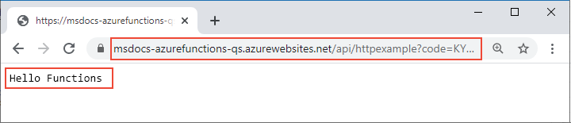

# <a name="quickstart-create-a-function-in-azure-that-responds-to-http-requests"></a>Schnellstart: Erstellen einer Funktion in Azure, die auf HTTP-Anforderungen antwortet

In diesem Artikel verwenden Sie Befehlszeilentools zum Erstellen einer Funktion, die auf HTTP-Anforderungen antwortet. Der Code wird lokal getestet und anschließend in der serverlosen Umgebung von Azure Functions bereitgestellt. Im Rahmen dieser Schnellstartanleitung fallen in Ihrem Azure-Konto ggf. geringfügige Kosten im Centbereich an.

::: zone pivot="programming-language-csharp,programming-language-javascript,programming-language-typescript,programming-language-powershell,programming-language-python"  
Es gibt auch eine [Visual Studio Code-basierte Version](functions-create-first-function-vs-code.md) dieses Artikels.
::: zone-end  

::: zone pivot="programming-language-java"  
> [!NOTE]
> Sollte Maven nicht Ihr bevorzugtes Entwicklungstool sein, stehen ähnliche Tutorials mit [Gradle](/azure/azure-functions/functions-create-first-java-gradle), [IntelliJ IDEA](/azure/developer/java/toolkit-for-intellij/quickstart-functions) und [VS Code](/azure/azure-functions/functions-create-first-function-vs-code?pivots=programming-language-java) für Java-Entwickler zur Verfügung.
::: zone-end  

[!INCLUDE [functions-requirements-cli](../../includes/functions-requirements-cli.md)]

[!INCLUDE [functions-cli-verify-prereqs](../../includes/functions-cli-verify-prereqs.md)]

[!INCLUDE [functions-cli-create-venv](../../includes/functions-cli-create-venv.md)]

## <a name="create-a-local-function-project"></a>Erstellen eines lokalen Funktionsprojekts

In Azure Functions handelt es sich bei einem Funktionsprojekt um einen Container für eine oder mehrere individuelle Funktionen, die jeweils auf einen bestimmten Trigger reagieren. Für alle Funktionen eines Projekts werden die gleichen lokalen Konfigurationen und Hostkonfigurationen gemeinsam genutzt. In diesem Abschnitt erstellen Sie ein Funktionsprojekt, das nur eine Funktion enthält.

::: zone pivot="programming-language-csharp,programming-language-javascript,programming-language-typescript,programming-language-powershell,programming-language-python"  
Führen Sie den Befehl `func init` wie folgt aus, um in einem Ordner mit dem Namen *LocalFunctionProj* ein Funktionsprojekt mit der angegebenen Runtime zu erstellen:  
::: zone-end  
::: zone pivot="programming-language-python"  
```
func init LocalFunctionProj --python
```
::: zone-end  
::: zone pivot="programming-language-csharp"  
```
func init LocalFunctionProj --dotnet
```
::: zone-end  
::: zone pivot="programming-language-javascript"  
```
func init LocalFunctionProj --javascript
```
::: zone-end  
::: zone pivot="programming-language-typescript"  
```
func init LocalFunctionProj --typescript
```
::: zone-end  
::: zone pivot="programming-language-powershell"  
```
func init LocalFunctionProj --powershell
```
::: zone-end    
::: zone pivot="programming-language-java"  
Führen Sie in einem leeren Ordner den folgenden Befehl aus, um das Functions-Projekt über einen [Maven-Archetyp](https://maven.apache.org/guides/introduction/introduction-to-archetypes.html) zu generieren.

# <a name="bash"></a>[Bash](#tab/bash)
```bash
mvn archetype:generate -DarchetypeGroupId=com.microsoft.azure -DarchetypeArtifactId=azure-functions-archetype 
```
# <a name="powershell"></a>[PowerShell](#tab/powershell)
```powershell
mvn archetype:generate "-DarchetypeGroupId=com.microsoft.azure" "-DarchetypeArtifactId=azure-functions-archetype" 
```
# <a name="cmd"></a>[Cmd](#tab/cmd)
```cmd
mvn archetype:generate "-DarchetypeGroupId=com.microsoft.azure" "-DarchetypeArtifactId=azure-functions-archetype" 
```
---

Maven fordert Sie zur Eingabe von Werten auf, die erforderlich sind, um die Generierung des Projekts bei der Bereitstellung abzuschließen.   
Geben Sie die folgenden Werte ein, wenn Sie dazu aufgefordert werden:

| Prompt | Wert | BESCHREIBUNG |
| ------ | ----- | ----------- |
| **groupId** | `com.fabrikam` | Ein Wert, der Ihr Projekt projektübergreifend eindeutig identifiziert. Für den Wert müssen die [Paketbenennungsregeln](https://docs.oracle.com/javase/specs/jls/se6/html/packages.html#7.7) für Java eingehalten werden. |
| **artifactId** | `fabrikam-functions` | Der Name des Behälters (ohne Versionsnummer). |
| **version** | `1.0-SNAPSHOT` | Wählen Sie den Standardwert aus. |
| **package** | `com.fabrikam.functions` | Das Java-Paket für den generierten Funktionscode. Verwenden Sie den Standardwert. |

Geben Sie zur Bestätigung `Y` ein, oder drücken Sie die EINGABETASTE.

Maven erstellt die Projektdateien in einem neuen Ordner und benennt ihn mit dem Wert von _artifactId_ (in diesem Beispiel: `fabrikam-functions`). 
::: zone-end  
Navigieren Sie zum Projektordner:

::: zone pivot="programming-language-csharp,programming-language-javascript,programming-language-typescript,programming-language-powershell,programming-language-python"  
```
cd LocalFunctionProj
```
::: zone-end  
::: zone pivot="programming-language-java"  
```
cd fabrikam-functions
```
::: zone-end  
Dieser Ordner enthält verschiedene Dateien für das Projekt, z. B. die Konfigurationsdateien [local.settings.json](functions-run-local.md#local-settings-file) und [host.json](functions-host-json.md). Da *local.settings.json* aus Azure heruntergeladene Geheimnisse enthalten kann, wird die Datei in der *GITIGNORE*-Datei standardmäßig aus der Quellcodeverwaltung ausgeschlossen.

[!INCLUDE [functions-cli-add-function](../../includes/functions-cli-add-function.md)]

### <a name="optional-examine-the-file-contents"></a>(Optional) Untersuchen des Dateiinhalts

Bei Bedarf können Sie [Lokales Ausführen der Funktion](#run-the-function-locally) überspringen und den Dateiinhalt später untersuchen.

::: zone pivot="programming-language-csharp"
#### <a name="httpexamplecs"></a>HttpExample.cs

*HttpExample.cs* enthält eine `Run`-Methode, die Anforderungsdaten über die Variable `req` empfängt. Hier ist dies eine Anforderung vom Typ [HttpRequest](/dotnet/api/microsoft.aspnetcore.http.httprequest), die durch das **HttpTriggerAttribute** zum Definieren des Triggerverhaltens ergänzt wird. 

:::code language="csharp" source="~/functions-docs-csharp/http-trigger-template/HttpExample.cs":::

Das Rückgabeobjekt ist ein [ActionResult](/dotnet/api/microsoft.aspnetcore.mvc.actionresult)-Element, das eine Antwortnachricht entweder als [OkObjectResult](/dotnet/api/microsoft.aspnetcore.mvc.okobjectresult) (200) oder [BadRequestObjectResult](/dotnet/api/microsoft.aspnetcore.mvc.badrequestobjectresult) (400) zurückgibt. Weitere Informationen finden Sie unter [HTTP-Trigger und -Bindungen in Azure Functions](/azure/azure-functions/functions-bindings-http-webhook?tabs=csharp).
::: zone-end

::: zone pivot="programming-language-java"
#### <a name="functionjava"></a>Function.java
*Function.java* enthält eine Methode vom Typ `run`, die Anforderungsdaten in der Variablen `request` empfängt. Hierbei handelt es sich um eine HTTP-Anforderungsnachricht ([HttpRequestMessage](/java/api/com.microsoft.azure.functions.httprequestmessage)), die mit der Anmerkung [HttpTrigger](/java/api/com.microsoft.azure.functions.annotation.httptrigger) versehen ist, um das Triggerverhalten zu definieren. 

:::code language="java" source="~/functions-quickstart-java/functions-add-output-binding-storage-queue/src/main/java/com/function/Function.java":::

Die Antwortnachricht wird von der API [HttpResponseMessage.Builder](/java/api/com.microsoft.azure.functions.httpresponsemessage.builder) generiert.

#### <a name="pomxml"></a>pom.xml

Einstellungen für die Azure-Ressourcen, die zum Hosten Ihrer App erstellt werden, werden in der generierten Datei „pom.xml“ im Konfigurationselement (**configuration**) des Plug-Ins mit der Gruppen-ID (**groupId**) `com.microsoft.azure` definiert. So wird beispielsweise durch das folgende Konfigurationselement eine Maven-basierte Bereitstellung angewiesen, eine Funktions-App in der Ressourcengruppe `java-functions-group` in der Region `westus` zu erstellen. Die Funktions-App selbst wird unter Windows mit Hosting im Tarif `java-functions-app-service-plan` ausgeführt. Bei dem Tarif handelt es sich standardmäßig um einen serverlosen Verbrauchstarif.    

:::code language="java" source="~/functions-quickstart-java/functions-add-output-binding-storage-queue/pom.xml" range="116-155":::

Diese Einstellungen ermöglichen die Steuerung der Ressourcenerstellung in Azure. Beispielsweise können Sie `runtime.os` vor der ersten Bereitstellung von `windows` in `linux` ändern. Eine umfassende Liste der Einstellungen, die vom Maven-Plug-In unterstützt werden, finden Sie in den [Konfigurationsdetails](https://github.com/microsoft/azure-maven-plugins/wiki/Azure-Functions:-Configuration-Details).

#### <a name="functiontestjava"></a>FunctionTest.java

Durch den Archetyp wird auch ein Komponententest für Ihre Funktion generiert. Wenn Sie Ihrer Funktion Bindungen hinzufügen oder dem Projekt neue Funktionen hinzufügen, müssen auch die Tests in der Datei *FunctionTest.java* geändert werden.
::: zone-end  
::: zone pivot="programming-language-python"
#### <a name="__init__py"></a>\_\_init\_\_.py

*\_\_init\_\_.py* enthält eine Python-Funktion vom Typ `main()`, die gemäß der Konfiguration in *function.json* ausgelöst wird.

:::code language="python" source="~/functions-quickstart-templates/Functions.Templates/Templates/HttpTrigger-Python/__init__.py":::

Für einen HTTP-Trigger empfängt die Funktion Anforderungsdaten in der Variablen `req`, wie dies in *function.json* definiert ist. `req` ist eine Instanz der [azure.functions.HttpRequest-Klasse](/python/api/azure-functions/azure.functions.httprequest). Das Rückgabeobjekt, das in *function.json* als `$return` definiert ist, ist eine Instanz der [azure.functions.HttpResponse-Klasse](/python/api/azure-functions/azure.functions.httpresponse). Weitere Informationen finden Sie unter [HTTP-Trigger und -Bindungen in Azure Functions](/azure/azure-functions/functions-bindings-http-webhook?tabs=python).
::: zone-end

::: zone pivot="programming-language-javascript"
#### <a name="indexjs"></a>index.js

*index.js* exportiert eine Funktion, die gemäß der Konfiguration in *function.json* ausgelöst wird.

:::code language="javascript" source="~/functions-quickstart-templates/Functions.Templates/Templates/HttpTrigger-JavaScript/index.js":::

Für einen HTTP-Trigger empfängt die Funktion Anforderungsdaten in der Variablen `req`, wie dies in *function.json* definiert ist. Das Rückgabeobjekt, das in *function.json* als `$return` definiert ist, ist die Antwort. Weitere Informationen finden Sie unter [HTTP-Trigger und -Bindungen in Azure Functions](/azure/azure-functions/functions-bindings-http-webhook?tabs=javascript).
::: zone-end

::: zone pivot="programming-language-typescript"
#### <a name="indexts"></a>index.ts

*index.ts* exportiert eine Funktion, die gemäß der Konfiguration in *function.json* ausgelöst wird.

:::code language="typescript" source="~/functions-quickstart-templates/Functions.Templates/Templates/HttpTrigger-TypeScript/index.ts":::

Für einen HTTP-Trigger empfängt die Funktion Anforderungsdaten in der Variablen `req` vom Typ **HttpRequest**, wie dies in *function.json* definiert ist. Das Rückgabeobjekt, das in *function.json* als `$return` definiert ist, ist die Antwort. 
::: zone-end

::: zone pivot="programming-language-powershell"
#### <a name="runps1"></a>run.ps1

*run.ps1* definiert ein Funktionsskript, das gemäß der Konfiguration in *function.json* ausgelöst wird.

:::code language="powershell" source="~/functions-quickstart-templates/Functions.Templates/Templates/HttpTrigger-PowerShell/run.ps1":::

Für einen HTTP-Trigger empfängt die Funktion Anforderungsdaten, die an den Parameter `$Request` übergeben werden, der in *function.json* definiert ist. Das Rückgabeobjekt, das in *function.json* als `Response` definiert ist, wird als Antwort an das Cmdlet `Push-OutputBinding` übergeben. 
::: zone-end

::: zone pivot="programming-language-javascript,programming-language-typescript,programming-language-python,programming-language-powershell"
#### <a name="functionjson"></a>function.json

*function.json* ist eine Konfigurationsdatei, in der die Eingabe- und Ausgabebindungen (`bindings`) für die Funktion, einschließlich Triggertyp, definiert sind. 
::: zone-end

::: zone pivot="programming-language-python"
Falls erforderlich, können Sie `scriptFile` auch so ändern, dass eine andere Python-Datei aufgerufen wird.

:::code language="json" source="~/functions-quickstart-templates/Functions.Templates/Templates/HttpTrigger-Python/function.json":::
::: zone-end

::: zone pivot="programming-language-javascript,programming-language-typescript"
:::code language="json" source="~/functions-quickstart-templates/Functions.Templates/Templates/HttpTrigger-JavaScript/function.json":::
::: zone-end

::: zone pivot="programming-language-powershell"
:::code language="json" source="~/functions-quickstart-templates/Functions.Templates/Templates/HttpTrigger-PowerShell/function.json":::
::: zone-end

::: zone pivot="programming-language-javascript,programming-language-typescript,programming-language-python,programming-language-powershell"  
Für jede Bindung sind eine Richtung, ein Typ und ein eindeutiger Name erforderlich. Der HTTP-Trigger weist eine Eingabebindung vom Typ [`httpTrigger`](functions-bindings-http-webhook-trigger.md) und eine Ausgabebindung vom Typ [`http`](functions-bindings-http-webhook-output.md) auf.
::: zone-end  

[!INCLUDE [functions-run-function-test-local-cli](../../includes/functions-run-function-test-local-cli.md)]

::: zone pivot="programming-language-javascript,programming-language-typescript,programming-language-python,programming-language-powershell,programming-language-csharp"    
## <a name="create-supporting-azure-resources-for-your-function"></a>Erstellen von unterstützenden Azure-Ressourcen für Ihre Funktion

Zum Bereitstellen Ihres Funktionscodes in Azure müssen Sie drei Ressourcen erstellen:

- Eine Ressourcengruppe als logischen Container für verwandte Ressourcen.
- Ein Storage-Konto, unter dem Status- und andere Informationen zu Ihren Projekten verwaltet werden.
- Eine Funktions-App, die als Umgebung zum Ausführen Ihres Funktionscodes dient. Eine Funktions-App ist Ihrem lokalen Funktionsprojekt zugeordnet und ermöglicht Ihnen das Gruppieren von Funktionen als logische Einheit, um die Verwaltung, Bereitstellung und Freigabe von Ressourcen zu vereinfachen.

Verwenden Sie die folgenden Azure CLI-Befehle, um diese Elemente zu erstellen. Für jeden Befehl wird nach Abschluss der Ausführung eine JSON-Ausgabe bereitgestellt.

Melden Sie sich mit dem Befehl [az login](/cli/azure/reference-index#az-login) bei Azure an, falls Sie dies noch nicht getan haben:

```azurecli
az login
```
    
Erstellen Sie mithilfe des Befehls [az group create](/cli/azure/group#az-group-create) eine Ressourcengruppe. Im folgenden Beispiel wird eine Ressourcengruppe mit dem Namen `AzureFunctionsQuickstart-rg` in der Region `westeurope` erstellt. (Im Allgemeinen erstellen Sie Ihre Ressourcengruppe und die Ressourcen in einer Region in Ihrer Nähe, indem Sie über den Befehl `az account list-locations` eine verfügbare Region nutzen.)

```azurecli
az group create --name AzureFunctionsQuickstart-rg --location westeurope
```

> [!NOTE]
> In derselben Ressourcengruppe können nicht gleichzeitig Linux- und Windows-Apps gehostet werden. Wenn Sie über eine bestehende Ressourcengruppe mit dem Namen `AzureFunctionsQuickstart-rg` und einer Windows-Funktions-App oder -Web-App verfügen, müssen Sie eine andere Ressourcengruppe verwenden.
 
    
Erstellen Sie mit dem Befehl [az storage account create](/cli/azure/storage/account#az-storage-account-create) in Ihrer Ressourcengruppe und Region ein universelles Speicherkonto. Ersetzen Sie im folgenden Beispiel `<STORAGE_NAME>` durch einen global eindeutigen Namen, der für Sie geeignet ist. Namen dürfen nur 3 bis 24 Zeichen und ausschließlich Kleinbuchstaben enthalten. Mit `Standard_LRS` wird ein universelles Konto angegeben, das [von Functions unterstützt](storage-considerations.md#storage-account-requirements) wird.

```azurecli
az storage account create --name <STORAGE_NAME> --location westeurope --resource-group AzureFunctionsQuickstart-rg --sku Standard_LRS
```

Mit diesem Speicherkonto fallen für diese Schnellstartanleitung nur Kosten in Höhe von wenigen Cent (USD) an.
    
Erstellen Sie die Funktions-App mit dem Befehl [az functionapp create](/cli/azure/functionapp#az-functionapp-create). Ersetzen Sie im folgenden Beispiel `<STORAGE_NAME>` durch den Namen des Kontos, das Sie im vorherigen Schritt verwendet haben, und `<APP_NAME>` durch einen global eindeutigen Namen, der für Sie geeignet ist. `<APP_NAME>` ist gleichzeitig die DNS-Standarddomäne für die Funktions-App. 
::: zone-end  

::: zone pivot="programming-language-python"  
Ändern Sie bei Verwendung von Python 3.8 `--runtime-version` in `3.8` und `--functions_version` in `3`.

Ändern Sie bei Verwendung von Python 3.6 `--runtime-version` in `3.6`.

```azurecli
az functionapp create --resource-group AzureFunctionsQuickstart-rg --os-type Linux --consumption-plan-location westeurope --runtime python --runtime-version 3.7 --functions-version 2 --name <APP_NAME> --storage-account <STORAGE_NAME>
```
::: zone-end  

::: zone pivot="programming-language-javascript,programming-language-typescript"  
Ändern Sie bei Verwendung von Node.js 8 auch `--runtime-version` in `8`.


```azurecli
az functionapp create --resource-group AzureFunctionsQuickstart-rg --consumption-plan-location westeurope --runtime node --runtime-version 10 --functions-version 2 --name <APP_NAME> --storage-account <STORAGE_NAME>
```
::: zone-end  

::: zone pivot="programming-language-csharp"  
```azurecli
az functionapp create --resource-group AzureFunctionsQuickstart-rg --consumption-plan-location westeurope --runtime dotnet --functions-version 2 --name <APP_NAME> --storage-account <STORAGE_NAME>
```
::: zone-end  

::: zone pivot="programming-language-powershell"  
```azurecli
az functionapp create --resource-group AzureFunctionsQuickstart-rg --consumption-plan-location westeurope --runtime powershell --functions-version 2 --name <APP_NAME> --storage-account <STORAGE_NAME>
```
::: zone-end  

::: zone pivot="programming-language-javascript,programming-language-typescript,programming-language-python,programming-language-powershell,programming-language-csharp"  
Mit diesem Befehl wird eine Funktions-App erstellt, für die die von Ihnen angegebene Language Runtime unter dem [Azure Functions-Verbrauchstarif](functions-scale.md#consumption-plan) ausgeführt wird. Dies ist für die Nutzungsmenge, die in diesem Fall anfällt, kostenlos. Darüber hinaus wird mit dem Befehl auch eine zugeordnete Azure Application Insights-Instanz in derselben Ressourcengruppe bereitgestellt, mit der Sie Ihre Funktions-App überwachen und Protokolle anzeigen können. Weitere Informationen finden Sie unter [Überwachen von Azure Functions](functions-monitoring.md). Für die Instanz fallen erst Kosten an, wenn Sie sie aktivieren.
    
## <a name="deploy-the-function-project-to-azure"></a>Bereitstellen des Funktionsprojekts in Azure
::: zone-end  

::: zone pivot="programming-language-typescript"  
Bevor Sie Core Tools zum Bereitstellen Ihres Projekts in Azure verwenden, erstellen Sie aus den TypeScript-Quelldateien einen produktionsbereiten Build aus JavaScript-Dateien.

Mit dem folgenden Befehl wird Ihr TypeScript-Projekt für die Bereitstellung vorbereitet:

```
npm run build:production 
```
::: zone-end  

::: zone pivot="programming-language-javascript,programming-language-typescript,programming-language-python,programming-language-powershell,programming-language-csharp"  
Da nun die benötigten Ressourcen vorhanden sind, können Sie Ihr lokales Funktionsprojekt für die Funktions-App in Azure bereitstellen, indem Sie den Befehl [func azure functionapp publish](functions-run-local.md#project-file-deployment) verwenden. Ersetzen Sie im folgenden Beispiel `<APP_NAME>` durch den Namen Ihrer App.

```
func azure functionapp publish <APP_NAME>
```

Wenn ein Fehler der Art „App mit dem Namen ... kann nicht gefunden werden“ angezeigt wird, sollten Sie einige Sekunden warten und es dann erneut versuchen. Es kann sein, dass Azure die App nach dem vorherigen `az functionapp create`-Befehl nicht richtig initialisiert hat.

Mit dem Befehl zum Veröffentlichen (publish) werden Ergebnisse wie in der folgenden (gekürzten) Ausgabe angezeigt:

<pre>
...

Getting site publishing info...
Creating archive for current directory...
Performing remote build for functions project.

...

Deployment successful.
Remote build succeeded!
Syncing triggers...
Functions in msdocs-azurefunctions-qs:
    HttpExample - [httpTrigger]
        Invoke url: https://msdocs-azurefunctions-qs.azurewebsites.net/api/httpexample?code=KYHrydo4GFe9y0000000qRgRJ8NdLFKpkakGJQfC3izYVidzzDN4gQ==
</pre>

::: zone-end  
::: zone pivot="programming-language-java"  
## <a name="deploy-the-function-project-to-azure"></a>Bereitstellen des Funktionsprojekts in Azure

Wenn Sie Ihr Funktionsprojekt erstmals bereitstellen, werden in Azure eine Funktions-App und zugehörige Ressourcen erstellt. Einstellungen für die Azure-Ressourcen, die zum Hosten Ihrer App erstellt werden, werden in der Datei [pom.xml](#pomxml) definiert. In diesem Artikel werden die Standardeinstellungen übernommen.

> [!TIP]
> Wenn Sie eine Funktions-App für Linux anstatt für Windows erstellen möchten, ändern Sie das Element `runtime.os` in der Datei „pom.xml“ von `windows` in `linux`. Das Ausführen von Linux in einem Verbrauchstarif wird in [diesen Regionen](https://github.com/Azure/azure-functions-host/wiki/Linux-Consumption-Regions) unterstützt. Unter Linux ausgeführte Apps und unter Windows ausgeführte Apps können nicht in der gleichen Ressourcengruppe enthalten sein.

Vor der Bereitstellung müssen Sie sich zunächst mithilfe des Azure CLI-Befehls [az login](/cli/azure/authenticate-azure-cli) bei Ihrem Azure-Abonnement anmelden. 

```azurecli
az login
```

Verwenden Sie den folgenden Befehl, um Ihr Projekt für eine neue Funktions-App bereitzustellen. 

```
mvn azure-functions:deploy
```

Dadurch werden in Azure die folgenden Ressourcen erstellt:

+ Ressourcengruppe namens _java-functions-group_.
+ Speicherkonto – von Functions benötigt. Der Name wird nach dem Zufallsprinzip basierend auf den Anforderungen für den Speicherkontonamen generiert.
+ Hostingplan: Serverloses Hosting für Ihre Funktions-App in der Region _westus_. Der Name lautet _java-functions-app-service-plan_.
+ Funktions-App – die Bereitstellungs-und Ausführungseinheit für Ihre Funktionen. Der Name wird nach dem Zufallsprinzip generiert. Er basiert auf Ihrer Artefakt-ID (_artifactId_) und wird am Ende mit einer nach dem Zufallsprinzip generierten Zahl versehen. 

Bei der Bereitstellung werden die Projektdateien mithilfe von [zip deployment](functions-deployment-technologies.md#zip-deploy) gepackt und für die neue Funktions-App bereitgestellt. Der Code wird über das Bereitstellungspaket in Azure ausgeführt.
::: zone-end

## <a name="invoke-the-function-on-azure"></a>Aufrufen der Funktion in Azure

Da für Ihre Funktion ein HTTP-Trigger verwendet wird, führen Sie das Aufrufen durch, indem Sie per Browser eine HTTP-Anforderung an die entsprechende URL senden oder ein Tool wie curl verwenden. In beiden Fällen ist der URL-Parameter `code` Ihr eindeutiger [Funktionsschlüssel](functions-bindings-http-webhook-trigger.md#authorization-keys), über den der Aufruf mit Ihrem Funktionsendpunkt autorisiert wird.

# <a name="browser"></a>[Browser](#tab/browser)

Kopieren Sie die vollständige **Aufruf-URL**, die in der Ausgabe des Befehls zum Veröffentlichen (publish) angezeigt wird, in eine Browseradressleiste, und fügen Sie den Abfrageparameter `&name=Functions` an. Im Browser sollte eine ähnliche Ausgabe wie bei der lokalen Ausführung der Funktion angezeigt werden.




# <a name="curl"></a>[curl](#tab/curl)

Führen Sie [`curl`](https://curl.haxx.se/) mit der **Aufruf-URL** aus, und fügen Sie den Parameter `&name=Functions` an. Die Ausgabe des Befehls sollte der Text „Hello Functions“ sein.


---

> [!TIP]
> Verwenden Sie die [Live Metrics Stream-Features von Application Insights](functions-monitoring.md#streaming-logs), um Protokolle für eine veröffentlichte Funktions-App nahezu in Echtzeit anzuzeigen.

## <a name="clean-up-resources"></a>Bereinigen von Ressourcen

Gehen Sie wie folgt vor, falls Sie mit dem nächsten Schritt fortfahren möchten: [Fügen Sie eine Ausgabebindung für die Azure Storage-Warteschlange hinzu](functions-add-output-binding-storage-queue-cli.md), und behalten Sie alle Ressourcen bei, weil der nächste Schritt auf der bisherigen Arbeit aufbaut.

Verwenden Sie andernfalls den unten angegebenen Befehl, um die Ressourcengruppe und alle darin enthaltenen Ressourcen zu löschen, damit keine weiteren Kosten anfallen.

```azurecli
az group delete --name AzureFunctionsQuickstart-rg
```

## <a name="next-steps"></a>Nächste Schritte

> [!div class="nextstepaction"]
> [Herstellen einer Verbindung mit einer Azure Storage-Warteschlange](functions-add-output-binding-storage-queue-cli.md)
