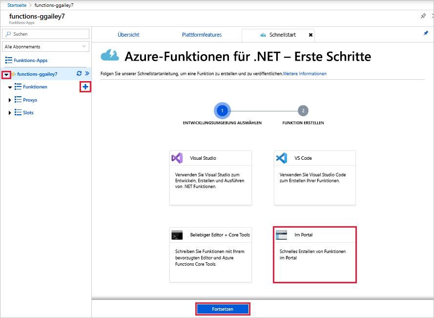
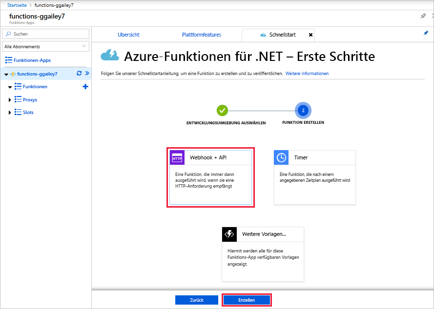
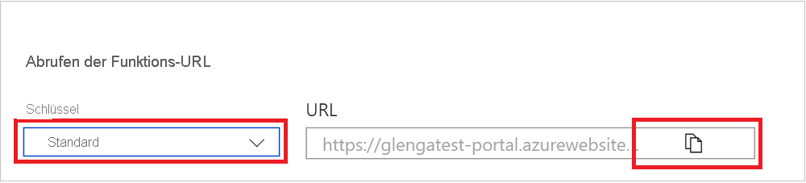
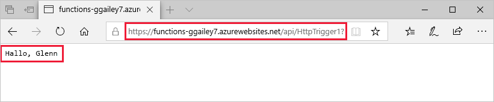
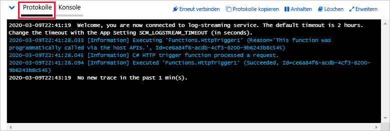

# Erstellen Ihrer ersten Funktion im Azure-Portal

Mit Azure Functions können Sie Ihren Code in einer serverlosen Umgebung ausführen, ohne vorher einen virtuellen Computer zu erstellen oder eine Webanwendung zu veröffentlichen. In diesem Artikel erfahren Sie, wie Sie Azure Functions verwenden können, um eine über HTTP ausgelöste Hallo Welt-Funktion im Azure-Portal zu erstellen.

[!INCLUDE [quickstarts-free-trial-note](../../includes/quickstarts-free-trial-note.md)]

Als C#-Entwickler sollten Sie für die [Erstellung Ihrer ersten Funktion Visual Studio 2019](functions-create-your-first-function-visual-studio.md) statt das Portal in Erwägung ziehen. 

## Anmelden bei Azure

Melden Sie sich mit Ihrem Azure-Konto beim [Azure-Portal](https://portal.azure.com) an.

## Erstellen einer Funktionen-App

Sie müssen über eine Funktionen-App verfügen, die die Ausführung Ihrer Funktionen in Azure hostet. Sie können mit einer Funktions-App Funktionen zu logischen Einheiten gruppieren. Dies erleichtert die Verwaltung, Bereitstellung, Skalierung und Freigabe von Ressourcen.

[!INCLUDE [Create function app Azure portal](../../includes/functions-create-function-app-portal.md)]

Erstellen Sie als Nächstes eine Funktion in der neuen Funktions-App.

## Erstellen einer Funktion mit Auslösung per HTTP

1. Erweitern Sie Ihre neue Funktions-App, wählen Sie neben **Functions** die Schaltfläche **+** aus, und klicken Sie auf **Im Portal** und anschließend auf **Weiter**.

    

1. Wählen Sie **Webhook + API** und anschließend **Erstellen** aus.

    

   Eine Funktion wird unter Verwendung einer sprachspezifischen Vorlage für eine Funktion mit HTTP-Trigger erstellt.

Nun können Sie die neue Funktion ausführen, indem Sie eine HTTP-Anforderung senden.

## Testen der Funktion

1. Wählen Sie in der neuen Funktion oben rechts **</> Funktions-URL abrufen** aus. 

1. Wählen Sie im Dialogfeld **Funktions-URL abrufen** im Dropdownmenü die Option **default (Function key)** (Standard (Funktionsschlüssel)) und anschließend **Kopieren** aus. 

    

1. Fügen Sie die URL der Funktion in die Adressleiste Ihres Browsers ein. Fügen Sie den Wert der Abfragezeichenfolge `&name=<your_name>` am Ende der URL hinzu, und drücken Sie die EINGABETASTE, um die Anforderung auszuführen. 

    Das folgende Beispiel zeigt die Antwort im Browser:

    

    Die Anfrage-URL enthält einen Schlüssel, der standardmäßig über HTTP auf Ihre Funktion zugreifen muss.

1. Wenn Ihre Funktion ausgeführt wird, werden Nachverfolgungsinformationen in die Protokolle geschrieben. Wenn Sie die Nachverfolgungsausgabe der vorherigen Ausführung anzeigen möchten, kehren Sie zu Ihrer Funktion im Portal zurück, und wählen Sie am unteren Bildschirmrand den Pfeil aus, um **Protokolle** zu erweitern.

   

## Bereinigen von Ressourcen

[!INCLUDE [Clean-up resources](../../includes/functions-quickstart-cleanup.md)]

## Nächste Schritte

[!INCLUDE [Next steps note](../../includes/functions-quickstart-next-steps.md)]

