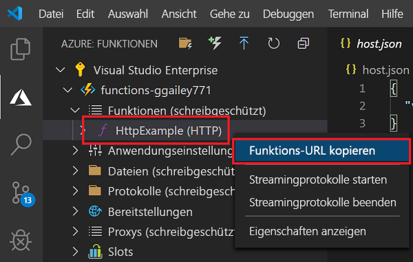
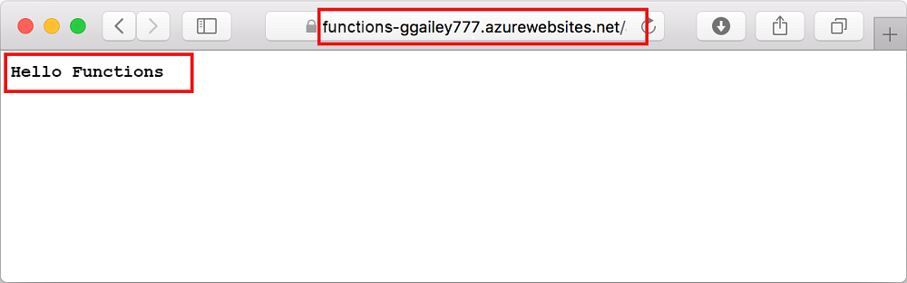

# Schnellstart: Erstellen einer Funktion in Azure mit Visual Studio Code

::: zone pivot="programming-language-csharp"  
In diesem Artikel wird mithilfe von Visual Studio Code eine auf der C#-Klassenbibliothek basierende Funktion erstellt, die auf HTTP-Anforderungen reagiert. Der Code wird lokal getestet und anschließend in der serverlosen Umgebung von Azure Functions bereitgestellt. 
::: zone-end  
::: zone pivot="programming-language-javascript"
In diesem Artikel wird mithilfe von Visual Studio Code eine JavaScript-Funktion erstellt, die auf HTTP-Anforderungen reagiert. Der Code wird lokal getestet und anschließend in der serverlosen Umgebung von Azure Functions bereitgestellt. 
::: zone-end
::: zone pivot="programming-language-typescript"
In diesem Artikel wird mithilfe von Visual Studio Code eine TypeScript-Funktion erstellt, die auf HTTP-Anforderungen reagiert. Der Code wird lokal getestet und anschließend in der serverlosen Umgebung von Azure Functions bereitgestellt. 
::: zone-end   
::: zone pivot="programming-language-powershell"
In diesem Artikel wird mithilfe von Visual Studio Code eine PowerShell-Funktion erstellt, die auf HTTP-Anforderungen reagiert. Der Code wird lokal getestet und anschließend in der serverlosen Umgebung von Azure Functions bereitgestellt. 
::: zone-end  
::: zone pivot="programming-language-python" 
In diesem Artikel wird mithilfe von Visual Studio Code eine Python-Funktion erstellt, die auf HTTP-Anforderungen reagiert. Der Code wird lokal getestet und anschließend in der serverlosen Umgebung von Azure Functions bereitgestellt. 
::: zone-end  
::: zone pivot="programming-language-java" 
In diesem Artikel wird mithilfe von Visual Studio Code eine Java-Funktion erstellt, die auf HTTP-Anforderungen reagiert. Der Code wird lokal getestet und anschließend in der serverlosen Umgebung von Azure Functions bereitgestellt. 
::: zone-end

Im Rahmen dieser Schnellstartanleitung fallen in Ihrem Azure-Konto ggf. geringfügige Kosten im Centbereich an. 

::: zone pivot="programming-language-csharp,programming-language-javascript,programming-language-typescript,programming-language-powershell,programming-language-python"
Es gibt auch eine [CLI-basierte Version](functions-create-first-azure-function-azure-cli.md) dieses Artikels.
::: zone-end
::: zone pivot="programming-language-java"  
> [!NOTE]
> Sollte Visual Studio Code nicht Ihr bevorzugtes Entwicklungstool sein, stehen ähnliche Tutorials mit [Maven](/azure/azure-functions/functions-create-first-azure-function-azure-cli?pivots=programming-language-java), [Gradle](/azure/azure-functions/functions-create-first-java-gradle) und [IntelliJ IDEA](/azure/developer/java/toolkit-for-intellij/quickstart-functions) für Java-Entwickler zur Verfügung.
::: zone-end  

## Konfigurieren Ihrer Umgebung

Vergewissern Sie sich zunähst, dass Folgendes vorhanden ist:

+ Ein Azure-Konto mit einem aktiven Abonnement. Sie können [kostenlos ein Konto erstellen](https://azure.microsoft.com/free/?ref=microsoft.com&utm_source=microsoft.com&utm_medium=docs&utm_campaign=visualstudio).

::: zone pivot="programming-language-csharp,programming-language-powershell,programming-language-python"  
+ [Node.js](https://nodejs.org/): Wird von Windows für npm benötigt. Nur [Active LTS- und Maintenance LTS-Versionen](https://nodejs.org/about/releases/). Verwenden Sie den Befehl `node --version`, um Ihre Version zu überprüfen.
    Nicht erforderlich für die lokale Entwicklung unter macOS und Linux   
::: zone-end  
::: zone pivot="programming-language-javascript,programming-language-typescript"  
+ [Node.js](https://nodejs.org/): Active LTS- und Maintenance LTS-Versionen (Empfehlung: 10.14.1). Verwenden Sie den Befehl `node --version`, um Ihre Version zu überprüfen.
::: zone-end 
::: zone pivot="programming-language-python"
+ [Python 3.8](https://www.python.org/downloads/release/python-381/), [Python 3.7](https://www.python.org/downloads/release/python-375/) und [Python 3.6](https://www.python.org/downloads/release/python-368/) werden von Azure Functions (x64) unterstützt.
::: zone-end   
::: zone pivot="programming-language-powershell"
+ [PowerShell Core](/powershell/scripting/install/installing-powershell-core-on-windows)

+ [.NET Core SDK 2.2+](https://www.microsoft.com/net/download)  
::: zone-end  
::: zone pivot="programming-language-java"  
+ [Java Developer Kit](https://aka.ms/azure-jdks), Version 8

+ [Apache Maven](https://maven.apache.org), Version 3.0 oder höher
::: zone-end  
+ [Visual Studio Code](https://code.visualstudio.com/) auf einer der [unterstützten Plattformen](https://code.visualstudio.com/docs/supporting/requirements#_platforms)  
::: zone pivot="programming-language-csharp"  
+ [C#-Erweiterung](https://marketplace.visualstudio.com/items?itemName=ms-dotnettools.csharp) für Visual Studio Code  
::: zone-end  
::: zone pivot="programming-language-python"
+ [Python-Erweiterung](https://marketplace.visualstudio.com/items?itemName=ms-python.python) für Visual Studio Code  
::: zone-end  
::: zone pivot="programming-language-powershell"
+ [PowerShell-Erweiterung für Visual Studio Code](https://marketplace.visualstudio.com/items?itemName=ms-vscode.PowerShell) 
::: zone-end  
::: zone pivot="programming-language-java"  
+ [Java-Erweiterungspaket](https://marketplace.visualstudio.com/items?itemName=vscjava.vscode-java-pack)
::: zone-end  

+ [Azure Functions-Erweiterung](https://marketplace.visualstudio.com/items?itemName=ms-azuretools.vscode-azurefunctions) für Visual Studio Code 

## Erstellen Ihres lokalen Projekts 

In diesem Abschnitt wird mithilfe von Visual Studio Code ein lokales Azure Functions-Projekt in der gewünschten Sprache erstellt. Weiter unten in diesem Artikel wird der Funktionscode in Azure veröffentlicht. 

1. Wählen Sie auf der Aktivitätsleiste das Azure-Symbol und anschließend im Bereich **Azure: Funktionen** das Symbol **Neues Projekt erstellen** aus.

    

1. Wählen Sie einen Verzeichnisspeicherort für Ihren Projektarbeitsbereich und anschließend **Auswählen** aus.

    > [!NOTE]
    > Diese Schritte sollten außerhalb eines Arbeitsbereichs ausgeführt werden. Wählen Sie in diesem Fall keinen Projektordner aus, der Teil eines Arbeitsbereichs ist.

1. Geben Sie nach entsprechender Aufforderung Folgendes ein:

    ::: zone pivot="programming-language-csharp"
    + **Select a language for your function project** (Wählen Sie eine Sprache für Ihr Funktionsprojekt aus.): Wählen Sie die Option `C#`.
    ::: zone-end
    ::: zone pivot="programming-language-javascript"
    + **Select a language for your function project** (Wählen Sie eine Sprache für Ihr Funktionsprojekt aus.): Wählen Sie die Option `JavaScript`.
    ::: zone-end
    ::: zone pivot="programming-language-typescript"
    + **Select a language for your function project** (Wählen Sie eine Sprache für Ihr Funktionsprojekt aus.): Wählen Sie die Option `TypeScript`.
    ::: zone-end
    ::: zone pivot="programming-language-powershell"
    + **Select a language for your function project** (Wählen Sie eine Sprache für Ihr Funktionsprojekt aus.): Wählen Sie die Option `PowerShell`.
    ::: zone-end
    ::: zone pivot="programming-language-python"
    + **Select a language for your function project** (Wählen Sie eine Sprache für Ihr Funktionsprojekt aus.): Wählen Sie die Option `Python`.

    + **Select a Python alias to create a virtual environment** (Wählen Sie einen Python-Alias zum Erstellen einer virtuellen Umgebung aus.): Wählen Sie den Speicherort Ihres Python-Interpreters aus. Sollte der Speicherort nicht angezeigt werden, geben Sie den vollständigen Pfad Ihrer Python-Binärdatei ein.  
    ::: zone-end

    ::: zone pivot="programming-language-java"  
    + **Select a language for your function project** (Wählen Sie eine Sprache für Ihr Funktionsprojekt aus.): Wählen Sie die Option `Java`.

    + **Provide a group ID** (Geben Sie eine Gruppen-ID an.): Wählen Sie die Option `com.function`.

    + **Provide an artifact ID** (Geben Sie eine Artefakt-ID an.): Wählen Sie die Option `myFunction`.

    + **Provide a version** (Geben Sie eine Version an.): Wählen Sie die Option `1.0-SNAPSHOT`.

    + **Provide a package name** (Geben Sie einen Paketnamen an.): Wählen Sie die Option `com.function`.

    + **Provide an app name** (Geben Sie einen App-Namen an.): Wählen Sie die Option `myFunction-12345`.
    ::: zone-end  
    ::: zone pivot="programming-language-csharp,programming-language-javascript,programming-language-typescript,programming-language-powershell,programming-language-python"
    + **Select a template for your project's first function** (Wählen Sie die Vorlage für die erste Funktion Ihres Projekts aus.): Wählen Sie die Option `HTTP trigger`.
    
    + **Provide a function name** (Geben Sie einen Funktionsnamen an.): Geben Sie `HttpExample`ein.
    ::: zone-end  
    ::: zone pivot="programming-language-csharp"
    + **Provide a namespace** (Geben Sie einen Namespace an.): Geben Sie `My.Functions`ein. 
    ::: zone-end  
    ::: zone pivot="programming-language-csharp,programming-language-javascript,programming-language-typescript,programming-language-powershell,programming-language-python"
    + **Autorisierungsstufe:** Wählen Sie `Anonymous` aus, damit Ihr Funktionsendpunkt von jedem Benutzer aufgerufen werden kann. Weitere Informationen zur Autorisierungsstufe finden Sie unter [Autorisierungsschlüssel](functions-bindings-http-webhook-trigger.md#authorization-keys).
    ::: zone-end  
    + **Select how you would like to open your project** (Wählen Sie aus, wie Sie Ihr Projekt öffnen möchten.): Wählen Sie die Option `Add to workspace`.

1. Auf der Grundlage dieser Informationen generiert Visual Studio Code ein Azure Functions-Projekt mit einem HTTP-Trigger. Die lokalen Projektdateien können im Explorer angezeigt werden. Weitere Informationen zu den erstellten Dateien finden Sie unter [Generierte Projektdateien](functions-develop-vs-code.md#generated-project-files). 

::: zone pivot="programming-language-csharp,programming-language-javascript,programming-language-python,programming-language-java"

[!INCLUDE [functions-run-function-test-local-vs-code](../../includes/functions-run-function-test-local-vs-code.md)]

::: zone-end

::: zone pivot="programming-language-powershell"

[!INCLUDE [functions-run-function-test-local-vs-code-ps](../../includes/functions-run-function-test-local-vs-code-ps.md)]

::: zone-end

Nachdem Sie sich vergewissert haben, dass die Funktion auf Ihrem lokalen Computer korrekt ausgeführt wird, können Sie das Projekt mithilfe von Visual Studio Code direkt in Azure veröffentlichen. 

[!INCLUDE [functions-sign-in-vs-code](../../includes/functions-sign-in-vs-code.md)]

[!INCLUDE [functions-publish-project-vscode](../../includes/functions-publish-project-vscode.md)]

## Ausführen der Funktion in Azure

1. Zurück im Bereich **Azure: Funktionen** auf der Seitenleiste die neue Funktions-App unter Ihrem Abonnement. Erweitern Sie **Funktionen**, klicken Sie mit der rechten Maustaste (Windows), bzw. klicken Sie bei gedrückter CTRL-TASTE (macOS) auf **HttpExample**, und wählen Sie **Copy function URL** (Funktions-URL kopieren) aus.

    

1. Fügen Sie diese URL für die HTTP-Anforderung in die Adressleiste Ihres Browsers ein, fügen Sie die Abfragezeichenfolge `name` als `?name=Functions` am Ende der URL hinzu, und führen Sie dann die Anforderung aus. Die URL, über die Ihre per HTTP ausgelöste Funktion aufgerufen wird, sollte das folgende Format haben:

        http://<functionappname>.azurewebsites.net/api/httpexample?name=Functions 
        
    Das folgende Beispiel zeigt die von der Funktion im Browser zurückgegebene Antwort auf die GET-Remoteanforderung: 

    

## Bereinigen von Ressourcen

Wenn Sie mit dem nächsten Schritt ([Hinzufügen einer Azure Storage-Warteschlangenbindung zu Ihrer Funktion](functions-add-output-binding-storage-queue-vs-code.md)) fortfahren möchten, müssen alle Ihre Ressourcen erhalten bleiben, um darauf aufbauen zu können.

Andernfalls können Sie die Funktions-App und die zugehörigen Ressourcen wie im Anschluss beschrieben löschen, um weitere Kosten zu vermeiden.

[!INCLUDE [functions-cleanup-resources-vs-code.md](../../includes/functions-cleanup-resources-vs-code.md)]

Weitere Informationen zu den Kosten von Functions finden Sie unter [Abschätzen der Kosten des Verbrauchstarifs](functions-consumption-costs.md).

## Nächste Schritte

Sie haben Visual Studio Code genutzt, um eine Funktions-App mit einer einfachen Funktion zu erstellen, die über HTTP ausgelöst wird. Im nächsten Artikel erweitern Sie diese Funktion durch Hinzufügen einer Ausgabebindung. Diese Bindung schreibt die Zeichenfolge aus der HTTP-Anforderung in eine Nachricht in einer Azure Queue Storage-Warteschlange. 

> [!div class="nextstepaction"]
> [Hinzufügen einer Azure Storage-Warteschlangenbindung zu Ihrer Funktion](functions-add-output-binding-storage-queue-vs-code.md)

[Azure Functions Core Tools]: functions-run-local.md
[Azure Functions extension for Visual Studio Code]: https://marketplace.visualstudio.com/items?itemName=ms-azuretools.vscode-azurefunctions
