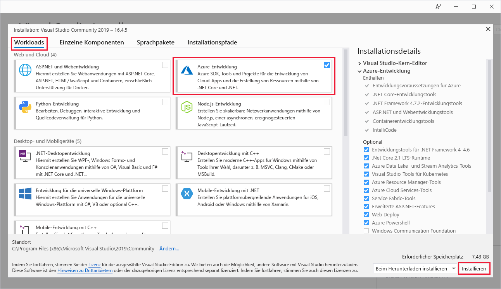

# Schnellstart: Erstellen Ihrer ersten Funktion in Azure mit Visual Studio

In diesem Artikel wird mithilfe von Visual Studio eine auf der C#-Klassenbibliothek basierende Funktion erstellt, die auf HTTP-Anforderungen reagiert. Der Code wird lokal getestet und anschließend in der serverlosen Umgebung von Azure Functions bereitgestellt.  

Im Rahmen dieser Schnellstartanleitung fallen in Ihrem Azure-Konto ggf. geringfügige Kosten im Centbereich an.

## Voraussetzungen

Installieren Sie für dieses Tutorial zunächst [Visual Studio 2019](https://azure.microsoft.com/downloads/). Wählen Sie bei der Installation die Workload **Azure-Entwicklung** aus. Falls Sie stattdessen ein Azure Functions-Projekt mit Visual Studio 2017 erstellen möchten, müssen Sie zuerst die [aktuellen Azure Functions-Tools](functions-develop-vs.md#check-your-tools-version) installieren.

Wenn Sie kein [Azure-Abonnement](../guides/developer/azure-developer-guide.md#understanding-accounts-subscriptions-and-billing) besitzen, erstellen Sie ein [kostenloses Konto](https://azure.microsoft.com/free/dotnet/), bevor Sie beginnen.

## Erstellen eines Funktionen-App-Projekts

[!INCLUDE [Create a project using the Azure Functions template](../../includes/functions-vstools-create.md)]

Visual Studio erstellt ein Projekt und eine Klasse mit Codebausteinen für den Funktionstyp „HTTP-Trigger“. Mit Code in den Codebausteinen wird eine HTTP-Antwort gesendet, die einen Wert aus dem Anforderungstext oder der Abfragezeichenfolge enthält. Mit dem Attribut `HttpTrigger` wird angegeben, dass die Funktion von einer HTTP-Anforderung ausgelöst wird. 

## Umbenennen der Funktion

Das Methodenattribut `FunctionName` dient zum Festlegen des Namens der Funktion, der standardmäßig als `Function1` generiert wird. Da die Tools Sie den Standardfunktionsnamen nicht überschreiben lassen, wenn Sie Ihr Projekt erstellen, nehmen Sie sich eine Minute Zeit, um einen besseren Namen für die Funktionsklasse, Datei und die Metadaten zu erstellen.

1. Klicken Sie im **Datei-Explorer** mit der rechten Maustaste auf die Datei „Function1.cs“, und benennen Sie sie in `HttpExample.cs` um.

1. Benennen Sie die Klasse „Function1“ im Code in ‚HttpExample‘ um.

1. Benennen Sie in der `HttpTrigger`-Methode namens `run` das Methodenattribut `FunctionName` in `HttpExample` um.

Nachdem Sie die Funktion nun umbenannt haben, können Sie sie auf Ihrem lokalen Computer testen.

## Lokales Ausführen der Funktion

Visual Studio wird in Azure Functions Core Tools integriert, sodass Sie Ihre Funktionen mithilfe der vollständigen Azure Functions-Runtime lokal testen können.  

[!INCLUDE [functions-run-function-test-local-vs](../../includes/functions-run-function-test-local-vs.md)]

Nachdem Sie sichergestellt haben, dass die Funktion auf Ihrem lokalen Computer richtig ausgeführt wird, können Sie das Projekt in Azure veröffentlichen.

## Veröffentlichen des Projekts in Azure

Sie müssen in Ihrem Azure-Abonnement über eine Funktions-App verfügen, um Ihr Projekt veröffentlichen zu können. Bei der Veröffentlichung in Visual Studio wird eine Funktions-App für Sie erstellt, wenn Sie das Projekt zum ersten Mal veröffentlichen.

[!INCLUDE [Publish the project to Azure](../../includes/functions-vstools-publish.md)]

## Testen der Funktion in Azure

1. In Cloud-Explorer sollte Ihre neue Funktions-App ausgewählt sein. Wenn nicht, erweitern Sie Ihr Abonnement > **App Services**, und wählen Sie Ihre neue Funktions-App aus.

1. Klicken Sie mit der rechten Maustaste auf die Funktions-App, und wählen Sie **In Browser öffnen** aus. Dadurch wird der Stamm ihrer Funktions-App in Ihrem Standardwebbrowser geöffnet und die Seite angezeigt, die anzeigt, dass ihre Funktions-App ausgeführt wird. 

    :::image type="content" source="media/functions-create-your-first-function-visual-studio/function-app-running-azure.png" alt-text="Ausgeführte Funktions-App":::

1. Fügen Sie in der Adressleiste des Browsers die Zeichenfolge `/api/HttpExample?name=Functions` an die Basis-URL an, und führen Sie die Anforderung aus.

    Die URL, über die Ihre Funktion mit HTTP-Trigger aufgerufen wird, hat das folgende Format:

    `http://<APP_NAME>.azurewebsites.net/api/HttpExample?name=Functions`

2. Wechseln Sie zu dieser URL, und im Browser wird eine von der App auf die GET-Remoteanforderung zurückgegebene Antwort angezeigt, die wie im folgenden Beispiel aussieht:

    :::image type="content" source="media/functions-create-your-first-function-visual-studio/functions-create-your-first-function-visual-studio-browser-azure.png" alt-text="Funktionsantwort im Browser":::

## Bereinigen von Ressourcen

Andere Schnellstarts in dieser Sammlung bauen auf diesem Schnellstart auf. Überspringen Sie die Bereinigung der Ressourcen, falls Sie mit nachfolgenden Schnellstartanleitungen, Tutorials oder einem der Dienste, die Sie im Rahmen dieser Schnellstartanleitung erstellt haben, weiterarbeiten möchten.

*Ressourcen* bezieht sich bei Azure auf Funktions-Apps, Funktionen, Speicherkonten und Ähnliches. Sie werden in *Ressourcengruppen* zusammengefasst, und sämtliche Inhalte einer Gruppe können durch das Löschen der Gruppe gelöscht werden. 

Im Rahmen dieser Schnellstartanleitungen haben Sie Ressourcen erstellt. Für diese Ressourcen fallen je nach [Kontostatus](https://azure.microsoft.com/account/) und [Dienstpreisen](https://azure.microsoft.com/pricing/) unter Umständen Kosten an. Nicht mehr benötigte Ressourcen können wie folgt gelöscht werden:

1. Erweitern Sie im Cloud-Explorer Ihr Abonnement > **App Services**, klicken Sie mit der rechten Maustaste auf ihre Funktions-App, und wählen Sie **Im Portal öffnen** aus. 

1. Wählen Sie auf der Seite „Funktions-App“ die Registerkarte **Übersicht** und anschließend unter **Ressourcengruppe** den Link aus.

   :::image type="content" source="media/functions-create-your-first-function-visual-studio/functions-app-delete-resource-group.png" alt-text="Auswählen der zu löschenden Ressourcengruppe auf der Seite „Funktions-App“":::

2. Prüfen Sie auf der Seite **Ressourcengruppe** die Liste mit den enthaltenen Ressourcen, und vergewissern Sie sich, dass es sich dabei um die Ressourcen handelt, die Sie löschen möchten.
 
3. Klicken Sie auf **Ressourcengruppe löschen**, und folgen Sie den Anweisungen.

   Der Löschvorgang kann einige Minuten dauern. Nach Abschluss des Vorgangs wird kurz eine Benachrichtigung angezeigt. Sie können auch am oberen Seitenrand auf das Glockensymbol klicken, um die Benachrichtigung anzuzeigen.

## Nächste Schritte

In dieser Schnellstartanleitung haben Sie mithilfe von Visual Studio eine C#-Funktions-App in Azure mit einer einfachen HTTP-Triggerfunktion erstellt und veröffentlicht. 

Im nächsten Artikel erfahren Sie, wie Sie Ihrer Funktion eine Azure Storage-Warteschlangenbindung zu hinzufügen:
> [!div class="nextstepaction"]
> [Hinzufügen einer Azure Storage-Warteschlangenbindung zu Ihrer Funktion](functions-add-output-binding-storage-queue-vs.md)

