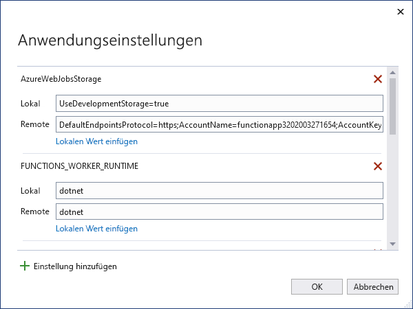

# <a name="develop-azure-functions-using-visual-studio"></a>Entwickeln von Azure Functions mithilfe von Visual Studio  

In Visual Studio können Sie C#-Klassenbibliotheksfunktionen entwickeln, testen und in Azure bereitstellen. Wenn Sie zum ersten Mal mit Azure Functions arbeiten, finden Sie unter [Einführung in Azure Functions](functions-overview.md) weitere Informationen.

Visual Studio bietet die folgenden Vorteile beim Entwickeln von Funktionen: 

* Bearbeiten, Erstellen und Ausführen von Funktionen auf Ihrem lokalen Entwicklungscomputer. 
* Veröffentlichen Sie Ihr Azure Functions-Projekt direkt in Azure, und erstellen Sie Azure-Ressourcen ganz nach Bedarf. 
* Verwenden Sie C#-Attribute, um Funktionsbindungen direkt im C#-Code zu deklarieren.
* Entwickeln und Bereitstellen vorkompilierter C#-Funktionen. Vorkompilierte Funktionen bieten eine bessere Leistung beim Kaltstart als auf skriptbasierende Funktionen von C#. 
* Codieren Ihrer Funktionen in C# während Sie von allen Vorteilen der Entwicklung mit Visual Studio profitieren. 

Dieser Artikel erläutert detailliert, wie Sie Visual Studio verwenden, um C#-Klassenbibliotheksfunktionen zu entwickeln und in Azure zu veröffentlichen. Bevor Sie diesen Artikel lesen, sollten Sie den [Functions-Schnellstart für Visual Studio](functions-create-your-first-function-visual-studio.md) abschließen. 

Sofern nicht anders angegeben, gelten die gezeigten Prozeduren und Beispiele für Visual Studio 2019. 

## <a name="prerequisites"></a>Voraussetzungen

- Azure Functions-Tools. Um Azure Functions-Tools hinzuzufügen, schließen Sie die Workload **Azure-Entwicklung** in Ihre Installation von Visual Studio ein. Azure Functions-Tools sind ab Visual Studio 2017 in der Workload „Azure-Entwicklung“ enthalten.

- Andere Ressourcen, die Sie benötigen, z. B. ein Azure Storage-Konto, werden während des Veröffentlichungsprozesses in Ihrem Abonnement erstellt.

- [!INCLUDE [quickstarts-free-trial-note](../../includes/quickstarts-free-trial-note.md)]

> [!NOTE]
> In Visual Studio 2017 werden mit der Workload „Azure-Entwicklung“ Azure Functions-Tools als separate Erweiterung installiert. Wenn Sie Ihre Installation von Visual Studio 2017 aktualisieren, stellen Sie sicher, dass Sie die [neueste Version](#check-your-tools-version) der Azure Functions-Tools verwenden. In den folgenden Abschnitten wird beschrieben, wie Sie Ihre Azure Functions-Tools-Erweiterung in Visual Studio 2017 überprüfen und ggf. aktualisieren. 
>
> Überspringen Sie diese Abschnitte, wenn Sie Visual Studio 2019 verwenden.

### <a name="check-your-tools-version-in-visual-studio-2017"></a><a name="check-your-tools-version"></a>Überprüfen der Toolversion in Visual Studio 2017

1. Wählen Sie im Menü **Extras** auf **Erweiterungen und Updates** . Erweitern Sie **Installiert** > **Tools** , und wählen Sie dann **Azure Functions und Webauftragstools** aus.

    

1. Notieren Sie sich die installierte **Version** , und vergleichen Sie diese Version mit der aktuellen, die in den [Versionshinweisen](https://github.com/Azure/Azure-Functions/blob/master/VS-AzureTools-ReleaseNotes.md) aufgeführt ist. 

1. Wenn Ihre Version älter ist, aktualisieren Sie Ihre Tools in Visual Studio, wie im folgenden Abschnitt gezeigt.

### <a name="update-your-tools-in-visual-studio-2017"></a>Aktualisieren der Tools in Visual Studio 2017

1. Erweitern Sie im Dialogfeld **Erweiterungen und Updates** die Option **Updates** > **Visual Studio Marketplace** , wählen Sie **Azure Functions und Webauftragstools** , und wählen Sie **Aktualisieren** .

       

1. Nachdem das Toolupdate heruntergeladen wurde, wählen Sie **Schließen** aus, und schließen Sie Visual Studio, damit die Tools mit dem VSIX-Installationsprogramm aktualisiert werden.

1. Wählen Sie im VSIX-Installationsprogramm **Ändern** aus, um die Tools zu aktualisieren. 

1. Wählen Sie nach Abschluss des Updates **Schließen** aus, und starten Sie Visual Studio neu.

> [!NOTE]  
> In Visual Studio 2019 und höher wird die Azure Functions-Tools-Erweiterung im Rahmen von Visual Studio aktualisiert.  

## <a name="create-an-azure-functions-project"></a>Erstellen eines Azure Functions-Projekts

[!INCLUDE [Create a project using the Azure Functions](../../includes/functions-vstools-create.md)]

Nach dem Erstellen eines Azure Functions-Projekts erstellt die Projektvorlage ein C#-Projekt, installiert das NuGet-Paket `Microsoft.NET.Sdk.Functions` und legt das Zielframework fest. Das neue Projekt enthält die folgenden Dateien:

* **host.json** : Ermöglicht das Konfigurieren des Functions-Hosts. Diese Einstellungen gelten für die lokale Ausführung und die Ausführung in Azure. Weitere Informationen finden Sie in der [host.json-Referenz](functions-host-json.md).

* **local.settings.json** : Behält Einstellungen beim lokalen Ausführen von Funktionen bei. Diese Einstellungen werden bei der Ausführung in Azure nicht verwendet. Weitere Informationen finden Sie unter [Datei für lokale Einstellungen](#local-settings-file).

    >[!IMPORTANT]
    >Da die Datei „local.settings.json“ Geheimnisse enthalten kann, müssen Sie sie aus der Quellcodeverwaltung Ihres Projekts ausschließen. Stellen Sie sicher, dass die Einstellung **In Ausgabeverzeichnis kopieren** für diese Datei auf **Kopieren, falls aktueller** festgelegt ist. 

Weitere Informationen finden Sie unter [Funktionsklassenbibliotheks-Projekt](functions-dotnet-class-library.md#functions-class-library-project).

[!INCLUDE [functions-local-settings-file](../../includes/functions-local-settings-file.md)]

Visual Studio lädt die Einstellungen in „local.settings.json“ nicht automatisch hoch, wenn Sie das Projekt veröffentlichen. Um sicherzustellen, dass diese Einstellungen auch in Ihrer Funktions-App in Azure vorhanden sind, laden Sie sie nach dem Veröffentlichen Ihres Projekts hoch. Weitere Informationen finden Sie unter [Einstellungen für Funktions-Apps](#function-app-settings). Die Werte in einer `ConnectionStrings`-Sammlung werden nie veröffentlicht.

Ihr Code kann die Werte für Funktions-App-Einstellungen auch als Umgebungsvariablen lesen. Weitere Informationen finden Sie unter [Umgebungsvariablen](functions-dotnet-class-library.md#environment-variables).

## <a name="configure-the-project-for-local-development"></a>Konfigurieren des Projekts für die lokale Entwicklung

Die Functions-Laufzeit verwendet intern ein Azure-Speicherkonto. Legen Sie für alle Triggertypen außer HTTP und Webhooks den Schlüssel `Values.AzureWebJobsStorage` auf eine gültige Verbindungszeichenfolge für ein Azure Storage-Konto fest. Ihre Funktions-App kann auch den [Azure-Speicheremulator](../storage/common/storage-use-emulator.md) für die Verbindungseinstellung `AzureWebJobsStorage` verwenden, die für das Projekt erforderlich ist. Um den Emulator zu verwenden, legen Sie den Wert für `AzureWebJobsStorage` auf `UseDevelopmentStorage=true` fest. Ändern Sie diese Einstellung vor der Bereitstellung in eine tatsächliche Verbindungszeichenfolge für ein Speicherkonto.

So legen Sie die Speicherkonto-Verbindungszeichenfolge fest:

1. Wählen Sie in Visual Studio **Ansicht** > **Cloud-Explorer** aus.

2. Erweitern Sie in **Cloud-Explorer** die Option **Speicherkonten** , und wählen Sie Ihr Speicherkonto aus. Kopieren Sie auf der Registerkarte **Eigenschaften** den Wert **Primäre Verbindungszeichenfolge** .

2. Öffnen Sie in Ihrem Projekt die Datei „local.settings.json“, und legen Sie den Wert des Schlüssels `AzureWebJobsStorage` auf die kopierte Verbindungszeichenfolge fest.

3. Wiederholen Sie den vorherigen Schritt zum Hinzufügen von eindeutigen Schlüsseln zum Array `Values` für alle anderen Verbindungen, die für Ihre Funktionen erforderlich sind. 

## <a name="add-a-function-to-your-project"></a>Hinzufügen einer Funktion zu Ihrem Projekt

In C#-Klassenbibliotheksfunktionen werden die von der Funktion verwendeten Bindungen durch Anwendung von Attributen im Code definiert. Wenn Sie Funktionstrigger aus den bereitgestellten Vorlagen erstellen, werden die Triggerattribute für Sie angewendet. 

1. Klicken Sie im **Projektmappen-Explorer** mit der rechten Maustaste auf den Projektknoten, und wählen Sie **Hinzufügen** > **Neues Element** aus. 

2. Wählen Sie **Azure-Funktion** aus, geben Sie einen **Namen** für die Klasse ein, und wählen Sie dann **Hinzufügen** aus.

3. Wählen Sie den Trigger aus, legen Sie die Bindungseigenschaften fest, und wählen Sie **OK** aus. Im folgenden Beispiel werden die Einstellungen zum Erstellen einer Queue Storage-Triggerfunktion gezeigt. 

    

    In diesem Triggerbeispiel wird eine Verbindungszeichenfolge mit dem Schlüssel `QueueStorage` verwendet. Definieren Sie diese Einstellung für die Verbindungszeichenfolge in der Datei [local.settings.json](functions-run-local.md#local-settings-file).

4. Untersuchen Sie die neu hinzugefügte Klasse. Es wird eine statische `Run()`-Methode angezeigt, der das `FunctionName`-Attribut zugewiesen wird. Dieses Attribut gibt an, dass die Methode den Einstiegspunkt für die Funktion darstellt.

    Die folgende C#-Klasse stellt beispielsweise eine einfache Queue Storage-Triggerfunktion dar:

    ```csharp
    using System;
    using Microsoft.Azure.WebJobs;
    using Microsoft.Azure.WebJobs.Host;
    using Microsoft.Extensions.Logging;

    namespace FunctionApp1
    {
        public static class Function1
        {
            [FunctionName("QueueTriggerCSharp")]
            public static void Run([QueueTrigger("myqueue-items", 
                Connection = "QueueStorage")]string myQueueItem, ILogger log)
            {
                log.LogInformation($"C# Queue trigger function processed: {myQueueItem}");
            }
        }
    }
    ```

Ein bindungsspezifisches Attribut wird auf jeden Bindungsparameter angewendet, der der Einstiegspunktmethode bereitgestellt wird. Das Attribut verwendet die Bindungsinformationen als Parameter. Im vorherigen Beispiel wurde auf den ersten Parameter ein `QueueTrigger`-Attribut angewandt, das auf eine Queue Storage-Triggerfunktion hinweist. Die Namen der Warteschlange und der Einstellung für die Verbindungszeichenfolge werden als Parameter an das `QueueTrigger`-Attribut übergeben. Weitere Informationen finden Sie unter [Azure Queue Storage-Bindungen für Azure Functions](functions-bindings-storage-queue-trigger.md).

Verwenden Sie das oben angegebene Verfahren, um Ihrem Funktions-App-Projekt weitere Funktionen hinzuzufügen. Jede Funktion im Projekt kann über einen anderen Trigger verfügen, aber einer Funktion muss genau ein Trigger zugeordnet sein. Weitere Informationen finden Sie unter [Konzepte für Azure Functions-Trigger und -Bindungen](functions-triggers-bindings.md).

## <a name="add-bindings"></a>Hinzufügen von Bindungen

Wie bei Triggern auch, werden Eingabe- und Ausgabebindungen Ihrer Funktion als Bindungsattribute hinzugefügt. Fügen Sie Bindungen einer Funktion wie folgt hinzu:

1. Stellen Sie sicher, dass Sie [das Projekt für lokale Entwicklung konfiguriert haben](#configure-the-project-for-local-development).

2. Fügen Sie für die entsprechende Bindung das geeignete NuGet-Erweiterungspaket hinzu. 

   Weitere Informationen finden Sie unter [C#-Klassenbibliothek mit Visual Studio](./functions-bindings-register.md#local-csharp). Die bindungsspezifischen NuGet-Paketanforderungen finden Sie im Referenzartikel für die Bindung. Paketanforderungen für den Event Hubs-Trigger finden Sie im [Referenzartikel zu Event Hubs-Bindungen](functions-bindings-event-hubs.md).

3. Falls für die Bindung bestimmte App-Einstellungen erforderlich sind, können Sie diese der Sammlung `Values` in der [Datei mit lokalen Einstellungen](functions-run-local.md#local-settings-file) hinzufügen. 

   Die-Funktion verwendet diese Werte, wenn sie lokal ausgeführt wird. Wenn die Funktion in der Funktions-App in Azure ausgeführt wird, werden die [Einstellungen für Funktions-Apps](#function-app-settings) verwendet.

4. Fügen Sie der Methodensignatur das entsprechende Bindungsattribut hinzu. Im folgenden Beispiel löst eine Warteschlangennachricht die Funktion aus, und die Ausgabebindung erstellt eine neue Warteschlangennachricht mit demselben Text in einer anderen Warteschlange.

    ```csharp
    public static class SimpleExampleWithOutput
    {
        [FunctionName("CopyQueueMessage")]
        public static void Run(
            [QueueTrigger("myqueue-items-source", Connection = "AzureWebJobsStorage")] string myQueueItem, 
            [Queue("myqueue-items-destination", Connection = "AzureWebJobsStorage")] out string myQueueItemCopy,
            ILogger log)
        {
            log.LogInformation($"CopyQueueMessage function processed: {myQueueItem}");
            myQueueItemCopy = myQueueItem;
        }
    }
    ```
   Die Verbindung mit dem Warteschlangenspeicher stammt aus der Einstellung `AzureWebJobsStorage`. Weitere Informationen finden Sie im Referenzartikel für die spezifische Bindung. 

[!INCLUDE [Supported triggers and bindings](../../includes/functions-bindings.md)]

## <a name="testing-functions"></a>Testen von Funktionen

Mit Azure Functions Core-Tools können Sie ein Azure Functions-Projekt auf dem lokalen Entwicklungscomputer ausführen. Weitere Informationen finden Sie unter [Arbeiten mit Azure Functions Core Tools](functions-run-local.md). Sie werden beim ersten Starten einer Funktion in Visual Studio zum Installieren dieser Tools aufgefordert. 

So testen Sie Ihre Funktion in Visual Studio

1. Drücken Sie F5. Akzeptieren Sie die entsprechende Aufforderung von Visual Studio zum Herunterladen und Installieren der Azure Functions Core (CLI)-Tools. Sie müssen möglicherweise auch eine Firewallausnahme aktivieren, damit die Tools HTTP-Anforderungen verarbeiten können.

2. Wenn das Projekt ausgeführt wird, testen Sie Ihren Code wie eine bereitgestellte Funktion. 

   Weitere Informationen finden Sie unter [Strategien zum Testen Ihres Codes in Azure Functions](functions-test-a-function.md). Wenn Sie Visual Studio im Debuggingmodus ausführen, werden wie erwartet Breakpoints erreicht.

<!---
For an example of how to test a queue triggered function, see the [queue triggered function quickstart tutorial](functions-create-storage-queue-triggered-function.md#test-the-function).  
-->


## <a name="publish-to-azure"></a>Veröffentlichen in Azure

Bei der Veröffentlichung über Visual Studio wird eine von zwei Bereitstellungsmethoden verwendet:

* [Web Deploy:](functions-deployment-technologies.md#web-deploy-msdeploy) Dient zum Packen und Bereitstellen von Windows-Apps auf einem beliebigen IIS-Server.
* [ZIP-Bereitstellung mit aktivierter Ausführung aus dem Paket:](functions-deployment-technologies.md#zip-deploy) Empfohlen für Azure Functions-Bereitstellungen.

Verwenden Sie die folgenden Schritte, um Ihr Projekt in einer Funktions-App in Azure zu veröffentlichen.

[!INCLUDE [Publish the project to Azure](../../includes/functions-vstools-publish.md)]

## <a name="function-app-settings"></a>Einstellungen für Funktions-Apps

Da Visual Studio diese Einstellungen nicht automatisch beim Veröffentlichen des Projekts hochlädt, müssen Sie alle in der Datei „local.settings.json“ hinzugefügten Einstellungen auch der Funktions-App in Azure hinzufügen.

Die einfachste Möglichkeit zum Hochladen der erforderlichen Einstellungen in Ihre Funktions-App in Azure ist das Auswählen des Links **Azure App Service-Einstellungen bearbeiten** , der nach dem Veröffentlichen des Projekts angezeigt wird.

:::image type="content" source="./media/functions-develop-vs/functions-vstools-app-settings.png" alt-text="Einstellungen im Fenster „Veröffentlichen“":::

Durch Auswählen dieses Links wird das Dialogfeld **Anwendungseinstellungen** für die Funktions-App angezeigt, in dem Sie neue Anwendungseinstellungen hinzufügen oder vorhandene ändern können.



**Lokal** zeigt einen Einstellungswert in der Datei „local.settings.json“ an, und **Remote** zeigt einen aktuellen Einstellungswert in der Funktions-App in Azure an. Wählen Sie **Einstellung hinzufügen** , um eine neue App-Einstellung zu erstellen. Verwenden Sie den Link **Wert aus lokaler Quelle einfügen** , um einen Einstellungswert in das Feld **Remote** zu kopieren. Ausstehende Änderungen werden in die Datei für lokale Einstellungen und die Funktions-App geschrieben, wenn Sie **OK** auswählen.

> [!NOTE]
> Standardmäßig wird die Datei „local.settings.json“ nicht in die Quellcodeverwaltung eingecheckt. Dies bedeutet, dass das Projekt beim Klonen eines lokalen Functions-Projekts aus der Quellcodeverwaltung keine Datei „local.settings.json“ enthält. In diesem Fall müssen Sie die Datei „local.settings.json“ manuell im Projektstamm erstellen, damit das Dialogfeld **Anwendungseinstellungen** erwartungsgemäß funktioniert. 

Sie können die Anwendungseinstellungen auch folgendermaßen verwalten:

* [Verwenden des Azure-Portals](functions-how-to-use-azure-function-app-settings.md#settings)
* [Verwenden der Veröffentlichungsoption `--publish-local-settings` in Azure Functions Core Tools](functions-run-local.md#publish)
* [Verwenden der Azure CLI](/cli/azure/functionapp/config/appsettings#az-functionapp-config-appsettings-set)

## <a name="monitoring-functions"></a>Überwachen von Funktionen

Die empfohlene Methode zum Überwachen der Ausführung Ihrer Funktionen ist die Integration Ihrer Funktions-App in Azure Application Insights. Wenn Sie eine Funktions-App im Azure-Portal erstellen, wird diese Integration standardmäßig für Sie erledigt. Wenn Sie Ihre Funktions-App während der Veröffentlichung in Visual Studio erstellen, erfolgt die Integration Ihrer Funktions-App in Azure nicht. Informationen zum Herstellen einer Verbindung von Application Insights mit ihrer Funktions-App finden Sie unter [Aktivieren der Application Insights-Integration](configure-monitoring.md#enable-application-insights-integration).

Weitere Informationen zum Überwachen mithilfe von Application Insights finden Sie unter [Überwachen von Azure Functions](functions-monitoring.md).

## <a name="next-steps"></a>Nächste Schritte

Weitere Informationen zu Azure Functions Core Tools finden Sie unter [Arbeiten mit Azure Functions Core Tools](functions-run-local.md).

Weitere Informationen zum Entwickeln von Funktionen als .NET-Klassenbibliotheken finden Sie unter [C#-Entwicklerreferenz zu Azure Functions](functions-dotnet-class-library.md). Dieser Artikel enthält auch Links zu Beispielen für die Verwendung von Attributen zum Deklarieren der verschiedenen Typen von Bindungen, die von Azure Functions unterstützt werden.    
