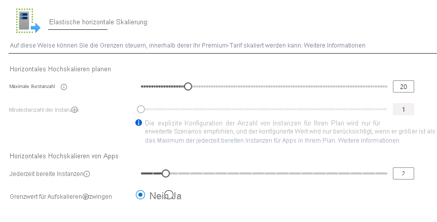

# <a name="azure-functions-premium-plan"></a>Premium-Tarif für Azure Functions

Der Premium-Plan für Azure Functions (gelegentlich auch als Elastic Premium-Plan bezeichnet) ist eine Hostingoption für Funktions-Apps. Andere Hostingplanoptionen finden Sie im [Artikel zu Hostingplänen](functions-scale.md).

Das Hosten von Funktionen im Premium-Plan bietet die folgenden Vorteile:

* Vermeiden von Kaltstarts durch ständig betriebsbereite (warme) Instanzen
* VNET-Konnektivität
* Unbegrenzte Ausführungsdauer, 60 Minuten garantiert
* Premium-Instanzgrößen: Instanzen mit einem Kern, mit zwei Kernen und mit vier Kernen
* Besser vorhersagbare Preise im Vergleich zum Verbrauchsplan
* App-Zuteilung mit hoher Dichte für Pläne mit mehrere Funktions-Apps

Bei Verwendung des Premium-Plans werden Instanzen des Azure Functions-Hosts basierend auf der Anzahl der eingehenden Ereignisse hinzugefügt und entfernt, wie es auch beim [Verbrauchsplan](consumption-plan.md) der Fall ist. Mehrere Funktions-Apps können im selben Premium-Plan bereitgestellt werden, und der Tarif ermöglicht es Ihnen, die Compute-Instanzgröße, Basisplangröße und maximale Plangröße zu konfigurieren. 

## <a name="billing"></a>Abrechnung

Die Abrechnung für den Premium-Plan basiert auf der Anzahl von Kernsekunden und dem Arbeitsspeicher, der den Instanzen zugeordnet ist. Diese Abrechnung unterscheidet sich von der des Verbrauchsplans, die pro Ausführung und verbrauchtem Arbeitsspeicher erfolgt. Beim Premium-Plan fallen keine Gebühren pro Ausführung an. Pro Plan muss immer mindestens eine Instanz zugeordnet sein. Diese Abrechnung führt zu monatlichen Mindestkosten pro aktivem Plan, unabhängig davon, ob die Funktion aktiv oder im Leerlauf ist. Beachten Sie, dass sich alle Funktions-Apps in einem Premium-Plan die zugeordneten Instanzen teilen. Weitere Informationen finden Sie auf der [Seite mit der Preisübersicht für Azure Functions](https://azure.microsoft.com/pricing/details/functions/).

## <a name="create-a-premium-plan"></a>Erstellen eines Premium-Plans

Wenn Sie eine Funktions-App im Azure-Portal erstellen, gilt standardmäßig der Verbrauchsplan. Um eine Funktions-App zur Ausführung in einem Premium-Plan zu erstellen, müssen Sie unter Verwendung einer der _Elastic Premium_-SKUs explizit einen App Service-Plan erstellen. Die von Ihnen erstellte Funktions-App wird dann in diesem Plan gehostet. Im Azure-Portal können Sie den Premium-Plan und die Funktions-App ganz einfach gleichzeitig erstellen. Sie können mehrere Funktions-Apps im selben Premium-Plan ausführen, dies gilt aber nur, wenn alle Apps unter demselben Betriebssystem (Windows oder Linux) ausgeführt werden. 

In den folgenden Artikeln erfahren Sie, wie Sie programmgesteuert oder im Azure-Portal eine Funktions-App mit einem Premium-Plan erstellen:

+ [Azure portal](create-premium-plan-function-app-portal.md)
+ [Azure-Befehlszeilenschnittstelle](scripts/functions-cli-create-premium-plan.md)
+ [Azure Resource Manager-Vorlage](functions-infrastructure-as-code.md#deploy-on-premium-plan)

## <a name="eliminate-cold-starts"></a>Vermeiden von Kaltstarts

Wenn keine Ereignisse und Ausführungen im Verbrauchsplan stattfinden werden, wird Ihre App möglicherweise auf null Instanzen abskaliert. Wenn neue Ereignisse eintreffen, muss eine neue Instanz angegeben werden, in der Ihre App ausgeführt wird. Das Einrichten einer neuen Instanz kann je nach App einige Zeit dauern. Diese zusätzliche Wartezeit beim ersten Aufruf wird häufig als App-_Kaltstart_ bezeichnet.

Ein Premium-Plan bietet zwei Features, die gemeinsam Kaltstarts in Ihren Funktionen effektiv vermeiden: _jederzeit bereite Instanzen_ und _vorab aufgewärmte Instanzen_. 

### <a name="always-ready-instances"></a>Jederzeit bereite Instanzen

Im Premium-Plan können Sie Ihre App jederzeit bereit für eine angegebene Anzahl von Instanzen vorhalten. Die maximale Anzahl von jederzeit bereiten Instanzen beträgt 20. Wenn Ereignisse mit dem Auslösen der App beginnen, werden sie zuerst an die jederzeit bereiten Instanzen weitergeleitet. Wenn die Funktion aktiv wird, werden zusätzliche Instanzen als Puffer „vorgewärmt“. Dieser Puffer verhindert einen Kaltstart für neue Instanzen, die während der Skalierung erforderlich sind. Diese gepufferten Instanzen werden als [vorgewärmte Instanzen](#pre-warmed-instances) aufgerufen. Durch die Kombination aus jederzeit bereiten Instanzen und einem vorgewärmten Puffer kann Ihre App einen Kaltstart effektiv vermeiden.

> [!NOTE]
> Jeder Premium-Plan bietet immer mindestens eine aktive (in Rechnung gestellte) Instanz.

# <a name="portal"></a>[Portal](#tab/portal)

Sie können die Anzahl der jederzeit bereiten Instanzen im Azure-Portal konfigurieren, indem Sie Ihre **Funktions-App** auswählen, zur Registerkarte **Plattformfeatures** wechseln und die Optionen zum **Aufskalieren** auswählen. Im Bearbeitungsfenster der Funktions-App sind jederzeit bereite Instanzen für diese App spezifisch.



# <a name="azure-cli"></a>[Azure-Befehlszeilenschnittstelle](#tab/azurecli)

Sie können jederzeit bereite Instanzen für eine App auch mit der Azure CLI konfigurieren.

```azurecli-interactive
az resource update -g <resource_group> -n <function_app_name>/config/web --set properties.minimumElasticInstanceCount=<desired_always_ready_count> --resource-type Microsoft.Web/sites
```
---

### <a name="pre-warmed-instances"></a>Vorab aufgewärmte Instanzen

Bei vorab aufgewärmten Instanzen handelt es sich um Instanzen, die während Skalierungs- und Aktivierungsereignissen als Puffer vorgewärmt werden. Vorab aufgewärmte Instanzen setzen die Pufferung fort, bis der Grenzwert für maximale horizontale Skalierung erreicht wird. Die standardmäßige Anzahl vorab aufgewärmter Instanzen ist 1, und dieser Wert sollte für die meisten Szenarien beibehalten werden.

Wenn eine App eine lange Aufwärmphase aufweist (z. B. ein benutzerdefiniertes Containerimage), kann es sinnvoll sein, diesen Puffer zu vergrößern. Eine vorab aufgewärmte Instanz wird erst aktiv, wenn alle aktiven Instanzen ausreichend ausgelastet wurden.

Folgendes Beispiel zeigt, wie jederzeit bereite Instanzen und vorab aufgewärmte Instanzen zusammenarbeiten. Für eine Premium-Funktions-App sind fünf jederzeit bereite Instanzen konfiguriert, und die Standardeinstellung bietet eine vorab aufgewärmte Instanz. Wenn sich die App im Leerlauf befindet und keine Ereignisse als Auslöser vorhanden sind, wird die App mit fünf Instanzen bereitgestellt und ausgeführt. Zu diesem Zeitpunkt wird Ihnen keine vorab aufgewärmte Instanz in Rechnung gestellt, da die jederzeit bereiten Instanzen nicht verwendet werden und keine vorab aufgewärmte Instanz zugeordnet ist.

Sobald der erste Trigger eintrifft, werden die fünf jederzeit bereiten Instanzen aktiv, und eine vorab aufgewärmte Instanz wird zugeordnet. Die App wird nun mit sechs bereitgestellten Instanzen ausgeführt: mit den fünf jetzt aktiven, jederzeit bereiten Instanzen und dem sechsten vorab aufgewärmten und inaktiven Puffer. Wenn die Ausführungsrate weiterhin zunimmt, sind die fünf aktiven Instanzen schließlich ausgelastet. Wenn die Plattform über fünf Instanzen hinaus skaliert, erfolgt die Skalierung in die vorab aufgewärmte Instanz. In diesem Fall sind jetzt sechs aktive Instanzen vorhanden, und eine siebte Instanz wird sofort bereitgestellt und füllt den Puffer mit vorab aufgewärmten Instanzen auf. Diese Sequenz aus Skalierung und Vorabaufwärmung wird fortgesetzt, bis die maximale Anzahl von Instanzen für die App erreicht ist. Über den maximalen Wert hinaus werden keine Instanzen vorab aufgewärmt oder aktiviert.

Sie können die Anzahl der vorab aufgewärmten Instanzen für eine App ändern, indem Sie die Azure CLI verwenden.

```azurecli-interactive
az resource update -g <resource_group> -n <function_app_name>/config/web --set properties.preWarmedInstanceCount=<desired_prewarmed_count> --resource-type Microsoft.Web/sites
```

### <a name="maximum-function-app-instances"></a>Maximale Anzahl von Funktions-App-Instanzen

Zusätzlich zur [Maximalen Anzahl von Instanzen des Tarifs](#plan-and-sku-settings) können Sie einen maximale Anzahl pro App konfigurieren. Die maximale Anzahl pro App kann mit der [App-Skalierungsgrenze](./event-driven-scaling.md#limit-scale-out) konfiguriert werden.

## <a name="private-network-connectivity"></a>Private Netzwerkkonnektivität

Funktions-App, die in einem Premium-Plan bereitgestellt wurden, können von der [VNET-Integration für Web-Apps](../app-service/web-sites-integrate-with-vnet.md) profitieren. Ist diese Integration konfiguriert, kann Ihre App mit Ressourcen in Ihrem VNET oder geschützt über Dienstendpunkte kommunizieren. IP-Einschränkungen sind ebenfalls für die App verfügbar, um eingehenden Datenverkehr zu beschränken.

Wenn Sie Ihrer Funktions-App in einem Premium-Plan ein Subnetz zuweisen, benötigen Sie ein Subnetz mit genügend IP-Adressen für jede mögliche-Instanz. Wir benötigen einen IP-Block mit mindestens 100 verfügbaren Adressen.

Weitere Informationen finden Sie unter [Integrieren einer Funktions-App in ein Azure Virtual Network](functions-create-vnet.md).

## <a name="rapid-elastic-scale"></a>Schnelle elastische Skalierung

Weitere Compute-Instanzen werden automatisch für Ihre App hinzugefügt. Dazu wird die gleiche Logik für schnelle Skalierung verwendet wie für den Verbrauchsplan. Apps im gleichen App Service-Plan werden unabhängig voneinander auf der Grundlage der Anforderungen der jeweiligen App skaliert. Von Funktions-Apps im gleichen App Service-Plan werden VM-Ressourcen jedoch nach Möglichkeit gemeinsam genutzt, um Kosten zu sparen. Die Anzahl von Apps, die einem virtuellen Computer zugeordnet sind, hängt vom Speicherbedarf der einzelnen Apps sowie von der Größe des virtuellen Computers ab.

Informationen zur Funktionsweise der Skalierung finden Sie unter [Ereignisgesteuerte Skalierung in Azure Functions](event-driven-scaling.md).

## <a name="longer-run-duration"></a>Längere Ausführungsdauer

Azure Functions in einem Verbrauchsplan sind auf 10 Minuten für eine einzelne Ausführung beschränkt. Im Premium-Plan wird die Ausführungsdauer standardmäßig auf 30 Minuten festgelegt, um Endlosausführungen zu verhindern. Sie können jedoch [die host.json-Konfiguration ändern](./functions-host-json.md#functiontimeout), um eine unbegrenzte Dauer für Premium-Plan-Apps festzulegen. Wenn für Ihre Funktions-App eine unbegrenzte Dauer festgelegt wurde, wird sie garantiert mindestens 60 Minuten lang ausgeführt. 

## <a name="plan-and-sku-settings"></a>Plan- und SKU-Einstellungen

Wenn Sie den Plan erstellen, konfigurieren Sie zwei Einstellungen für die Plangröße: die Mindestanzahl von Instanzen (oder Plangröße) und den maximalen Burstgrenzwert.

Wenn Ihre App über die jederzeit bereiten Instanzen hinaus weitere Instanzen erfordert, kann die Aufskalierung fortgesetzt werden, bis die Anzahl von Instanzen das maximale Burstlimit erreicht. Instanzen, die Ihre Plangröße überschreiten, werden Ihnen nur in Rechnung gestellt, während sie ausgeführt werden und Ihnen zugeordnet sind. Die Abrechnung erfolgt sekundengenau. Die Plattform versucht, Ihre App bis zum definierten Maximalwert zu skalieren.

Sie können die Plangröße und die Maximalwerte im Azure-Portal konfigurieren, indem Sie die **Aufskalieren**-Optionen im Plan oder eine Funktions-App auswählen, die für diesen Plan bereitgestellt ist (unter **Plattformfeatures**).

Sie können auch den maximalen Burstgrenzwert über die Azure-Befehlszeilenschnittstelle erhöhen:

```azurecli-interactive
az functionapp plan update -g <resource_group> -n <premium_plan_name> --max-burst <desired_max_burst>
```

Die Mindestanzahl für jeden Plan beträgt mindestens eine Instanz. Die tatsächliche Mindestanzahl von Instanzen wird basierend auf den jederzeit bereiten Apps im Plan automatisch konfiguriert, die von Apps im Plan angefordert werden. Wenn App A z. B. fünf jederzeit bereite Instanzen anfordert und App B zwei jederzeit bereite Instanzen im gleichen Plan anfordert, wird die Mindestplangröße als fünf berechnet. App A wird in allen 5 Instanzen ausgeführt, App B nur in 2 Instanzen.

> [!IMPORTANT]
> Ihnen wird jede Instanz, die entsprechend der Mindestanzahl von Instanzen zugeordnet ist, in Rechnung gestellt, unabhängig davon, ob Funktionen ausgeführt werden oder nicht.

In den meisten Fällen ist dieser automatisch berechnete Mindestwert ausreichend. Eine Skalierung über den Mindestwert hinaus erfolgt jedoch nach bestem Bemühen. Es ist möglich (wenn auch unwahrscheinlich), dass sich die Aufskalierung zu einem bestimmten Zeitpunkt verzögert, wenn keine weiteren Instanzen verfügbar sind. Wenn Sie einen Mindestwert festlegen, der höher als der automatisch berechnete Mindestwert ist, reservieren Sie Instanzen vor dem horizontalen Hochskalieren.

Die Erhöhung des berechneten Mindestwerts für einen Plan kann mit der Azure CLI erfolgen.

```azurecli-interactive
az functionapp plan update -g <resource_group> -n <premium_plan_name> --min-instances <desired_min_instances>
```

### <a name="available-instance-skus"></a>Verfügbare Instanz-SKUs

Wenn Sie Ihren Plan erstellen oder skalieren, können Sie zwischen drei Instanzgrößen wählen. Ihnen werden die Gesamtanzahl bereitgestellter Kerne und der bereitgestellte Arbeitsspeicher in Rechnung gestellt (sekundengenau für die Zeit, die Ihnen die Instanz zugeordnet ist). Ihre App kann automatisch nach Bedarf auf mehrere Instanzen aufskaliert werden.

|SKU|Kerne|Arbeitsspeicher|Storage|
|--|--|--|--|
|EP1|1|3,5 GB|250 GB|
|EP2|2|7 GB|250 GB|
|EP3|4|14 GB|250 GB|

### <a name="memory-usage-considerations"></a>Überlegungen zur Speicherauslastung

Das Ausführen auf einem Computer mit mehr Arbeitsspeicher bedeutet nicht immer, dass Ihre Funktions-App den gesamten verfügbaren Arbeitsspeicher auch verwendet.

Beispielsweise wird eine JavaScript-Funktions-App durch das standardmäßige Arbeitsspeicherlimit in „Node.js“ eingeschränkt. Um dieses feste Arbeitsspeicherlimit zu erhöhen, fügen Sie die App-Einstellung `languageWorkers:node:arguments` mit dem Wert `--max-old-space-size=<max memory in MB>` hinzu.

Stellen Sie bei Plänen mit mehr als 4 GB Arbeitsspeicher sicher, dass die Einstellung für die Bitanzahl der Plattform unter [Allgemeine Einstellungen](../app-service/configure-common.md#configure-general-settings) auf `64 Bit` festgelegt ist.

## <a name="region-max-scale-out"></a>Maximale horizontale Hochskalierung der Region

Im Folgenden werden die derzeit unterstützten maximalen Werte für horizontales Hochskalieren für einen einzelnen Tarif in jeder Region und Betriebssystemkonfiguration aufgeführt. Wenn Sie eine Erhöhung anfordern möchten, können Sie ein Supportticket eröffnen.

Auf der [Azure-Website](https://azure.microsoft.com/global-infrastructure/services/?products=functions) finden Sie Informationen zur Verfügbarkeit von Functions in allen Regionen.

|Region| Windows | Linux |
|--| -- | -- |
|Australien, Mitte| 100 | Nicht verfügbar. |
|Australien, Mitte 2| 100 | Nicht verfügbar. |
|Australien (Osten)| 100 | 20 |
|Australien, Südosten | 100 | 20 |
|Brasilien Süd| 100 | 20 |
|Kanada, Mitte| 100 | 20 |
|USA (Mitte)| 100 | 20 |
|China, Osten 2| 100 | 20 |
|China, Norden 2| 100 | 20 |
|Asien, Osten| 100 | 20 |
|East US | 100 | 20 |
|USA (Ost) 2| 100 | 20 |
|Frankreich, Mitte| 100 | 20 |
|Deutschland, Westen-Mitte| 100 | Nicht verfügbar. |
|Japan, Osten| 100 | 20 |
|Japan, Westen| 100 | 20 |
|Korea, Mitte| 100 | 20 |
|Korea, Süden| Nicht verfügbar | 20 |
|USA Nord Mitte| 100 | 20 |
|Nordeuropa| 100 | 20 |
|Norwegen, Osten| 100 | 20 |
|USA Süd Mitte| 100 | 20 |
|Indien (Süden) | 100 | Nicht verfügbar. |
|Asien, Südosten| 100 | 20 |
|Schweiz, Norden| 100 | Nicht verfügbar. |
|Schweiz, Westen| 100 | Nicht verfügbar. |
|UK, Süden| 100 | 20 |
|UK, Westen| 100 | 20 |
|US Gov Arizona| 100 | 20 |
|US Government, Virginia| 100 | 20 |
|US Nat East| 100 | Nicht verfügbar. |
|US Nat West| 100 | Nicht verfügbar. |
|Europa, Westen| 100 | 20 |
|Indien, Westen| 100 | 20 |
|USA, Westen-Mitte| 100 | 20 |
|USA (Westen)| 100 | 20 |
|USA, Westen 2| 100 | 20 |

## <a name="next-steps"></a>Nächste Schritte

> [!div class="nextstepaction"]
> [Grundlegendes zu den Hostingoptionen von Azure Functions](functions-scale.md)