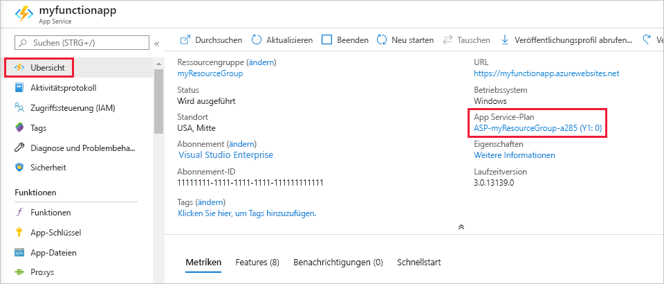

# <a name="azure-functions-scale-and-hosting"></a>Skalierung und Hosting von Azure Functions

Wenn Sie eine Funktions-App in Azure erstellen, müssen Sie einen Hostingplan für die App auswählen. Für Azure Functions gibt es drei grundlegende Hostingpläne: [Verbrauchstarif](#consumption-plan), [Premium-Tarif](#premium-plan) und [Dedicated-Tarif (App Service)](#app-service-plan). Alle Hostingpläne sind sowohl für Linux- als auch für Windows-VMs allgemein verfügbar.

Der von Ihnen gewählte Hostingplan bestimmt folgendes Verhalten:

* Wie Ihre Funktions-App skaliert wird.
* Die für jede Instanz der Funktions-App verfügbaren Ressourcen.
* Die Unterstützung für erweiterte Funktionen wie Azure Virtual Network-Konnektivität

Sowohl beim Verbrauchsplan als auch beim Premium-Plan wird beim Ausführen Ihres Codes automatisch Computeleistung hinzugefügt. Ihre App wird horizontal hochskaliert, wenn dies zur Verarbeitung der Last erforderlich ist, und herunterskaliert, wenn die Codeausführung beendet wurde. Beim Verbrauchsplan müssen Sie außerdem für virtuelle Computer im Leerlauf nichts bezahlen und auch keine Kapazitäten im Voraus reservieren.  

Der Premium-Plan bietet zusätzliche Features wie Premium-Compute-Instanzen, die Möglichkeit, Instanzen unbegrenzt betriebsbereit zu halten, und VNET-Konnektivität.

Mit dem App Service-Plan können Sie eine von Ihnen verwaltete dedizierte Infrastruktur nutzen. Die Skalierung Ihrer Funktions-App basiert nicht auf Ereignissen, d. h., sie wird nie horizontal auf Null herunterskaliert. (Hierzu muss [Always On](#always-on) aktiviert sein.)

Einen detaillierten Vergleich zwischen den verschiedenen Hostingplänen (einschließlich Kubernetes-basiertem Hosting) finden Sie im Abschnitt [Vergleich der Hostingpläne](#hosting-plans-comparison).

## <a name="consumption-plan"></a>Verbrauchsplan

Bei Verwendung des Verbrauchstarifs werden Instanzen des Azure Functions-Hosts dynamisch basierend auf der Anzahl der eingehenden Ereignisse hinzugefügt und entfernt. Dieser serverlose Plan wird automatisch skaliert, sodass Ihnen nur dann Computeressourcen berechnet werden, wenn Ihre Funktionen ausgeführt werden. In einem Verbrauchsplan tritt für eine Funktionsausführung nach einem konfigurierbaren Zeitraum ein Timeout auf.

Die Abrechnung erfolgt auf der Grundlage der Anzahl von Ausführungen, der Ausführungszeit und des verwendeten Arbeitsspeichers. Die Abrechnung wird für alle Funktionen innerhalb einer Funktions-App aggregiert. Weitere Informationen finden Sie unter [Azure Functions – Preise](https://azure.microsoft.com/pricing/details/functions/).

Der Verbrauchsplan ist der Standardhostingplan. Er bietet folgende Vorteile:

* Sie bezahlen nur, wenn Ihre Funktionen ausgeführt werden.
* Das Aufskalieren erfolgt automatisch – selbst in Zeiten hoher Lasten.

Funktions-Apps in derselben Region können demselben Verbrauchsplan zugewiesen werden. Das Ausführen mehrerer Apps im selben Verbrauchsplan hat keine Nachteile oder Auswirkungen. Das Zuweisen mehrerer Apps zum selben Verbrauchsplan hat keine Auswirkungen auf die Stabilität, Skalierbarkeit oder Zuverlässigkeit der einzelnen Apps.

Weitere Informationen zum Schätzen der Kosten bei Ausführung in einem Verbrauchstarif finden Sie unter [Grundlegendes zu Kosten des Verbrauchstarifs](functions-consumption-costs.md).

## <a name="premium-plan"></a><a name="premium-plan"></a>Premium-Plan

Bei Verwendung des Premium-Plans werden Instanzen des Azure Functions-Hosts basierend auf der Anzahl der eingehenden Ereignisse hinzugefügt und entfernt, wie es auch beim Verbrauchsplan der Fall ist.  Der Premium-Plan unterstützt die folgenden Features:

* Ständig betriebsbereite (warme) Instanzen, um jegliche Kaltstarts zu vermeiden
* VNet-Konnektivität
* Unbegrenzte Ausführungsdauer (60 Minuten garantiert)
* Premium-Instanzgrößen (Instanz mit einem Kern, mit zwei Kernen und mit vier Kernen)
* Besser vorhersagbare Preise
* App-Zuteilung mit hoher Dichte für Pläne mit mehreren Funktions-Apps

Informationen zum Erstellen einer Funktions-App in einem Premium-Plan finden Sie unter [Premium-Tarif für Azure Functions](functions-premium-plan.md).

Anstatt pro Ausführung und genutztem Arbeitsspeicher abzurechnen, basiert die Abrechnung für den Premium-Plan auf der Anzahl von Kernsekunden und dem für benötigte und vorab aufgewärmte Instanzen verwendeten Arbeitsspeicher. Pro Plan muss immer mindestens eine Instanz aufgewärmt sein. Dies bedeutet, dass pro aktivem Plan unabhängig von der Anzahl von Ausführungen monatliche Mindestkosten anfallen. Beachten Sie, dass sich alle Funktions-Apps in einem Premium-Plan vorab aufgewärmte und aktive Instanzen teilen.

Ziehen Sie den Premium-Plan für Azure Functions in folgenden Situationen in Betracht:

* Ihre Funktions-Apps werden kontinuierlich oder nahezu kontinuierlich ausgeführt.
* Sie verfügen über eine hohe Anzahl kleiner Ausführungen und haben hohe Ausführungskosten, aber geringe Kosten für Gigabytesekunden im Verbrauchsplan.
* Sie benötigen weitere CPU- oder Arbeitsspeicheroptionen zusätzlich zu den vom Verbrauchsplan bereitgestellten.
* Ihr Code muss länger ausgeführt werden, als im Verbrauchsplan als [maximal zulässige Ausführungsdauer](#timeout) angegeben ist.
* Sie benötigen Features, die nur im Rahmen eines Premium-Plans zur Verfügung stehen, z. B. VNET/VPN-Konnektivität. 

## <a name="dedicated-app-service-plan"></a><a name="app-service-plan"></a>Dedizierter (App Service-)Plan

Ihre Funktions-Apps können auf denselben dedizierten virtuellen Computern wie andere App Service-Apps ausgeführt werden (Basic-, Standard-, Premium- und isolierte SKUs).

Ziehen Sie einen App Service-Plan in folgenden Situationen in Betracht:

* Sie verfügen über nicht ausgelastete virtuelle Computer, auf denen bereits andere App Service-Instanzen ausgeführt werden.
* Sie möchten ein benutzerdefiniertes Image bereitstellen, auf dem Ihre Funktionen ausgeführt werden sollen.

Sie zahlen für Funktions-Apps in einem App Service-Plan das gleiche wie für andere App Service-Ressourcen, etwa Web-Apps. Weitere Informationen zur Funktionsweise von App Service-Plänen finden Sie unter [Azure App Service-Pläne – Detaillierte Übersicht](../app-service/overview-hosting-plans.md).

Mit einem App Service-Plan können Sie manuell aufskalieren, indem Sie weitere Instanzen von virtuellen Computern hinzufügen. Sie können auch die automatische Skalierung aktivieren. Weitere Informationen finden Sie unter [Manuelles oder automatisches Skalieren der Instanzenzahl](../azure-monitor/platform/autoscale-get-started.md?toc=%2fazure%2fapp-service%2ftoc.json). Sie können auch hochskalieren, indem Sie einen anderen App Service-Plan auswählen. Weitere Informationen finden Sie unter [Hochskalieren einer App in Azure](../app-service/manage-scale-up.md). 

Wenn Sie JavaScript-Funktionen im Rahmen eines App Service-Plans ausführen, sollten Sie einen Plan mit weniger vCPUs wählen. Weitere Informationen finden Sie unter [Auswählen von Einzelkern-App Service-Plänen](functions-reference-node.md#choose-single-vcpu-app-service-plans). 
<!-- Note: the portal links to this section via fwlink https://go.microsoft.com/fwlink/?linkid=830855 --> 

Durch Ausführung einer [App Service-Umgebung](../app-service/environment/intro.md) (App Service Environment, ASE) können Sie Ihre Funktionen vollständig isolieren und von einem hohen Maß an Skalierbarkeit profitieren.

### <a name="always-on"></a><a name="always-on"></a> Always On

Wenn Sie einen App Service-Plan verwenden, müssen Sie die Einstellung **Always On** aktivieren, damit Ihre Funktions-App ordnungsgemäß ausgeführt wird. Bei einem App Service-Plan geht die Functions-Runtime nach wenigen Minuten der Inaktivität in den Leerlauf über, sodass nur HTTP-Trigger Ihre Funktionen tatsächlich „reaktivieren“ können. Always On ist nur bei einem App Service-Plan verfügbar. Bei einem Verbrauchsplan aktiviert die Plattform Funktions-Apps automatisch.

[!INCLUDE [Timeout Duration section](../../includes/functions-timeout-duration.md)]


Auch bei aktiviertem Always On wird das Ausführungstimeout für einzelne Funktionen durch die Einstellung `functionTimeout` in der [host.json](functions-host-json.md#functiontimeout)-Projektdatei gesteuert.

## <a name="determine-the-hosting-plan-of-an-existing-application"></a>Ermitteln des Hostingplans einer vorhandenen Anwendung

Wenn Sie den von Ihrer Funktions-App verwendeten Hostingplan ermitteln möchten, sehen Sie im [Azure-Portal](https://portal.azure.com) auf der Registerkarte **Übersicht** für die Funktions-App unter **App Service-Plan** nach. Um den Tarif anzuzeigen, wählen Sie den Namen des **App Service-Plans** aus, und wählen Sie dann **Eigenschaften** im linken Bereich aus.



Sie können auch die Azure-Befehlszeilenschnittstelle verwenden, um den Plan auf folgende Weise zu ermitteln:

```azurecli-interactive
appServicePlanId=$(az functionapp show --name <my_function_app_name> --resource-group <my_resource_group> --query appServicePlanId --output tsv)
az appservice plan list --query "[?id=='$appServicePlanId'].sku.tier" --output tsv
```  

Wenn die Ausgabe dieses Befehls `dynamic` lautet, ist Ihre Funktions-App im Verbrauchsplan enthalten. Wenn die Ausgabe dieses Befehls `ElasticPremium` lautet, ist Ihre Funktions-App im Premium-Plan enthalten. Alle anderen Werte geben verschiedene Stufen eines App Service-Plans an.

## <a name="storage-account-requirements"></a>Anforderungen an das Speicherkonto

Bei jedem Plan erfordert eine Funktions-App ein allgemeines Azure Storage-Konto, das Azure-Blob-, Warteschlangen-, Datei- und Tabellenspeicher unterstützt. Der Grund dafür ist, dass Azure Functions bei Vorgängen wie dem Verwalten von Triggern und Protokollieren von Funktionsausführungen auf Azure Storage basiert, einige Speicherkonten jedoch keine Warteschlangen und Tabellen unterstützen. Diese Konten, zu denen reine Blobspeicherkonten (einschließlich Storage Premium) und allgemeine Speicherkonten mit zonenredundanter Speicherreplikation gehören, werden aus den vorhandenen Auswahlmöglichkeiten für **Speicherkonto** herausgefiltert, wenn Sie eine Funktions-App erstellen.

Dasselbe Speicherkonto, das von ihrer Funktions-App verwendet wird, kann auch von Ihren Triggern und Bindungen verwendet werden, um Ihre Anwendungsdaten zu speichern. Für speicherintensive Vorgänge sollten Sie jedoch ein gesondertes Speicherkonto verwenden.  

Es ist möglich, dass mehrere Funktions-Apps dasselbe Speicherkonto ohne Probleme gemeinsam nutzen. (Ein gutes Beispiel hierfür ist, wenn Sie in Ihrer lokalen Umgebung mehrere Apps mit dem Azure Storage Emulator entwickeln, der wie ein Speicherkonto fungiert.) 

<!-- JH: Does using a Premium Storage account improve perf? -->

Weitere Informationen zu Speicherkontentypen finden Sie unter [Einführung in die Azure Storage-Dienste](../storage/common/storage-introduction.md#core-storage-services).

## <a name="how-the-consumption-and-premium-plans-work"></a>Funktionsweise von Verbrauchsplan (Verbrauchstarif) und Premium-Plan

Im Verbrauchsplan und im Premium-Plan skaliert die Azure Functions-Infrastruktur CPU- und Arbeitsspeicherressourcen automatisch, indem dem Functions-Host basierend auf der Anzahl der Ereignisse, nach denen die Funktionen ausgelöst werden, weitere Instanzen hinzugefügt werden. Jede Instanz des Functions-Hosts im Verbrauchsplan ist auf 1,5 GB Arbeitsspeicher und eine CPU beschränkt.  Eine Instanz des Hosts ist die gesamte Funktions-App, d. h., alle Funktionen innerhalb einer Funktions-App verwenden innerhalb einer Instanz dieselbe Ressource und werden gleichzeitig skaliert. Funktions-Apps, die den gleichen Verbrauchsplan nutzen, werden unabhängig voneinander skaliert.  Im Premium-Plan bestimmt Ihre Plangröße den verfügbaren Arbeitsspeicher und die verfügbare CPU für alle Apps in diesem Plan für diese Instanz.  

Funktionscodedateien werden in Azure Files-Freigaben im Hauptspeicherkonto der Funktion gespeichert. Wenn Sie das Hauptspeicherkonto der Funktions-App löschen, werden die Funktionscodedateien gelöscht und können nicht wiederhergestellt werden.

### <a name="runtime-scaling"></a>Laufzeitskalierung

Azure Functions verwendet die Komponente *Skalierungscontroller*, um die Rate der Ereignisse zu überwachen und zu bestimmen, ob eine Auf- oder Abskalierung erforderlich ist. Der Skalierungscontroller verwendet Heuristik für jeden Triggertyp. Bei Verwendung eines Triggers für Azure Queue Storage beispielsweise basieren die Skalen auf der Länge der Warteschlange und dem Alter der ältesten Nachricht in der Warteschlange.

Die Skalierungseinheit für Azure Functions ist die Funktions-App. Bei einer horizontalen Hochskalierung der Funktions-App werden zusätzliche Ressourcen zugeordnet, um mehrere Instanzen des Azure Functions-Hosts auszuführen. Umgekehrt entfernt der Skalierungscontroller bei abnehmenden Computeanforderungen Instanzen des Functions-Hosts. Die Anzahl von Instanzen wird schließlich *zentral auf null herunterskaliert*, wenn in einer Funktions-App keine Funktionen ausgeführt werden.


### <a name="cold-start"></a>Kaltstart

Wenn sich Ihre Funktions-App einige Minuten im Leerlauf befunden hat, skaliert die Plattform möglicherweise die Anzahl von Instanzen, auf denen Ihre App ausgeführt wird, auf 0. Bei der nächsten Anforderung kommt eine zusätzliche Latenz für die Skalierung von 0 auf 1 zum Tragen. Diese Latenz wird als _Kaltstart_ bezeichnet. Die Anzahl von Abhängigkeiten, die von Ihrer Funktions-App geladen werden müssen, kann sich auf die Dauer des Kaltstarts auswirken. Bei synchronen Vorgängen wie beispielsweise HTTP-Triggern, die eine Antwort zurückgeben müssen, ist ein Kaltstart ein größeres Problem. Wenn Kaltstarts Ihre Funktionen beeinträchtigen, sollten Sie die Ausführung in einem Premium-Plan oder einem Dedicated-Plan mit aktivierter Always-On-Funktionalität in Erwägung ziehen.   

### <a name="understanding-scaling-behaviors"></a>Grundlegendes zum Verhalten von Skalierungen

Die Skalierung variiert ausgehend von verschiedenen Faktoren, und die Skalierung ist je nach dem ausgewählten Auslöser und der Sprache unterschiedlich. Es gibt einige Feinheiten des Skalierungsverhaltens, die zu beachten sind:

* Eine einzelne Funktions-App wird maximal auf 200 Instanzen erweitert. Eine einzelne Instanz kann mehrere Meldungen oder Anforderungen gleichzeitig verarbeiten, weshalb es keine Grenze für die Anzahl gleichzeitiger Ausführungen gibt.  Sie können [ein niedrigeres Maximum angeben](#limit-scale-out), um die Skalierung nach Bedarf zu drosseln.
* Bei HTTP-Triggern werden neue Instanzen höchstens einmal pro Sekunde zugeordnet.
* Bei Nicht-HTTP-Triggern werden neue Instanzen höchstens einmal alle 30 Sekunden zugeordnet. Die Skalierung ist schneller, wenn sie in einem [Premium-Plan](#premium-plan) ausgeführt wird.
* Verwenden Sie für Service Bus-Trigger _Verwaltungsrechte_ für Ressourcen, um eine möglichst effiziente Skalierung zu erreichen. Mit _Lauschrechten_ ist die Skalierung unpräziser, da die Warteschlangenlänge nicht in Skalierungsentscheidungen einbezogen werden kann. Weitere Informationen zum Festlegen von Berechtigungen in Service Bus-Zugriffsrichtlinien finden Sie unter [SAS-Autorisierungsrichtlinien](../service-bus-messaging/service-bus-sas.md#shared-access-authorization-policies).
* Informationen zu Event Hub-Triggern finden Sie im Referenzartikel im [Skalierungsleitfaden](functions-bindings-event-hubs-trigger.md#scaling). 

### <a name="limit-scale-out"></a>Begrenzen des horizontalen Hochskalierens

Möglicherweise möchten Sie die Anzahl der Instanzen einschränken, auf die eine App horizontal hochskaliert wird.  Dies ist am häufigsten der Fall, wenn der Durchsatz einer Downstreamkomponente wie einer Datenbank begrenzt ist.  Standardmäßig werden die Funktionen des Verbrauchsplans auf bis zu 200 Instanzen horizontal hochskaliert, und Premium-Planfunktionen werden auf bis zu 100 Instanzen horizontal hochskaliert.  Sie können einen niedrigeren Höchstwert für eine bestimmte App angeben, indem Sie den `functionAppScaleLimit`-Wert ändern.  Der `functionAppScaleLimit`-Wert kann auf 0 (null) oder NULL festgelegt werden, wenn keine Einschränkungen erforderlich sind, oder auf einen gültigen Wert zwischen 1 und dem App-Maximum.

```azurecli
az resource update --resource-type Microsoft.Web/sites -g <resource_group> -n <function_app_name>/config/web --set properties.functionAppScaleLimit=<scale_limit>
```

### <a name="best-practices-and-patterns-for-scalable-apps"></a>Bewährte Methoden und Muster für skalierbare Apps

Es gibt viele Aspekte einer Funktions-App, die sich auf die Skalierung auswirken. Dazu zählen beispielsweise die Hostkonfiguration, der Runtimespeicherbedarf und die Ressourceneffizienz.  Weitere Informationen finden Sie im [Abschnitt zur Skalierbarkeit im Artikel zum Thema Leistung](functions-best-practices.md#scalability-best-practices). Sie sollten auch das Verhalten von Verbindungen beim Skalieren Ihrer Funktions-App beachten. Weitere Informationen finden Sie unter [How to manage connections in Azure Functions](manage-connections.md) (Verwalten von Verbindungen in Azure Functions).

Weitere Informationen zum Skalieren in Python und Node.js finden Sie unter [Python-Entwicklerhandbuch für Azure Functions: Skalierung und Parallelität](functions-reference-python.md#scaling-and-concurrency) und [Node.js-Entwicklerhandbuch für Azure Functions: Skalierung und Parallelität](functions-reference-node.md#scaling-and-concurrency).

### <a name="billing-model"></a>Abrechnungsmodell

Die Abrechnung für die verschiedenen Pläne ist detailliert auf der [Preisseite für Azure Functions](https://azure.microsoft.com/pricing/details/functions/) beschrieben. Der Verbrauch wird auf Ebene der Funktions-App zusammengefasst, wobei nur die Zeit gezählt wird, für die der Funktionscode ausführt wurde. Folgende Einheiten werden für die Abrechnung verwendet:

* **Ressourcenverbrauch in Gigabytesekunden (GB-s)** – berechnet als Kombination aus Arbeitsspeichergröße und Ausführungsdauer für alle Funktionen in einer Funktions-App. 
* **Ausführungen** – werden bei jeder Ausführung einer Funktion als Antwort auf einen Ereignisauslöser gezählt.

Nützliche Fragen und Informationen zum Verständnis Ihrer Verbrauchsrechnung finden Sie [in den häufig gestellten Fragen zur Abrechnung](https://github.com/Azure/Azure-Functions/wiki/Consumption-Plan-Cost-Billing-FAQ).

[Azure Functions pricing page]: https://azure.microsoft.com/pricing/details/functions

## <a name="hosting-plans-comparison"></a>Vergleich der Hostingpläne

Die folgende Vergleichstabelle zeigt alle wichtigen Aspekte, um Sie bei der Entscheidung für einen Hostingplan für Azure Functions-Apps zu unterstützen:

### <a name="plan-summary"></a>Planzusammenfassung
| | |
| --- | --- |  
|**[Verbrauchsplan](#consumption-plan)**| Skalieren Sie Ihre Computeressourcen automatisch, und zahlen Sie nur dann für diese Ressourcen, wenn Ihre Funktionen tatsächlich ausgeführt werden. Im Verbrauchsplan werden Instanzen des Functions-Hosts basierend auf der Anzahl von eingehenden Ereignissen dynamisch hinzugefügt und entfernt.<br/> ✔ Standardhostingplan.<br/>✔ Sie bezahlen nur, wenn Ihre Funktionen ausgeführt werden.<br/>✔ Die Aufskalierung erfolgt automatisch – selbst in Zeiten hoher Auslastungen.|  
|**[Premium-Plan](#premium-plan)**|In diesem Plan werden Ressourcen automatisch nach Bedarf skaliert. Nutzen Sie vorab aufgewärmte (also betriebsbereite) Worker, um Anwendungen nach einem Leerlauf ohne jede Verzögerung auszuführen, profitieren Sie von leistungsstärkeren Instanzen für die Ausführung, und stellen Sie Verbindungen mit virtuellen Netzwerken her. Der Premium-Plan für Azure Functions bietet alle Features des App Service-Plans und eignet sich zusätzlich für die folgenden Situationen: <br/>✔ Ihre Funktions-Apps werden kontinuierlich oder nahezu kontinuierlich ausgeführt.<br/>✔ Sie verfügen über eine hohe Anzahl kleiner Ausführungen und haben hohe Ausführungskosten, aber geringe Kosten für Gigabytesekunden im Verbrauchsplan.<br/>✔ Sie benötigen weitere CPU- oder Arbeitsspeicheroptionen zusätzlich zu den vom Verbrauchsplan bereitgestellten.<br/>✔ Ihr Code muss länger ausgeführt werden, als im Verbrauchsplan als maximal zulässige Ausführungsdauer angegeben ist.<br/>✔ Sie benötigen Features, die nur im Rahmen eines Premium-Plans zur Verfügung stehen, z. B. VNET-Konnektivität.|  
|**[Dedicated-Plan](#app-service-plan)** <sup>1</sup>|Führen Sie Ihre Funktionen in einem App Service-Plan zu den regulären Preisen dieses Plans aus. Diese Option ist gut geeignet für zeitintensive Vorgänge sowie für Anforderungen an eine bessere Vorhersagbarkeit für Skalierung und Kosten. Ziehen Sie einen App Service-Plan in folgenden Situationen in Betracht:<br/>✔ Sie verfügen über nicht ausgelastete virtuelle Computer, auf denen bereits andere App Service-Instanzen ausgeführt werden.<br/>✔ Sie möchten ein benutzerdefiniertes Image bereitstellen, auf dem Ihre Funktionen ausgeführt werden sollen.|  
|**[ASE](#app-service-plan)** <sup>1</sup>|Die App Service-Umgebung (App Service Environment, ASE) ist ein App Service-Feature, das eine vollständig isolierte und dedizierte Umgebung zur sicheren Ausführung von App Service-Apps in großem Maßstab bereitstellt. App Service-Umgebungen eignen sich ideal für Anwendungsworkloads mit folgenden Anforderungen: <br/>✔ Sehr großer Umfang.<br/>✔ Isolierung und sicherer Netzwerkzugriff.<br/>✔ Hohe Arbeitsspeicherauslastung.|  
| **[Kubernetes](functions-kubernetes-keda.md)** | Kubernetes bietet eine vollständig isolierte und dedizierte Umgebung, die auf der Kubernetes-Plattform aufsetzt.  Kubernetes eignet sich für Anwendungsworkloads mit folgenden Anforderungen: <br/>✔ Benutzerdefinierte Hardwareanforderungen.<br/>✔ Isolierung und sicherer Netzwerkzugriff.<br/>✔ Möglichkeit zur Ausführung in Hybrid- oder Multicloudumgebungen.<br/>✔ Parallele Ausführung mit vorhandenen Kubernetes-Anwendungen und -Diensten.|  

<sup>1</sup> Spezifische Grenzwerte für die verschiedenen Optionen des App Service-Plans finden Sie unter [Grenzwerte für App Service-Pläne](../azure-resource-manager/management/azure-subscription-service-limits.md#app-service-limits).

### <a name="operating-systemruntime"></a>Betriebssystem/Runtime

| | Linux<sup>1</sup><br/>Nur Code | Windows<sup>2</sup><br/>Nur Code | Linux<sup>1,3</sup><br/>Docker-Container |
| --- | --- | --- | --- |
| **[Verbrauchsplan](#consumption-plan)** | .NET Core<br/>Node.js<br/>Java<br/>Python | .NET Core<br/>Node.js<br/>Java<br/>PowerShell Core | Keine Unterstützung  |
| **[Premium-Plan](#premium-plan)** | .NET Core<br/>Node.js<br/>Java<br/>Python|.NET Core<br/>Node.js<br/>Java<br/>PowerShell Core |.NET Core<br/>Node.js<br/>Java<br/>PowerShell Core<br/>Python  | 
| **[Dedicated-Plan](#app-service-plan)** <sup>4</sup> | .NET Core<br/>Node.js<br/>Java<br/>Python|.NET Core<br/>Node.js<br/>Java<br/>PowerShell Core |.NET Core<br/>Node.js<br/>Java<br/>PowerShell Core<br/>Python |
| **[ASE](#app-service-plan)** <sup>4</sup> | .NET Core<br/>Node.js<br/>Java<br/>Python |.NET Core<br/>Node.js<br/>Java<br/>PowerShell Core  |.NET Core<br/>Node.js<br/>Java<br/>PowerShell Core<br/>Python | 
| **[Kubernetes](functions-kubernetes-keda.md)** | – | – |.NET Core<br/>Node.js<br/>Java<br/>PowerShell Core<br/>Python |

<sup>1</sup>Linux ist das einzige unterstützte Betriebssystem für den Python-Runtimestapel.  
<sup>2</sup>Windows ist das einzige unterstützte Betriebssystem für den PowerShell-Runtimestapel.   
<sup>3</sup>Linux ist das einzige unterstützte Betriebssystem für Docker-Container.
<sup>4</sup>Spezifische Grenzwerte für die verschiedenen Optionen des App Service-Plans finden Sie unter [App Service-Grenzwerte](../azure-resource-manager/management/azure-subscription-service-limits.md#app-service-limits).

### <a name="scale"></a>Skalieren

| | Aufskalieren | Maximale Anzahl Instanzen |
| --- | --- | --- |
| **[Verbrauchsplan](#consumption-plan)** | Ereignisgesteuert. Das Aufskalieren erfolgt automatisch – selbst in Zeiten hoher Lasten. Die Azure Functions-Infrastruktur skaliert CPU- und Arbeitsspeicherressourcen durch Hinzufügen zusätzlicher Instanzen des Functions-Hosts basierend auf der Anzahl der Ereignisse, für die Funktionen ausgelöst werden. | 200 |
| **[Premium-Plan](#premium-plan)** | Ereignisgesteuert. Das Aufskalieren erfolgt automatisch – selbst in Zeiten hoher Lasten. Die Azure Functions-Infrastruktur skaliert CPU- und Arbeitsspeicherressourcen durch Hinzufügen zusätzlicher Instanzen des Functions-Hosts basierend auf der Anzahl der Ereignisse, für die Funktionen ausgelöst werden. |100|
| **[Dedicated-Plan](#app-service-plan)** <sup>1</sup> | Manuelle Skalierung/Autoskalierung |10 – 20|
| **[ASE](#app-service-plan)** <sup>1</sup> | Manuelle Skalierung/Autoskalierung |100 |
| **[Kubernetes](functions-kubernetes-keda.md)**  | Ereignisgesteuerte Autoskalierung für Kubernetes-Cluster über [KEDA](https://keda.sh). | Variiert je&nbsp;nach&nbsp;Cluster.&nbsp;&nbsp;|

<sup>1</sup> Spezifische Grenzwerte für die verschiedenen Optionen des App Service-Plans finden Sie unter [Grenzwerte für App Service-Pläne](../azure-resource-manager/management/azure-subscription-service-limits.md#app-service-limits).

### <a name="cold-start-behavior"></a>Kaltstartverhalten

|    |    | 
| -- | -- |
| **[Verbrauchsplan](#consumption-plan)** | Apps werden möglicherweise nach einer bestimmten Leerlaufzeit auf 0 skaliert, wodurch bei einigen Anforderungen die Latenz beim Start steigen kann.  Der Verbrauchsplan bietet einige Optimierungen, um die Kaltstartzeit zu verkürzen, beispielsweise den Abruf von vorab aufgewärmten (betriebsbereiten) Platzhalterfunktionen, für die bereits der Funktionshost und die Sprachprozesse ausgeführt werden. |
| **[Premium-Plan](#premium-plan)** | Ständig betriebsbereite (warme) Instanzen, um jegliche Kaltstarts zu vermeiden. |
| **[Dedicated-Plan](#app-service-plan)** <sup>1</sup> | In einem Dedicated-Plan kann der Functions-Host kontinuierlich ausgeführt werden, sodass ein Kaltstart kein Problem darstellt. |
| **[ASE](#app-service-plan)** <sup>1</sup> | In einem Dedicated-Plan kann der Functions-Host kontinuierlich ausgeführt werden, sodass ein Kaltstart kein Problem darstellt. |
| **[Kubernetes](functions-kubernetes-keda.md)**  | Richtet sich nach der KEDA-Konfiguration. Apps können für die ständige Ausführung konfiguriert sein, sodass keine Kaltstarts auftreten. Apps können auch so konfiguriert sein, dass sie auf 0 skaliert werden können, wodurch bei neuen Ereignissen ein Kaltstart notwendig wird. 

<sup>1</sup> Spezifische Grenzwerte für die verschiedenen Optionen des App Service-Plans finden Sie unter [Grenzwerte für App Service-Pläne](../azure-resource-manager/management/azure-subscription-service-limits.md#app-service-limits).

### <a name="service-limits"></a>Diensteinschränkungen

[!INCLUDE [functions-limits](../../includes/functions-limits.md)]

### <a name="networking-features"></a>Netzwerkfeatures

[!INCLUDE [functions-networking-features](../../includes/functions-networking-features.md)]

### <a name="billing"></a>Abrechnung

| | | 
| --- | --- |
| **[Verbrauchsplan](#consumption-plan)** | Sie bezahlen nur für die Zeit, in der Ihre Funktionen ausgeführt werden. Die Abrechnung erfolgt auf der Grundlage der Anzahl von Ausführungen, der Ausführungszeit und des verwendeten Arbeitsspeichers. |
| **[Premium-Plan](#premium-plan)** | Die Abrechnung für den Premium-Plan basiert auf der Anzahl von Kernsekunden und dem für benötigte und vorab aufgewärmte Instanzen verwendeten Arbeitsspeicher. Pro Plan muss immer mindestens eine Instanz aufgewärmt sein. Dieser Plan bietet besser vorhersagbare Preise. |
| **[Dedicated-Plan](#app-service-plan)** <sup>1</sup> | Sie zahlen für Funktions-Apps in einem App Service-Plan das gleiche wie für andere App Service-Ressourcen, etwa Web-Apps.|
| **[ASE](#app-service-plan)** <sup>1</sup> | Es gibt eine monatliche Pauschalgebühr für eine ASE, mit der die Infrastruktur abgedeckt ist und die sich nicht mit der Größe der ASE ändert. Darüber hinaus fallen Kosten pro vCPU im App Service-Plan an. Alle in einer ASE gehosteten Apps befinden sich in der isolierten Preis-SKU. |
| **[Kubernetes](functions-kubernetes-keda.md)**| Sie zahlen nur die Kosten für Ihren Kubernetes-Cluster, keine zusätzlichen Gebühren für Functions. Ihre Funktions-App wird als Anwendungsworkload in Ihrem Cluster ausgeführt, genau wie eine ganz normale App. |

<sup>1</sup> Spezifische Grenzwerte für die verschiedenen Optionen des App Service-Plans finden Sie unter [Grenzwerte für App Service-Pläne](../azure-resource-manager/management/azure-subscription-service-limits.md#app-service-limits).

## <a name="next-steps"></a>Nächste Schritte

+ [Schnellstart: Erstellen eines Azure Functions-Projekts mit Visual Studio Code](functions-create-first-function-vs-code.md)
+ [Bereitstellungstechnologien in Azure Functions](functions-deployment-technologies.md) 
+ [Azure Functions: Entwicklerhandbuch](functions-reference.md)
