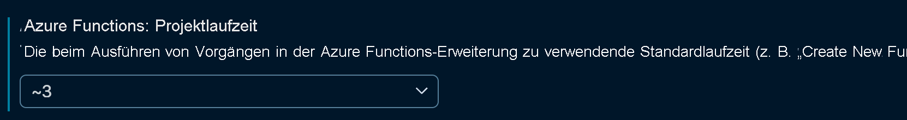

# <a name="azure-functions-runtime-versions-overview"></a>Übersicht über die Runtimeversionen von Azure Functions

Die Hauptversionen der Azure Functions-Runtime sind mit der Version von .NET verknüpft, auf der die Runtime basiert. In der folgenden Tabelle sind die aktuelle Version der Runtime, die Releaseebene und die zugehörige .NET-Version angegeben. 

| Laufzeitversion | Releaseebene<sup>1</sup> | .NET-Version | 
| --------------- | ------------- | ------------ |
| 3.x | Allgemein verfügbar | .NET Core 3.1 | 
| 2.x | Allgemein verfügbar | .NET Core 2.2 |
| 1.x | Allgemeine Verfügbarkeit<sup>2</sup> | .NET Framework 4.6<sup>3</sup> |

<sup>1</sup> GA-Releases werden für Produktionsszenarien unterstützt.   
<sup>2</sup> Die Version 1.x befindet sich im Wartungsmodus. Erweiterungen werden nur in höheren Versionen bereitgestellt.   
<sup>3</sup> Unterstützt nur die Entwicklung im Azure-Portal oder lokal auf Windows-Computern.

In diesem Artikel werden einige Unterschiede zwischen den verschiedenen Versionen, das Erstellen der einzelnen Versionen und das Ändern von Versionen erläutert.

## <a name="languages"></a>Languages

Ab Version 2.x verwendet die Runtime ein Modell für die Erweiterbarkeit von Sprachen, und alle Funktionen in einer Funktions-App müssen dieselbe Sprache aufweisen. Die Sprache der Funktionen in einer Funktions-App wird beim Erstellen der App ausgewählt und in der Einstellung [FUNCTIONS\_WORKER\_RUNTIME](functions-app-settings.md#functions_worker_runtime) beibehalten. 

Experimentelle Sprachen von Azure Functions 1.x verwenden das neue Modell nicht und werden daher in 2.x nicht unterstützt. Die folgende Tabelle zeigt, welche Programmiersprachen derzeit in den einzelnen Runtimeversionen unterstützt werden.

[!INCLUDE [functions-supported-languages](../../includes/functions-supported-languages.md)]

Weitere Informationen finden Sie unter [Unterstützte Sprachen](supported-languages.md).

## <a name="creating-1x-apps"></a>Ausführen auf einer spezifischen Version

Im Azure-Portal und durch die Azure CLI erstellte Funktions-Apps sind standardmäßig auf Version 2.x festgelegt. Diese Version kann bei Bedarf geändert werden. Die Runtimeversion kann nur in 1.x geändert werden, wenn Sie Ihre Funktions-App erstellt, aber noch keine Funktionen hinzugefügt haben.  Der Wechsel zwischen 2.x und 3.x ist auch bei Apps möglich, die bereits über Funktionen verfügen. Es empfiehlt sich allerdings trotzdem, zuerst einen Test in einer neuen App durchzuführen.

## <a name="migrating-from-1x-to-later-versions"></a>Migrieren von 1.x zu neueren Versionen

Eine vorhandene App, die für die Runtimeversion 1.x geschrieben wurde, kann zu einer neueren Version migriert werden. Die meisten erforderlichen Änderungen hängen mit der Sprachruntime zusammen – also beispielsweise C#-API-Änderungen zwischen .NET Framework 4.7 und .NET Core. Sie müssen auch sicherstellen, dass Ihr Code und Ihre Bibliotheken mit den ausgewählten Sprachruntimes kompatibel sind. Beachten Sie nicht zuletzt auch die unten genannten Änderungen an Triggern, Bindungen und Funktionen. Um ein optimales Migrationsergebnis zu erzielen, sollten Sie eine neue Funktions-App in einer neuen Version erstellen und Ihren vorhandenen Funktionscode der Version 1.x zur neuen App portieren.  

Es besteht zwar die Möglichkeit eines direkten Upgrades durch manuelles Aktualisieren der App-Konfiguration, die Umstellung von 1.x auf eine höhere Version beinhaltet jedoch einige Breaking Changes. In C# ändert sich beispielsweise das Debuggingobjekt von `TraceWriter` in `ILogger`. Durch die Erstellung eines neuen Projekts mit der Version 3.x stehen die aktualisierten Funktionen auf der Grundlage der neuesten Vorlagen der Version 3.x zur Verfügung.

### <a name="changes-in-triggers-and-bindings-after-version-1x"></a>Änderungen bei Triggern und Bindungen nach der Version 1.x

Ab der Version 2.x müssen die Erweiterungen für bestimmte Trigger und Bindungen installiert werden, die von den Funktionen in Ihrer App verwendet werden. Die einzigen Ausnahmen sind HTTP- und Timertrigger, für die keine Erweiterung erforderlich ist.  Weitere Informationen finden Sie unter [Registrieren und Installieren von Bindungserweiterungen](./functions-bindings-register.md).

Zwischen den Versionen gibt es auch einige Änderungen an der Datei *function.json* sowie an Attributen der Funktion. Die Event Hub-Eigenschaft `path` beispielsweise lautet jetzt `eventHubName`. Links zur Dokumentation für die einzelnen Bindungen finden Sie in der [Tabelle der vorhandenen Bindungen](#bindings).

### <a name="changes-in-features-and-functionality-after-version-1x"></a>Änderungen bei Features und Funktionen nach der Version 1.x

Einige Features wurden nach der Version 1.x entfernt, aktualisiert oder ersetzt. In diesem Abschnitt werden die Änderungen nach der Version 1.x erläutert.

In Version 2.x wurden die folgenden Änderungen vorgenommen:

* Schlüssel für aufrufende HTTP-Endpunkte werden immer verschlüsselt in Azure Blob Storage gespeichert. In Version 1.x wurden die Schlüssel standardmäßig in Azure File Storage gespeichert. Beim Durchführen eines Upgrades für eine App von Version 1.x auf Version 2.x werden vorhandene Geheimnisse, die sich in File Storage befinden, zurückgesetzt.

* Version 2.x der Runtime umfasst keine integrierte Unterstützung für Webhookanbieter. Diese Änderung wurde vorgenommen, um die Leistung zu verbessern. Sie können weiterhin HTTP-Trigger als Endpunkte für Webhooks verwenden.

* Die Hostkonfigurationsdatei (host.json) muss leer sein oder die Zeichenfolge `"version": "2.0"` enthalten.

* Zur Verbesserung der Überwachung wurde das WebJobs-Dashboard im Portal, das die Einstellung [`AzureWebJobsDashboard`](functions-app-settings.md#azurewebjobsdashboard) verwendete, durch Azure Application Insights ersetzt – hierbei wird die Einstellung [`APPINSIGHTS_INSTRUMENTATIONKEY`](functions-app-settings.md#appinsights_instrumentationkey) verwendet. Weitere Informationen finden Sie unter [Überwachen von Azure Functions](functions-monitoring.md).

* Alle Funktionen in einer Funktions-App müssen die gleiche Sprache verwenden. Wenn Sie eine Funktions-App erstellen, müssen Sie einen Runtimestapel für die App auswählen. Der Runtimestapel wird durch den [`FUNCTIONS_WORKER_RUNTIME`](functions-app-settings.md#functions_worker_runtime)-Wert in den Anwendungseinstellungen angegeben. Diese Anforderung wurde hinzugefügt, um den Speicherbedarf und die Startzeit zu verbessern. Bei der lokalen Entwicklung müssen Sie diese Einstellung auch in die [Datei „local.settings.json“](functions-run-local.md#local-settings-file) einschließen.

* Das Standardzeitlimit für Funktionen in einem App Service-Plan wurde zu 30 Minuten geändert. Sie können das Zeitlimit mit der [functionTimeout](functions-host-json.md#functiontimeout)-Einstellung in der host.json-Datei manuell wieder zu „unbegrenzt“ ändern.

* HTTP-Parallelitätsdrosselungen sind standardmäßig für Verbrauchsplanfunktionen implementiert. Der Standardwert beträgt 100 gleichzeitige Anforderungen pro Instanz. Sie können diesen Wert in der [`maxConcurrentRequests`](functions-host-json.md#http)-Einstellung in der host.json-Datei ändern.

* Aufgrund der [Einschränkungen von .NET Core](https://github.com/Azure/azure-functions-host/issues/3414) wurde die Unterstützung für F#-Skriptfunktionen (FSX) entfernt. Kompilierte F#-Funktionen (FS) werden weiterhin unterstützt.

* Das URL-Format von Event Grid-Triggerwebhooks wurde zu `https://{app}/runtime/webhooks/{triggerName}` geändert.

## <a name="migrating-from-2x-to-3x"></a>Migrieren von 2.x zu 3.x

Die Azure Functions-Version 3.x bietet eine hohe Abwärtskompatibilität mit der Version 2.x.  Bei vielen Apps sollte problemlos ein Upgrade auf die Version 3.x möglich sein, ohne Codeänderungen vornehmen zu müssen.  Die Migration zur Version 3.x wird zwar empfohlen, trotzdem sollten ausführliche Tests durchgeführt werden, bevor die Hauptversion in Produktions-Apps geändert wird.

### <a name="breaking-changes-between-2x-and-3x"></a>Breaking Changes zwischen 2.x und 3.x

In diesem Abschnitt werden die Änderungen erläutert, die vor einem App-Upgrade von 2.x auf 3.x beachtet werden müssen.

#### <a name="javascript"></a>JavaScript

* Über `context.done` oder Rückgabewerte zugewiesene Ausgabebindungen weisen nun das gleiche Verhalten auf wie die Einstellung in `context.bindings`.

* Das Zeitgebertrigger-Objekt wird im camelCase-Format angegeben (nicht im PascalCase-Format).

* Funktionen, die von Event Hub mit binärem Datentyp (`dataType`) ausgelöst werden, erhalten ein Array vom Typ `binary` (anstelle von `string`).

* Auf die Nutzlast von HTTP-Anforderungen kann nicht mehr über `context.bindingData.req` zugegriffen werden.  Der Zugriff darauf ist aber weiterhin als Eingabeparameter (`context.req`) und in `context.bindings` möglich.

* Node.js 8 wird nicht mehr unterstützt und in Funktionen der Version 3.x nicht ausgeführt.

#### <a name="net"></a>.NET

* [Synchrone Servervorgänge sind standardmäßig deaktiviert.](https://docs.microsoft.com/dotnet/core/compatibility/2.2-3.0#http-synchronous-io-disabled-in-all-servers)

### <a name="changing-version-of-apps-in-azure"></a>Ändern der Version von Apps in Azure

Welche Version der Functions-Runtime von veröffentlichten Apps in Azure verwendet wird, wird durch die [`FUNCTIONS_EXTENSION_VERSION`](functions-app-settings.md#functions_extension_version)-Anwendungseinstellung bestimmt. Für die Hauptversion der Runtime werden folgende Werte unterstützt:

| value | Runtimeziel |
| ------ | -------- |
| `~3` | 3.x |
| `~2` | 2.x |
| `~1` | 1.x |

>[!IMPORTANT]
> Ändern Sie diese Einstellung mit Bedacht, da hierdurch unter Umständen weitere Änderungen an App-Einstellungen und Ihrem Funktionscode nötig werden.

### <a name="locally-developed-application-versions"></a>Lokal entwickelte Anwendungsversionen

Sie können folgende Aktualisierungen für Funktions-Apps vornehmen, um die Zielversionen lokal zu ändern.

#### <a name="visual-studio-runtime-versions"></a>Visual Studio-Runtimeversionen

In Visual Studio wählen Sie die Runtimeversion beim Erstellen eines Projekts aus. Azure Functions-Tools für Visual Studio unterstützen die drei Hauptversionen der Runtime. Beim Debuggen und Veröffentlichen wird die richtige Version verwendet, basierend auf den Projekteinstellungen. Die Versionseinstellungen sind in der `.csproj`-Datei in den folgenden Einstellungen definiert:

##### <a name="version-1x"></a>Version 1.x

```xml
<TargetFramework>net461</TargetFramework>
<AzureFunctionsVersion>v1</AzureFunctionsVersion>
```

##### <a name="version-2x"></a>Version 2.x

```xml
<TargetFramework>netcoreapp2.1</TargetFramework>
<AzureFunctionsVersion>v2</AzureFunctionsVersion>
```

##### <a name="version-3x"></a>Version 3.x

```xml
<TargetFramework>netcoreapp3.1</TargetFramework>
<AzureFunctionsVersion>v3</AzureFunctionsVersion>
```

> [!NOTE]
> Für Azure Functions 3.x und .NET muss die `Microsoft.NET.Sdk.Functions` Erweiterung mindestens die Version `3.0.0` haben.

###### <a name="updating-2x-apps-to-3x-in-visual-studio"></a>Aktualisieren von Apps der Version 2.x auf die Version 3.x in Visual Studio

Sie können eine bereits vorhandene, für die Version 2.x konzipierte Funktion öffnen und zu 3.x migrieren, indem Sie die Datei `.csproj` bearbeiten und die obigen Werte aktualisieren.  Visual Studio verwaltet Runtimeversionen automatisch auf der Grundlage der Projektmetadaten.  Sollten Sie allerdings bislang noch keine App der Version 3.x erstellt haben, kann es sein, dass Visual Studio auf Ihrem Computer noch nicht über die Vorlagen und die Runtime für die Version 3.x verfügt.  In diesem Fall tritt ggf. ein Fehler wie der folgende auf: „Es ist keine Functions-Laufzeit verfügbar, die der im Projekt angegebenen Version entspricht.“  Führen Sie die Schritte zum Erstellen eines neuen Funktionsprojekts aus, um die neuesten Vorlagen und die Runtime abzurufen.  Wenn Sie zum Auswahlbildschirm für die Version und die Vorlage gelangen, warten Sie, bis Visual Studio die neuesten Vorlagen abgerufen hat.  Wenn die neuesten .NET Core 3-Vorlagen verfügbar sind und angezeigt werden, können Sie jedes beliebige Projekt ausführen und debuggen, das für die Version 3.x konfiguriert wurde.

> [!IMPORTANT]
> Funktionen der Version 3.x können nur in Visual Studio entwickelt werden, wenn Sie mindestens die Visual Studio Version 16.4 verwenden.

#### <a name="vs-code-and-azure-functions-core-tools"></a>Visual Studio Code und Azure Functions Core Tools

[Azure Functions Core Tools](functions-run-local.md) werden für die Entwicklung über die Befehlszeile und auch von der [Azure Functions-Erweiterung](https://marketplace.visualstudio.com/items?itemName=ms-azuretools.vscode-azurefunctions) für Visual Studio Code verwendet. Wenn Sie für die Version 3.x entwickeln möchten, müssen Sie die Core Tools-Version 3.x installieren. Bei der Entwicklung für die Version 2.x benötigen Sie die Core Tools-Version 2.x. Und so weiter. Weitere Informationen finden Sie unter [Installieren der Azure Functions Core Tools](functions-run-local.md#install-the-azure-functions-core-tools).

Für die Visual Studio Code-Entwicklung müssen Sie möglicherweise auch die Benutzereinstellung für die `azureFunctions.projectRuntime` entsprechend der installierten Version der Tools aktualisieren.  Diese Einstellung aktualisiert auch die Vorlagen und Sprachen, die während der Erstellung von Funktions-Apps verwendet werden.  Wenn Sie Apps in `~3` erstellen möchten, müssen Sie die Benutzereinstellung `azureFunctions.projectRuntime` auf `~3`aktualisieren.



#### <a name="maven-and-java-apps"></a>Maven- und Java-Apps

Sie können Java-Apps der Version 2.x zur Version 3.x migrieren, indem Sie die [Version 3.x von Core Tools installieren](functions-run-local.md#install-the-azure-functions-core-tools), die für die lokale Ausführung benötigt wird.  Nachdem Sie sich vergewissert haben, dass Ihre lokal ausgeführte App unter der Version 3.x ordnungsgemäß funktioniert, können Sie die Datei `POM.xml` der App aktualisieren, um die Einstellung `FUNCTIONS_EXTENSION_VERSION` in `~3` zu ändern, wie im folgenden Beispiel zu sehen:

```xml
<configuration>
    <resourceGroup>${functionResourceGroup}</resourceGroup>
    <appName>${functionAppName}</appName>
    <region>${functionAppRegion}</region>
    <appSettings>
        <property>
            <name>WEBSITE_RUN_FROM_PACKAGE</name>
            <value>1</value>
        </property>
        <property>
            <name>FUNCTIONS_EXTENSION_VERSION</name>
            <value>~3</value>
        </property>
    </appSettings>
</configuration>
```

## <a name="bindings"></a>Bindungen

Ab Version 2.x verwendet die Runtime ein neues [Modell für die Erweiterbarkeit von Bindungen](https://github.com/Azure/azure-webjobs-sdk-extensions/wiki/Binding-Extensions-Overview), das folgende Vorteile bietet:

* Unterstützung für Bindungserweiterungen von Drittanbietern.

* Entkoppeln von Runtime und Bindungen. Mit dieser Änderung können Bindungserweiterungen versioniert und unabhängig freigegeben werden. Sie können z.B. ein Upgrade auf eine Version einer Erweiterung durchführen, das auf einer neueren Version des zugrunde liegenden SDKs basiert.

* Eine schlankere Ausführungsumgebung, in der nur die tatsächlich verwendeten Bindungen bekannt sind und von der Runtime geladen werden.

Mit Ausnahme von HTTP- und Timertriggern müssen alle Bindungen explizit zum Funktions-App-Projekt hinzugefügt oder im Portal registriert werden. Weitere Informationen finden Sie unter [Registrieren von Bindungserweiterungen](./functions-bindings-expressions-patterns.md).

Die folgende Tabelle zeigt, welche Bindungen in den einzelnen Runtimeversionen unterstützt werden.

[!INCLUDE [Full bindings table](../../includes/functions-bindings.md)]

[!INCLUDE [Timeout Duration section](../../includes/functions-timeout-duration.md)]

## <a name="next-steps"></a>Nächste Schritte

Weitere Informationen finden Sie in den folgenden Ressourcen:

* [Lokales Codieren und Testen von Azure Functions](functions-run-local.md)
* [Einstellen von Runtimeversionen von Azure Functions als Ziel](set-runtime-version.md)
* [Versionshinweise](https://github.com/Azure/azure-functions-host/releases)
