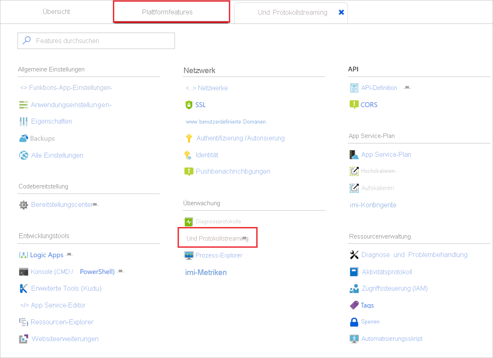

# <a name="enable-streaming-execution-logs-in-azure-functions"></a>Aktivieren des Streamings von Ausführungsprotokollen in Azure Functions

Bei der Anwendungsentwicklung ist es häufig wünschenswert, nahezu in Echtzeit zu sehen, was bei der Ausführung in Azure in die Protokolle geschrieben wird.

Es gibt zwei Möglichkeiten, einen Datenstrom von Protokolldateien anzuzeigen, die bei den Ausführungen Ihrer Funktion generiert werden.

* **Integriertes Protokollstreaming**: Mithilfe der App Service-Plattform können Sie einen Datenstrom Ihrer Anwendungsprotokolldateien einsehen. Dies entspricht der Ausgabe, die beim Debuggen Ihrer Funktionen bei der [lokalen Entwicklung](functions-develop-local.md) oder bei Verwenden der Registerkarte **Test** im Portal zu sehen ist. Alle protokollbasierten Informationen werden angezeigt. Weitere Informationen finden Sie unter [Streamen von Protokollen](../app-service/troubleshoot-diagnostic-logs.md#stream-logs). Diese Streamingmethode unterstützt nur eine einzelne Instanz und kann nicht mit einer App verwendet werden, die unter Linux in einem Verbrauchstarif ausgeführt wird.

* **Live Metrics Stream**: Wenn Ihre Funktions-App [mit Application Insights verbunden](configure-monitoring.md#enable-application-insights-integration) ist, können Sie im Azure-Portal mithilfe von [Live Metrics Stream](../azure-monitor/app/live-stream.md) Protokolldaten und andere Metriken nahezu in Echtzeit anzeigen. Verwenden Sie diese Methode, wenn Sie Funktionen überwachen, die auf mehreren Instanzen oder unter Linux in einem Verbrauchstarif ausgeführt werden. Diese Methode verwendet [Stichprobendaten](configure-monitoring.md#configure-sampling).

Protokolldatenströme können sowohl im Portal als auch in den meisten lokalen Entwicklungsumgebungen eingesehen werden. 

## <a name="portal"></a>Portal

Sie können im Portal beide Arten von Protokolldatenströmen einsehen.

### <a name="built-in-log-streaming"></a>Integriertes Protokollstreaming

Um Streamingprotokolle im Portal anzuzeigen, wählen Sie in Ihrer Funktions-App die Registerkarte **Plattformfeatures** aus. Klicken Sie unter **Überwachung** auf **Protokollstreaming**.



Dadurch wird Ihre App mit dem Protokollstreamingdienst verbunden, woraufhin Anwendungsprotokolle im Fenster angezeigt werden. Sie können zwischen **Anwendungsprotokolle** und **Webserverprotokolle** umschalten.  


### <a name="live-metrics-stream"></a>Live Metrics Stream

Um den Live Metrics Stream für Ihre App anzuzeigen, wählen Sie die Registerkarte **Übersicht** Ihrer Funktions-App aus. Wenn Application Insights aktiviert ist, wird unter **Konfigurierte Features** der Link **Application Insights** angezeigt. Über diesen Link gelangen Sie zur Application Insights-Seite für Ihre App.

Wählen Sie in Application Insights **Live Metrics Stream** aus. [Stichprobenhafte Protokolleinträge](configure-monitoring.md#configure-sampling) werden unter **Beispieltelemetrie** angezeigt.

 

## <a name="visual-studio-code"></a>Visual Studio Code

[!INCLUDE [functions-enable-log-stream-vs-code](../../includes/functions-enable-log-stream-vs-code.md)]

## <a name="core-tools"></a>Kerntools

[!INCLUDE [functions-streaming-logs-core-tools](../../includes/functions-streaming-logs-core-tools.md)]

## <a name="azure-cli"></a>Azure CLI

Sie können Streamingprotokolle mithilfe der [Azure CLI](/cli/azure/install-azure-cli) aktivieren. Verwenden Sie die folgenden Befehle, um sich anzumelden, Ihr Abonnement auszuwählen und Protokolldateien zu streamen:

```azurecli
az login
az account list
az account set --subscription <subscriptionNameOrId>
az webapp log tail --resource-group <RESOURCE_GROUP_NAME> --name <FUNCTION_APP_NAME>
```

## <a name="azure-powershell"></a>Azure PowerShell

Sie können Streamingprotokolle über [Azure PowerShell](/powershell/azure/) aktivieren. Verwenden Sie für PowerShell den Befehl [Set-AzWebApp](/powershell/module/az.websites/set-azwebapp), um Protokollierung für die Funktions-App zu aktivieren, wie im folgenden Codeausschnitt gezeigt: 

:::code language="powershell" source="~/powershell_scripts/app-service/monitor-with-logs/monitor-with-logs.ps1" range="19-20":::

Weitere Informationen finden Sie im [vollständigen Codebeispiel](../app-service/scripts/powershell-monitor.md#sample-script). 

## <a name="next-steps"></a>Nächste Schritte

+ [Überwachen von Azure Functions](functions-monitoring.md)
+ [Analysieren von Azure Functions-Telemetriedaten in Application Insights](analyze-telemetry-data.md)
