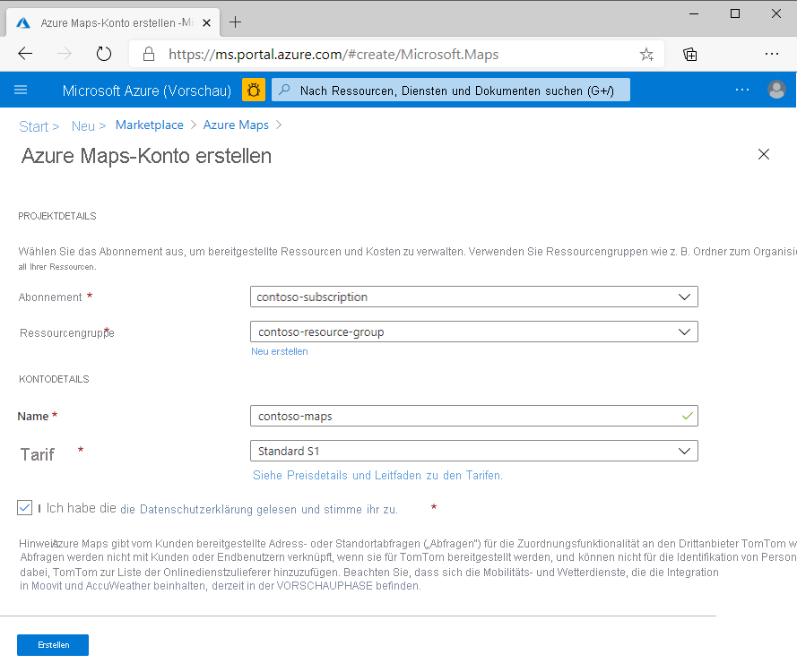
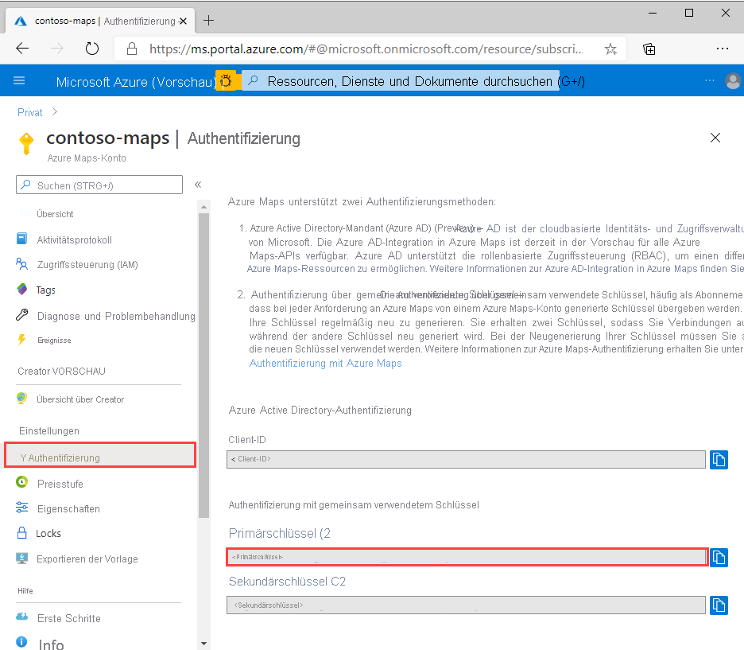
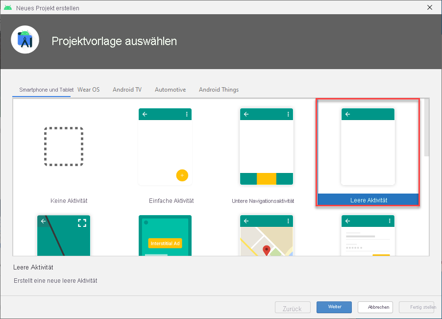
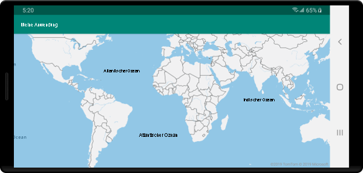

# <a name="quickstart-create-an-android-app-with-azure-maps"></a>Schnellstart: Erstellen einer Android-App mit Azure Maps

In diesem Artikel wird beschrieben, wie Sie Azure Maps einer Android-App hinzufügen. Die folgenden grundlegenden Schritte werden erläutert:

* Einrichten Ihrer Entwicklungsumgebung
* Erstellen eines eigenen Azure Maps-Kontos
* Abrufen Ihres primären Azure Maps-Schlüssels für die Verwendung in der App
* Verweisen auf die Azure Maps-Bibliotheken aus dem Projekt
* Hinzufügen eines Azure Maps-Steuerelements zur App

## <a name="prerequisites"></a>Voraussetzungen

1. Erstellen Sie ein Azure Maps-Konto, indem Sie sich beim [Azure-Portal](https://portal.azure.com) anmelden. Wenn Sie kein Azure-Abonnement besitzen, können Sie ein [kostenloses Konto](https://azure.microsoft.com/free/) erstellen, bevor Sie beginnen.
2. [Erstellen eines Azure Maps-Kontos](quick-demo-map-app.md#create-an-azure-maps-account)
3. [Abrufen eines Primärschlüssels](quick-demo-map-app.md#get-the-primary-key-for-your-account) (auch primärer Schlüssel oder Abonnementschlüssel genannt) Weitere Informationen zur Authentifizierung in Azure Maps finden Sie unter [Verwalten der Authentifizierung in Azure Maps](how-to-manage-authentication.md).
4. Das [Herunterladen von Android Studio](https://developer.android.com/studio/) von der Google-Seite ist kostenlos.

## <a name="create-an-azure-maps-account"></a>Erstellen eines Azure Maps-Kontos

Erstellen Sie mithilfe der folgenden Schritte ein neues Azure Maps-Konto:

1. Klicken Sie im [Azure-Portal](https://portal.azure.com) links oben auf **Ressource erstellen**.
2. Geben Sie im Feld *Marketplace durchsuchen* die Begriffe **Azure Maps** ein.
3. Wählen Sie in den *Ergebnissen* die Option **Azure Maps** aus. Klicken Sie auf die unterhalb der Karte angezeigte Schaltfläche **Erstellen**.
4. Geben Sie auf der Seite **Azure Maps-Konto erstellen** die folgenden Werte ein:
    * *Abonnement*, das Sie für dieses Konto verwenden möchten
    * Name der *Ressourcengruppe* für dieses Konto. Sie können für die Ressourcengruppe die Option *Neu erstellen* oder die Option *Vorhandene verwenden* auswählen.
    * *Name* des neuen Kontos
    * Der *Tarif* für dieses Konto.
    * Lesen Sie die *Lizenzbedingungen* und die *Datenschutzerklärung*, und aktivieren Sie zum Akzeptieren der Bestimmungen das Kontrollkästchen.
    * Klicken Sie auf die Schaltfläche **Erstellen** .

    

## <a name="get-the-primary-key-for-your-account"></a>Abrufen des Primärschlüssels für Ihr Konto

Rufen Sie nach der Erstellung des Maps-Kontos den Primärschlüssel ab, mit dem Sie die Maps-APIs abfragen können.

1. Öffnen Sie Ihr Maps-Konto im Portal.
2. Wählen Sie im Abschnitt „Einstellungen“ die Option **Authentifizierung** aus.
3. Kopieren Sie den **Primärschlüssel** in die Zwischenablage. Speichern Sie ihn lokal zur späteren Verwendung in diesem Tutorial.

>[!NOTE]
> Wenn Sie den Azure-Abonnementschlüssel anstelle des Azure Maps-Primärschlüssels verwenden, wird Ihre Karte nicht richtig gerendert. Außerdem wird aus Sicherheitsgründen empfohlen, dass Sie zwischen Ihrem Primär- und Sekundärschlüssel wechseln. Aktualisieren Sie zur Schlüsselrotation Ihre App, um den Sekundärschlüssel zu verwenden. Stellen Sie dann die App bereit, und drücken Sie die Taste für die Aktualisierung neben dem Primärschlüssel, um einen neuen Primärschlüssel zu generieren. Der alte Primärschlüssel wird deaktiviert. Weitere Informationen zur Schlüsselrotation finden Sie unter [Einrichten von Azure Key Vault mit Schlüsselrotation und Überwachung](https://docs.microsoft.com/azure/key-vault/secrets/key-rotation-log-monitoring)



## <a name="create-a-project-in-android-studio"></a>Erstellen eines Projekts in Android Studio

Erstellen Sie zuerst ein neues Projekt mit einer leeren Aktivität. Gehen Sie wie folgt vor, um ein Android Studio-Projekt zu erstellen:

1. Klicken Sie unter **Ihr Projekt auswählen** auf **Telefon und Tablet**. Ihre Anwendung wird auf diesem Formfaktor ausgeführt.
2. Wählen Sie auf der Registerkarte **Telefon und Tablet** die Option **Leere Aktivität** aus und klicken Sie dann auf **Weiter**.
3. Wählen Sie unter **Ihr Projekt konfigurieren** die Option `API 21: Android 5.0.0 (Lollipop)` als das minimale SDK aus. Dies ist die niedrigste Version, die vom Android SDK in Azure Maps unterstützt wird.
4. Übernehmen Sie die Standardwerte `Activity Name` und `Layout Name`, und klicken Sie auf **Fertig stellen**.

Weitere Informationen zur Installation von Android Studio und zur Erstellung eines neuen Projekts finden Sie in der [Dokumentation zu Android Studio](https://developer.android.com/studio/intro/).



## <a name="set-up-a-virtual-device"></a>Einrichten eines virtuellen Geräts

Mit Android Studio können Sie ein virtuelles Android-Gerät auf Ihrem Computer einrichten. Auf diese Weise können Sie Ihre Anwendung während der Entwicklung testen. Klicken Sie auf das Symbol für den Manager für virtuelle Android-Geräte (AVD) rechts oben auf Ihrem Projektbildschirm und anschließend auf **Virtuelles Gerät erstellen**, um ein virtuelles Gerät einzurichten. Sie können den AVD-Manager auch über die Symbolleiste aufrufen, indem Sie **Tools** > **Android** > **AVD-Manager** auswählen. Wählen Sie in der Kategorie **Telefone** die Option **Nexus 5X** aus, und klicken Sie auf **Weiter**.

Weitere Informationen zum Einrichten eines AVD finden Sie in der [Dokumentation zu Android Studio](https://developer.android.com/studio/run/managing-avds).


## <a name="install-the-azure-maps-android-sdk"></a>Installieren des Android SDK für Azure Maps

Als nächstes müssen Sie zur Erstellung Ihrer Anwendung das Android SDK für Azure Maps installieren. Führen Sie die folgenden Schritte aus, um das SDK zu installieren:

1. Öffnen Sie die Datei **build.gradle** auf der obersten Ebene, und fügen Sie dem Blockabschnitt **all projects**, **repositories** den folgenden Code hinzu:

    ```java
    maven {
        url "https://atlas.microsoft.com/sdk/android"
    }
    ```

2. Aktualisieren Sie **app/build.gradle**, und fügen Sie den folgenden Code hinzu:

    1. Stellen Sie sicher, dass **minSdkVersion** Ihres Projekts mindestens auf API 21 festgelegt ist.

    2. Fügen Sie den folgenden Code dem Abschnitt „Android“ hinzu:

        ```java
        compileOptions {
            sourceCompatibility JavaVersion.VERSION_1_8
            targetCompatibility JavaVersion.VERSION_1_8
        }
        ```

    3. Aktualisieren Sie Ihren Block „dependencies“, und fügen Sie eine neue Implementierungsabhängigkeitszeile für das neueste Android SDK von Azure Maps hinzu:

        ```java
        implementation "com.microsoft.azure.maps:mapcontrol:0.6"
        ```

        > [!Note]
        > Sie können die Versionsnummer auf „0+“ festlegen, damit Ihr Code immer auf die neueste Version verweist.

    4. Wechseln Sie auf der Symbolleiste zu **Datei**, und klicken Sie dann auf **Projekt mit Gradle-Dateien synchronisieren**.
3. Fügen Sie der Hauptaktivität ein Kartenfragment hinzu (res \> Layout \> activity\_main.xml):

    ```XML
    <?xml version="1.0" encoding="utf-8"?>
    <FrameLayout
        xmlns:android="http://schemas.android.com/apk/res/android"
        xmlns:app="http://schemas.android.com/apk/res-auto"
        android:layout_width="match_parent"
        android:layout_height="match_parent"
        >

        <com.microsoft.azure.maps.mapcontrol.MapControl
            android:id="@+id/mapcontrol"
            android:layout_width="match_parent"
            android:layout_height="match_parent"
            />
    </FrameLayout>
    ```

4. In der Datei **MainActivity.java** müssen folgende Schritte ausgeführt werden:

    * Hinzufügen von Importen für das Azure Maps SDK
    * Festlegen Ihrer Azure Maps-Authentifizierungsinformationen
    * Abrufen der Kartensteuerelementinstanz in der **onCreate**-Methode

    Wenn Sie die Authentifizierungsinformationen für die Klasse `AzureMaps` mithilfe der Methode `setSubscriptionKey` oder der Methode `setAadProperties` global festlegen, müssen Sie nicht für jede Ansicht Ihre Authentifizierungsinformationen hinzufügen.

    Das Kartensteuerelement enthält eigene Lebenszyklusmethoden zur Verwaltung des OpenGL-Lebenszyklus von Android. Diese Lebenszyklusmethoden müssen direkt über die enthaltende Aktivität aufgerufen werden. Damit in Ihrer App die Lebenszyklusmethoden des Kartensteuerelements ordnungsgemäß aufgerufen werden, müssen in der Aktivität, die das Kartensteuerelement enthält, die folgenden Lebenszyklusmethoden überschrieben werden. Außerdem müssen Sie die entsprechende Kartensteuerelementmethode aufrufen.

    * `onCreate(Bundle)`
    * `onStart()`
    * `onResume()`
    * `onPause()`
    * `onStop()`
    * `onDestroy()`
    * `onSaveInstanceState(Bundle)`
    * `onLowMemory()`

    Bearbeiten Sie die Datei **MainActivity.java** wie folgt:

    ```Java
    package com.example.myapplication;
    
    //For older versions use: import android.support.v7.app.AppCompatActivity; 
    import androidx.appcompat.app.AppCompatActivity;
    import com.microsoft.azure.maps.mapcontrol.AzureMaps;
    import com.microsoft.azure.maps.mapcontrol.MapControl;
    import com.microsoft.azure.maps.mapcontrol.layer.SymbolLayer;
    import com.microsoft.azure.maps.mapcontrol.options.MapStyle;
    import com.microsoft.azure.maps.mapcontrol.source.DataSource;
    
    public class MainActivity extends AppCompatActivity {
        
    static {
        AzureMaps.setSubscriptionKey("<Your Azure Maps subscription key>");

        //Alternatively use Azure Active Directory authenticate.
        //AzureMaps.setAadProperties("<Your aad clientId>", "<Your aad AppId>", "<Your aad Tenant>");
    }

    MapControl mapControl;

    @Override
    protected void onCreate(Bundle savedInstanceState) {
        super.onCreate(savedInstanceState);
        setContentView(R.layout.activity_main);

        mapControl = findViewById(R.id.mapcontrol);

        mapControl.onCreate(savedInstanceState);

        //Wait until the map resources are ready.
        mapControl.onReady(map -> {
            //Add your post map load code here.

        });
    }

    @Override
    public void onResume() {
        super.onResume();
        mapControl.onResume();
    }

    @Override
    protected void onStart(){
        super.onStart();
        mapControl.onStart();
    }

    @Override
    public void onPause() {
        super.onPause();
        mapControl.onPause();
    }

    @Override
    public void onStop() {
        super.onStop();
        mapControl.onStop();
    }

    @Override
    public void onLowMemory() {
        super.onLowMemory();
        mapControl.onLowMemory();
    }

    @Override
    protected void onDestroy() {
        super.onDestroy();
        mapControl.onDestroy();
    }

    @Override
    protected void onSaveInstanceState(Bundle outState) {
        super.onSaveInstanceState(outState);
        mapControl.onSaveInstanceState(outState);
    }}
    ```

    > [!NOTE]
    > Nachdem Sie die vorherigen Schritte abgeschlossen haben, werden Ihnen wahrscheinlich zu einem Teil des Codes Warnungen von Android Studio angezeigt. Importieren Sie die Klassen, auf die in `MainActivity.java` verwiesen wird, um diese Warnungen aufzulösen.
    > Sie können diese Klassen automatisch importieren, indem Sie `Alt` + `Enter` drücken (`Option` + `Return` auf einem Macintosh-Computer).

5. Klicken Sie wie in der folgenden Grafik dargestellt auf die Schaltfläche „Ausführen“ (oder drücken Sie `Control` + `R` auf einem Macintosh-Computer), um Ihre Anwendung zu erstellen.

    

Es dauert ein paar Sekunden, bis Android Studio die Anwendung erstellt hat. Nach Abschluss des Builds können Sie Ihre Anwendung auf dem emulierten Android-Gerät testen. Es sollte eine Zuordnung wie diese angezeigt werden:



## <a name="clean-up-resources"></a>Bereinigen von Ressourcen

>[!WARNING]
> In den Tutorials, die im Abschnitt [Nächste Schritte](#next-steps) aufgeführt sind, wird ausführlich erläutert, wie Sie Azure Maps mit Ihrem Konto verwenden und konfigurieren. Wenn Sie mit den Tutorials fortfahren möchten, sollten Sie die in diesem Schnellstart erstellten Ressourcen nicht bereinigen.

Falls Sie nicht mit den Tutorials fortfahren möchten, führen Sie die folgenden Schritte aus, um die Ressourcen zu bereinigen:

1. Schließen Sie Android Studio, und löschen Sie die von Ihnen erstellte Anwendung.
2. Falls Sie die Anwendung auf einem externen Gerät getestet haben, sollten Sie sie auf diesem Gerät deinstallieren.

Gehen Sie wie folgt vor, falls Sie die Entwicklungsarbeit mit dem Android SDK für Azure Maps nicht fortsetzen möchten:

1. Navigieren Sie zur Seite mit dem Azure-Portal. Wählen Sie auf der Hauptseite des Portals **Alle Ressourcen** aus. Oder klicken Sie oben links auf das Menüsymbol. Wählen Sie **Alle Ressourcen**.
2. Klicken Sie auf Ihr Azure Maps-Konto. Klicken Sie oben auf der Seite auf **Löschen**.
3. Sie können Android Studio deinstallieren, falls Sie die Entwicklung von Android-Apps nicht fortsetzen möchten.

Weitere Codebeispiele finden Sie in den folgenden Leitfäden:

* [Verwalten der Authentifizierung in Azure Maps](how-to-manage-authentication.md).
* [Ändern von Kartenstilen auf Android-Karten](set-android-map-styles.md)
* [Hinzufügen einer Symbolebene](how-to-add-symbol-to-android-map.md)
* [Hinzufügen einer Linienebene](android-map-add-line-layer.md)
* [Hinzufügen einer Polygonebene](how-to-add-shapes-to-android-map.md)

## <a name="next-steps"></a>Nächste Schritte

In dieser Schnellstartanleitung haben Sie Ihr Azure Maps-Konto und eine Demoanwendung erstellt. Sehen Sie sich die folgenden Tutorials an, um mehr über Azure Maps zu erfahren:

> [!div class="nextstepaction"]
> [Laden von GeoJSON-Daten in das Android SDK für Azure Maps](tutorial-load-geojson-file-android.md)
