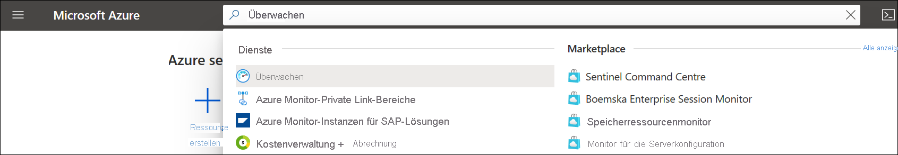
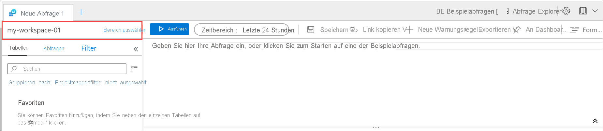

# <a name="quickstart-send-azure-activity-log-to-log-analytics-workspace-using-an-arm-template"></a>Schnellstart: Senden eines Azure-Aktivitätsprotokolls an einen Log Analytics-Arbeitsbereich per ARM-Vorlage

Das Aktivitätsprotokoll ist ein Plattformprotokoll in Azure, das einen Einblick in Ereignisse auf Abonnementebene ermöglicht. Dies sind beispielsweise Informationen wie das Ändern einer Ressource oder das Starten eines virtuellen Computers. Sie können das Aktivitätsprotokoll im Azure-Portal anzeigen oder Einträge mit PowerShell und der CLI abrufen. In dieser Schnellstartanleitung wird veranschaulicht, wie Sie Azure Resource Manager-Vorlagen (ARM-Vorlagen) zum Erstellen eines Log Analytics-Arbeitsbereichs und eine Diagnoseeinstellung zum Senden des Aktivitätsprotokolls an Azure Monitor-Protokolle verwenden, um es mit [Protokollabfragen](../logs/log-query-overview.md) zu analysieren und andere Features wie [Protokollwarnungen](../alerts/alerts-log-query.md) und [Arbeitsmappen](../visualize/workbooks-overview.md) zu aktivieren.

[!INCLUDE [About Azure Resource Manager](../../../includes/resource-manager-quickstart-introduction.md)]

## <a name="prerequisites"></a>Voraussetzungen

- Wenn Sie kein Azure-Abonnement besitzen, können Sie ein [kostenloses Konto](https://azure.microsoft.com/free/?WT.mc_id=A261C142F) erstellen, bevor Sie beginnen.
- Installieren Sie die Azure CLI oder die Azure PowerShell-Module, um die Befehle auf Ihrem lokalen Computer auszuführen. Weitere Informationen finden Sie unter [Installieren der Azure CLI](/cli/azure/install-azure-cli) und [Installieren von Azure PowerShell](/powershell/azure/install-az-ps).

## <a name="create-a-log-analytics-workspace"></a>Erstellen eines Log Analytics-Arbeitsbereichs

### <a name="review-the-template"></a>Überprüfen der Vorlage

Mit der folgenden Vorlage wird ein leerer Log Analytics-Arbeitsbereich erstellt. Speichern Sie diese Vorlage als *CreateWorkspace.json*.

```json
{
  "$schema": "https://schema.management.azure.com/schemas/2019-04-01/deploymentTemplate.json#",
  "contentVersion": "1.0.0.0",
  "parameters": {
    "workspaceName": {
      "type": "string",
      "metadata": {
        "description": "Name of the workspace."
      }
    },
    "sku": {
      "type": "string",
      "defaultValue": "pergb2018",
      "allowedValues": [
        "pergb2018",
        "Free",
        "Standalone",
        "PerNode",
        "Standard",
        "Premium"
      ],
      "metadata": {
        "description": "Pricing tier: PerGB2018 or legacy tiers (Free, Standalone, PerNode, Standard or Premium) which are not available to all customers."
      }
    },
    "location": {
      "type": "string",
      "allowedValues": [
        "australiacentral",
        "australiaeast",
        "australiasoutheast",
        "brazilsouth",
        "canadacentral",
        "centralindia",
        "centralus",
        "eastasia",
        "eastus",
        "eastus2",
        "francecentral",
        "japaneast",
        "koreacentral",
        "northcentralus",
        "northeurope",
        "southafricanorth",
        "southcentralus",
        "southeastasia",
        "switzerlandnorth",
        "switzerlandwest",
        "uksouth",
        "ukwest",
        "westcentralus",
        "westeurope",
        "westus",
        "westus2"
      ],
      "metadata": {
        "description": "Specifies the location for the workspace."
      }
    },
    "retentionInDays": {
      "type": "int",
      "defaultValue": 120,
      "metadata": {
        "description": "Number of days to retain data."
      }
    },
    "resourcePermissions": {
      "type": "bool",
      "defaultValue": true,
      "metadata": {
        "description": "true to use resource or workspace permissions. false to require workspace permissions."
      }
    }
  },
  "resources": [
    {
      "type": "Microsoft.OperationalInsights/workspaces",
      "apiVersion": "2020-08-01",
      "name": "[parameters('workspaceName')]",
      "location": "[parameters('location')]",
      "properties": {
        "sku": {
          "name": "[parameters('sku')]"
        },
        "retentionInDays": "[parameters('retentionInDays')]",
        "features": {
          "searchVersion": 1,
          "legacy": 0,
          "enableLogAccessUsingOnlyResourcePermissions": "[parameters('resourcePermissions')]"
        }
      }
    }
  ]
}
```

Mit dieser Vorlage wird eine Ressource definiert:

- [Microsoft.OperationalInsights/workspaces](/azure/templates/microsoft.operationalinsights/workspaces)

### <a name="deploy-the-template"></a>Bereitstellen der Vorlage

Stellen Sie die Vorlage mit einer Standardmethode zur [Bereitstellung einer ARM-Vorlage](../../azure-resource-manager/templates/deploy-portal.md) bereit, z. B. wie in den folgenden Beispielen per CLI und PowerShell. Ersetzen Sie die Beispielwerte für **Resource Group**, **workspaceName** und **location** durch die entsprechenden Werte für Ihre Umgebung. Der Name des Arbeitsbereichs muss für alle Azure-Abonnements eindeutig sein.

# <a name="cli"></a>[BEFEHLSZEILENSCHNITTSTELLE (CLI)](#tab/CLI)

```azurecli
az login
az deployment group create \
    --name CreateWorkspace \
    --resource-group my-resource-group \
    --template-file CreateWorkspace.json \
    --parameters workspaceName='my-workspace-01' location='eastus'

```

# <a name="powershell"></a>[PowerShell](#tab/PowerShell)

```powershell
Connect-AzAccount
Select-AzSubscription -SubscriptionName my-subscription
New-AzResourceGroupDeployment -Name AzureMonitorDeployment -ResourceGroupName my-resource-group -TemplateFile CreateWorkspace.json -workspaceName my-workspace-01 -location eastus
```

---

### <a name="validate-the-deployment"></a>Überprüfen der Bereitstellung

Überprüfen Sie mit einem der folgenden Befehle, ob der Arbeitsbereich erstellt wurde. Ersetzen Sie die Beispielwerte für **Resource Group** und **workspaceName** durch die Werte, die Sie oben verwendet haben.

# <a name="cli"></a>[BEFEHLSZEILENSCHNITTSTELLE (CLI)](#tab/CLI)

```azurecli
az monitor log-analytics workspace show --resource-group my-workspace-01 --workspace-name my-resource-group
```

# <a name="powershell"></a>[PowerShell](#tab/PowerShell)

```powershell
Get-AzOperationalInsightsWorkspace -Name my-workspace-01 -ResourceGroupName my-resource-group
```

---

## <a name="create-diagnostic-setting"></a>Erstellen einer Diagnoseeinstellung

### <a name="review-the-template"></a>Überprüfen der Vorlage

Mit der folgenden Vorlage wird eine Diagnoseeinstellung erstellt, mit der das Aktivitätsprotokoll an einen Log Analytics-Arbeitsbereich gesendet wird. Speichern Sie diese Vorlage als *CreateDiagnosticSetting.json*.

```json
{
  "$schema": "https://schema.management.azure.com/schemas/2019-04-01/deploymentTemplate.json#",
  "contentVersion": "1.0.0.0",
  "parameters": {
    "settingName": {
        "type": "String"
    },
    "workspaceId": {
        "type": "String"
    }
  },
  "resources": [
    {
      "type": "Microsoft.Insights/diagnosticSettings",
      "apiVersion": "2017-05-01-preview",
      "name": "[parameters('settingName')]",
      "dependsOn": [],
      "properties": {
        "workspaceId": "[parameters('workspaceId')]",
        "logs": [
          {
          "category": "Administrative",
          "enabled": true
          },
          {
          "category": "Alert",
          "enabled": true
          },
          {
          "category": "Autoscale",
          "enabled": true
          },
          {
          "category": "Policy",
          "enabled": true
          },
          {
          "category": "Recommendation",
          "enabled": true
          },
          {
          "category": "ResourceHealth",
          "enabled": true
          },
          {
          "category": "Security",
          "enabled": true
          },
          {
          "category": "ServiceHealth",
          "enabled": true
          }
        ]
      }
    }
  ]
}
```

Mit dieser Vorlage wird eine Ressource definiert:

- [Microsoft.Insights/diagnosticSettings](/azure/templates/microsoft.insights/diagnosticsettings)

### <a name="deploy-the-template"></a>Bereitstellen der Vorlage

Stellen Sie die Vorlage mit einer Standardmethode zur [Bereitstellung einer ARM-Vorlage](../../azure-resource-manager/templates/deploy-portal.md) bereit, z. B. wie in den folgenden Beispielen per CLI und PowerShell. Ersetzen Sie die Beispielwerte für **Resource Group**, **workspaceName** und **location** durch die entsprechenden Werte für Ihre Umgebung. Der Name des Arbeitsbereichs muss für alle Azure-Abonnements eindeutig sein.

# <a name="cli"></a>[BEFEHLSZEILENSCHNITTSTELLE (CLI)](#tab/CLI)

```azurecli
az deployment sub create --name CreateDiagnosticSetting --location eastus --template-file CreateDiagnosticSetting.json --parameters settingName='Send Activity log to workspace' workspaceId='/subscriptions/00000000-0000-0000-0000-000000000000/resourcegroups/my-resource-group/providers/microsoft.operationalinsights/workspaces/my-workspace-01'

```

# <a name="powershell"></a>[PowerShell](#tab/PowerShell)

```powershell
New-AzSubscriptionDeployment -Name CreateDiagnosticSetting -location eastus -TemplateFile CreateDiagnosticSetting.json -settingName "Send Activity log to workspace" -workspaceId "/subscriptions/00000000-0000-0000-0000-000000000000/resourcegroups/my-resource-group/providers/microsoft.operationalinsights/workspaces/my-workspace-01"
```
---

### <a name="validate-the-deployment"></a>Überprüfen der Bereitstellung

Überprüfen Sie mit einem der folgenden Befehle, ob die Diagnoseeinstellung erstellt wurde. Ersetzen Sie die Beispielwerte für das Abonnement und den Namen der Einstellung durch die Werte, die Sie oben verwendet haben.

> [!NOTE]
> Derzeit ist es nicht möglich, Diagnoseeinstellungen auf Abonnementebene mit PowerShell abzurufen.

```azurecli
az monitor diagnostic-settings show --resource '/subscriptions/00000000-0000-0000-0000-000000000000' --name 'Send Activity log to workspace'
```

## <a name="generate-log-data"></a>Generieren von Protokolldaten

Es werden nur neue Aktivitätsprotokolleinträge an den Log Analytics-Arbeitsbereich gesendet. Führen Sie daher einige Aktionen in Ihrem Abonnement durch, die protokolliert werden, z. B. das Starten oder Beenden eines virtuellen Computers oder das Erstellen oder Ändern einer anderen Ressource. Sie müssen ggf. einige Minuten warten, bis die Diagnoseeinstellung erstellt wurde und die Daten zum ersten Mal in den Arbeitsbereich geschrieben wurden. Nach dieser Verzögerung werden alle Ereignisse, die in das Aktivitätsprotokoll geschrieben werden, innerhalb weniger Sekunden an den Arbeitsbereich gesendet.

## <a name="retrieve-data-with-a-log-query"></a>Abrufen von Daten mit einer Protokollabfrage

Verwenden Sie das Azure-Portal, um Log Analytics zum Abrufen von Daten aus dem Arbeitsbereich zu verwenden. Suchen Sie im Azure-Portal nach dem Eintrag **Überwachen**, und wählen Sie ihn anschließend aus.



Wählen Sie im Menü **Azure Monitor** die Option **Protokolle** aus. Schließen Sie die Seite **Beispielabfragen**. Falls der Bereich nicht auf den von Ihnen erstellten Arbeitsbereich festgelegt ist, müssen Sie auf **Bereich auswählen** klicken und danach suchen.



Geben Sie im Abfragefenster `AzureActivity` ein, und klicken Sie auf **Ausführen**. Dies ist eine einfache Abfrage, bei der alle Datensätze der Tabelle *AzureActivity* zurückgegeben werden. Hierin sind alle Datensätze enthalten, die vom Aktivitätsprotokoll gesendet wurden.


Erweitern Sie einen der Datensätze, um dafür die detaillierten Eigenschaften anzuzeigen.


Probieren Sie eine komplexere Abfrage aus, z. B. `AzureActivity | summarize count() by CategoryValue`, bei der die Anzahl von Ereignissen zusammengefasst nach Kategorie ausgegeben wird.


## <a name="clean-up-resources"></a>Bereinigen von Ressourcen

Falls Sie mit weiteren Schnellstartanleitungen und Tutorials fortfahren möchten, sollten Sie die Ressourcen nicht bereinigen. Löschen Sie die Ressourcengruppe, wenn Sie die Ressourcen nicht mehr benötigen. Hierdurch werden die Warnungsregel und die zugehörigen Ressourcen gelöscht. Löschen der Ressourcengruppe per Azure-Befehlszeilenschnittstelle oder Azure PowerShell

# <a name="cli"></a>[BEFEHLSZEILENSCHNITTSTELLE (CLI)](#tab/CLI)

```azurecli
az group delete --name my-resource-group
```

# <a name="powershell"></a>[PowerShell](#tab/PowerShell)

```powershell
Remove-AzResourceGroup -Name my-resource-group
```

---

## <a name="next-steps"></a>Nächste Schritte

In dieser Schnellstartanleitung haben Sie das Aktivitätsprotokoll so konfiguriert, dass es an einen Log Analytics-Arbeitsbereich gesendet wird. Sie können nun andere Daten konfigurieren, die im Arbeitsbereich gesammelt werden sollen, um sie mit [Protokollabfragen](../logs/log-query-overview.md) in Azure Monitor gemeinsam zu analysieren und Features wie [Protokollwarnungen](../alerts/alerts-log-query.md) und [Arbeitsmappen](../visualize/workbooks-overview.md) zu nutzen. Als Nächstes sollten Sie [Ressourcenprotokolle](../essentials/resource-logs.md) aus Ihren Azure-Ressourcen erfassen, die die Daten im Aktivitätsprotokoll erweitern und Einblick in die Vorgänge ermöglichen, die auf den einzelnen Ressourcen durchgeführt wurden.

> [!div class="nextstepaction"]
> [Sammeln und Analysieren von Ressourcenprotokollen mit Azure Monitor](../essentials/tutorial-resource-logs.md)