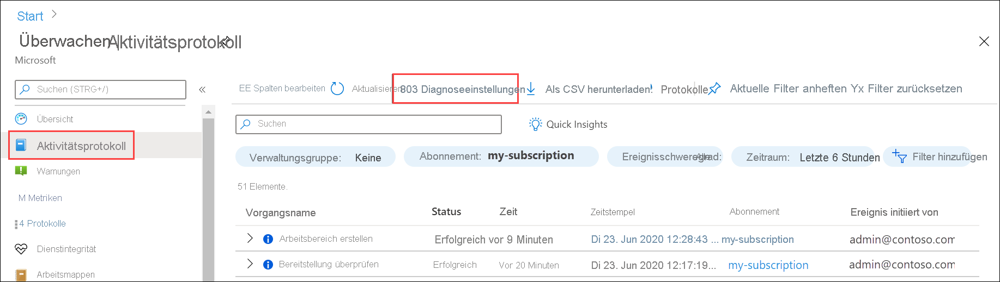

# Senden eines Azure-Aktivitätsprotokolls an einen Log Analytics-Arbeitsbereich unter Verwendung des Azure-Portals
Das Aktivitätsprotokoll ist ein Plattformprotokoll in Azure, das einen Einblick in Ereignisse auf Abonnementebene ermöglicht. Dies sind beispielsweise Informationen wie das Ändern einer Ressource oder das Starten eines virtuellen Computers. Sie können das Aktivitätsprotokoll im Azure-Portal anzeigen oder Einträge mit PowerShell und der CLI abrufen. In dieser Schnellstartanleitung wird veranschaulicht, wie Sie das Azure-Portal zum Erstellen eines Log Analytics-Arbeitsbereichs und eine Diagnoseeinstellung zum Senden des Aktivitätsprotokolls an Azure Monitor-Protokolle verwenden, um es mit [Protokollabfragen](../logs/log-query-overview.md) zu analysieren und andere Features wie [Protokollwarnungen](../alerts/alerts-log-query.md) und [Arbeitsmappen](../visualize/workbooks-overview.md) zu aktivieren. 

## Anmelden beim Azure-Portal
Melden Sie sich unter [https://portal.azure.com](https://portal.azure.com) beim Azure-Portal an. 

## Erstellen eines Log Analytics-Arbeitsbereichs
Suchen Sie im Azure-Portal nach **Log Analytics-Arbeitsbereiche**, und wählen Sie die Option dann aus. 

  
Klicken Sie auf **Hinzufügen**, und geben Sie dann Werte für die **Ressourcengruppe**, den Arbeitsbereich **Name** und **Standort** ein. Der Name des Arbeitsbereichs muss für alle Azure-Abonnements eindeutig sein.

Klicken Sie auf **Überprüfen + erstellen**, um die Einstellungen zu überprüfen, und dann auf **Erstellen**, um den Arbeitsbereich zu erstellen. Dadurch wird als Standardtarif die **nutzungsbasierte Bezahlung** ausgewählt. Dies wird nicht geändert, bis Sie mit der Erfassung einer ausreichenden Datenmenge beginnen. Es fallen keine Kosten für die Erfassung des Aktivitätsprotokolls an.

## Erstellen einer Diagnoseeinstellung
Suchen Sie im Azure-Portal nach dem Eintrag **Überwachen**, und wählen Sie ihn anschließend aus. 

Wählen Sie **Aktivitätsprotokoll** aus. Es sollten die jüngsten Ereignisse für das aktuelle Abonnement angezeigt werden. Klicken Sie auf **Diagnoseeinstellungen**, um die Diagnoseeinstellungen für das Abonnement anzuzeigen.

Klicken Sie auf **Diagnoseeinstellung hinzufügen**, um eine neue Einstellung zu erstellen. 

Geben Sie einen Namen wie z. B. *Aktivitätsprotokoll an Arbeitsbereich senden* ein. Wählen Sie jede einzelne der Kategorien aus. Wählen Sie **An Log Analytics senden** als einziges Ziel aus, und geben Sie dann den erstellten Arbeitsbereich an. Klicken Sie auf **Speichern**, um die Diagnoseeinstellung zu erstellen, und schließen Sie dann die Seite.

## Generieren von Protokolldaten
Es werden nur neue Aktivitätsprotokolleinträge an den Log Analytics-Arbeitsbereich gesendet. Führen Sie daher einige Aktionen in Ihrem Abonnement durch, die protokolliert werden, z. B. das Starten oder Beenden eines virtuellen Computers oder das Erstellen oder Ändern einer anderen Ressource. Sie müssen ggf. einige Minuten warten, bis die Diagnoseeinstellung erstellt wurde und die Daten zum ersten Mal in den Arbeitsbereich geschrieben wurden. Nach dieser Verzögerung werden alle Ereignisse, die in das Aktivitätsprotokoll geschrieben werden, innerhalb weniger Sekunden an den Arbeitsbereich gesendet.

## Abrufen von Daten mit einer Protokollabfrage

Wählen Sie im Menü **Azure Monitor** die Option **Protokolle** aus. Schließen Sie die Seite **Beispielabfragen**. Falls der Bereich nicht auf den von Ihnen erstellten Arbeitsbereich festgelegt ist, müssen Sie auf **Bereich auswählen** klicken und danach suchen.

Geben Sie im Abfragefenster `AzureActivity` ein, und klicken Sie auf **Ausführen**. Dies ist eine einfache Abfrage, bei der alle Datensätze der Tabelle *AzureActivity* zurückgegeben werden. Hierin sind alle Datensätze enthalten, die vom Aktivitätsprotokoll gesendet wurden.

Erweitern Sie einen der Datensätze, um dafür die detaillierten Eigenschaften anzuzeigen.

Probieren Sie eine komplexere Abfrage aus, z. B. `AzureActivity | summarize count() by CategoryValue`, bei der die Anzahl von Ereignissen zusammengefasst nach Kategorie ausgegeben wird.

## Nächste Schritte
In dieser Schnellstartanleitung haben Sie das Aktivitätsprotokoll so konfiguriert, dass es an einen Log Analytics-Arbeitsbereich gesendet wird. Sie können nun andere Daten konfigurieren, die im Arbeitsbereich gesammelt werden sollen, um sie mit [Protokollabfragen](../logs/log-query-overview.md) in Azure Monitor gemeinsam zu analysieren und Features wie [Protokollwarnungen](../alerts/alerts-log-query.md) und [Arbeitsmappen](../visualize/workbooks-overview.md) zu nutzen. Als Nächstes sollten Sie [Ressourcenprotokolle](../essentials/resource-logs.md) aus Ihren Azure-Ressourcen erfassen, die die Daten im Aktivitätsprotokoll erweitern und Einblick in die Vorgänge ermöglichen, die auf den einzelnen Ressourcen durchgeführt wurden.

> [!div class="nextstepaction"]
> [Sammeln und Analysieren von Ressourcenprotokollen mit Azure Monitor](../essentials/tutorial-resource-logs.md)