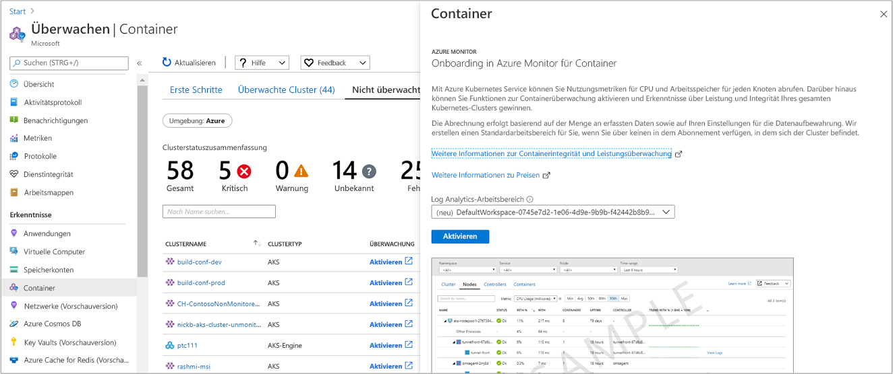

# <a name="configure-azure-red-hat-openshift-clusters-with-azure-monitor-for-containers"></a>Konfigurieren von Azure Red Hat OpenShift-Clustern mit Azure Monitor für Container

Azure Monitor für Container bietet umfassende Überwachungsfunktionen für Azure Kubernetes Service- (AKS) und AKS-Engine-Cluster. In diesem Artikel wird beschrieben, wie Sie die Überwachung von auf [Azure Red Hat OpenShift](../../openshift/intro-openshift.md) gehosteten Kubernetes-Clustern aktivieren, um eine ähnliche Überwachung zu erreichen.

>[!NOTE]
>Die Unterstützung für Azure Red Hat OpenShift ist zurzeit als Feature in der öffentlichen Vorschauversion verfügbar.
>

Azure Monitor für Container kann für neue oder mindestens eine vorhandene Bereitstellung von Azure Red Hat OpenShift mit den folgenden unterstützten Methoden aktiviert werden:

- für einen vorhandenen Cluster im Azure-Portal oder mit einer Azure Resource Manager-Vorlage.
- für einen neuen Cluster mit einer Azure Resource Manager-Vorlage oder beim Erstellen eines neuen Clusters mithilfe der [Azure CLI](https://docs.microsoft.com/cli/azure/openshift?view=azure-cli-latest#az-openshift-create).

## <a name="supported-and-unsupported-features"></a>Unterstützte und nicht unterstützte Funktionen

Azure Monitor für Container unterstützt wie im Artikel [Übersicht](container-insights-overview.md) beschrieben die Überwachung von Azure Red Hat OpenShift mit Ausnahme der folgenden Funktionen:

- Livedaten (Vorschauversion)
- [Sammeln von Metriken](container-insights-update-metrics.md) von Clusterknoten und Pods sowie das Speichern in der Azure Monitor-Metrikdatenbank

## <a name="prerequisites"></a>Voraussetzungen

- Sie müssen in Ihrem Azure-Abonnement mindestens über die Azure-Rolle *Mitwirkender* und im Log Analytics-Arbeitsbereich über die mit Azure Monitor für Container konfigurierte Rolle [*Log Analytics-Mitwirkender*](../platform/manage-access.md#manage-access-using-azure-permissions) verfügen, um auf die Funktionen in Azure Monitor für Container zugreifen zu können.

- Sie müssen über die Berechtigungen der Rolle [*Log Analytics-Leser*](../platform/manage-access.md#manage-access-using-azure-permissions) mit dem mit Azure Monitor für Container konfigurierten Log Analytics-Arbeitsbereich verfügen, um die Überwachungsdaten anzuzeigen.

## <a name="enable-for-a-new-cluster-using-an-azure-resource-manager-template"></a>Aktivieren eines neuen Clusters mithilfe einer Azure Resource Manager-Vorlage

Führen Sie die folgenden Schritte aus, um einen Azure Red Hat OpenShift-Cluster mit aktivierter Überwachung bereitzustellen. Lesen Sie sich vor den nächsten Schritten das Tutorial [Erstellen eines Azure Red Hat OpenShift-Clusters](../../openshift/tutorial-create-cluster.md#prerequisites) durch, um mehr über die Abhängigkeiten zu erfahren, die Sie konfigurieren müssen, damit Ihre Umgebung ordnungsgemäß eingerichtet ist.

Diese Methode umfasst zwei JSON-Vorlagen. Eine Vorlage gibt die Konfiguration zum Bereitstellen des Clusters mit aktivierter Überwachung an, während die andere Vorlage die zu konfigurierenden Parameterwerte enthält, mit denen Folgendes festgelegt wird:

- Azure Red Hat OpenShift-Clusterressourcen-ID

- Ressourcengruppe, in der der Cluster bereitgestellt wird

- [Azure Active Directory-Mandanten-ID](../../openshift/howto-create-tenant.md#create-a-new-azure-ad-tenant), die nach der Durchführung der Schritte zum Erstellen einer neuen oder bereits erstellten Mandanten-ID notiert wurde

- [Azure Active Directory-Clientanwendungs-ID](../../openshift/howto-aad-app-configuration.md#create-an-azure-ad-app-registration), die nach der Durchführung der Schritte zum Erstellen einer neuen oder bereits erstellten Clientanwendungs-ID notiert wurde

- [geheimer Azure Active Directory-Clientschlüssel](../../openshift/howto-aad-app-configuration.md#create-a-client-secret), der nach der Durchführung der Schritte zum Erstellen eines neuen oder bereits erstellten Clientschlüssels notiert wurde

- [Azure AD-Sicherheitsgruppe](../../openshift/howto-aad-app-configuration.md#create-an-azure-ad-security-group), die nach der Durchführung der Schritte zum Erstellen einer neuen oder bereits erstellten Sicherheitsgruppe notiert wurde

- Ressourcen-ID eines vorhandenen Log Analytics-Arbeitsbereichs

- Anzahl der im Cluster zu erstellenden Masterknoten

- Anzahl der Computeknoten im Agentpoolprofil

- Anzahl der Infrastrukturknoten im Agentpoolprofil

Wenn Sie mit der Bereitstellung von Ressourcen mithilfe einer Vorlage nicht vertraut sind, finden Sie weitere Informationen unter:

- [Bereitstellen von Ressourcen mit Azure Resource Manager-Vorlagen und Azure PowerShell](../../azure-resource-manager/templates/deploy-powershell.md)

- [Bereitstellen von Ressourcen mit Azure Resource Manager-Vorlagen und Azure CLI](../../azure-resource-manager/templates/deploy-cli.md)

Wenn Sie die Azure CLI verwenden möchten, müssen Sie sie zuerst installieren und lokal verwenden. Sie benötigen die Azure CLI-Version 2.0.65 oder höher. Um Ihre Version zu ermitteln, führen Sie `az --version` aus. Informationen zur Installation und zum Upgrade von Azure CLI finden Sie unter [Installieren von Azure CLI](https://docs.microsoft.com/cli/azure/install-azure-cli).

Der Log Analytics-Arbeitsbereich muss erstellt werden, bevor Sie die Überwachung mit Azure PowerShell oder CLI aktivieren. Arbeitsbereiche können über den [Azure Resource Manager](../../azure-monitor/platform/template-workspace-configuration.md), [PowerShell](../scripts/powershell-sample-create-workspace.md?toc=%2fpowershell%2fmodule%2ftoc.json) oder das [Azure-Portal](../../azure-monitor/learn/quick-create-workspace.md) eingerichtet werden.

1. Laden Sie die Azure Resource Manager-Vorlage und Parameterdatei herunter, und speichern Sie diese in einem lokalen Ordner, um mithilfe der folgenden Befehle einen Cluster mit dem Überwachungs-Add-On zu erstellen:

    `curl -LO https://raw.githubusercontent.com/microsoft/OMS-docker/ci_feature/docs/aro/enable_monitoring_to_new_cluster/newClusterWithMonitoring.json`

    `curl -LO https://raw.githubusercontent.com/microsoft/OMS-docker/ci_feature/docs/aro/enable_monitoring_to_new_cluster/newClusterWithMonitoringParam.json`

2. Anmelden bei Azure

    ```azurecli
    az login    
    ```

    Wenn Sie Zugriff auf mehrere Abonnements haben, führen Sie `az account set -s {subscription ID}` aus, und ersetzen Sie `{subscription ID}` durch das zu verwendende Abonnement.

3. Erstellen Sie eine Ressourcengruppe für Ihren Cluster, wenn Sie noch nicht über eine Ressourcengruppe verfügen. Eine Liste der Azure-Regionen, die OpenShift in Azure unterstützen, finden Sie unter [Unterstützte Regionen](../../openshift/supported-resources.md#azure-regions).

    ```azurecli
    az group create -g <clusterResourceGroup> -l <location>
    ```

4. Bearbeiten Sie die JSON-Parameterdatei **newClusterWithMonitoringParam.json**, und aktualisieren Sie die folgenden Werte:

    - *location*
    - *clusterName*
    - *aadTenantId*
    - *aadClientId*
    - *aadClientSecret*
    - *aadCustomerAdminGroupId*
    - *workspaceResourceId*
    - *masterNodeCount*
    - *computeNodeCount*
    - *infraNodeCount*

5. Im folgenden Schritt wird mithilfe der Azure CLI der Cluster mit aktivierter Überwachung bereitgestellt.

    ```azurecli
    az group deployment create --resource-group <ClusterResourceGroupName> --template-file ./newClusterWithMonitoring.json --parameters @./newClusterWithMonitoringParam.json
    ```

    Die Ausgabe sieht ungefähr so aus:

    ```output
    provisioningState       : Succeeded
    ```

## <a name="enable-for-an-existing-cluster"></a>Aktivieren für einen vorhandenen Cluster

Führen Sie die folgenden Schritte aus, um die Überwachung eines in Azure bereitgestellten Azure Red Hat OpenShift-Clusters zu aktivieren. Dies ist über das Azure-Portal oder mithilfe der bereitgestellten Vorlagen möglich.

### <a name="from-the-azure-portal"></a>Über das Azure-Portal

1. Melden Sie sich beim [Azure-Portal](https://portal.azure.com) an.

2. Klicken Sie im Azure-Portalmenü oder auf der Homepage auf **Azure Monitor**. Wählen Sie im Abschnitt **Insights** die Option **Container** aus.

3. Wählen Sie auf der Seite **Überwachung – Container** die Option **Nicht überwachte Cluster** aus.

4. Suchen Sie in der Liste der nicht überwachten Cluster den Cluster, und klicken Sie auf **Aktivieren**. Sie können die Ergebnisse in der Liste ermitteln, indem Sie in der Spalte **CLUSTERTYP** nach dem Wert **ARO** suchen.

5. Wenn Sie im selben Abonnement wie der Cluster über einen Log Analytics-Arbeitsbereich verfügen, wählen Sie ihn auf der Seite **Onboarding zu Azure Monitor für Container** aus der Dropdownliste aus.  
    Die Liste wählt vorab den Standardarbeitsbereich und den Speicherort, in dem der Cluster im Abonnement bereitgestellt wird.

    

    >[!NOTE]
    >Wenn Sie einen neuen Log Analytics-Arbeitsbereich zum Speichern der Überwachungsdaten aus dem Cluster erstellen möchten, befolgen Sie die Anweisungen in [Erstellen eines Log Analytics-Arbeitsbereichs](../../azure-monitor/learn/quick-create-workspace.md). Achten Sie darauf, dass Sie den Arbeitsbereich in demselben Abonnement erstellen, in dem der Azure RedHat OpenShift-Cluster bereitgestellt wird.

Nach dem Aktivieren der Überwachung kann es ca. 15 Minuten dauern, bis Integritätsmetriken für den Cluster angezeigt werden.

### <a name="enable-using-an-azure-resource-manager-template"></a>Aktivieren mit einer Azure Resource Manager-Vorlage

Diese Methode umfasst zwei JSON-Vorlagen. Eine Vorlage gibt die Konfiguration zur Aktivierung der Überwachung an, während die andere Vorlage die zu konfigurierenden Parameterwerte enthält, mit denen Folgendes festgelegt wird:

- Azure Red Hat OpenShift-Clusterressourcen-ID

- Ressourcengruppe, in der der Cluster bereitgestellt wird

- Einen Log Analytics-Arbeitsbereich

Wenn Sie mit der Bereitstellung von Ressourcen mithilfe einer Vorlage nicht vertraut sind, finden Sie weitere Informationen unter:

- [Bereitstellen von Ressourcen mit Azure Resource Manager-Vorlagen und Azure PowerShell](../../azure-resource-manager/templates/deploy-powershell.md)

- [Bereitstellen von Ressourcen mit Azure Resource Manager-Vorlagen und Azure CLI](../../azure-resource-manager/templates/deploy-cli.md)

Wenn Sie die Azure CLI verwenden möchten, müssen Sie sie zuerst installieren und lokal verwenden. Sie benötigen die Azure CLI-Version 2.0.65 oder höher. Um Ihre Version zu ermitteln, führen Sie `az --version` aus. Informationen zur Installation und zum Upgrade von Azure CLI finden Sie unter [Installieren von Azure CLI](https://docs.microsoft.com/cli/azure/install-azure-cli).

Der Log Analytics-Arbeitsbereich muss erstellt werden, bevor Sie die Überwachung mit Azure PowerShell oder CLI aktivieren. Arbeitsbereiche können über den [Azure Resource Manager](../../azure-monitor/platform/template-workspace-configuration.md), [PowerShell](../scripts/powershell-sample-create-workspace.md?toc=%2fpowershell%2fmodule%2ftoc.json) oder das [Azure-Portal](../../azure-monitor/learn/quick-create-workspace.md) eingerichtet werden.

1. Laden Sie die Vorlage und Parameterdatei herunter, um mithilfe der folgenden Befehle Ihren Cluster mit dem Überwachungs-Add-On zu aktualisieren:

    `curl -LO https://raw.githubusercontent.com/microsoft/OMS-docker/ci_feature/docs/aro/enable_monitoring_to_existing_cluster/existingClusterOnboarding.json`

    `curl -LO https://raw.githubusercontent.com/microsoft/OMS-docker/ci_feature/docs/aro/enable_monitoring_to_existing_cluster/existingClusterParam.json`

2. Anmelden bei Azure

    ```azurecli
    az login    
    ```

    Wenn Sie Zugriff auf mehrere Abonnements haben, führen Sie `az account set -s {subscription ID}` aus, und ersetzen Sie `{subscription ID}` durch das zu verwendende Abonnement.

3. Geben Sie das Abonnement des Azure RedHat OpenShift-Clusters an.

    ```azurecli
    az account set --subscription "Subscription Name"  
    ```

4. Führen Sie den folgenden Befehl aus, um den Clusterspeicherort und die Ressourcen-ID zu identifizieren:

    ```azurecli
    az openshift show -g <clusterResourceGroup> -n <clusterName>
    ```

5. Bearbeiten Sie die JSON-Parameterdatei **existingClusterParam.json**, und aktualisieren Sie die Werte *araResourceId* und *araResoruceLocation*. Der Wert für **workspaceResourceId** ist die vollständige Ressourcen-ID Ihres Log Analytics-Arbeitsbereichs, darunter der Name des Arbeitsbereichs.

6. Führen Sie zum Bereitstellen mit Azure CLI die folgenden Befehle aus:

    ```azurecli
    az group deployment create --resource-group <ClusterResourceGroupName> --template-file ./ExistingClusterOnboarding.json --parameters @./existingClusterParam.json
    ```

    Die Ausgabe sieht ungefähr so aus:

    ```output
    provisioningState       : Succeeded
    ```

## <a name="next-steps"></a>Nächste Schritte

- Informieren Sie sich über die [Verwendung von Azure Monitor für Container](container-insights-analyze.md), um bei aktivierter Überwachung die Integrität und Ressourcennutzung Ihres RedHat OpenShift-Clusters und der darauf ausgeführten Workloads zu erfassen.

- Informationen zum Beenden der Überwachung Ihres Clusters mit Azure Monitor für Container finden Sie unter [Beenden der Überwachung von Azure Red Hat OpenShift-Clustern](container-insights-optout-openshift.md).
