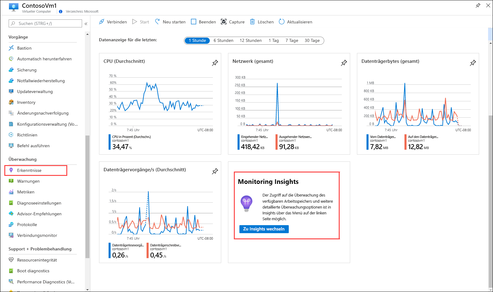
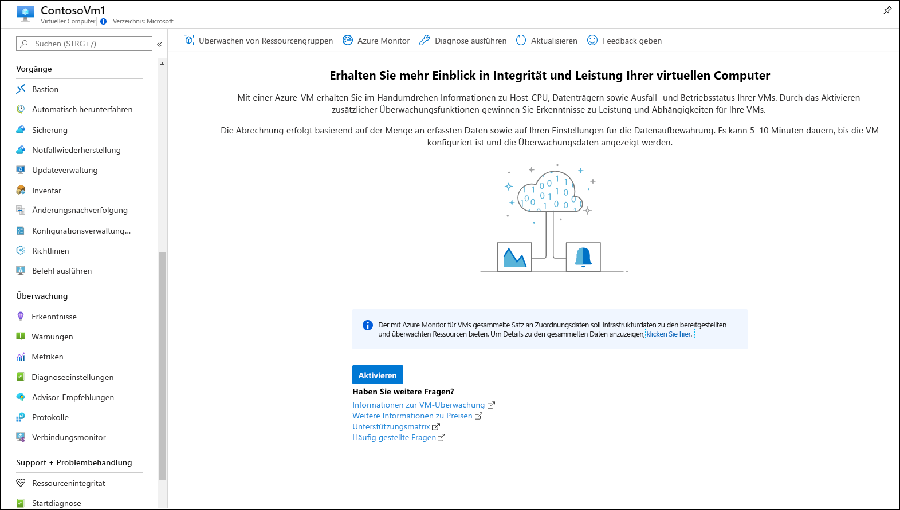
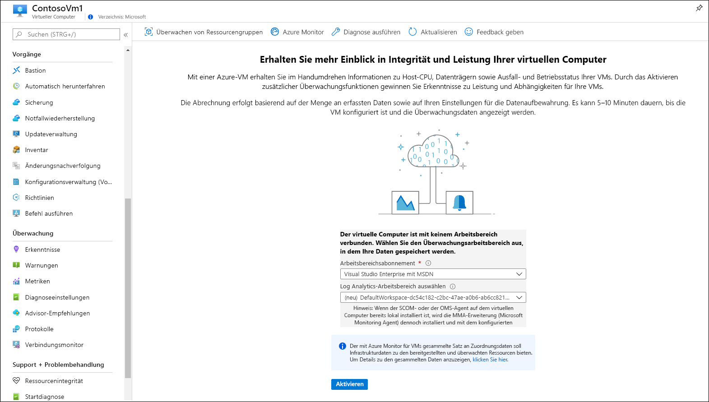
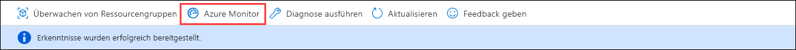
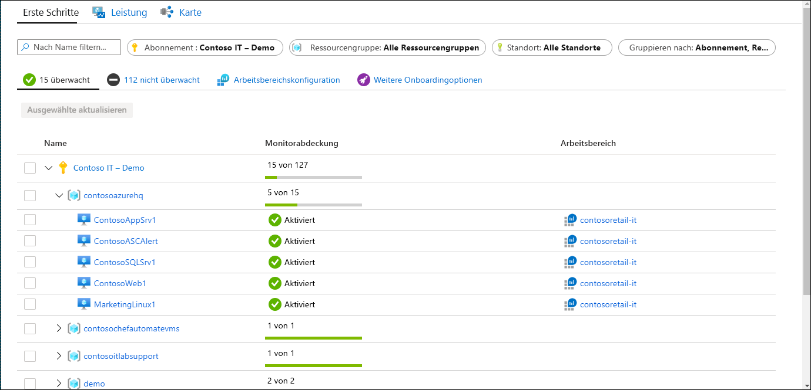
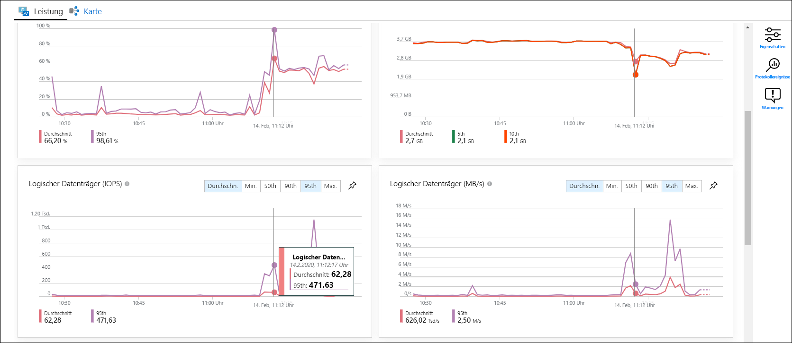
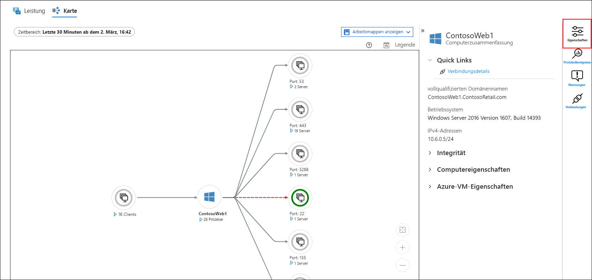
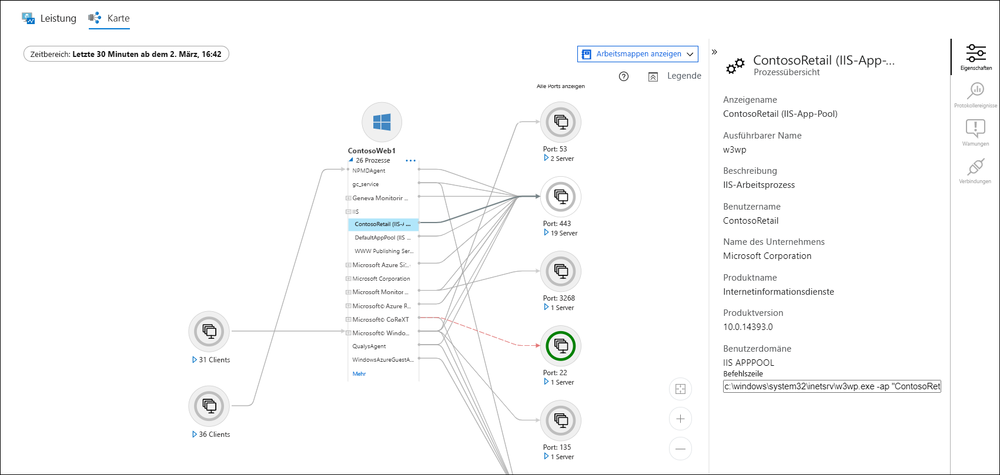
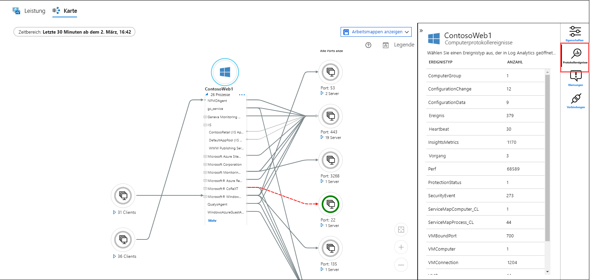
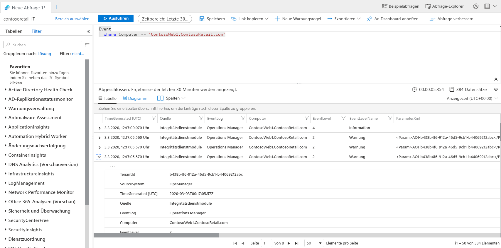

# Schnellstart: Überwachen eines virtuellen Azure-Computers mit Azure Monitor
[Azure Monitor](../overview.md) beginnt sofort nach der Erstellung virtueller Azure-Computer mit der Datenerfassung. Diese Schnellstartanleitung bietet eine kurze Übersicht darüber, welche Daten für einen virtuellen Azure-Computer automatisch gesammelt werden und wie sie im Azure-Portal angezeigt werden können. Anschließend erfahren Sie, wie Sie [Azure Monitor für VMs](../insights/vminsights-overview.md) für Ihren virtuellen Computer aktivieren, sodass Agents auf dem virtuellen Computer Daten aus dem Gastbetriebssystem erfassen und analysieren können (einschließlich Prozesse und deren Abhängigkeiten).

Dieser Schnellstart setzt voraus, dass Sie über einen virtuellen Azure-Computer verfügen. Falls nicht, können Sie mithilfe unserer VM-Schnellstartanleitungen einen [virtuellen Windows-Computer](../../virtual-machines/windows/quick-create-portal.md) oder einen [virtuellen Linux-Computer](../../virtual-machines/linux/quick-create-cli.md) erstellen.

Eine ausführlichere Beschreibung der gesammelten Überwachungsdaten von Azure-Ressourcen finden Sie unter [Überwachen virtueller Azure-Computer mit Azure Monitor](../insights/monitor-vm-azure.md).

## Durchlaufen der Schnellstartanleitung zur Überwachung einer Azure-Ressource
Durchlaufen Sie [Schnellstart: Überwachen einer Azure-Ressource mit Azure Monitor](quick-monitor-azure-resource.md), um die Übersichtsseite, das Aktivitätsprotokoll und Metriken für einen virtuellen Computer in Ihrem Abonnement anzuzeigen. Von virtuellen Azure-Computern werden die gleichen Überwachungsdaten erfasst wie von anderen Azure-Ressourcen. Dies gilt jedoch nur für den virtuellen Hostcomputer. In der restlichen Schnellstartanleitung steht die Überwachung des Gastbetriebssystems und dessen Workloads im Mittelpunkt.

## Aktivieren von Azure Monitor für VMs
Metriken und Aktivitätsprotokolle werden zwar für den virtuellen Hostcomputer erfasst, für die Erfassung und Analyse von Überwachungsdaten des Gastbetriebssystems und dessen Workloads sind jedoch ein Agent und ein paar Konfigurationsschritte erforderlich. Azure Monitor für VMs installiert diese Agents und stellt zusätzliche leistungsstarke Features für die Überwachung Ihrer virtuellen Computer bereit.

1. Navigieren Sie zum Menü für Ihren virtuellen Computer.
2. Klicken Sie entweder in der Kachel auf der Seite **Übersicht** auf **Zu Insights wechseln**, oder klicken Sie im Menü **Überwachung** auf **Insights**.

    

3. Falls Azure Monitor für VMs noch nicht für den virtuellen Computer aktiviert wurde, klicken Sie auf **Aktivieren**. 

    

4. Sollte der virtuelle Computer noch nicht mit einem Log Analytics-Arbeitsbereich verknüpft sein, werden Sie aufgefordert, einen vorhandenen Arbeitsbereich auszuwählen oder einen neuen zu erstellen. Wählen Sie die Standardeinstellung aus. Hierbei handelt es sich um einen Arbeitsbereich mit einem eindeutigen Namen, der sich in der gleichen Region befindet wie Ihr virtueller Computer.

    

5. Das Onboarding dauert einige Minuten. In dieser Zeit werden Erweiterungen aktiviert und Agents auf dem virtuellen Computer installiert. Nach Abschluss des Vorgangs erhalten Sie eine Meldung mit dem Hinweis, dass Erkenntnisse erfolgreich bereitgestellt wurden. Klicken Sie auf **Azure Monitor**, um Azure Monitor für VMs zu öffnen.

    

6. Ihr virtueller Computer wird zusammen mit allen anderen virtuellen Computern Ihres Abonnements angezeigt, für die das Onboarding durchgeführt wurde. Wählen Sie die Registerkarte **Nicht überwacht** aus, wenn Sie virtuelle Computer in Ihrem Abonnement anzeigen möchten, für die kein Onboarding durchgeführt wurde.

    

## Konfigurieren des Arbeitsbereichs
Wenn Sie einen neuen Log Analytics-Arbeitsbereich erstellen, muss er für die Protokollerfassung konfiguriert werden. Diese Konfiguration muss nur einmal durchgeführt werden, da sie an alle virtuellen Computer gesendet wird, die eine Verbindung herstellen.

1. Wählen Sie **Arbeitsbereichskonfiguration** und anschließend Ihren Arbeitsbereich aus.

2. Wählen Sie **Erweiterte Einstellungen** aus.

    

### Datensammlung auf Windows-VM

2. Wählen Sie **Daten** und dann **Windows-Ereignisprotokolle**.

3. Fügen Sie ein Ereignisprotokoll hinzu, indem Sie den Namen des Protokolls eingeben.  Geben Sie **System** ein, und wählen Sie dann das Pluszeichen ( **+** ) aus.

4. Aktivieren Sie in der Tabelle die Schweregrade **Fehler** und **Warnung**.

5. Wählen Sie ganz oben auf der Seite **Speichern** aus, um die Konfiguration zu speichern.

### Datensammlung auf Linux-VM

1. Wählen Sie **Syslog**.  

2. Fügen Sie ein Ereignisprotokoll hinzu, indem Sie den Namen des Protokolls eingeben.  Geben Sie **Syslog** ein, und wählen Sie dann das Pluszeichen ( **+** ) aus.  

3. Deaktivieren Sie in der Tabelle die Schweregrade **Info**, **Hinweis** und **Debuggen**. 

4. Wählen Sie ganz oben auf der Seite **Speichern** aus, um die Konfiguration zu speichern.

## Anzeigen gesammelter Daten

7. Klicken Sie auf Ihren virtuellen Computer, und wählen Sie die Registerkarte **Leistung** aus. Diese befindet sich im Menü **Überwachung** auf der Kachel **Insights**. Dadurch wird eine ausgewählte Gruppe von Leistungsindikatoren angezeigt, die vom Gastbetriebssystem Ihres virtuellen Computers erfasst werden. Scrollen Sie nach unten, um weitere Indikatoren anzuzeigen, und zeigen Sie mit dem Mauszeiger auf ein Diagramm, um den Durchschnitt und die Perzentile zu unterschiedlichen Zeiten anzuzeigen.

    

9. Wählen Sie **Zuordnung** aus, um das Zuordnungsfeature zu öffnen, das die auf dem virtuellen Computer ausgeführten Prozesse und deren Abhängigkeiten anzeigt. Wählen Sie **Eigenschaften** aus, um den Eigenschaftenbereich zu öffnen, falls er noch nicht geöffnet ist.

    

11. Erweitern Sie die Prozesse für Ihren virtuellen Computer. Wählen Sie einen der Prozesse aus, um seine Details anzuzeigen und die zugehörigen Abhängigkeiten hervorzuheben.

    

12. Wählen Sie erneut Ihren virtuellen Computer und anschließend **Protokollereignisse** aus. 

    

13. Es wird eine Liste mit den Tabellen angezeigt, die im Log Analytics-Arbeitsbereich für den virtuellen Computer gespeichert sind. Der Inhalt dieser Liste hängt davon ab, ob Sie einen virtuellen Windows-Computer oder einen virtuellen Linux-Computer verwenden. Klicken Sie auf die Tabelle **Ereignis**. Diese Tabelle enthält alle Ereignisse aus dem Windows-Ereignisprotokoll. Log Analytics wird mit einer einfachen Abfrage zum Abfragen von Ereignisprotokolleinträgen geöffnet.

    

## Nächste Schritte
In dieser Schnellstartanleitung haben Sie Azure Monitor für VMs für einen virtuellen Computer aktiviert und den Log Analytics-Arbeitsbereich konfiguriert, um Ereignisse für das Gastbetriebssystem zu erfassen. Um zu erfahren, wie Sie die Daten anzeigen und analysieren, fahren Sie mit dem Tutorial fort.

> [!div class="nextstepaction"]
> [Anzeigen oder Analysieren der Daten in Log Analytics](../log-query/log-analytics-tutorial.md)