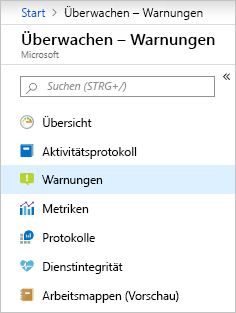
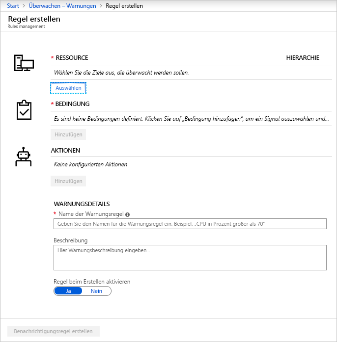
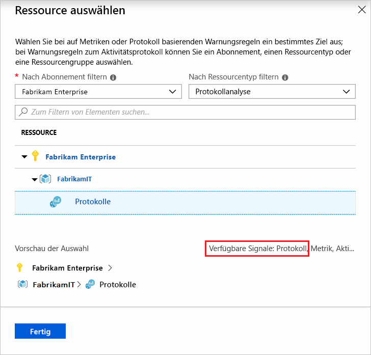
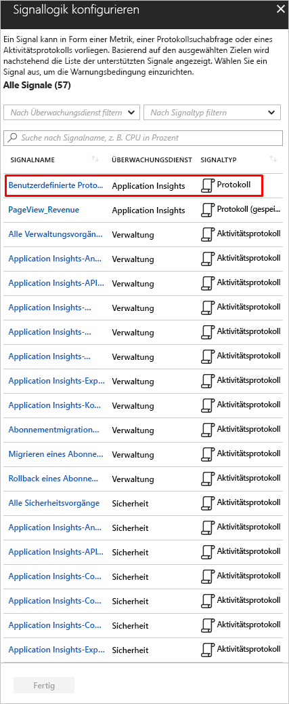
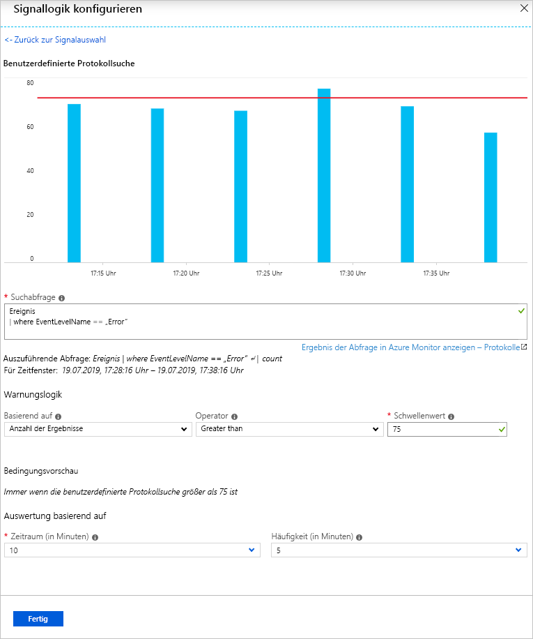
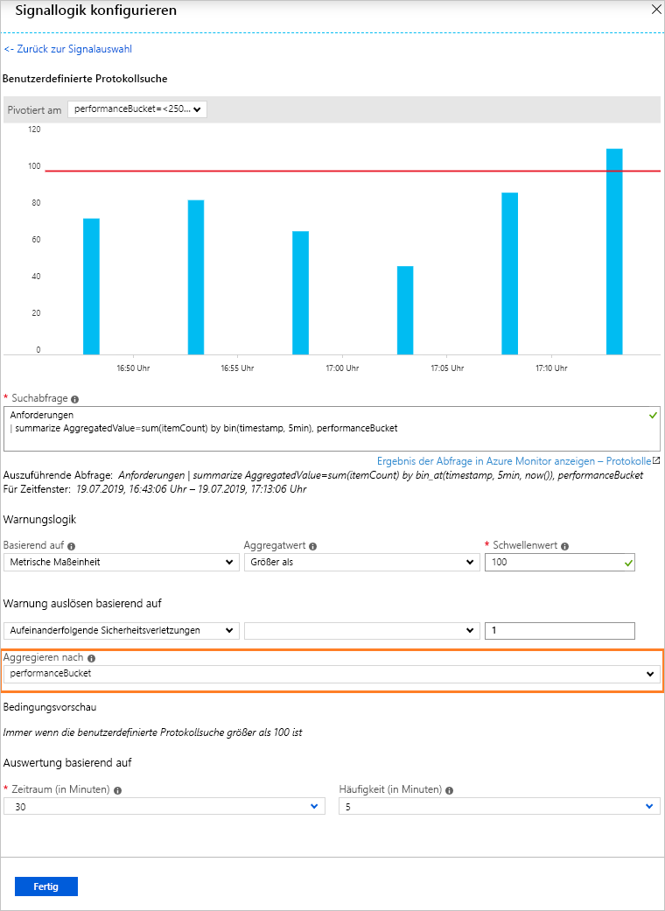
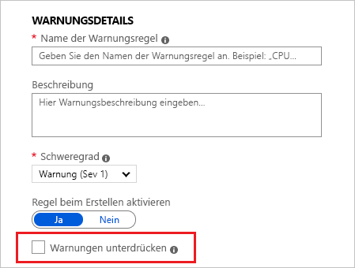
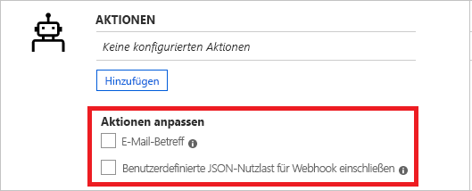
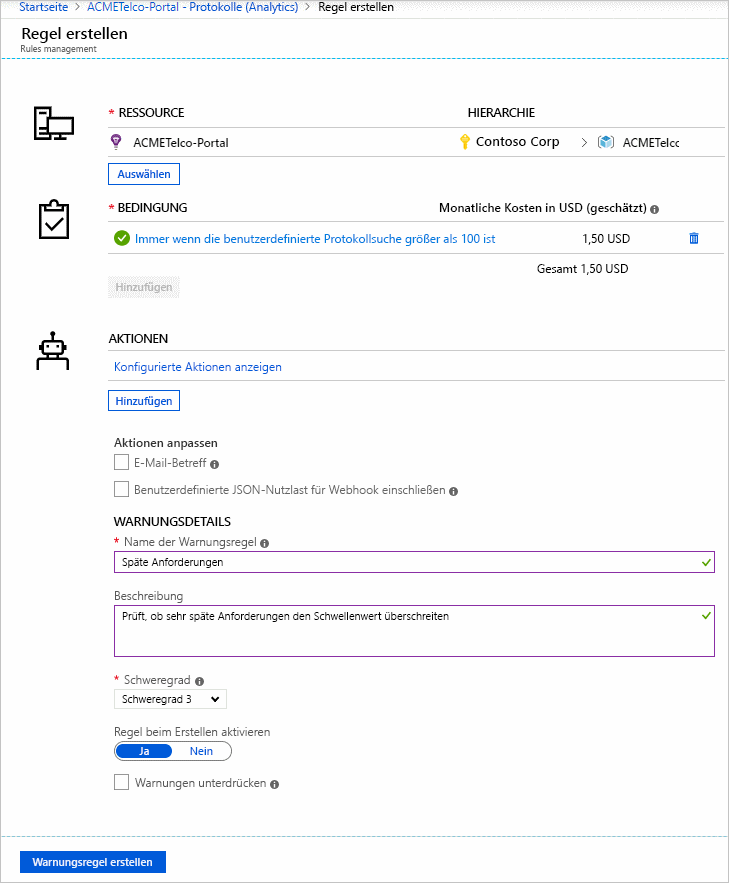
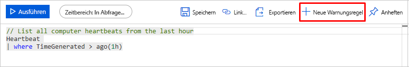

# <a name="create-view-and-manage-log-alerts-using-azure-monitor"></a>Erstellen, Anzeigen und Verwalten von Protokollwarnungen mithilfe von Azure Monitor

## <a name="overview"></a>Übersicht
In diesem Artikel wird erläutert, wie Sie im Azure-Portal mithilfe der Oberfläche für Warnungen Protokollwarnungen erstellen und verwalteten. Warnungsregeln werden durch drei Komponenten definiert:
- Ziel: Eine bestimmte zu überwachende Azure-Ressource
- Kriterien: Eine Bedingung oder Logik zum Auswerten auf Wahrheit. Bei TRUE wird die Warnung ausgelöst.  
- Aktion: Eine bestimmte Form der Kontaktaufnahme, die an einen Empfänger einer Benachrichtigung (z. B. E-Mail, SMS oder Webhook usw.) gesendet wird.

Der Begriff **Protokollwarnung** beschreibt Warnungen, bei denen eine Protokollabfrage in einem [Log Analytics-Arbeitsbereich](../log-query/get-started-portal.md) oder in [Application Insights](../log-query/log-query-overview.md) ausgewertet und beim Ergebnis TRUE eine Warnung ausgelöst wird. Erfahren Sie mehr über Funktionen, Terminologie und Typen von [Protokollwarnungen – Übersicht](alerts-unified-log.md).

> [!NOTE]
> Protokolldaten aus [einem Log Analytics-Arbeitsbereich](../log-query/get-started-portal.md) können auch an die Azure Monitor-Metrikdatenbank weitergeleitet werden. Metrikwarnungen weisen ein [anderes Verhalten](alerts-metric-overview.md) auf. Je nach den Daten, mit denen Sie arbeiten, kann dies wünschenswert sein.   Informationen zu den Protokollen, die Sie an Metriken weiterleiten können, und der zugehörigen Vorgehensweise finden Sie unter [Metrikwarnungen für Protokolle](alerts-metric-logs.md).

## <a name="create-a-log-alert-rule-with-the-azure-portal"></a>Erstellen einer Protokollwarnungsregel mit dem Azure-Portal

1. Wählen Sie im [Portal](https://portal.azure.com/) die Option **Überwachen**. Wählen Sie in diesem Abschnitt **Warnungen** aus.

    

1. Klicken Sie auf **Neue Warnungsregel**. 

    

1. Der Bereich **Warnung erstellen** wird geöffnet. Es besteht aus vier Teilen: 
    - Die Ressource, für die die Warnung gilt
    - Die zu überprüfende Bedingung
    - Die durchzuführende Aktion, wenn die Bedingung erfüllt ist
    - Die Details zur Benennung und Beschreibung der Warnung 

    

1. Definieren Sie die Warnungsbedingung, indem Sie auf den Link **Ressource auswählen** klicken und dann durch Auswahl einer Ressource das Ziel angeben. Filtern Sie, indem Sie die Optionen *Abonnement*, *Ressourcentyp* und schließlich die erforderliche Option *Ressource* auswählen. 

   

1. Stellen Sie sicher, dass als **Ressourcentyp** eine Analysequelle wie *Log Analytics* oder *Application Insights* und als Signaltyp *Protokoll* ausgewählt sind. Klicken Sie auf **Fertig**. Wählen Sie als Nächstes die Schaltfläche **Kriterien hinzufügen** aus, um die Liste der für die Ressource verfügbaren Signaloptionen anzuzeigen. Suchen Sie für *Log Analytics* oder *Application Insights* (je nachdem, wo sich die Daten für Ihre Protokollwarnungen befinden) die Option **Custom log search** (Benutzerdefinierte Protokollsuche), und wählen Sie sie aus.

   

   > [!NOTE]
   > 
   > Über die Listen von „Warnungen“ kann eine Analyseabfrage als Signaltyp **Protokoll (gespeicherte Abfrage)** importiert werden. Dies ist in der obigen Abbildung dargestellt. Daher können Benutzer Ihre Abfrage in Analytics optimieren und sie dann zur zukünftigen Verwendung in Warnungen speichern. Weitere Informationen zur Verwendung gespeicherter Abfragen finden Sie unter [Verwenden von Protokollabfragen in Azure Monitor](../log-query/log-query-overview.md) und [Freigegebene Abfragen in Application Insights-Analysen](../app/app-insights-overview.md).

1. Nachdem Sie diese Option ausgewählt haben, erstellen Sie die Warnungsabfrage im Feld **Suchabfrage**. Wenn in der Abfragesyntax ein Fehler vorliegt, wird das Feld mit dem Fehler in Rot angezeigt. 

1. Wenn die Abfragesyntax richtig ist, werden für die Abfrage Verlaufsdaten als Graph angezeigt. Dabei besteht die Möglichkeit, das Zeitfenster von den letzten sechs Stunden bis zur letzten Woche anzupassen.

    

   Die Visualisierung von Verlaufsdaten kann nur angezeigt werden, wenn die Abfrageergebnisse zeitliche Details enthalten. Wenn Ihre Abfrage zusammengefasste Daten oder bestimmte Spaltenwerte zurückgibt, werden diese als einzelner Plot angezeigt.
  
   Bei Metrikmessungen mit Application Insights oder der **Log Analytics-API** können Sie mithilfe der Option [Aggregieren nach](/rest/api/monitor/scheduledqueryrules) angeben, nach welcher Variable die Daten gruppiert werden sollen, wie hier zu sehen: 
  
   


1. Wählen Sie als Nächstes die Bedingung, die Aggregation und den Schwellenwert für die **Warnungslogik** aus. 

1. Wählen Sie über die Option **Zeitraum** den Zeitraum aus, für den die angegebene Bedingung überprüft werden soll. 

1. Wählen Sie unter **Häufigkeit** aus, wie oft die Warnung ausgeführt wird. 

    **Protokollwarnungen** können auf Folgendem basieren:
    - [Anzahl von Datensätzen](../../azure-monitor/platform/alerts-unified-log.md#number-of-results-alert-rules): Eine Warnung wird erstellt, wenn die Anzahl der von der Abfrage zurückgegebenen Datensätze entweder größer als oder kleiner als der Wert ist, den Sie angeben.
    - [Metrische Maßeinheit](../../azure-monitor/platform/alerts-unified-log.md#metric-measurement-alert-rules): Eine Warnung wird erstellt, wenn die einzelnen *aggregierten Werte* in den Ergebnissen den angegebenen Schwellenwert überschreiten und *nach dem ausgewählten Wert gruppiert* werden. Die Anzahl von Sicherheitsverletzungen für eine Warnung ist die Anzahl der Häufigkeit, mit der im ausgewählten Zeitraum der Schwellenwert überschritten wird. Sie können „Sicherheitsverletzungen gesamt“ für eine beliebige Kombination aus Verletzungen in den Ergebnissen angeben oder „Aufeinanderfolgende Sicherheitsverletzungen“, um vorauszusetzen, dass die Sicherheitsverletzungen in aufeinanderfolgenden Stichproben auftreten müssen.


1. Klicken Sie auf **Fertig**. 

1. Legen Sie im Feld **Name der Warnungsregel** einen Namen für Ihre Warnung sowie eine **Beschreibung** mit Einzelheiten zur Warnung und den **Schweregrad** über die jeweiligen Optionen fest. Diese Details werden in allen Warnungs-E-Mails, Benachrichtigungen und Pushvorgängen von Azure Monitor wiederverwendet. Darüber hinaus können Sie durch Klicken auf **Regel beim Erstellen aktivieren** festlegen, dass die Warnungsregel bei der Erstellung sofort aktiviert werden soll.

1. Wählen Sie aus, ob Sie für einen bestimmten Zeitraum **Warnungen unterdrücken** möchten.  Wenn Sie die Unterdrückung für die Warnungsregel aktivieren, werden Aktionen für die Regel nach dem Erstellen einer neuen Warnung für einen vorher festgelegten Zeitraum deaktiviert. Die Regel wird weiter ausgeführt und erstellt Warnungsdatensätze, wenn die Kriterien erfüllt sind. Durch diese Einstellung erhalten Sie Zeit, das Problem zu beheben, ohne doppelte Aktionen auszuführen.

   

    > [!TIP]
    > Geben Sie einen größeren Wert für das Unterdrücken von Warnungen als für die Häufigkeit der Warnung an, um sicherzustellen, dass Benachrichtigungen ohne Überlappung beendet werden.

1. Legen Sie im dritten und letzten Schritt bei Bedarf fest, ob **Aktionsgruppen** für die Warnungsregel ausgelöst werden sollen, wenn die Warnungsbedingung erfüllt ist. Sie können eine vorhandene Aktionsgruppe auswählen oder eine neue erstellen. Mit Aktionsgruppen können Sie eine Reihe von Aktionen durchführen, z. B. Senden von E-Mails, Senden von SMS-Nachrichten, Abrufen von Webhooks, Korrigieren mithilfe von Azure-Runbooks, Pushen an Ihr ITSM-Tool usw. Erfahren Sie mehr über [Aktionsgruppen](action-groups.md).

    > [!NOTE]
    > Informationen zu den Einschränkungen für mögliche Aktionen finden Sie unter [Einschränkungen für Azure-Abonnementdienste](../../azure-resource-manager/management/azure-subscription-service-limits.md).  

    Es sind einige weitere Funktionen zum Außerkraftsetzen der Standardaktionen verfügbar:

    - **E-Mail-Benachrichtigung**: Setzt den *E-Mail-Betreff* in der über die Aktionsgruppe gesendeten E-Mail außer Kraft. Der Text der E-Mail kann nicht geändert werden, und dieses Feld ist **nicht** für E-Mail-Adressen vorgesehen.
    - **Benutzerdefinierte JSON-Nutzlast einschließen**: Setzt den von Aktionsgruppen verwendeten Webhook-JSON-Code außer Kraft, wenn die Aktionsgruppe einen Webhooktyp enthält. Weitere Informationen zu Webhookformaten finden Sie unter [Webhookaktionen für Protokollwarnungen](../../azure-monitor/platform/alerts-log-webhook.md). Die Option „Webhook anzeigen“ bietet die Möglichkeit, das Format anhand von JSON-Beispieldaten zu überprüfen.

        


1. Wenn alle Felder gültig sind und mit einem grünen Häkchen versehen sind, kann auf die Schaltfläche **Warnungsregel erstellen** geklickt werden, wodurch eine Warnung in Azure Monitor unter „Warnungen“ erstellt wird. Alle Warnungen können über das Dashboard „Warnungen“ angezeigt werden.

     

     Innerhalb weniger Minuten wird die Warnung aktiv und wie oben beschrieben ausgelöst.

Benutzer können ihre Analyseabfrage auch in [Logs Analytics](../log-query/log-query-overview.md) abschließen und dann über die Schaltfläche „Warnung festlegen“ eine Warnung erstellen. Anschließend können sie die Anweisungen ab Schritt 6 im obigen Tutorial befolgen.

 

### <a name="view--manage-log-alerts-in-azure-portal"></a>Anzeigen und Verwalten von Warnungen im Azure-Portal

1. Wählen Sie im [Portal](https://portal.azure.com/) die Option **Monitor** und im Abschnitt „MONITOR“ dann **Warnungen** aus.

1. Das **Dashboard „Warnungen“** wird angezeigt, wobei alle Azure-Warnungen (einschließlich Protokollwarnungen) in einem einzelnen Board angezeigt werden, und zwar einschließlich jeder Instanz seit der Auslösung der Protokollwarnungsregel. Weitere Informationen finden Sie unter [Warnungsverwaltung](https://aka.ms/managealertinstances).
    > [!NOTE]
    > Protokollwarnungsregeln bestehen aus einer benutzerdefinierten, abfragebasierten Logik, die von Benutzern bereitgestellt wird und somit keinen aufgelösten Zustand aufweisen. Daher wird sie jedes Mal ausgelöst, wenn die in der Protokollwarnungsregel festgelegten Bedingungen erfüllt sind.

1. Wählen Sie in der oberen Leiste die Schaltfläche **Regeln verwalten** aus, um zum Abschnitt „Regelverwaltung“ zu navigieren, wobei alle erstellten Warnungsregeln sowie deaktivierte Warnungen aufgeführt sind.
    

## <a name="managing-log-alerts-using-azure-resource-template"></a>Verwalten von Protokollwarnungen mithilfe von Azure-Ressourcenvorlagen

Protokollwarnungen in Azure Monitor sind dem Ressourcentyp `Microsoft.Insights/scheduledQueryRules/` zugeordnet. Weitere Informationen zu diesem Ressourcentyp finden Sie unter [Azure Monitor: Referenz für die Scheduled Query Rules-API](/rest/api/monitor/scheduledqueryrules/). Protokollwarnungen für Application Insights oder Log Analytics können mithilfe der [Scheduled Query Rules-API](/rest/api/monitor/scheduledqueryrules/) erstellt werden.

> [!NOTE]
> Protokollwarnungen für Log Analytics können zudem über die [Legacywarnungs-API von Log Analytics](api-alerts.md) sowie über Legacyvorlagen von [gespeicherten Log Analytics-Suchen und -Warnungen](../insights/solutions.md) verwaltet werden. Weitere Informationen zur standardmäßigen Verwendung der hier beschriebenen neuen ScheduledQueryRules-API finden Sie unter [Wechseln zur neuen API für Log Analytics-Warnungen](alerts-log-api-switch.md).


### <a name="sample-log-alert-creation-using-azure-resource-template"></a>Beispiel für das Erstellen einer Protokollwarnung mithilfe einer Azure-Ressourcenvorlage

Im Folgenden sehen Sie die Struktur für die auf der [Scheduled Query Rules-Erstellung](/rest/api/monitor/scheduledqueryrules/createorupdate) basierende Ressourcenvorlage mithilfe der Standardprotokollsuchabfrage [Anzahl der Ergebnistyp-Protokollwarnungen](alerts-unified-log.md#number-of-results-alert-rules) mit einem Stichprobendataset als Variablen.

```json
{
    "$schema": "https://schema.management.azure.com/schemas/2015-01-01/deploymentTemplate.json#",
    "contentVersion": "1.0.0.0",
    "parameters": {
    },
    "variables": {
        "alertLocation": "southcentralus",
        "alertName": "samplelogalert",
        "alertDescription": "Sample log search alert",
        "alertStatus": "true",
        "alertSource":{
            "Query":"requests",
            "SourceId": "/subscriptions/a123d7efg-123c-1234-5678-a12bc3defgh4/resourceGroups/myRG/providers/microsoft.insights/components/sampleAIapplication",
            "Type":"ResultCount"
        },
        "alertSchedule":{
            "Frequency": 15,
            "Time": 60
        },
        "alertActions":{
            "SeverityLevel": "4"
        },
        "alertTrigger":{
            "Operator":"GreaterThan",
            "Threshold":"1"
        },
        "actionGrp":{
            "ActionGroup": "/subscriptions/a123d7efg-123c-1234-5678-a12bc3defgh4/resourceGroups/myRG/providers/microsoft.insights/actiongroups/sampleAG",
            "Subject": "Customized Email Header",
            "Webhook": "{ \"alertname\":\"#alertrulename\", \"IncludeSearchResults\":true }"
        }
    },
    "resources":[ {
        "name":"[variables('alertName')]",
        "type":"Microsoft.Insights/scheduledQueryRules",
        "apiVersion": "2018-04-16",
        "location": "[variables('alertLocation')]",
        "properties":{
            "description": "[variables('alertDescription')]",
            "enabled": "[variables('alertStatus')]",
            "source": {
                "query": "[variables('alertSource').Query]",
                "dataSourceId": "[variables('alertSource').SourceId]",
                "queryType":"[variables('alertSource').Type]"
            },
            "schedule":{
                "frequencyInMinutes": "[variables('alertSchedule').Frequency]",
                "timeWindowInMinutes": "[variables('alertSchedule').Time]"
            },
            "action":{
                "odata.type": "Microsoft.WindowsAzure.Management.Monitoring.Alerts.Models.Microsoft.AppInsights.Nexus.DataContracts.Resources.ScheduledQueryRules.AlertingAction",
                "severity":"[variables('alertActions').SeverityLevel]",
                "aznsAction":{
                    "actionGroup":"[array(variables('actionGrp').ActionGroup)]",
                    "emailSubject":"[variables('actionGrp').Subject]",
                    "customWebhookPayload":"[variables('actionGrp').Webhook]"
                },
                "trigger":{
                    "thresholdOperator":"[variables('alertTrigger').Operator]",
                    "threshold":"[variables('alertTrigger').Threshold]"
                }
            }
        }
    } ]
}

```

Das JSON-Beispiel oben kann im Rahmen dieser exemplarischen Vorgehensweise z.B. als „sampleScheduledQueryRule.json“ gespeichert und mithilfe von [Azure Resource Manager im Azure-Portal](../../azure-resource-manager/templates/deploy-portal.md#deploy-resources-from-custom-template) bereitgestellt werden.


### <a name="log-alert-with-cross-resource-query-using-azure-resource-template"></a>Protokollwarnung mit ressourcenübergreifender Abfrage mithilfe einer Azure-Ressourcenvorlage

Im Folgenden sehen Sie die Struktur für die auf der [Scheduled Query Rules-Erstellung](/rest/api/monitor/scheduledqueryrules/createorupdate) basierende Ressourcenvorlage mithilfe der [ressourcenübergreifenden Protokollsuchabfrage](../../azure-monitor/log-query/cross-workspace-query.md)[metrische Messungstyp-Protokollwarnung](../../azure-monitor/platform/alerts-unified-log.md#metric-measurement-alert-rules) mit einem Stichprobendataset als Variablen.

```json

{
    "$schema": "https://schema.management.azure.com/schemas/2015-01-01/deploymentTemplate.json#",
    "contentVersion": "1.0.0.0",
    "parameters": {
    },
    "variables": {
        "alertLocation": "Region Name for your Application Insights App or Log Analytics Workspace",
        "alertName": "sample log alert",
        "alertDescr": "Sample log search alert",
        "alertStatus": "true",
        "alertSource":{
            "Query":"union workspace(\"servicews\").Update, app('serviceapp').requests | summarize AggregatedValue = count() by bin(TimeGenerated,1h), Classification",
            "Resource1": "/subscriptions/a123d7efg-123c-1234-5678-a12bc3defgh4/resourceGroups/contosoRG/providers/microsoft.OperationalInsights/workspaces/servicews",
            "Resource2": "/subscriptions/a123d7efg-123c-1234-5678-a12bc3defgh4/resourceGroups/contosoRG/providers/microsoft.insights/components/serviceapp",
            "SourceId": "/subscriptions/a123d7efg-123c-1234-5678-a12bc3defgh4/resourceGroups/contosoRG/providers/microsoft.OperationalInsights/workspaces/servicews",
            "Type":"ResultCount"
        },
        "alertSchedule":{
            "Frequency": 15,
            "Time": 60
        },
        "alertActions":{
            "SeverityLevel": "4",
            "SuppressTimeinMin": 20
        },
        "alertTrigger":{
            "Operator":"GreaterThan",
            "Threshold":"1"
        },
        "metricMeasurement": {
            "thresholdOperator": "Equal",
            "threshold": "1",
            "metricTriggerType": "Consecutive",
            "metricColumn": "Classification"
        },
        "actionGrp":{
            "ActionGroup": "/subscriptions/a123d7efg-123c-1234-5678-a12bc3defgh4/resourceGroups/contosoRG/providers/microsoft.insights/actiongroups/sampleAG",
            "Subject": "Customized Email Header",
            "Webhook": "{ \"alertname\":\"#alertrulename\", \"IncludeSearchResults\":true }"
        }
    },
    "resources":[ {
        "name":"[variables('alertName')]",
        "type":"Microsoft.Insights/scheduledQueryRules",
        "apiVersion": "2018-04-16",
        "location": "[variables('alertLocation')]",
        "properties":{
            "description": "[variables('alertDescr')]",
            "enabled": "[variables('alertStatus')]",
            "source": {
                "query": "[variables('alertSource').Query]",
                "authorizedResources": "[concat(array(variables('alertSource').Resource1), array(variables('alertSource').Resource2))]",
                "dataSourceId": "[variables('alertSource').SourceId]",
                "queryType":"[variables('alertSource').Type]"
            },
            "schedule":{
                "frequencyInMinutes": "[variables('alertSchedule').Frequency]",
                "timeWindowInMinutes": "[variables('alertSchedule').Time]"
            },
            "action":{
                "odata.type": "Microsoft.WindowsAzure.Management.Monitoring.Alerts.Models.Microsoft.AppInsights.Nexus.DataContracts.Resources.ScheduledQueryRules.AlertingAction",
                "severity":"[variables('alertActions').SeverityLevel]",
                "throttlingInMin": "[variables('alertActions').SuppressTimeinMin]",
                "aznsAction":{
                    "actionGroup": "[array(variables('actionGrp').ActionGroup)]",
                    "emailSubject":"[variables('actionGrp').Subject]",
                    "customWebhookPayload":"[variables('actionGrp').Webhook]"
                },
                "trigger":{
                    "thresholdOperator":"[variables('alertTrigger').Operator]",
                    "threshold":"[variables('alertTrigger').Threshold]",
                    "metricTrigger":{
                        "thresholdOperator": "[variables('metricMeasurement').thresholdOperator]",
                        "threshold": "[variables('metricMeasurement').threshold]",
                        "metricColumn": "[variables('metricMeasurement').metricColumn]",
                        "metricTriggerType": "[variables('metricMeasurement').metricTriggerType]"
                    }
                }
            }
        }
    } ]
}

```

> [!IMPORTANT]
> Bei Verwendung einer ressourcenübergreifenden Abfrage in der Protokollwarnung ist die Verwendung von [authorizedResources](/rest/api/monitor/scheduledqueryrules/createorupdate#source) zwingend, und der Benutzer muss Zugriff auf die Liste der angegebenen Ressourcen besitzen.

Das JSON-Beispiel oben kann im Rahmen dieser exemplarischen Vorgehensweise z.B. als „sampleScheduledQueryRule.json“ gespeichert und mithilfe von [Azure Resource Manager im Azure-Portal](../../azure-resource-manager/templates/deploy-portal.md#deploy-resources-from-custom-template) bereitgestellt werden.

## <a name="managing-log-alerts-using-powershell"></a>Verwalten von Protokollwarnungen mit PowerShell

[!INCLUDE [updated-for-az](../../../includes/updated-for-az.md)]

Azure Monitor – [API für geplante Abfrageregeln](/rest/api/monitor/scheduledqueryrules/) ist eine REST-API und vollständig kompatibel mit der Azure Resource Manager-REST-API. Die unten aufgeführten PowerShell-Cmdlets stehen zur Nutzung der [API für Regeln für geplante Abfragen](/rest/api/monitor/scheduledqueryrules/) zur Verfügung.

- [New-AzScheduledQueryRule](/powershell/module/az.monitor/new-azscheduledqueryrule): PowerShell-Cmdlet zum Erstellen einer neuen Protokollwarnungsregel
- [Set-AzScheduledQueryRule](/powershell/module/az.monitor/set-azscheduledqueryrule): PowerShell-Cmdlet zum Aktualisieren einer vorhandenen Protokollwarnungsregel
- [New-AzScheduledQueryRuleSource](/powershell/module/az.monitor/new-azscheduledqueryrulesource): PowerShell-Cmdlet zum Erstellen oder Aktualisieren von Objekten, mit denen Quellparameter für eine Protokollwarnung angegeben werden. Wird von den Cmdlets [New-AzScheduledQueryRule](/powershell/module/az.monitor/new-azscheduledqueryrule) und [Set-AzScheduledQueryRule](/powershell/module/az.monitor/set-azscheduledqueryrule) als Eingabe verwendet.
- [New-AzScheduledQueryRuleSchedule](/powershell/module/az.monitor/new-azscheduledqueryruleschedule): PowerShell-Cmdlet zum Erstellen oder Aktualisieren von Objekten, mit denen Planungsparameter für eine Protokollwarnung angegeben werden. Wird von den Cmdlets [New-AzScheduledQueryRule](/powershell/module/az.monitor/new-azscheduledqueryrule) und [Set-AzScheduledQueryRule](/powershell/module/az.monitor/set-azscheduledqueryrule) als Eingabe verwendet.
- [New-AzScheduledQueryRuleAlertingAction](/powershell/module/az.monitor/new-azscheduledqueryrulealertingaction): PowerShell-Cmdlet zum Erstellen oder Aktualisieren von Objekten, mit denen Aktionsparameter für eine Protokollwarnung angegeben werden. Wird von den Cmdlets [New-AzScheduledQueryRule](/powershell/module/az.monitor/new-azscheduledqueryrule) und [Set-AzScheduledQueryRule](/powershell/module/az.monitor/set-azscheduledqueryrule) als Eingabe verwendet.
- [New-AzScheduledQueryRuleAznsActionGroup](/powershell/module/az.monitor/new-azscheduledqueryruleaznsactiongroup): PowerShell-Cmdlet zum Erstellen oder Aktualisieren von Objekten, mit denen Aktionsgruppenparameter für eine Protokollwarnung angegeben werden. Wird vom Cmdlet [New-AzScheduledQueryRuleAlertingAction](/powershell/module/az.monitor/new-azscheduledqueryrulealertingaction) als Eingabe verwendet.
- [New-AzScheduledQueryRuleTriggerCondition](/powershell/module/az.monitor/new-azscheduledqueryruletriggercondition): PowerShell-Cmdlet zum Erstellen oder Aktualisieren von Objekten, mit denen Auslöserbedingungsparameter für eine Protokollwarnung angegeben werden. Wird vom Cmdlet [New-AzScheduledQueryRuleAlertingAction](/powershell/module/az.monitor/new-azscheduledqueryrulealertingaction) als Eingabe verwendet.
- [New-AzScheduledQueryRuleLogMetricTrigger](/powershell/module/az.monitor/new-azscheduledqueryrulelogmetrictrigger): PowerShell-Cmdlet zum Erstellen oder Aktualisieren von Objekten, mit denen Bedingungsparameter von Metriktriggern für [Warnungsregeln des Typs „Metrische Maßeinheit“](../../azure-monitor/platform/alerts-unified-log.md#metric-measurement-alert-rules) angegeben werden. Wird vom Cmdlet [New-AzScheduledQueryRuleTriggerCondition](/powershell/module/az.monitor/new-azscheduledqueryruletriggercondition) als Eingabe verwendet.
- [Get-AzScheduledQueryRule](/powershell/module/az.monitor/get-azscheduledqueryrule): PowerShell-Cmdlet zum Auflisten der vorhandenen Protokollwarnungsregeln oder einer bestimmten Protokollwarnungsregel
- [Update-AzScheduledQueryRule](/powershell/module/az.monitor/update-azscheduledqueryrule): PowerShell-Cmdlet zum Aktivieren oder Deaktivieren von Protokollwarnungsregeln
- [Remove-AzScheduledQueryRule](/powershell/module/az.monitor/remove-azscheduledqueryrule): PowerShell-Cmdlet zum Löschen einer vorhandenen Protokollwarnungsregel

> [!NOTE]
> Mit ScheduledQueryRules-PowerShell-Cmdlets können nur Regeln verwaltet werden, die vom Cmdlet selbst oder mit der [API für Regeln für geplante Abfragen](/rest/api/monitor/scheduledqueryrules/) von Azure Monitor erstellt werden. Protokollwarnungsregeln, die mit der [Legacy-API für Warnungen von Log Analytics](api-alerts.md) und mit Legacyvorlagen von [gespeicherten Log Analytics-Suchen und -Warnungen](../insights/solutions.md) erstellt wurden, können erst dann mit ScheduledQueryRules-PowerShell-Cmdlets verwaltet werden, wenn der Benutzer die [API-Einstellung für Protokollwarnungen wechselt](alerts-log-api-switch.md).

Im nächsten Abschnitt werden die Schritte veranschaulicht, mit denen mithilfe des PowerShell-Cmdlets scheduledQueryRules eine Beispielregel für Protokollwarnungen erstellt wird.

```powershell
$source = New-AzScheduledQueryRuleSource -Query 'Heartbeat | summarize AggregatedValue = count() by bin(TimeGenerated, 5m), _ResourceId' -DataSourceId "/subscriptions/a123d7efg-123c-1234-5678-a12bc3defgh4/resourceGroups/contosoRG/providers/microsoft.OperationalInsights/workspaces/servicews"

$schedule = New-AzScheduledQueryRuleSchedule -FrequencyInMinutes 15 -TimeWindowInMinutes 30

$metricTrigger = New-AzScheduledQueryRuleLogMetricTrigger -ThresholdOperator "GreaterThan" -Threshold 2 -MetricTriggerType "Consecutive" -MetricColumn "_ResourceId"

$triggerCondition = New-AzScheduledQueryRuleTriggerCondition -ThresholdOperator "LessThan" -Threshold 5 -MetricTrigger $metricTrigger

$aznsActionGroup = New-AzScheduledQueryRuleAznsActionGroup -ActionGroup "/subscriptions/a123d7efg-123c-1234-5678-a12bc3defgh4/resourceGroups/contosoRG/providers/microsoft.insights/actiongroups/sampleAG" -EmailSubject "Custom email subject" -CustomWebhookPayload "{ `"alert`":`"#alertrulename`", `"IncludeSearchResults`":true }"

$alertingAction = New-AzScheduledQueryRuleAlertingAction -AznsAction $aznsActionGroup -Severity "3" -Trigger $triggerCondition

New-AzScheduledQueryRule -ResourceGroupName "contosoRG" -Location "Region Name for your Application Insights App or Log Analytics Workspace" -Action $alertingAction -Enabled $true -Description "Alert description" -Schedule $schedule -Source $source -Name "Alert Name"
```

## <a name="managing-log-alerts-using-cli-or-api"></a>Verwalten von Protokollwarnungen per CLI oder API

Azure Monitor – [API für geplante Abfrageregeln](/rest/api/monitor/scheduledqueryrules/) ist eine REST-API und vollständig kompatibel mit der Azure Resource Manager-REST-API. Daher ist die Verwendung über PowerShell mit Resource Manager-Befehlen für die Azure CLI möglich.


> [!NOTE]
> Protokollwarnungen für Log Analytics können zudem über die [Legacywarnungs-API von Log Analytics](api-alerts.md) sowie über Legacyvorlagen von [gespeicherten Log Analytics-Suchen und -Warnungen](../insights/solutions.md) verwaltet werden. Weitere Informationen zur standardmäßigen Verwendung der hier beschriebenen neuen ScheduledQueryRules-API finden Sie unter [Wechseln zur neuen API für Log Analytics-Warnungen](alerts-log-api-switch.md).

Protokollwarnungen verfügen derzeit nicht über dedizierte CLI-Befehle. Sie können aber über den CLI-Befehl von Azure Resource Manager für die weiter oben im Abschnitt „Ressourcenvorlage“ dargestellte Ressourcenvorlage (sampleScheduledQueryRule.json) verwendet werden. Dies ist hier dargestellt:

```azurecli
az group deployment create --resource-group contosoRG --template-file sampleScheduledQueryRule.json
```

Bei erfolgreicher Ausführung wird 201 zurückgegeben, wenn eine neue Warnungsregel erstellt wurde, bzw. 200, wenn eine vorhandene Warnungsregel geändert wurde.

## <a name="next-steps"></a>Nächste Schritte

* Erfahren Sie mehr über [Protokollwarnungen in Azure-Warnungen](../../azure-monitor/platform/alerts-unified-log.md).
* Machen Sie sich mit [Webhookaktionen für Protokollwarnungen](../../azure-monitor/platform/alerts-log-webhook.md) vertraut.
* Weitere Informationen zu [Application Insights](../log-query/log-query-overview.md)
* Weitere Informationen zum [Analysieren von Protokolldaten in Azure Monitor](../log-query/log-query-overview.md).
