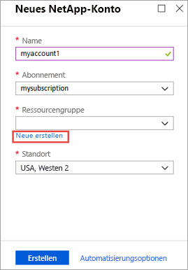
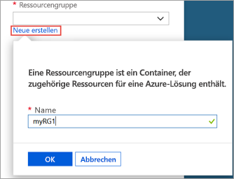
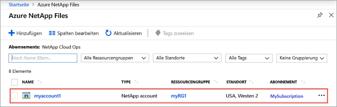
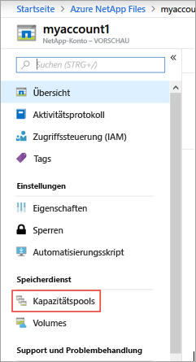
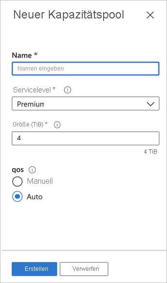
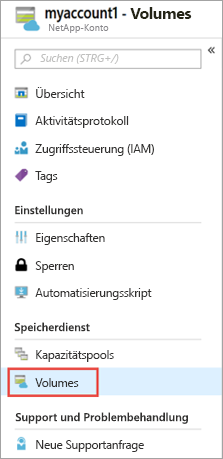
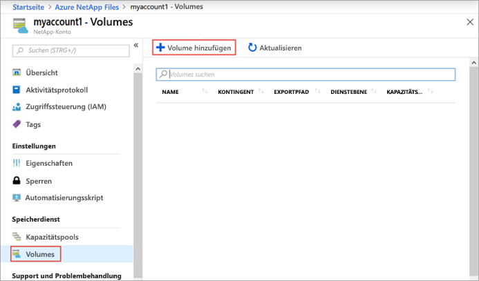
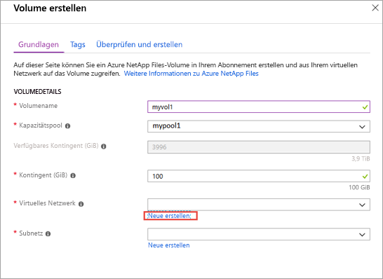
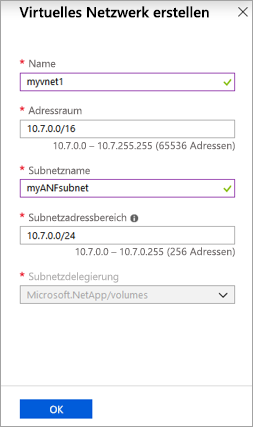

# <a name="quickstart-set-up-azure-netapp-files-and-create-an-nfs-volume"></a>Schnellstart: Einrichten von Azure NetApp Files und Erstellen eines NFS-Volumes 

In diesem Artikel erfahren Sie, wie Sie auf schnelle Weise Azure NetApp Files einrichten und ein Volume erstellen. 

In dieser Schnellstartanleitung wird Folgendes eingerichtet:

- Registrierung für Azure NetApp Files und NetApp-Ressourcenanbieter
- NetApp-Konto
- Kapazitätspool
- NFS-Volume für Azure NetApp Files

Wenn Sie kein Azure-Abonnement besitzen, können Sie ein [kostenloses Konto](https://azure.microsoft.com/free/?WT.mc_id=A261C142F) erstellen, bevor Sie beginnen.

## <a name="before-you-begin"></a>Voraussetzungen 

> [!IMPORTANT] 
> Sie müssen Zugriff auf den Azure NetApp Files-Dienst erhalten.  Informationen zum Anfordern des Zugriffs auf den Dienst finden Sie auf der Seite für die [Übermittlung der Azure NetApp Files-Warteliste](https://aka.ms/azurenetappfiles).  Sie müssen auf eine offizielle Bestätigungs-E-Mail des Azure NetApp Files-Teams warten, bevor Sie fortfahren können. 

[!INCLUDE [cloud-shell-try-it.md](../../includes/cloud-shell-try-it.md)]

---

## <a name="register-for-azure-netapp-files-and-netapp-resource-provider"></a>Registrieren für Azure NetApp Files und NetApp-Ressourcenanbieter

> [!NOTE]
> Der Registrierungsvorgang kann einige Zeit in Anspruch nehmen.
>

# <a name="portal"></a>[Portal](#tab/azure-portal)

Öffnen Sie für die Registrierungsschritte mit dem Portal wie oben gezeigt eine Cloud Shell-Sitzung, und führen Sie diese Azure CLI-Schritte aus:

[!INCLUDE [azure-netapp-files-cloudshell-include](../../includes/azure-netapp-files-azure-cloud-shell-window.md)]

# <a name="powershell"></a>[PowerShell](#tab/azure-powershell)

Für diesen Gewusst-wie-Artikel wird Az-Version 2.6.0 (oder höher) des Azure PowerShell-Moduls benötigt. Führen Sie `Get-Module -ListAvailable Az` aus, um Ihre aktuelle Version zu ermitteln. Wenn Sie eine Installation oder ein Upgrade ausführen müssen, finden Sie unter [Install and configure Azure PowerShell](/powershell/azure/install-Az-ps) (Installieren des Azure PowerShell-Moduls) Informationen dazu. Wenn Sie möchten, können Sie stattdessen die Cloud Shell-Konsole in einer PowerShell-Sitzung verwenden.

1. Geben Sie an einer PowerShell-Eingabeaufforderung (oder PowerShell Cloud Shell-Sitzung) das Abonnement an, das für Azure NetApp Files genehmigt wurde:
    ```powershell-interactive
    Select-AzSubscription -Subscription <subscriptionId>
    ```

2. Registrieren des Azure-Ressourcenanbieters:
    ```powershell-interactive
    Register-AzResourceProvider -ProviderNamespace Microsoft.NetApp
    ```

# <a name="azure-cli"></a>[Azure-Befehlszeilenschnittstelle](#tab/azure-cli)

[!INCLUDE [azure-netapp-files-cloudshell-include](../../includes/azure-netapp-files-azure-cloud-shell-window.md)]

# <a name="template"></a>[Vorlage](#tab/template)

Keine.  

Verwenden Sie das Azure-Portal, die PowerShell oder die Azure CLI, um sich für Azure NetApp Files und den NetApp-Ressourcenanbieter zu registrieren.  

Weitere Informationen finden Sie unter [Registrieren für Azure NetApp Files](azure-netapp-files-register.md). 

---

## <a name="create-a-netapp-account"></a>Erstellen eines NetApp-Kontos

# <a name="portal"></a>[Portal](#tab/azure-portal)

1. Geben Sie im Suchfeld des Azure-Portals **Azure NetApp Files** ein, und wählen Sie in der daraufhin angezeigten Liste die Option **Azure NetApp Files** aus.

      

2. Klicken Sie auf **+ Hinzufügen**, um ein neues NetApp-Konto zu erstellen.

     

3. Geben Sie im Fenster für das neue NetApp-Konto folgende Informationen an: 
   1. Geben Sie **myaccount1** als Kontoname ein. 
   2. Wählen Sie Ihr Abonnement aus.
   3. Wählen Sie **Neu erstellen** aus, um eine neue Ressourcengruppe zu erstellen. Geben Sie **myRG1** als Ressourcengruppenname ein. Klicken Sie auf **OK**. 
   4. Wählen Sie den Standort Ihres Kontos aus.  

        

      

4. Klicken Sie auf **Erstellen**, um Ihr neues NetApp-Konto zu erstellen.

# <a name="powershell"></a>[PowerShell](#tab/azure-powershell)

1. Definieren Sie einige Variablen, damit in den restlichen Beispielen darauf verwiesen werden kann:

    ```powershell-interactive
    $resourceGroup = "myRG1"
    $location = "eastus"
    $anfAccountName = "myaccount1"
    ``` 

    > [!NOTE]
    > Eine Liste mit den unterstützten Regionen finden Sie unter [Verfügbare Produkte nach Region](https://azure.microsoft.com/global-infrastructure/services/?products=netapp&regions=all).
    > Verwenden Sie `Get-AzLocation | select Location`, um den Regionsnamen abzurufen, der von unseren Befehlszeilentools unterstützt wird.
    >

1. Erstellen Sie mit dem Befehl [New-AzResourceGroup](/powershell/module/az.resources/new-azresourcegroup) eine neue Ressourcengruppe:

    ```powershell-interactive
    New-AzResourceGroup -Name $resourceGroup -Location $location
    ```

2. Erstellen Sie mit dem Befehl [New-AzNetAppFilesAccount](/powershell/module/az.netappfiles/New-AzNetAppFilesAccount) ein Azure NetApp Files-Konto:
   
    ```powershell-interactive
    New-AzNetAppFilesAccount -ResourceGroupName $resourceGroup -Location $location -Name $anfAccountName
    ```

# <a name="azure-cli"></a>[Azure-Befehlszeilenschnittstelle](#tab/azure-cli)

1. Definieren Sie einige Variablen, damit in den restlichen Beispielen darauf verwiesen werden kann:

    ```azurecli-interactive
    RESOURCE_GROUP="myRG1"
    LOCATION="eastus"
    ANF_ACCOUNT_NAME="myaccount1"
    ``` 

    > [!NOTE]
    > Eine Liste mit den unterstützten Regionen finden Sie unter [Verfügbare Produkte nach Region](https://azure.microsoft.com/global-infrastructure/services/?products=netapp&regions=all).
    > Verwenden Sie `az account list-locations --query "[].{Region:name}" --out table`, um den Regionsnamen abzurufen, der von unseren Befehlszeilentools unterstützt wird.
    >

2. Erstellen Sie mit dem Befehl [az group create](/cli/azure/group#az-group-create) eine neue Ressourcengruppe:

    ```azurecli-interactive
    az group create \
        --name $RESOURCE_GROUP \
        --location $LOCATION
    ```

3. Erstellen Sie mit dem Befehl [az netappfiles account create](/cli/azure/netappfiles/account#az-netappfiles-account-create) ein Azure NetApp Files-Konto:
   
    ```azurecli-interactive
    az netappfiles account create \
        --resource-group $RESOURCE_GROUP \
        --location $LOCATION \
        --account-name $ANF_ACCOUNT_NAME
    ```

# <a name="template"></a>[Vorlage](#tab/template)

[!INCLUDE [About Azure Resource Manager](../../includes/resource-manager-quickstart-introduction.md)]

Der folgende Codeausschnitt zeigt, wie Sie ein NetApp-Konto in einer Azure Resource Manager-Vorlage (ARM-Vorlage) erstellen, indem Sie die Ressource [Microsoft.NetApp/netAppAccounts](/azure/templates/microsoft.netapp/netappaccounts) verwenden. Um den Code auszuführen, laden Sie die [vollständige ARM-Vorlage](https://github.com/Azure/azure-quickstart-templates/blob/master/101-anf-nfs-volume/azuredeploy.json) aus unserem GitHub-Repository herunter.

:::code language="json" source="~/quickstart-templates/101-anf-nfs-volume/azuredeploy.json" range="177-183":::

<!-- Block begins with "type": "Microsoft.NetApp/netAppAccounts", -->

---

## <a name="set-up-a-capacity-pool"></a>Einrichten eines Kapazitätspools

# <a name="portal"></a>[Portal](#tab/azure-portal)

1. Wählen Sie auf dem Azure NetApp Files-Verwaltungsblatt Ihr NetApp-Konto (**myaccount1**) aus.

      

2. Klicken Sie auf dem Azure NetApp Files-Verwaltungsblatt Ihres NetApp-Kontos auf **Kapazitätspools**.

      

3. Klicken Sie auf **+ Pools hinzufügen**. 

      

4. Geben Sie Informationen für den Kapazitätspool an: 
    * Geben Sie **mypool1** als Poolname ein.
    * Wählen Sie für den Servicelevel die Option **Premium** aus. 
    * Geben Sie eine Poolgröße von **4 (TiB)** an. 
    * Verwenden Sie den QoS-Typ **Auto** (Automatisch).

5. Klicken Sie auf **Erstellen**.

# <a name="powershell"></a>[PowerShell](#tab/azure-powershell)

1. Definieren einiger neuer Variablen, auf die verwiesen werden kann

    ```powershell-interactive
    $poolName = "mypool1"
    $poolSizeBytes = 4398046511104 # 4TiB
    $serviceLevel = "Premium" # Valid values are Standard, Premium and Ultra
    ```

1. Erstellen Sie mit [New-AzNetAppFilesPool](/powershell/module/az.netappfiles/new-aznetappfilespool) einen neuen Kapazitätspool.

    ```powershell-interactive
    New-AzNetAppFilesPool -ResourceGroupName $resourceGroup -Location $location -AccountName $anfAccountName -Name $poolName -PoolSize $poolSizeBytes -ServiceLevel $serviceLevel
    ```

# <a name="azure-cli"></a>[Azure-Befehlszeilenschnittstelle](#tab/azure-cli)

1. Definieren einiger neuer Variablen, auf die verwiesen werden kann

    ```azurecli-interactive
    POOL_NAME="mypool1"
    POOL_SIZE_TiB=4 # Size in Azure CLI needs to be in TiB unit (minimum 4 TiB)
    SERVICE_LEVEL="Premium" # Valid values are Standard, Premium and Ultra
    ```

2. Erstellen Sie mit [az netappfiles pool create](/cli/azure/netappfiles/pool#az-netappfiles-pool-create) einen neuen Kapazitätspool. 

    ```azurecli-interactive
    az netappfiles pool create \
        --resource-group $RESOURCE_GROUP \
        --location $LOCATION \
        --account-name $ANF_ACCOUNT_NAME \
        --pool-name $POOL_NAME \
        --size $POOL_SIZE_TiB \
        --service-level $SERVICE_LEVEL
    ```

# <a name="template"></a>[Vorlage](#tab/template)

<!-- [!INCLUDE [About Azure Resource Manager](../../includes/resource-manager-quickstart-introduction.md)] -->

Der folgende Codeausschnitt zeigt, wie Sie einen Kapazitätspool in einer Azure Resource Manager-Vorlage (ARM-Vorlage) erstellen, indem Sie die Ressource [Microsoft.NetApp/netAppAccounts/capacityPools](/azure/templates/microsoft.netapp/netappaccounts/capacitypools) verwenden. Um den Code auszuführen, laden Sie die [vollständige ARM-Vorlage](https://github.com/Azure/azure-quickstart-templates/blob/master/101-anf-nfs-volume/azuredeploy.json) aus unserem GitHub-Repository herunter.

:::code language="json" source="~/quickstart-templates/101-anf-nfs-volume/azuredeploy.json" range="184-196":::

<!-- LN 185, block begins with  "type": "Microsoft.NetApp/netAppAccounts/capacityPools", -->

---

## <a name="create-nfs-volume-for-azure-netapp-files"></a>Erstellen eines NFS-Volumes für Azure NetApp Files

# <a name="portal"></a>[Portal](#tab/azure-portal)

1. Klicken Sie auf dem Azure NetApp Files-Verwaltungsblatt Ihres NetApp-Kontos auf **Volumes**.

      

2. Klicken Sie auf **+ Volume hinzufügen**.

      

3. Geben Sie im Fenster „Volume erstellen“ Informationen für das Volume an: 
   1. Geben Sie **myvol1** als Volumename ein. 
   2. Wählen Sie Ihren Kapazitätspool (**mypool1**) aus.
   3. Übernehmen Sie für das Kontingent den Standardwert. 
   4. Klicken Sie unter „Virtuelles Netzwerk“ auf **Neu erstellen**, um ein neues virtuelles Azure-Netzwerk (VNET) zu erstellen.  Geben Sie anschließend folgende Informationen an:
       * Geben Sie **myvnet1** als VNET-Name ein.
       * Geben Sie einen Adressraum für Ihre Einstellung an (beispielsweise 10.7.0.0/16).
       * Geben Sie **myANFsubnet** als Subnetzname ein.
       * Geben Sie den Subnetzadressbereich an (beispielsweise 10.7.0.0/24). Sie können das dedizierte Subnetz nicht für andere Ressourcen freigeben.
       * Wählen Sie für die Subnetzdelegierung die Option **Microsoft.NetApp/volumes** aus.
       * Klicken Sie auf **OK**, um das VNET zu erstellen.
   5. Wählen Sie unter „Subnetz“ das neu erstellte VNET (**myvnet1**) als Delegatsubnetz aus.

        

        

4. Klicken Sie auf **Protokoll**, und führen Sie anschließend die folgenden Aktionen aus: 
    * Wählen Sie **NFS** als Protokolltyp für das Volume aus.  
    * Geben Sie **myfilepath1** als Dateipfad zum Erstellen des Exportpfads für das Volume an.  
    * Wählen Sie die NFS-Version (**NFSv3** oder **NFSv4.1**) für das Volume aus.  
      Lesen Sie sich die [Überlegungen](azure-netapp-files-create-volumes.md#considerations) und [bewährten Methoden](azure-netapp-files-create-volumes.md#best-practice) zu NFS-Versionen durch. 
      
  

5. Klicken Sie auf **Überprüfen + erstellen**.

      

6. Überprüfen Sie die Informationen für das Volume, und klicken Sie anschließend auf **Erstellen**.  
    Das erstellte Volume wird auf dem Blatt „Volumes“ angezeigt.

      

# <a name="powershell"></a>[PowerShell](#tab/azure-powershell)

1. Erstellen Sie mit dem Befehl [New-AzDelegation](/powershell/module/az.network/new-azdelegation) eine Subnetzdelegierung für „Microsoft.NetApp/volumes“.

    ```powershell-interactive
    $anfDelegation = New-AzDelegation -Name ([guid]::NewGuid().Guid) -ServiceName "Microsoft.NetApp/volumes"
    ```

2. Erstellen Sie mit dem Befehl [New-AzVirtualNetworkSubnetConfig](/powershell/module/az.network/new-azvirtualnetworksubnetconfig) eine Subnetzkonfiguration.

    ```powershell-interactive
    $subnet = New-AzVirtualNetworkSubnetConfig -Name "myANFSubnet" -AddressPrefix "10.7.0.0/24" -Delegation $anfDelegation
    ```

3. Erstellen Sie mit dem Befehl [New-AzVirtualNetwork](/powershell/module/az.network/new-azvirtualnetwork) das virtuelle Netzwerk.
    
    ```powershell-interactive
    $vnet = New-AzVirtualNetwork -Name "myvnet1" -ResourceGroupName $resourceGroup -Location $location -AddressPrefix "10.7.0.0/16" -Subnet $subnet
    ```

4. Erstellen Sie das Volume mit dem Befehl [New-AzNetAppFilesVolume](/powershell/module/az.netappfiles/new-aznetappfilesvolume).
   
    ```powershell-interactive
    $volumeSizeBytes = 1099511627776 # 100GiB
    $subnetId = $vnet.Subnets[0].Id

    New-AzNetAppFilesVolume -ResourceGroupName $resourceGroup `
        -Location $location `
        -AccountName $anfAccountName `
        -PoolName $poolName `
        -Name "myvol1" `
        -UsageThreshold $volumeSizeBytes `
        -SubnetId $subnetId `
        -CreationToken "myfilepath1" `
        -ServiceLevel $serviceLevel `
        -ProtocolType NFSv3
    ```

# <a name="azure-cli"></a>[Azure-Befehlszeilenschnittstelle](#tab/azure-cli)

1. Definieren Sie einige Variablen zur späteren Verwendung.
    
    ```azurecli-interactive
    VNET_NAME="myvnet1"
    SUBNET_NAME="myANFSubnet"
    ```

1. Erstellen Sie mit dem Befehl [az network vnet create](/cli/azure/network/vnet#az-network-vnet-create) ein virtuelles Netzwerk ohne Subnetz.
    
    ```azurecli-interactive
    az network vnet create \
        --resource-group $RESOURCE_GROUP \
        --name $VNET_NAME \
        --location $LOCATION \
        --address-prefix "10.7.0.0/16"

    ```

2. Erstellen Sie mit dem Befehl [az network vnet subnet create](/cli/azure/network/vnet/subnet#az-network-vnet-subnet-create) ein delegiertes Subnetz.

    ```azurecli-interactive
    az network vnet subnet create \
        --resource-group $RESOURCE_GROUP \
        --vnet-name $VNET_NAME \
        --name $SUBNET_NAME \
        --address-prefixes "10.7.0.0/24" \
        --delegations "Microsoft.NetApp/volumes"
    ```

3. Erstellen Sie das Volume mit dem Befehl [az netappfiles volume create](/cli/azure/netappfiles/volume#az-netappfiles-volume-create).
   
    ```azurecli-interactive
    VNET_ID=$(az network vnet show --resource-group $RESOURCE_GROUP --name $VNET_NAME --query "id" -o tsv)
    SUBNET_ID=$(az network vnet subnet show --resource-group $RESOURCE_GROUP --vnet-name $VNET_NAME --name $SUBNET_NAME --query "id" -o tsv)
    VOLUME_SIZE_GiB=100 # 100 GiB
    UNIQUE_FILE_PATH="myfilepath2" # Please note that creation token needs to be unique within subscription and region

    az netappfiles volume create \
        --resource-group $RESOURCE_GROUP \
        --location $LOCATION \
        --account-name $ANF_ACCOUNT_NAME \
        --pool-name $POOL_NAME \
        --name "myvol1" \
        --service-level $SERVICE_LEVEL \
        --vnet $VNET_ID \
        --subnet $SUBNET_ID \
        --usage-threshold $VOLUME_SIZE_GiB \
        --file-path $UNIQUE_FILE_PATH \
        --protocol-types "NFSv3"
    ```

# <a name="template"></a>[Vorlage](#tab/template)

<!-- [!INCLUDE [About Azure Resource Manager](../../includes/resource-manager-quickstart-introduction.md)] --> 

Die folgenden Codeausschnitte zeigen, wie Sie ein VNet einrichten und ein Azure NetApp Files-Volume in einer Azure Resource Manager-Vorlage (ARM-Vorlage) erstellen. Das VNet-Setup verwendet die Ressource [Microsoft.Network/virtualNetworks](/azure/templates/Microsoft.Network/virtualNetworks). Die Volumeerstellung verwendet die Ressource [Microsoft.NetApp/netAppAccounts/capacityPools/volumes](/azure/templates/microsoft.netapp/netappaccounts/capacitypools/volumes). Um den Code auszuführen, laden Sie die [vollständige ARM-Vorlage](https://github.com/Azure/azure-quickstart-templates/blob/master/101-anf-nfs-volume/azuredeploy.json) aus unserem GitHub-Repository herunter.

:::code language="json" source="~/quickstart-templates/101-anf-nfs-volume/azuredeploy.json" range="148-176":::

<!-- Block begins with  "type": "Microsoft.Network/virtualNetworks", -->

:::code language="json" source="~/quickstart-templates/101-anf-nfs-volume/azuredeploy.json" range="197-229":::

<!-- Block begins with  "type": "Microsoft.NetApp/netAppAccounts/capacityPools/volumes", -->

---

## <a name="clean-up-resources"></a>Bereinigen von Ressourcen

# <a name="portal"></a>[Portal](#tab/azure-portal)

Wenn Sie fertig sind, können Sie die Ressourcengruppe bei Bedarf löschen. Das Löschen einer Ressourcengruppe kann nicht rückgängig gemacht werden.  

> [!IMPORTANT]
> Alle Ressourcen innerhalb der Ressourcengruppen werden permanent gelöscht und der Vorgang kann nicht rückgängig gemacht werden. 

1. Geben Sie im Suchfeld des Azure-Portals **Azure NetApp Files** ein, und wählen Sie in der daraufhin angezeigten Liste die Option **Azure NetApp Files** aus.

2. Klicken Sie in der Liste der Abonnements auf die Ressourcengruppe (myRG1), die Sie löschen möchten. 

    


3. Klicken Sie auf der Seite für die Ressourcengruppe auf die Option **Ressourcengruppe löschen**.

     

    Ein Fenster mit der Warnung, dass die Ressourcen mit der Ressourcengruppe gelöscht werden, wird geöffnet.

4. Geben Sie den Namen der Ressourcengruppe (myRG1) ein, um zu bestätigen, dass Sie die Ressourcengruppe und alle darin enthaltenen Ressourcen permanent löschen möchten, und klicken Sie dann auf **Löschen**.

     

# <a name="powershell"></a>[PowerShell](#tab/azure-powershell)

Wenn Sie fertig sind, können Sie die Ressourcengruppe bei Bedarf löschen. Das Löschen einer Ressourcengruppe kann nicht rückgängig gemacht werden.  

> [!IMPORTANT]
> Alle Ressourcen innerhalb der Ressourcengruppen werden permanent gelöscht und der Vorgang kann nicht rückgängig gemacht werden.

1. Löschen Sie die Ressourcengruppe mit dem Befehl [Remove-AzResourceGroup](/powershell/module/az.resources/remove-azresourcegroup).
   
    ```powershell-interactive
    Remove-AzResourceGroup -Name $resourceGroup
    ```

# <a name="azure-cli"></a>[Azure-Befehlszeilenschnittstelle](#tab/azure-cli)

Wenn Sie fertig sind, können Sie die Ressourcengruppe bei Bedarf löschen. Das Löschen einer Ressourcengruppe kann nicht rückgängig gemacht werden.  

> [!IMPORTANT]
> Alle Ressourcen innerhalb der Ressourcengruppen werden permanent gelöscht und der Vorgang kann nicht rückgängig gemacht werden.

1. Löschen Sie die Ressourcengruppe mit dem Befehl [az group delete](/cli/azure/group#az-group-delete).
   
    ```azurecli-interactive
    az group delete \
        --name $RESOURCE_GROUP
    ```

# <a name="template"></a>[Vorlage](#tab/template)

Keine.

Verwenden Sie das Azure-Portal, die PowerShell oder die Azure CLI, um die Ressourcengruppe zu löschen.   

---

## <a name="next-steps"></a>Nächste Schritte  

> [!div class="nextstepaction"]
> [Speicherhierarchie von Azure NetApp Files](azure-netapp-files-understand-storage-hierarchy.md)   
> [Dienstebenen für Azure NetApp Files](azure-netapp-files-service-levels.md)   
> [Erstellen eines NFS-Volumes](azure-netapp-files-create-volumes.md)