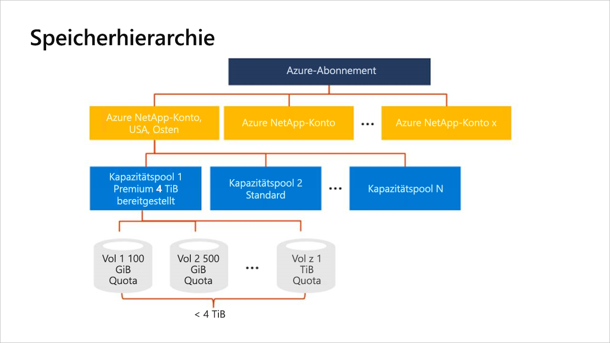

# Speicherhierarchie von Azure NetApp Files

Vor der Erstellung eines Volumes in Azure NetApp Files müssen Sie zunächst einen Pool für bereitgestellte Kapazität erwerben und einrichten.  Um einen Kapazitätspool einrichten zu können, benötigen Sie ein NetApp-Konto. Die Informationen zur Speicherhierarchie sind beim Einrichten und Verwalten Ihrer Azure NetApp Files-Ressourcen hilfreich.

> [!IMPORTANT] 
> Azure NetApp Files unterstützt derzeit keine Ressourcenmigration zwischen Abonnements.

## NetApp-Konten

- Ein NetApp-Konto fungiert als administrative Gruppierung der einzelnen Kapazitätspools.  
- Ein NetApp-Konto ist nicht dasselbe wie Ihr allgemeines Azure-Speicherkonto. 
- Ein NetApp-Konto deckt einen regionalen Bereich ab.   
- Sie können über mehrere NetApp-Konten in einer Region verfügen, jedes NetApp-Konto ist aber an eine einzelne Region gebunden.

## Kapazitätspools

Wenn Sie mit der Funktionsweise von Kapazitätspools vertraut sind, können Sie leichter die richtigen Typen von Kapazitätspools auswählen, die Sie zur Erfüllung Ihrer Speicheranforderungen benötigen. 

### Allgemeine Regeln von Kapazitätspools

- Ein Kapazitätspool wird anhand der bereitgestellten Kapazität gemessen.   
    Weitere Informationen finden Sie unter [QoS-Typen für Kapazitätspools](#qos_types).  
- Die Kapazität wird durch die festen SKUs bereitgestellt, die Sie erworben haben (beispielsweise eine Kapazität von 4 TiB).
- Ein Kapazitätspool kann lediglich einen einzelnen Servicelevel aufweisen.  
- Jeder einzelne Kapazitätspool kann nur zu einem einzelnen NetApp-Konto gehören. Innerhalb eines NetApp-Kontos können jedoch mehrere Kapazitätspools vorhanden sein.  
- Ein Kapazitätspool kann nicht zwischen NetApp-Konten verschoben werden.   
  Im [Konzeptdiagramm der Speicherhierarchie](#conceptual_diagram_of_storage_hierarchy) weiter unten kann beispielsweise der Kapazitätspool 1 nicht aus dem NetApp-Konto für „USA, Osten“ in das NetApp-Konto für „USA, Westen 2“ verschoben werden.  
- Ein Kapazitätspool kann erst gelöscht werden, wenn alle Volumes innerhalb des Kapazitätspools gelöscht wurden.

### QoS-Typen für Kapazitätspools

Der QoS-Typ (Quality of Service, Servicequalität) ist ein Attribut eines Kapazitätspools. Azure NetApp Files verfügt über zwei QoS-Typen für Kapazitätspools. 

- QoS-Typ *Automatisch („Auto“)*  

    Beim Erstellen eines Kapazitätspools wird standardmäßig der QoS-Typ „Auto“ verwendet.

    In einem QoS-Kapazitätspool vom Typ „Auto“ wird der Durchsatz den Volumes im Pool automatisch zugewiesen. Dies erfolgt proportional zum Größenkontingent, das den Volumes zugewiesen ist. 

    Der maximale Durchsatz, der einem Volume zugewiesen ist, richtet sich nach dem Servicelevel des Kapazitätspools und dem Größenkontingent des Volumes. Unter [Dienstebenen für Azure NetApp Files](azure-netapp-files-service-levels.md) finden Sie ein Beispiel für eine Berechnung.

- QoS-Typ *Manuell*  

     > [!IMPORTANT] 
     > Bei Verwendung des QoS-Typs „Manuell“ für einen Kapazitätspool ist eine Registrierung erforderlich.  Informationen hierzu finden Sie unter [Verwalten eines manuellen QoS-Kapazitätspools](manage-manual-qos-capacity-pool.md).  

    Sie haben die Möglichkeit, für einen Kapazitätspool den QoS-Typ „Manuell“ zu verwenden.

    Bei einem Kapazitätspool mit dem QoS-Typ „Manuell“ können Sie die Kapazität und den Durchsatz für ein Volume separat zuweisen. Der Gesamtdurchsatz aller Volumes, die mit einem Kapazitätspool mit dem QoS-Typ „Manuell“ erstellt werden, ist durch den Gesamtdurchsatz des Pools begrenzt.  Dieser wird anhand der Kombination von Poolgröße und Serviceleveldurchsatz ermittelt. 

    Ein Kapazitätspool mit 4 TiB und dem Servicelevel „Ultra“ verfügt beispielsweise über einen Gesamtdurchsatz von 512 MiB/s (4 TiB · 128 MiB/s/TiB), der für die Volumes verfügbar ist.

## Volumes

- Ein Volume wird anhand des logischen Kapazitätsverbrauchs gemessen und ist skalierbar. 
- Der Kapazitätsverbrauch eines Volumes wird mit der bereitgestellten Kapazität des dazugehörigen Pools verrechnet.
- Der Durchsatzverbrauch eines Volumes wird auf den verfügbaren Durchsatz des zugehörigen Pools angerechnet. Weitere Informationen finden Sie unter [QoS-Typ „Manuell“](#manual_qos_type).
- Jedes Volume gehört zu einem einzelnen Pool, ein Pool kann jedoch mehrere Volumes enthalten. 

## Konzeptdiagramm der Speicherhierarchie 
Das folgende Beispiel zeigt die Beziehungen zwischen Azure-Abonnement, NetApp-Konten, Kapazitätspools und Volumes.   

## Nächste Schritte

- [Ressourcenlimits für Azure NetApp Files](azure-netapp-files-resource-limits.md)
- [Registrieren für Azure NetApp Files](azure-netapp-files-register.md)
- [Dienstebenen für Azure NetApp Files](azure-netapp-files-service-levels.md)
- [Überlegungen zur Leistung für Azure NetApp Files](azure-netapp-files-performance-considerations.md)
- [Einrichten eines Kapazitätspools](azure-netapp-files-set-up-capacity-pool.md)
- [Verwalten eines manuellen QoS-Kapazitätspools](manage-manual-qos-capacity-pool.md)
