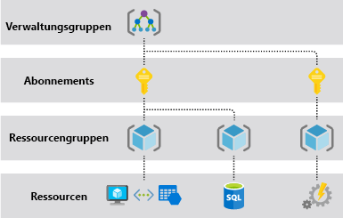

# Was ist Azure Resource Manager?

Azure Resource Manager ist der Bereitstellungs- und Verwaltungsdienst für Azure. Er bietet eine Verwaltungsebene, die das Erstellen, Aktualisieren und Löschen von Ressourcen in Ihrem Azure-Konto ermöglicht. Mithilfe von Verwaltungsfeatures wie Zugriffssteuerung, Sperren und Tags können Sie Ihre Ressourcen nach der Bereitstellung schützen und organisieren.

Informationen zu Azure Resource Manager-Vorlagen (ARM-Vorlagen) finden Sie in der [Übersicht über die Vorlagenbereitstellung](../templates/overview.md).

## Einheitliche Verwaltungsebene

Wenn ein Benutzer eine Anforderung über eines der Azure-Tools, über eine der APIs oder über eines der SDKs sendet, wird diese von Resource Manager empfangen. Die Anforderung wird authentifiziert und autorisiert. Anschließend sendet Resource Manager die Anforderung an den Azure-Dienst, der daraufhin die angeforderte Aktion ausführt. Da alle Anforderungen von der gleichen API verarbeitet werden, stehen in allen Tools konsistente Ergebnisse und Funktionen zur Verfügung.

Die folgende Abbildung veranschaulicht die Rolle von Azure Resource Manager bei der Behandlung von Azure-Anforderungen.

Alle Funktionen, die über das Azure-Portal verfügbar sind, stehen auch über PowerShell, die Azure CLI, die REST-APIs und über Client-SDKs zur Verfügung. Funktionen, die ursprünglich über APIs veröffentlicht wurden, werden innerhalb von 180 Tagen ab der ursprünglichen Veröffentlichung in das Portal aufgenommen.

## Begriff

Wenn Sie mit dem Azure Resource Manager noch nicht vertraut sind, kennen Sie unter Umständen einige Begriffe noch nicht.

* **Ressource** : Ein verwaltbares Element, das über Azure verfügbar ist. Virtuelle Computer, Speicherkonten, Web-Apps, Datenbanken und virtuelle Netzwerke sind Beispiele für Ressourcen. Ressourcengruppen, Abonnements, Verwaltungsgruppen und Tags sind ebenfalls Beispiele für Ressourcen.
* **Ressourcengruppe** : Ein Container, der verwandte Ressourcen für eine Azure-Lösung enthält. Die Ressourcengruppe enthält die Ressourcen, die Sie als Gruppe verwalten möchten. Sie entscheiden in Abhängigkeit davon, was für Ihre Organisation am sinnvollsten ist, welche Ressourcen in eine Ressourcengruppen gehören. Weitere Informationen finden Sie unter [Ressourcengruppen](#resource-groups).
* **Ressourcenanbieter:** Ein Dienst, der Azure-Ressourcen bereitstellt. Ein gängiger Ressourcenanbieter, von dem die VM-Ressource bereitgestellt wird, ist beispielsweise `Microsoft.Compute`. `Microsoft.Storage` ist ein weiterer gängiger Ressourcenanbieter. Weitere Informationen finden Sie unter [Ressourcenanbieter und -typen](resource-providers-and-types.md).
* **Resource Manager-Vorlage:** Eine JSON-Datei (JavaScript Object Notation), mit der eine oder mehrere Ressourcen zum Bereitstellen einer Ressourcengruppe, eines Abonnements, einer Verwaltungsgruppe oder eines Mandanten definiert werden. Die Vorlage kann zum konsistenten und wiederholten Bereitstellen der Ressourcen verwendet werden. Weitere Informationen finden Sie in der [Übersicht über die Vorlagenbereitstellung](../templates/overview.md).
* **Deklarative Syntax** : Bei dieser Syntax können Sie beispielsweise „Here is what I intend to create“ (Dies möchte ich erstellen) eingeben, ohne dafür die Folge der Programmierbefehle für die Erstellung schreiben zu müssen. Die Resource Manager-Vorlage ist ein Beispiel für die deklarative Syntax. In der Datei definieren Sie die Eigenschaften für die Infrastruktur zum Bereitstellen für Azure.  Weitere Informationen finden Sie in der [Übersicht über die Vorlagenbereitstellung](../templates/overview.md).

## Vorteile der Verwendung des Ressourcen-Managers

Resource Manager ermöglicht Folgendes:

* Verwalten Ihrer Infrastruktur über deklarative Vorlagen (anstelle von Skripts)

* Bereitstellen, Verwalten und Überwachen aller Ressourcen für Ihre Lösung als Gruppe, anstatt diese Ressourcen einzeln zu behandeln

* Wiederholtes Bereitstellen Ihrer Lösung während des gesamten Entwicklungslebenszyklus mit der Gewissheit, dass Ihre Ressourcen konsistent bereitgestellt werden

* Definieren der Abhängigkeiten zwischen Ressourcen, sodass diese in der korrekten Reihenfolge bereitgestellt werden

* Anwenden der Zugriffssteuerung auf alle Dienste, da die rollenbasierte Zugriffssteuerung von Azure (Azure Role-Based Access Control, Azure RBAC) nativ in die Verwaltungsplattform integriert ist

* Anwenden von Tags auf Ressourcen, um alle Ressourcen in Ihrem Abonnement logisch zu organisieren

* Anzeigen der Kosten für eine Gruppe von Ressourcen mit dem gleichen Tag, um die Abrechnungstransparenz Ihrer Organisation zu verbessern

## Der Bereich

Azure bietet vier Bereichsebenen: [Verwaltungsgruppen](../../governance/management-groups/overview.md), Abonnements, [Ressourcengruppen](#resource-groups) und Ressourcen. Die folgende Abbildung zeigt ein Beispiel dieser Ebenen.

Sie wenden die Verwaltungseinstellungen auf einer dieser Bereichsebenen an. Die von Ihnen ausgewählte Ebene bestimmt, wie umfassend die Einstellung angewendet wird. Niedrigere Ebenen erben die Einstellungen von höheren Ebenen. Wenn Sie also beispielsweise eine [Richtlinie](../../governance/policy/overview.md) auf das Abonnement anwenden, gilt diese für alle Ressourcengruppen und Ressourcen in Ihrem Abonnement. Wenn Sie eine Richtlinie auf die Ressourcengruppe anwenden, gilt diese für die Ressourcengruppe und alle dazugehörigen Ressourcen. Andere Ressourcengruppen sind von der Richtlinienzuweisung dagegen nicht betroffen.

Sie können Vorlagen für Mandanten, Verwaltungsgruppen, Abonnements oder Ressourcengruppen bereitstellen.

## Ressourcengruppen

Beim Definieren der Ressourcengruppe sind einige wichtige Faktoren zu beachten:

* Alle Ressourcen einer Ressourcengruppe sollten über den gleichen Lebenszyklus verfügen. Sie werden von Ihnen zusammen bereitgestellt, aktualisiert und gelöscht. Falls eine Ressource, z. B. ein Server, in einem anderen Entwicklungszyklus vorhanden sein muss, sollte er in einer anderen Ressourcengruppe enthalten sein.

* Jede Ressource kann nur in einer Ressourcengruppe vorhanden sein.

* Sie können eine Ressource einer Ressourcengruppe jederzeit hinzufügen bzw. die Ressource daraus entfernen.

* Sie können eine Ressource aus einer Ressourcengruppe in eine andere Gruppe verschieben. Weitere Informationen finden Sie unter [Verschieben von Ressourcen in eine neue Ressourcengruppe oder ein neues Abonnement](move-resource-group-and-subscription.md).

* Die Ressourcen einer Ressourcengruppe können sich in anderen Regionen als die Ressourcengruppe befinden.

* Beim Erstellen einer Ressourcengruppe müssen Sie einen Standort für die Ressourcengruppe angeben. Vielleicht stellen Sie sich hierbei die folgende Frage: „Warum wird für eine Ressourcengruppe ein Standort benötigt? Und wenn die Ressourcen andere Standorte als die Ressourcengruppe aufweisen können, warum ist der Standort der Ressourcengruppe dann überhaupt wichtig?“ In der Ressourcengruppe werden Metadaten zu den Ressourcen gespeichert. Wenn Sie einen Standort für die Ressourcengruppe angeben, legen Sie fest, wo die Metadaten gespeichert werden. Aus Compliance-Gründen müssen Sie unter Umständen sicherstellen, dass Ihre Daten in einer bestimmten Region gespeichert werden.

   Ist die Region der Ressourcengruppe vorübergehend nicht verfügbar, können Sie keine Ressourcen in der Ressourcengruppe aktualisieren, da die Metadaten nicht verfügbar sind. Die Ressourcen in anderen Regionen funktionieren weiterhin wie erwartet, doch können Sie diese nicht aktualisieren. Weitere Informationen zum Entwerfen zuverlässiger Anwendungen finden Sie unter [Entwerfen zuverlässiger Azure-Anwendungen](/azure/architecture/checklist/resiliency-per-service).

* Eine Ressourcengruppe kann zum Festlegen der Zugriffssteuerung für administrative Aktionen verwendet werden. Zum Verwalten einer Ressourcengruppe können Sie [Azure-Richtlinien](../../governance/policy/overview.md), [Azure-Rollen](../../role-based-access-control/role-assignments-portal.md) oder [Ressourcensperren](lock-resources.md) zuweisen.

* Sie können auf eine Ressourcengruppe [Tags anwenden](tag-resources.md). Die Ressourcen in der Ressourcengruppe erben diese Tags nicht.

* Eine Ressource kann eine Verbindung mit Ressourcen in anderen Ressourcengruppen herstellen. Dieses Szenario kommt häufig vor, wenn die beiden Ressourcen zusammengehören, aber nicht denselben Lebenszyklus aufweisen. Beispielsweise können Sie über eine Web-App verfügen, die eine Verbindung mit einer Datenbank in einer anderen Ressourcengruppe herstellt.

* Wenn Sie eine Ressourcengruppe löschen, werden alle Ressourcen darin ebenfalls gelöscht. Weitere Informationen dazu, wie Azure Resource Manager diese Löschungen orchestriert, finden Sie unter [Löschen von Ressourcengruppen und Ressourcen mit Azure Resource Manager](delete-resource-group.md).

* Sie können bis zu 800 Instanzen eines Ressourcentyps in jeder Ressourcengruppe bereitstellen. Einige Ressourcentypen sind [von der Beschränkung auf 800 Instanzen ausgenommen](resources-without-resource-group-limit.md). Weitere Informationen finden Sie unter [Grenzwerte für Ressourcengruppen](azure-subscription-service-limits.md#resource-group-limits).

* Einige Ressourcen können außerhalb einer Ressourcengruppe vorhanden sein. Diese Ressourcen werden im [Abonnement](../templates/deploy-to-subscription.md), in der [Verwaltungsgruppe](../templates/deploy-to-management-group.md) oder im [Mandanten](../templates/deploy-to-tenant.md) bereitgestellt. In diesen Bereichen werden nur bestimmte Ressourcentypen unterstützt.

* Zum Erstellen einer Ressourcengruppe können Sie das [Portal](manage-resource-groups-portal.md#create-resource-groups), [PowerShell](manage-resource-groups-powershell.md#create-resource-groups), die [Azure CLI](manage-resource-groups-cli.md#create-resource-groups) oder eine [ARM-Vorlage](../templates/deploy-to-subscription.md#resource-groups) verwenden.

## Resilienz von Azure Resource Manager

Der Azure Resource Manager-Dienst ist auf Resilienz und fortlaufende Verfügbarkeit ausgelegt. Resource Manager-Vorgänge und Vorgänge auf Steuerungsebene (an `management.azure.com` gesendete Anforderungen) in der REST-API haben folgende Eigenschaften:

* Sie sind regionsübergreifend verteilt. Einige Dienste sind regional.

* Sie sind an Standorten mit mehreren Verfügbarkeitszonen über diese Verfügbarkeitszonen (sowie deren Regionen) verteilt.

* Sie sind nicht von einem einzelnen logischen Rechenzentrum abhängig.

* Sie werden nie für Wartungsaktivitäten außer Betrieb genommen.

Diese Resilienz gilt für Dienste, die Anforderungen über Resource Manager empfangen. Key Vault profitiert beispielsweise von dieser Resilienz.

## Nächste Schritte

* Informationen zu Grenzwerten, die auf Azure-Dienste angewendet werden, finden Sie unter [Einschränkungen für Azure-Abonnements und Dienste, Kontingente und Einschränkungen](azure-subscription-service-limits.md).

* Informationen zum Verschieben von Ressourcen finden Sie unter [Verschieben von Ressourcen in eine neue Ressourcengruppe oder ein neues Abonnement](move-resource-group-and-subscription.md).

* Informationen zum Taggen von Ressourcen finden Sie unter [Verwenden von Tags zum Organisieren von Azure-Ressourcen](tag-resources.md).

* Informationen zum Sperren von Ressourcen finden Sie unter [Sperren von Ressourcen, um unerwartete Änderungen zu verhindern](lock-resources.md).
