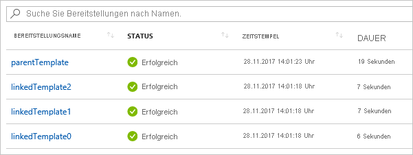

# <a name="using-linked-and-nested-templates-when-deploying-azure-resources"></a>Verwenden von verknüpften und geschachtelten Vorlagen bei der Bereitstellung von Azure-Ressourcen

Zum Bereitstellen komplexer Lösungen können Sie Ihre Vorlage in viele verwandte Vorlagen unterteilen und diese dann über eine Hauptvorlage gemeinsam bereitstellen. Die zugehörigen Vorlagen können separate Dateien oder in die Hauptvorlage eingebettete Vorlagensyntax sein. In diesem Artikel wird der Begriff **verknüpfte Vorlage** für eine separate Vorlagendatei verwendet, auf die über eine Verknüpfung in der Hauptvorlage verwiesen wird. Der Begriff **geschachtelte Vorlage** wird verwendet, um auf die eingebettete Vorlagensyntax in der Hauptvorlage zu verweisen.

Bei kleinen bis mittelgroßen Lösungen lässt sich eine Einzelvorlage einfacher verstehen und verwalten. Sie können alle Ressourcen und Werte in einer einzelnen Datei anzeigen. In erweiterten Szenarien können Sie mithilfe verknüpfter Vorlagen die Lösung in Zielkomponenten unterteilen. Sie können diese Vorlagen mühelos erneut für andere Szenarien verwenden.

Ein entsprechendes Tutorial finden Sie unter [Tutorial: Erstellen verknüpfter Azure Resource Manager-Vorlagen](./deployment-tutorial-linked-template.md).

> [!NOTE]
> Für verknüpfte oder geschachtelte Vorlagen können Sie den Bereitstellungsmodus nur auf [Inkrementell](deployment-modes.md) festlegen. Die Hauptvorlage kann jedoch im vollständigen Modus bereitgestellt werden. Wenn Sie die Hauptvorlage im vollständigen Modus bereitstellen und die verknüpfte oder geschachtelte Vorlage auf dieselbe Ressourcengruppe ausgerichtet ist, werden die in der verknüpften oder geschachtelten Vorlage bereitgestellten Ressourcen in die Auswertung für die Bereitstellung im vollständigen Modus aufgenommen. Die kombinierte Sammlung der in der Hauptvorlage und den verknüpften oder geschachtelten Vorlagen bereitgestellten Ressourcen wird mit den vorhandenen Ressourcen in der Ressourcengruppe verglichen. Alle Ressourcen, die nicht in dieser kombinierten Sammlung enthalten sind, werden gelöscht.
>
> Wenn die verknüpfte oder geschachtelte Vorlage auf eine andere Ressourcengruppe ausgerichtet ist, wird in dieser Bereitstellung der inkrementelle Modus verwendet.
>

## <a name="nested-template"></a>Geschachtelte Vorlage

Zum Schachteln einer Vorlage fügen Sie der Hauptvorlage eine [Bereitstellungsressource](/azure/templates/microsoft.resources/deployments) hinzu. Geben Sie in der **template**-Eigenschaft die Vorlagensyntax an.

```json
{
  "$schema": "https://schema.management.azure.com/schemas/2019-04-01/deploymentTemplate.json#",
  "contentVersion": "1.0.0.0",
  "parameters": {},
  "variables": {},
  "resources": [
    {
      "type": "Microsoft.Resources/deployments",
      "apiVersion": "2019-10-01",
      "name": "nestedTemplate1",
      "properties": {
        "mode": "Incremental",
        "template": {
          <nested-template-syntax>
        }
      }
    }
  ],
  "outputs": {
  }
}
```

Im folgenden Beispiel wird ein Speicherkonto über eine geschachtelte Vorlage bereitgestellt.

```json
{
  "$schema": "https://schema.management.azure.com/schemas/2019-04-01/deploymentTemplate.json#",
  "contentVersion": "1.0.0.0",
  "parameters": {
    "storageAccountName": {
      "type": "string"
    }
  },
  "resources": [
    {
      "type": "Microsoft.Resources/deployments",
      "apiVersion": "2019-10-01",
      "name": "nestedTemplate1",
      "properties": {
        "mode": "Incremental",
        "template": {
          "$schema": "https://schema.management.azure.com/schemas/2019-04-01/deploymentTemplate.json#",
          "contentVersion": "1.0.0.0",
          "resources": [
            {
              "type": "Microsoft.Storage/storageAccounts",
              "apiVersion": "2019-04-01",
              "name": "[parameters('storageAccountName')]",
              "location": "West US",
              "sku": {
                "name": "Standard_LRS"
              },
              "kind": "StorageV2"
            }
          ]
        }
      }
    }
  ],
  "outputs": {
  }
}
```

### <a name="expression-evaluation-scope-in-nested-templates"></a>Auswertungsbereich von Ausdrücken in geschachtelten Vorlagen

Bei Verwendung einer geschachtelten Vorlage können Sie angeben, ob Vorlagenausdrücke im Bereich der übergeordneten Vorlage oder der geschachtelten Vorlage ausgewertet werden sollen. Der Bereich legt fest, wie Parameter, Variablen und Funktionen (z. B. [resourceGroup](template-functions-resource.md#resourcegroup) und [subscription](template-functions-resource.md#subscription)) aufgelöst werden.

Der Bereich wird durch die `expressionEvaluationOptions`-Eigenschaft festgelegt. Standardmäßig wird die `expressionEvaluationOptions`-Eigenschaft auf `outer` festgelegt, sodass der übergeordnete Vorlagenbereich verwendet wird. Legen Sie den Wert auf `inner` fest, damit Ausdrücke innerhalb des Bereichs der geschachtelten Vorlage ausgewertet werden.

```json
{
  "type": "Microsoft.Resources/deployments",
  "apiVersion": "2019-10-01",
  "name": "nestedTemplate1",
  "properties": {
  "expressionEvaluationOptions": {
    "scope": "inner"
  },
  ...
```

Die folgende Vorlage veranschaulicht, wie Vorlagenausdrücke entsprechend dem Bereich aufgelöst werden. Sie enthält eine Variable mit dem Namen `exampleVar`, die sowohl in der übergeordneten als auch in der geschachtelten Vorlage definiert ist. Sie gibt den Wert der Variable zurück.

```json
{
  "$schema": "https://schema.management.azure.com/schemas/2019-04-01/deploymentTemplate.json#",
  "contentVersion": "1.0.0.0",
  "parameters": {
  },
  "variables": {
    "exampleVar": "from parent template"
  },
  "resources": [
    {
      "type": "Microsoft.Resources/deployments",
      "apiVersion": "2019-10-01",
      "name": "nestedTemplate1",
      "properties": {
        "expressionEvaluationOptions": {
          "scope": "inner"
        },
        "mode": "Incremental",
        "template": {
          "$schema": "https://schema.management.azure.com/schemas/2019-04-01/deploymentTemplate.json#",
          "contentVersion": "1.0.0.0",
          "variables": {
            "exampleVar": "from nested template"
          },
          "resources": [
          ],
          "outputs": {
            "testVar": {
              "type": "string",
              "value": "[variables('exampleVar')]"
            }
          }
        }
      }
    }
  ],
  "outputs": {
    "messageFromLinkedTemplate": {
      "type": "string",
      "value": "[reference('nestedTemplate1').outputs.testVar.value]"
    }
  }
}
```

Der Wert von `exampleVar` ändert sich abhängig vom Wert der Eigenschaft `scope` in `expressionEvaluationOptions`. In der folgenden Tabelle werden die Ergebnisse für beide Bereiche angezeigt.

| Bereich `expressionEvaluationOptions` | Output |
| ----- | ------ |
| Innerer Join | aus der geschachtelten Vorlage |
| äußerer (oder Standard) | aus der übergeordneten Vorlage |

Im folgenden Beispiel wird eine SQL Server-Instanz bereitgestellt, und ein Schlüsseltresorgeheimnis wird als Kennwort abgerufen. Der Bereich ist auf `inner` festgelegt, da er die Schlüsseltresor-ID dynamisch erstellt (siehe `adminPassword.reference.keyVault` in den `parameters` der umschließenden Vorlagen) und als Parameter an die geschachtelte Vorlage übergibt.

```json
{
  "$schema": "https://schema.management.azure.com/schemas/2019-04-01/deploymentTemplate.json#",
  "contentVersion": "1.0.0.0",
  "parameters": {
    "location": {
      "type": "string",
      "defaultValue": "[resourceGroup().location]",
      "metadata": {
        "description": "The location where the resources will be deployed."
      }
    },
    "vaultName": {
      "type": "string",
      "metadata": {
        "description": "The name of the keyvault that contains the secret."
      }
    },
    "secretName": {
      "type": "string",
      "metadata": {
        "description": "The name of the secret."
      }
    },
    "vaultResourceGroupName": {
      "type": "string",
      "metadata": {
        "description": "The name of the resource group that contains the keyvault."
      }
    },
    "vaultSubscription": {
      "type": "string",
      "defaultValue": "[subscription().subscriptionId]",
      "metadata": {
        "description": "The name of the subscription that contains the keyvault."
      }
    }
  },
  "resources": [
    {
      "type": "Microsoft.Resources/deployments",
      "apiVersion": "2019-10-01",
      "name": "dynamicSecret",
      "properties": {
        "mode": "Incremental",
        "expressionEvaluationOptions": {
          "scope": "inner"
        },
        "parameters": {
          "location": {
            "value": "[parameters('location')]"
          },
          "adminLogin": {
            "value": "ghuser"
          },
          "adminPassword": {
            "reference": {
              "keyVault": {
                "id": "[resourceId(parameters('vaultSubscription'), parameters('vaultResourceGroupName'), 'Microsoft.KeyVault/vaults', parameters('vaultName'))]"
              },
              "secretName": "[parameters('secretName')]"
            }
          }
        },
        "template": {
          "$schema": "https://schema.management.azure.com/schemas/2019-04-01/deploymentTemplate.json#",
          "contentVersion": "1.0.0.0",
          "parameters": {
            "adminLogin": {
              "type": "string"
            },
            "adminPassword": {
              "type": "securestring"
            },
            "location": {
              "type": "string"
            }
          },
          "variables": {
            "sqlServerName": "[concat('sql-', uniqueString(resourceGroup().id, 'sql'))]"
          },
          "resources": [
            {
              "type": "Microsoft.Sql/servers",
              "apiVersion": "2018-06-01-preview",
              "name": "[variables('sqlServerName')]",
              "location": "[parameters('location')]",
              "properties": {
                "administratorLogin": "[parameters('adminLogin')]",
                "administratorLoginPassword": "[parameters('adminPassword')]"
              }
            }
          ],
          "outputs": {
            "sqlFQDN": {
              "type": "string",
              "value": "[reference(variables('sqlServerName')).fullyQualifiedDomainName]"
            }
          }
        }
      }
    }
  ],
  "outputs": {
  }
}
```

> [!NOTE]
>
> Wenn der Bereich auf `outer` festgelegt ist, können Sie die `reference`-Funktion nicht im Ausgabeabschnitt einer geschachtelten Vorlage für eine Ressource verwenden, die Sie in der geschachtelten Vorlage bereitgestellt haben. Um die Werte für eine bereitgestellte Ressource in einer geschachtelten Vorlage zurückzugeben, verwenden Sie den Bereich `inner`, oder konvertieren Sie die geschachtelte Vorlage in eine verknüpfte Vorlage.

## <a name="linked-template"></a>Verknüpfte Vorlage

Zum Verknüpfen einer Vorlage fügen Sie der Hauptvorlage eine [Bereitstellungsressource](/azure/templates/microsoft.resources/deployments) hinzu. Geben Sie in der **templateLink**-Eigenschaft den URI der einzuschließenden Vorlage an. Im folgenden Beispiel wird eine Vorlage verknüpft, die ein neues Speicherkonto bereitstellt.

```json
{
  "$schema": "https://schema.management.azure.com/schemas/2019-04-01/deploymentTemplate.json#",
  "contentVersion": "1.0.0.0",
  "parameters": {},
  "variables": {},
  "resources": [
    {
      "type": "Microsoft.Resources/deployments",
      "apiVersion": "2019-10-01",
      "name": "linkedTemplate",
      "properties": {
        "mode": "Incremental",
        "templateLink": {
          "uri":"https://mystorageaccount.blob.core.windows.net/AzureTemplates/newStorageAccount.json",
          "contentVersion":"1.0.0.0"
        }
      }
    }
  ],
  "outputs": {
  }
}
```

Beim Verweisen auf eine verknüpfte Vorlage darf der Wert von `uri` keine lokale Datei oder keine Datei sein, die nur in Ihrem lokalen Netzwerk verfügbar ist. Sie müssen einen URI-Wert angeben, der als **http**- oder **https**-Wert heruntergeladen werden kann.

> [!NOTE]
>
> Sie können auf Vorlagen mithilfe von Parametern verweisen, die letztendlich in einen Wert aufgelöst werden, der **http** oder **https** verwendet, beispielsweise die Verwendung des Parameters `_artifactsLocation` wie folgt: `"uri": "[concat(parameters('_artifactsLocation'), '/shared/os-disk-parts-md.json', parameters('_artifactsLocationSasToken'))]",`

Der Resource Manager muss auf die Vorlage zugreifen können. Eine Option besteht darin, die verknüpfte Vorlage in einem Speicherkonto zu platzieren und den URI für dieses Element zu verwenden.

### <a name="parameters-for-linked-template"></a>Parameter für eine verknüpfte Vorlage

Sie können die Parameter für die verknüpfte Vorlage in einer externen Datei oder inline bereitstellen. Verenden Sie zum Bereitstellen einer externen Parameterdatei die **parametersLink**-Eigenschaft:

```json
"resources": [
  {
  "type": "Microsoft.Resources/deployments",
  "apiVersion": "2019-10-01",
  "name": "linkedTemplate",
  "properties": {
    "mode": "Incremental",
    "templateLink": {
      "uri":"https://mystorageaccount.blob.core.windows.net/AzureTemplates/newStorageAccount.json",
      "contentVersion":"1.0.0.0"
    },
    "parametersLink": {
      "uri":"https://mystorageaccount.blob.core.windows.net/AzureTemplates/newStorageAccount.parameters.json",
      "contentVersion":"1.0.0.0"
    }
  }
  }
]
```

Um Parameterwerte inline zu übergeben, verwenden Sie die **parameters**-Eigenschaft.

```json
"resources": [
  {
   "type": "Microsoft.Resources/deployments",
   "apiVersion": "2019-10-01",
   "name": "linkedTemplate",
   "properties": {
     "mode": "Incremental",
     "templateLink": {
      "uri":"https://mystorageaccount.blob.core.windows.net/AzureTemplates/newStorageAccount.json",
      "contentVersion":"1.0.0.0"
     },
     "parameters": {
      "storageAccountName":{"value": "[parameters('storageAccountName')]"}
    }
   }
  }
]
```

Sie können nicht sowohl Inlineparameter als auch einen Link auf eine Parameterdatei verwenden. Bei der Bereitstellung tritt ein Fehler auf, wenn sowohl `parametersLink` als auch `parameters` angegeben sind.

## <a name="template-specs"></a>Vorlagenspezifikationen

Anstatt die verknüpften Vorlagen an einem zugänglichen Endpunkt zu verwalten, können Sie eine [Vorlagenspezifikation](template-specs.md) erstellen, die die Hauptvorlage und die verknüpften Vorlagen in eine einzelne Entität verpackt, die Sie bereitstellen können. Bei der Vorlagenspezifikation handelt es sich um eine Ressource im Azure-Abonnement. Sie vereinfacht die sichere Freigabe der Vorlage für Benutzer in Ihrer Organisation. Mit der rollenbasierten Zugriffssteuerung (Role-Based Access Control, RBAC) können Sie Zugriff auf die Vorlagenspezifikation gewähren. Diese Funktion steht derzeit als Vorschau zur Verfügung.

Weitere Informationen finden Sie unter

- [Tutorial: Erstellen einer Vorlagenspezifikation mit verknüpften Vorlagen](./template-specs-create-linked.md).
- [Tutorial: Bereitstellen einer Vorlagenspezifikation als verknüpfte Vorlage](./template-specs-deploy-linked-template.md).

## <a name="contentversion"></a>contentVersion

Sie müssen die `contentVersion`-Eigenschaft für die `templateLink`- oder `parametersLink`- Eigenschaft nicht angeben. Wenn Sie keinen Wert für `contentVersion` angeben, wird die aktuelle Version der Vorlage bereitgestellt. Wenn Sie einen Wert für die Inhaltsversion angeben, muss diese mit der Version in der verknüpften Vorlage übereinstimmen. Andernfalls tritt bei der Bereitstellung ein Fehler auf.

## <a name="using-variables-to-link-templates"></a>Verwenden von Variablen für das Verknüpfen von Vorlagen

Die vorherigen Beispiele zeigen hartcodierte URL-Werte für die Vorlagenlinks. Dieser Ansatz funktioniert zwar bei einfachen Vorlagen, er funktioniert jedoch nicht gut bei einer großen Anzahl von modularen Vorlagen. Stattdessen können Sie eine statische Variable erstellen, die eine Basis-URL für die Hauptvorlage speichert, und dann aus dieser Basis-URL dynamisch URLs für die verknüpften Vorlagen erstellen. Der Vorteil dieses Ansatzes besteht darin, dass Sie die Vorlage problemlos verschieben oder verzweigen können, da Sie nur die statische Variable in der Hauptvorlage ändern müssen. Die Hauptvorlage übergibt die richtigen URIs an die zerlegten Vorlagen.

Das folgende Beispiel zeigt, wie Sie eine Basis-URL verwenden können, um zwei URLs für verknüpfte Vorlagen (**sharedTemplateUrl** und **vmTemplate**) zu erstellen.

```json
"variables": {
  "templateBaseUrl": "https://raw.githubusercontent.com/Azure/azure-quickstart-templates/master/postgresql-on-ubuntu/",
  "sharedTemplateUrl": "[uri(variables('templateBaseUrl'), 'shared-resources.json')]",
  "vmTemplateUrl": "[uri(variables('templateBaseUrl'), 'database-2disk-resources.json')]"
}
```

Sie können auch [deployment()](template-functions-deployment.md#deployment) verwenden, um die Basis-URL für die aktuelle Vorlage zu erhalten. Mit dieser können Sie die URL für die anderen Vorlagen am gleichen Speicherort abrufen. Diese Vorgehensweise ist hilfreich, wenn sich der Speicherort der Vorlage ändert oder wenn Sie es vermeiden möchten, URLs in der Vorlagendatei hart zu codieren. Die Eigenschaft „templateLink“ wird nur zurückgegeben, wenn auf eine Remotevorlage mit einer URL verwiesen wird. Wenn Sie eine lokale Vorlage verwenden, ist diese Eigenschaft nicht verfügbar.

```json
"variables": {
  "sharedTemplateUrl": "[uri(deployment().properties.templateLink.uri, 'shared-resources.json')]"
}
```

Letztendlich verwenden Sie die Variable in der `uri`-Eigenschaft einer `templateLink`-Eigenschaft.

```json
"templateLink": {
 "uri": "[variables('sharedTemplateUrl')]",
 "contentVersion":"1.0.0.0"
}
```

## <a name="using-copy"></a>Verwenden von „copy“

Wenn Sie mehrere Instanzen einer Ressource mit einer geschachtelten Vorlage erstellen möchten, fügen Sie das Element „copy“ auf der Ebene der Ressource **Microsoft.Resources/deployments** hinzu. Wenn der innere Bereich verwendet wird, können Sie die Kopie innerhalb der geschachtelten Vorlage hinzufügen.

In der folgenden Beispielvorlage wird die Verwendung von „copy“ mit einer geschachtelten Vorlage veranschaulicht.

```json
"resources": [
  {
  "type": "Microsoft.Resources/deployments",
  "apiVersion": "2019-10-01",
  "name": "[concat('nestedTemplate', copyIndex())]",
  // yes, copy works here
  "copy":{
    "name": "storagecopy",
    "count": 2
  },
  "properties": {
    "mode": "Incremental",
    "expressionEvaluationOptions": {
    "scope": "inner"
    },
    "template": {
    "$schema": "https://schema.management.azure.com/schemas/2019-04-01/deploymentTemplate.json#",
    "contentVersion": "1.0.0.0",
    "resources": [
      {
      "type": "Microsoft.Storage/storageAccounts",
      "apiVersion": "2019-04-01",
      "name": "[concat(variables('storageName'), copyIndex())]",
      "location": "West US",
      "sku": {
        "name": "Standard_LRS"
      },
      "kind": "StorageV2"
      // Copy works here when scope is inner
      // But, when scope is default or outer, you get an error
      //"copy":{
      //  "name": "storagecopy",
      //  "count": 2
      //}
      }
    ]
    }
  }
  }
]
```

## <a name="get-values-from-linked-template"></a>Abrufen von Werten aus einer verknüpften Vorlage

Um einen Ausgabewert aus einer verknüpften Vorlage abzurufen, rufen Sie den Eigenschaftswert mit einer der folgenden ähnlichen Syntax ab: `"[reference('deploymentName').outputs.propertyName.value]"`.

Wenn Sie eine Ausgabeeigenschaft von einer verknüpften Vorlage abrufen, darf der Name der Eigenschaft keinen Bindestrich enthalten.

In den folgenden Beispielen wird veranschaulicht, wie Sie auf eine verknüpfte Vorlage verweisen und einen Ausgabewert abrufen. Die verknüpfte Vorlage gibt eine einfache Nachricht zurück.  Zunächst die verknüpfte Vorlage:

```json
{
  "$schema": "https://schema.management.azure.com/schemas/2019-04-01/deploymentTemplate.json#",
  "contentVersion": "1.0.0.0",
  "parameters": {},
  "variables": {},
  "resources": [],
  "outputs": {
    "greetingMessage": {
      "value": "Hello World",
      "type" : "string"
    }
  }
}
```

Die Hauptvorlage stellt die verknüpfte Vorlage bereit und ruft den zurückgegebenen Wert ab. Beachten Sie, dass sie durch den Namen auf die Bereitstellungsressource verweist und den Namen der von der verknüpften Vorlage zurückgegebenen Eigenschaft verwendet.

```json
{
  "$schema": "https://schema.management.azure.com/schemas/2019-04-01/deploymentTemplate.json#",
  "contentVersion": "1.0.0.0",
  "parameters": {},
  "variables": {},
  "resources": [
    {
      "type": "Microsoft.Resources/deployments",
      "apiVersion": "2019-10-01",
      "name": "linkedTemplate",
      "properties": {
        "mode": "Incremental",
        "templateLink": {
          "uri": "[uri(deployment().properties.templateLink.uri, 'helloworld.json')]",
          "contentVersion": "1.0.0.0"
        }
      }
    }
  ],
  "outputs": {
    "messageFromLinkedTemplate": {
      "type": "string",
      "value": "[reference('linkedTemplate').outputs.greetingMessage.value]"
    }
  }
}
```

Wie bei anderen Ressourcentypen können Sie Abhängigkeiten zwischen der verknüpften Vorlage und anderen Ressourcen festlegen. Wenn andere Ressourcen einen Ausgabewert aus der verknüpften Vorlage benötigen, stellen Sie sicher, dass die verknüpfte Vorlage vor ihnen bereitgestellt wird. Wenn andererseits die verknüpfte Vorlage von anderen Ressourcen abhängig ist, sorgen Sie dafür, dass andere Ressourcen vor der verknüpften Vorlage bereitgestellt werden.

Im folgenden Beispiel ist eine Vorlage dargestellt, die eine öffentliche IP-Adresse bereitstellt und die Ressourcen-ID der Azure-Ressource für diese öffentliche IP-Adresse zurückgibt:

```json
{
  "$schema": "https://schema.management.azure.com/schemas/2019-04-01/deploymentTemplate.json#",
  "contentVersion": "1.0.0.0",
  "parameters": {
    "publicIPAddresses_name": {
      "type": "string"
    }
  },
  "variables": {},
  "resources": [
    {
      "type": "Microsoft.Network/publicIPAddresses",
      "apiVersion": "2018-11-01",
      "name": "[parameters('publicIPAddresses_name')]",
      "location": "eastus",
      "properties": {
        "publicIPAddressVersion": "IPv4",
        "publicIPAllocationMethod": "Dynamic",
        "idleTimeoutInMinutes": 4
      },
      "dependsOn": []
    }
  ],
  "outputs": {
    "resourceID": {
      "type": "string",
      "value": "[resourceId('Microsoft.Network/publicIPAddresses', parameters('publicIPAddresses_name'))]"
    }
  }
}
```

Um beim Bereitstellen eines Lastenausgleichs die öffentliche IP-Adresse aus der vorherigen Vorlage zu verwenden, verknüpfen Sie die Vorlage, und deklarieren Sie eine Abhängigkeit von der `Microsoft.Resources/deployments`-Ressource. Die öffentliche IP-Adresse des Lastenausgleichs wird auf den Ausgabewert von der verknüpften Vorlage festgelegt.

```json
{
  "$schema": "https://schema.management.azure.com/schemas/2019-04-01/deploymentTemplate.json#",
  "contentVersion": "1.0.0.0",
  "parameters": {
    "loadBalancers_name": {
      "defaultValue": "mylb",
      "type": "string"
    },
    "publicIPAddresses_name": {
      "defaultValue": "myip",
      "type": "string"
    }
  },
  "variables": {},
  "resources": [
    {
      "type": "Microsoft.Network/loadBalancers",
      "apiVersion": "2018-11-01",
      "name": "[parameters('loadBalancers_name')]",
      "location": "eastus",
      "properties": {
        "frontendIPConfigurations": [
          {
            "name": "LoadBalancerFrontEnd",
            "properties": {
              "privateIPAllocationMethod": "Dynamic",
              "publicIPAddress": {
                // this is where the output value from linkedTemplate is used
                "id": "[reference('linkedTemplate').outputs.resourceID.value]"
              }
            }
          }
        ],
        "backendAddressPools": [],
        "loadBalancingRules": [],
        "probes": [],
        "inboundNatRules": [],
        "outboundNatRules": [],
        "inboundNatPools": []
      },
      // This is where the dependency is declared
      "dependsOn": [
        "linkedTemplate"
      ]
    },
    {
      "type": "Microsoft.Resources/deployments",
      "apiVersion": "2019-10-01",
      "name": "linkedTemplate",
      "properties": {
        "mode": "Incremental",
        "templateLink": {
          "uri": "[uri(deployment().properties.templateLink.uri, 'publicip.json')]",
          "contentVersion": "1.0.0.0"
        },
        "parameters":{
          "publicIPAddresses_name":{"value": "[parameters('publicIPAddresses_name')]"}
        }
      }
    }
  ]
}
```

## <a name="deployment-history"></a>Bereitstellungsverlauf

Der Resource Manager verarbeitet jede Vorlage als separate Bereitstellung im Bereitstellungsverlauf. Eine Hauptvorlage mit drei verknüpften oder geschachtelten Vorlagen wird im Bereitstellungsverlauf wie folgt angezeigt:



Über diese separaten Einträge im Verlauf können Sie nach der Bereitstellung Ausgabewerte abrufen. Mit der folgenden Vorlage wird eine öffentliche IP-Adresse erstellt und die IP-Adresse ausgegeben:

```json
{
  "$schema": "https://schema.management.azure.com/schemas/2019-04-01/deploymentTemplate.json#",
  "contentVersion": "1.0.0.0",
  "parameters": {
    "publicIPAddresses_name": {
      "type": "string"
    }
  },
  "variables": {},
  "resources": [
    {
      "type": "Microsoft.Network/publicIPAddresses",
      "apiVersion": "2018-11-01",
      "name": "[parameters('publicIPAddresses_name')]",
      "location": "southcentralus",
      "properties": {
        "publicIPAddressVersion": "IPv4",
        "publicIPAllocationMethod": "Static",
        "idleTimeoutInMinutes": 4,
        "dnsSettings": {
          "domainNameLabel": "[concat(parameters('publicIPAddresses_name'), uniqueString(resourceGroup().id))]"
        }
      },
      "dependsOn": []
    }
  ],
  "outputs": {
    "returnedIPAddress": {
      "type": "string",
      "value": "[reference(parameters('publicIPAddresses_name')).ipAddress]"
    }
  }
}
```

Die folgende Vorlage wird mit der vorherigen Vorlage verknüpft. Es werden drei öffentliche IP-Adressen erstellt.

```json
{
  "$schema": "https://schema.management.azure.com/schemas/2019-04-01/deploymentTemplate.json#",
  "contentVersion": "1.0.0.0",
  "parameters": {
  },
  "variables": {},
  "resources": [
    {
      "type": "Microsoft.Resources/deployments",
      "apiVersion": "2019-10-01",
      "name": "[concat('linkedTemplate', copyIndex())]",
      "copy": {
        "count": 3,
        "name": "ip-loop"
      },
      "properties": {
        "mode": "Incremental",
        "templateLink": {
        "uri": "[uri(deployment().properties.templateLink.uri, 'static-public-ip.json')]",
        "contentVersion": "1.0.0.0"
        },
        "parameters":{
          "publicIPAddresses_name":{"value": "[concat('myip-', copyIndex())]"}
        }
      }
    }
  ]
}
```

Nach der Bereitstellung können Sie die Ausgabewerte mit dem folgenden PowerShell-Skript abrufen:

```azurepowershell-interactive
$loopCount = 3
for ($i = 0; $i -lt $loopCount; $i++)
{
  $name = 'linkedTemplate' + $i;
  $deployment = Get-AzResourceGroupDeployment -ResourceGroupName examplegroup -Name $name
  Write-Output "deployment $($deployment.DeploymentName) returned $($deployment.Outputs.returnedIPAddress.value)"
}
```

Oder ein Azure CLI-Skript in einer Bash-Shell:

```azurecli-interactive
#!/bin/bash

for i in 0 1 2;
do
  name="linkedTemplate$i";
  deployment=$(az deployment group show -g examplegroup -n $name);
  ip=$(echo $deployment | jq .properties.outputs.returnedIPAddress.value);
  echo "deployment $name returned $ip";
done
```

## <a name="securing-an-external-template"></a>Sichern einer externen Vorlage

Obwohl die verknüpfte Vorlage extern verfügbar sein muss, muss sie nicht allgemein der Öffentlichkeit zur Verfügung stehen. Sie können Ihre Vorlage einem privaten Speicherkonto hinzufügen, auf das nur der Speicherkontobesitzer Zugriff hat. Anschließend erstellen Sie ein SAS-Token (Shared Access Signature), um den Zugriff während der Bereitstellung zu ermöglichen. Sie fügen dieses SAS-Token dem URI für die verknüpfte Vorlage hinzu. Obwohl das Token als sichere Zeichenfolge übergeben wird, wird der URI der verknüpften Vorlage samt SAS-Token in den Bereitstellungsvorgängen protokolliert. Legen Sie ein Ablaufdatum für das Token fest, um den Zugriff zu beschränken.

Für die Parameterdatei kann auch die Einschränkung gelten, dass der Zugriff nur mithilfe eines SAS-Tokens möglich ist.

Derzeit ist es nicht möglich, eine Verknüpfung mit einer Vorlage in einem Speicherkonto zu erstellen, das sich hinter einer [Azure Storage-Firewall](../../storage/common/storage-network-security.md) befindet.

> [!IMPORTANT]
> Anstatt die verknüpfte Vorlage mit einem SAS-Token zu sichern, können Sie eine [Vorlagenspezifikationen](template-specs.md) erstellen. In der Vorlagenspezifikation werden die Hauptvorlage und die verknüpften Vorlagen auf sichere Weise als Ressource im Azure-Abonnement gespeichert. Mit RBAC können Sie Benutzern Zugriff gewähren, die die Vorlage bereitstellen müssen.

Im folgenden Beispiel wird veranschaulicht, wie ein SAS-Token beim Verknüpfen mit einer Vorlage übergeben wird:

```json
{
  "$schema": "https://schema.management.azure.com/schemas/2019-04-01/deploymentTemplate.json#",
  "contentVersion": "1.0.0.0",
  "parameters": {
  "containerSasToken": { "type": "securestring" }
  },
  "resources": [
  {
    "type": "Microsoft.Resources/deployments",
    "apiVersion": "2019-10-01",
    "name": "linkedTemplate",
    "properties": {
    "mode": "Incremental",
    "templateLink": {
      "uri": "[concat(uri(deployment().properties.templateLink.uri, 'helloworld.json'), parameters('containerSasToken'))]",
      "contentVersion": "1.0.0.0"
    }
    }
  }
  ],
  "outputs": {
  }
}
```

In PowerShell rufen Sie ein Token für den Container ab und stellen die Vorlagen mit folgenden Befehlen bereit. Beachten Sie, dass der Parameter **containerSasToken** in der Vorlage definiert ist. Es handelt sich nicht um einen Parameter im Befehl **New-AzResourceGroupDeployment**.

```azurepowershell-interactive
Set-AzCurrentStorageAccount -ResourceGroupName ManageGroup -Name storagecontosotemplates
$token = New-AzStorageContainerSASToken -Name templates -Permission r -ExpiryTime (Get-Date).AddMinutes(30.0)
$url = (Get-AzStorageBlob -Container templates -Blob parent.json).ICloudBlob.uri.AbsoluteUri
New-AzResourceGroupDeployment -ResourceGroupName ExampleGroup -TemplateUri ($url + $token) -containerSasToken $token
```

Für die Azure CLI in einer Bash-Shell rufen Sie ein Token für den Container ab und stellen die Vorlagen mit folgendem Code bereit:

```azurecli-interactive
#!/bin/bash

expiretime=$(date -u -d '30 minutes' +%Y-%m-%dT%H:%MZ)
connection=$(az storage account show-connection-string \
  --resource-group ManageGroup \
  --name storagecontosotemplates \
  --query connectionString)
token=$(az storage container generate-sas \
  --name templates \
  --expiry $expiretime \
  --permissions r \
  --output tsv \
  --connection-string $connection)
url=$(az storage blob url \
  --container-name templates \
  --name parent.json \
  --output tsv \
  --connection-string $connection)
parameter='{"containerSasToken":{"value":"?'$token'"}}'
az deployment group create --resource-group ExampleGroup --template-uri $url?$token --parameters $parameter
```

## <a name="example-templates"></a>Beispielvorlagen

Die folgenden Beispiele zeigen gängige Nutzungsszenarien für verknüpften Vorlagen.

|Hauptvorlage  |Verknüpfte Vorlage |BESCHREIBUNG  |
|---------|---------| ---------|
|[Hello World](https://github.com/Azure/azure-docs-json-samples/blob/master/azure-resource-manager/linkedtemplates/helloworldparent.json) |[Verknüpfte Vorlage](https://github.com/Azure/azure-docs-json-samples/blob/master/azure-resource-manager/linkedtemplates/helloworld.json) | Gibt eine Zeichenfolge aus der verknüpften Vorlage zurück. |
|[Lastenausgleich mit öffentlicher IP-Adresse](https://github.com/Azure/azure-docs-json-samples/blob/master/azure-resource-manager/linkedtemplates/public-ip-parentloadbalancer.json) |[Verknüpfte Vorlage](https://github.com/Azure/azure-docs-json-samples/blob/master/azure-resource-manager/linkedtemplates/public-ip.json) |Gibt die öffentliche IP-Adresse aus der verknüpften Vorlage zurück und legt diesen Wert im Lastenausgleichsmodul fest. |
|[Mehrere IP-Adressen](https://github.com/Azure/azure-docs-json-samples/blob/master/azure-resource-manager/linkedtemplates/static-public-ip-parent.json) | [Verknüpfte Vorlage](https://github.com/Azure/azure-docs-json-samples/blob/master/azure-resource-manager/linkedtemplates/static-public-ip.json) |Erstellt verschiedene öffentliche IP-Adressen in der verknüpften Vorlage.  |

## <a name="next-steps"></a>Nächste Schritte

* Ein entsprechendes Tutorial finden Sie unter [Tutorial: Erstellen verknüpfter Azure Resource Manager-Vorlagen](./deployment-tutorial-linked-template.md).
* Informationen zum Definieren der Bereitstellungsreihenfolge Ihrer Ressourcen finden Sie unter [Definieren von Abhängigkeiten in Azure Resource Manager-Vorlagen](define-resource-dependency.md).
* Informationen, wie Sie eine Ressource definieren und von dieser viele Instanzen erstellen, finden Sie unter [Erstellen mehrerer Instanzen von Ressourcen in Azure Resource Manager](copy-resources.md).
* Schritte zum Einrichten einer Vorlage in einem Speicherkonto und zum Generieren eines SAS-Tokens finden Sie unter [Bereitstellen von Ressourcen mit Resource Manager-Vorlagen und Azure PowerShell](deploy-powershell.md) oder [Bereitstellen von Ressourcen mit Resource Manager-Vorlagen und Azure-CLI](deploy-cli.md).
