# <a name="quickstart-create-azure-resource-manager-templates-with-visual-studio-code"></a>Schnellstart: Erstellen von Azure Resource Manager-Vorlagen mit Visual Studio Code

Die Azure Resource Manager-Tools für Visual Studio Code bieten Sprachunterstützung, Ressourcenausschnitte und eine automatische Vervollständigung für Ressourcen. Diese Tools unterstützen Sie beim Erstellen und Überprüfen von Azure Resource Manager-Vorlagen. In dieser Schnellstartanleitung wird mithilfe der Erweiterung eine ganz neue Azure Resource Manager-Vorlage erstellt. Dabei werden Erweiterungsfunktionen wie ARM-Vorlagenausschnitte, Überprüfung, Vervollständigungen und die Unterstützung einer Parameterdatei genutzt.

Für diese Schnellstartanleitung benötigen Sie [Visual Studio Code](https://code.visualstudio.com/) mit installierter Erweiterung [Azure Resource Manager Tools](https://marketplace.visualstudio.com/items?itemName=msazurermtools.azurerm-vscode-tools). Außerdem muss entweder die [Azure-Befehlszeilenschnittstelle](/cli/azure/?view=azure-cli-latest) oder das [Azure PowerShell-Modul](/powershell/azure/new-azureps-module-az?view=azps-3.7.0) installiert und authentifiziert sein.

Wenn Sie kein Azure-Abonnement besitzen, können Sie ein [kostenloses Konto](https://azure.microsoft.com/free/) erstellen, bevor Sie beginnen.

## <a name="create-an-arm-template"></a>Erstellen einer ARM-Vorlage

Erstellen Sie mit Visual Studio Code eine neue Datei namens *azuredeploy.json*, und öffnen Sie sie. Geben Sie `arm` in den Code-Editor ein. Dadurch werden Azure Resource Manager-Ausschnitte zum Bau eines Gerüsts für eine ARM-Vorlage initiiert.

Wählen Sie `arm!` aus, um eine Vorlage für eine Azure-Ressourcengruppenbereitstellung zu erstellen.

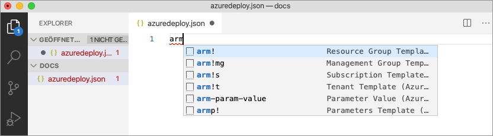

Mit diesem Codeausschnitt werden die Grundbausteine für eine ARM-Vorlage erstellt.

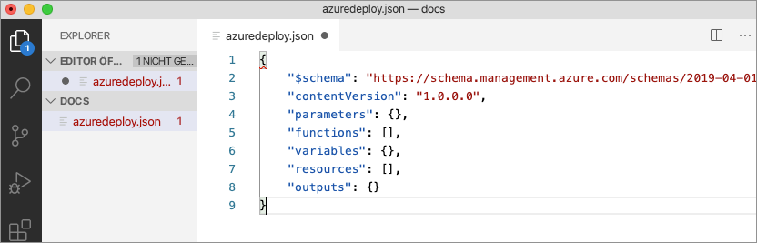

Beachten Sie, dass der Visual Studio Code-Sprachmodus von *JSON* in *Azure Resource Manager-Vorlage* geändert wurde. Die Erweiterung enthält einen speziellen Sprachserver für ARM-Vorlagen, der eine speziell auf ARM-Vorlagen zugeschnittene Überprüfung, Vervollständigung und andere entsprechende Sprachdienste bietet.

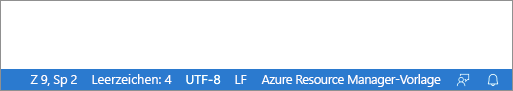

## <a name="add-an-azure-resource"></a>Hinzufügen einer Azure-Ressource

Die Erweiterung enthält Ausschnitte für zahlreiche Azure-Ressourcen. Mit diesen Ausschnitten können Sie Ihrer Vorlagenbereitstellung ganz einfach Ressourcen hinzufügen.

Platzieren Sie den Cursor im Block **resources** der Vorlage, geben Sie `storage` ein, und wählen Sie den Ausschnitt *arm-storage* aus.

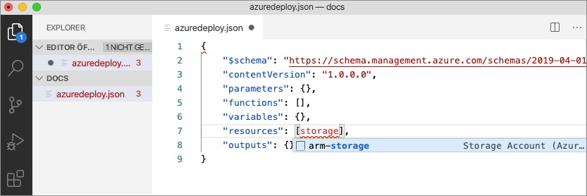

Durch diese Aktion wird der Vorlage eine Speicherressource hinzugefügt.

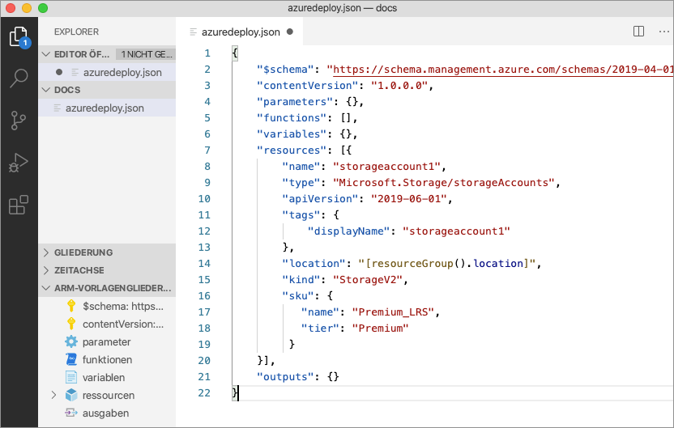

Mithilfe der **TAB-TASTE** kann durch die konfigurierbaren Eigenschaften für das Speicherkonto navigiert werden.

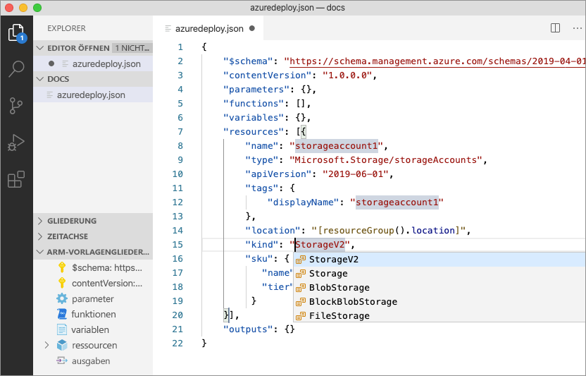

## <a name="completion-and-validation"></a>Vervollständigung und Überprüfung

Eine der praktischsten Funktionen der Erweiterung ist die Azure-Schemaintegration. Durch Azure-Schemas stehen der Erweiterung Überprüfungs- und ressourcenbasierte Vervollständigungsfunktionen zur Verfügung. Im nächsten Schritt wird das Speicherkonto geändert, um die Überprüfung und Vervollständigung in Aktion zu sehen. 

Legen Sie zunächst die Art des Speicherkontos auf einen ungültigen Wert fest (beispielsweise `megaStorage`). Beachten Sie, dass diese Aktion zu einer Warnung mit dem Hinweis führt, dass `megaStorage` kein gültiger Wert ist.

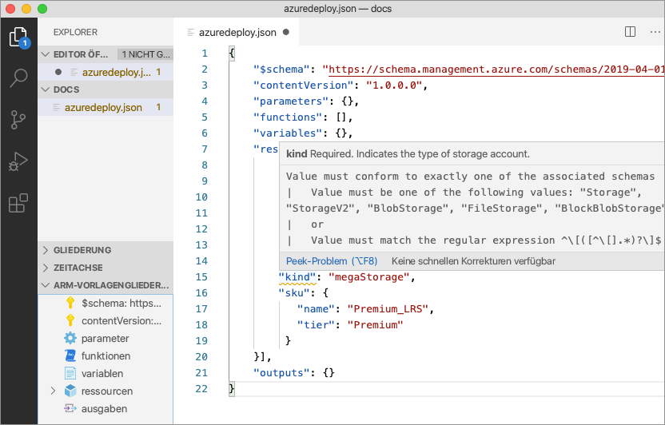

Entfernen Sie zur Verwendung der Vervollständigungsfunktionen `megaStorage`, platzieren Sie den Cursor innerhalb der doppelten Anführungszeichen, und drücken Sie `ctrl` + `space`. Daraufhin wird eine Vervollständigungsliste mit gültigen Werten angezeigt.

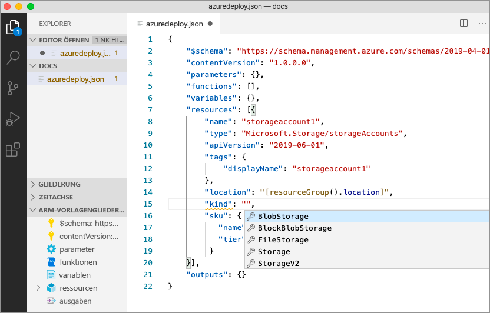

## <a name="add-template-parameters"></a>Hinzufügen von Vorlagenparametern

Erstellen Sie nun einen Parameter, und verwenden Sie ihn zur Angabe des Speicherkontonamens.

Platzieren Sie den Cursor im Block „parameters“, fügen Sie einen Wagenrücklauf ein, geben Sie `par` ein, und wählen Sie anschließend den Ausschnitt `arm-param-value` aus. Dadurch wird der Vorlage ein generischer Parameter hinzugefügt.

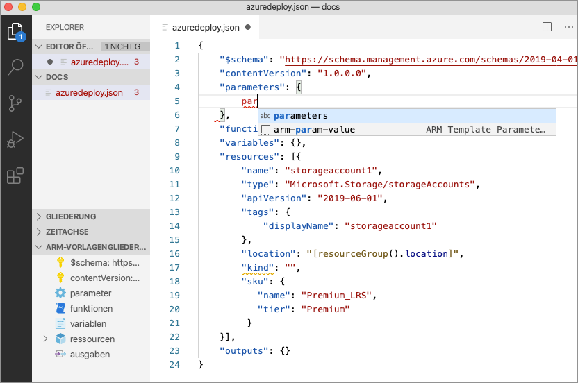

Ändern Sie den Namen des Parameters in `storageAccountName` und die Beschreibung in `Storage Account Name`.

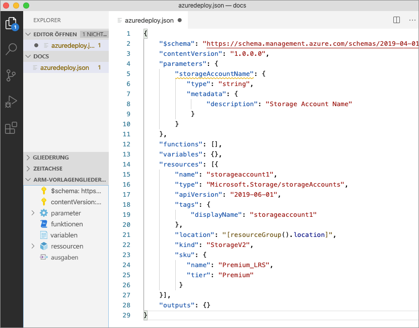

Azure-Speicherkontonamen müssen zwischen drei und 24 Zeichen lang sein. Fügen Sie dem Parameter sowohl `minLength` als auch `maxLength` hinzu, und geben Sie entsprechende Werte an.

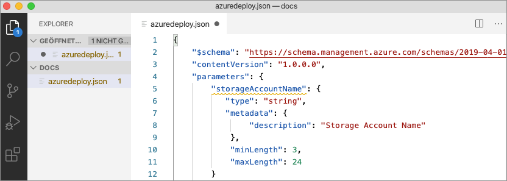

Aktualisieren Sie nun in der Speicherressource die Namenseigenschaft, um den Parameter zu verwenden. Entfernen Sie dazu den aktuellen Namen. Geben Sie ein doppeltes Anführungszeichen und eine öffnende eckige Klammer (`[`) ein. Daraufhin wird eine Liste mit ARM-Vorlagenfunktionen angezeigt. Wählen Sie in der Liste die Option *parameters* aus. 

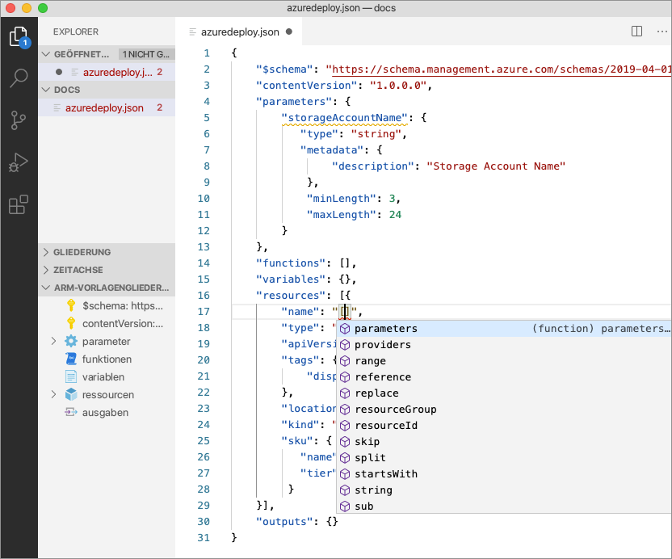

Wenn Sie innerhalb der runden Klammern ein einzelnes Anführungszeichen (`'`) eingeben, wird eine Liste aller Parameter angezeigt, die in der Vorlage definiert sind (in diesem Fall: *storageAccountName*). Wählen Sie den Parameter aus.

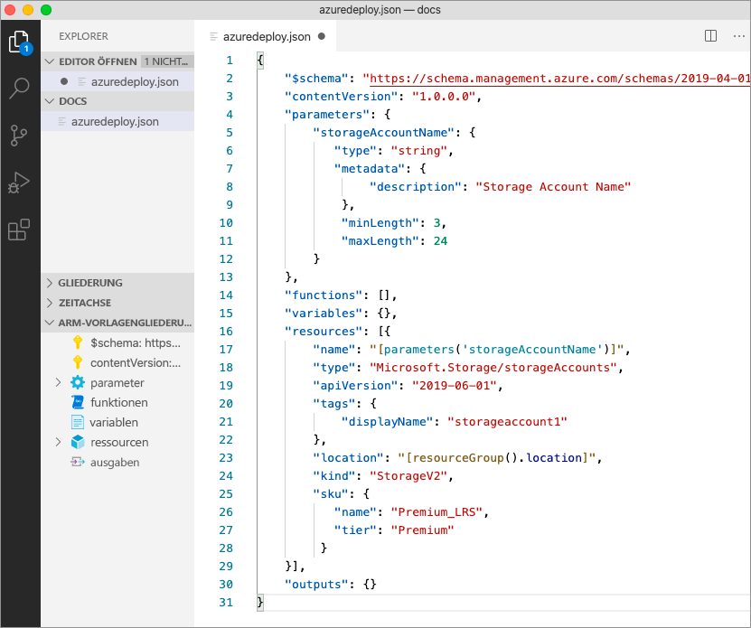

## <a name="create-a-parameter-file"></a>Erstellen einer Parameterdatei

Mit einer ARM-Vorlagenparameterdatei können Sie umgebungsspezifische Parameterwerte speichern und zur Bereitstellungszeit gesammelt übergeben. So können Sie beispielsweise eine Parameterdatei mit speziellen Werten für eine Testumgebung und eine andere Parameterdatei für eine Produktionsumgebung verwenden.

Mit der Erweiterung können Sie ganz einfach eine Parameterdatei auf der Grundlage Ihrer vorhandenen Vorlagen erstellen. Klicken Sie hierzu im Code-Editor mit der rechten Maustaste auf die Vorlage, und wählen Sie `Select/Create Parameter File` aus.

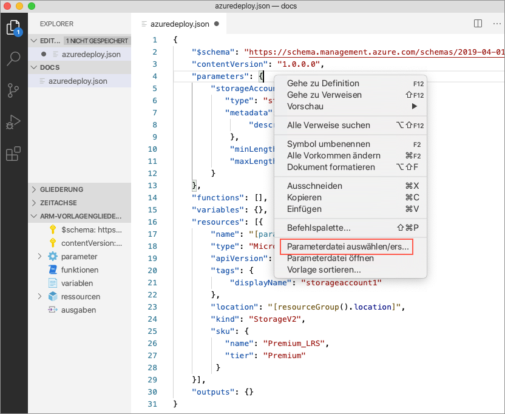

Wählen Sie `New` > `All Parameters` und anschließend einen Namen und einen Speicherort für die Parameterdatei aus.

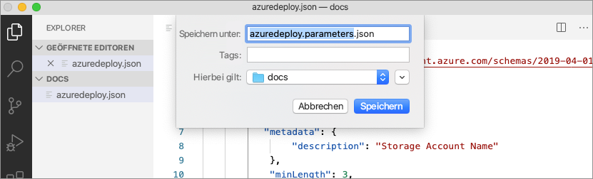

Dadurch wird eine neue Parameterdatei erstellt und der Vorlage zugeordnet, auf deren Grundlage sie erstellt wurde. Die aktuelle Zuordnung zwischen Vorlage und Parameterdatei wird auf der Statusleiste von Visual Studio Code angezeigt, während die Vorlage ausgewählt ist, und kann geändert werden.


Nachdem die Parameterdatei der Vorlage zugeordnet wurde, werden Vorlage und Parameterdatei gemeinsam durch die Erweiterung überprüft. Fügen Sie dem Parameter `storageAccountName` in der Parameterdatei einen zweistelligen Wert hinzu, und speichern Sie die Datei, um die Überprüfung in Aktion zu sehen.

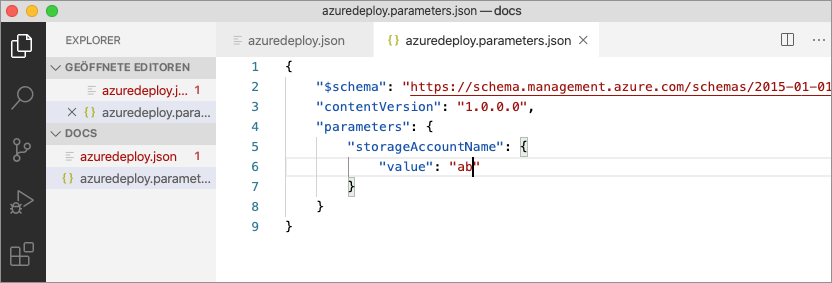

Wenn Sie nun zur ARM-Vorlage zurückkehren, sehen Sie, dass ein Fehler ausgelöst wurde, da der Wert nicht den Parameterkriterien entspricht.

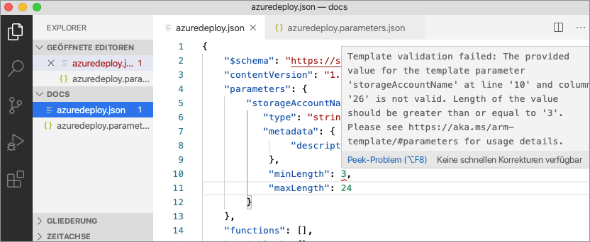

Aktualisieren Sie den Wert auf einen geeigneten Wert, speichern Sie die Datei, und kehren Sie zur Vorlage zurück. Dort sehen Sie, dass der Fehler für den Parameter behoben wurde.

## <a name="deploy-the-template"></a>Bereitstellen der Vorlage

Öffnen Sie das integrierte Visual Studio Code-Terminal mithilfe der Tastenkombination `ctrl` + ```` ` ````, und stellen Sie die Vorlage per Azure-Befehlszeilenschnittstelle oder Azure PowerShell-Modul bereit.

# <a name="cli"></a>[BEFEHLSZEILENSCHNITTSTELLE (CLI)](#tab/CLI)

```azurecli
az group create --name arm-vscode --location eastus

az deployment group create --resource-group arm-vscode --template-file azuredeploy.json --parameters azuredeploy.parameters.json
```

# <a name="powershell"></a>[PowerShell](#tab/PowerShell)

```azurepowershell
New-AzResourceGroup -Name arm-vscode -Location eastus

New-AzResourceGroupDeployment -ResourceGroupName arm-vscode -TemplateFile ./azuredeploy.json -TemplateParameterFile ./azuredeploy.parameters.json
```
---

## <a name="clean-up-resources"></a>Bereinigen von Ressourcen

Wenn Sie die Azure-Ressourcen nicht mehr benötigen, löschen Sie die Ressourcengruppe der Schnellstartanleitung mithilfe der Azure-Befehlszeilenschnittstelle oder des Azure PowerShell-Moduls.

# <a name="cli"></a>[BEFEHLSZEILENSCHNITTSTELLE (CLI)](#tab/CLI)

```azurecli
az group delete --name arm-vscode
```

# <a name="powershell"></a>[PowerShell](#tab/PowerShell)

```azurepowershell
Remove-AzResourceGroup -Name arm-vscode
```
---

## <a name="next-steps"></a>Nächste Schritte

> [!div class="nextstepaction"]
> [Tutorials für Anfänger](./template-tutorial-create-first-template.md)
