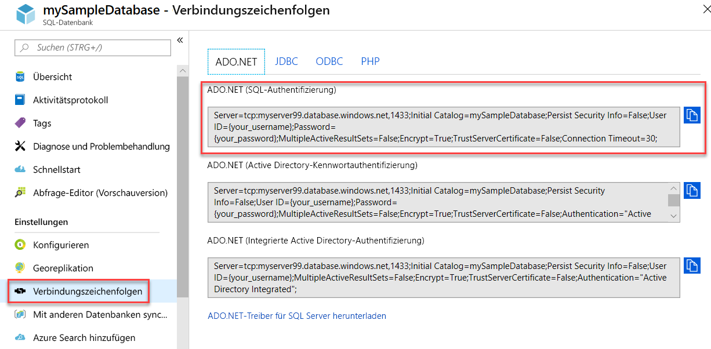

# Artikel zum Verbinden mit und Abfragen von Azure SQL-Datenbank und Azure SQL Managed Instance
[!INCLUDE[appliesto-sqldb-sqlmi](../includes/appliesto-sqldb-sqlmi.md)]

Das folgende Dokument enthält Links zu Azure-Beispielen, die veranschaulichen, wie Sie eine Verbindung mit Azure SQL-Datenbank und Azure SQL Managed Instance herstellen und Abfragen ausführen. In den [Überlegungen zu TLS für Datenbankverbindungen](#tls-considerations-for-database-connectivity) finden Sie entsprechende Empfehlungen zu TLS (Transport Layer Security).

## Schnellstarts

| Schnellstart | BESCHREIBUNG |
|---|---|
|[SQL Server Management Studio](connect-query-ssms.md)|In dieser Schnellstartanleitung wird veranschaulicht, wie Sie SSMS zum Herstellen einer Verbindung mit einer Datenbank verwenden und anschließend mithilfe von Transact-SQL-Anweisungen Daten in der Datenbank abfragen, einfügen, aktualisieren und löschen.|
|[Azure Data Studio](/sql/azure-data-studio/quickstart-sql-database?toc=%2fazure%2fsql-database%2ftoc.json)|In dieser Schnellstartanleitung erfahren Sie, wie Sie Azure Data Studio zum Herstellen einer Verbindung mit einer Datenbank verwenden und dann mit T-SQL-Anweisungen (Transact-SQL) die in Tutorials für Azure Data Studio verwendete TutorialDB-Komponente erstellen.|
|[Azure portal](connect-query-portal.md)|In dieser Schnellstartanleitung erfahren Sie, wie Sie den Abfrage-Editor zum Herstellen einer Verbindung mit einer Datenbank (nur Azure SQL-Datenbank) verwenden und dann Transact-SQL-Anweisungen nutzen, um Daten in der Datenbank abzufragen, einzufügen, zu aktualisieren und zu löschen.|
|[Visual Studio Code](connect-query-vscode.md)|In dieser Schnellstartanleitung erfahren Sie, wie Sie Visual Studio Code zum Herstellen einer Verbindung mit einer Datenbank verwenden und dann Transact-SQL-Anweisungen nutzen, um Daten in der Datenbank abzufragen, einzufügen, zu aktualisieren und zu löschen.|
|[.NET mit Visual Studio](connect-query-dotnet-visual-studio.md)|In dieser Schnellstartanleitung erfahren Sie, wie Sie unter Verwendung von .NET Framework ein C#-Programm mit Visual Studio erstellen, das eine Verbindung mit einer Datenbank herstellt, und mithilfe von Transact-SQL-Anweisungen Daten abfragen.|
|[.NET Core](connect-query-dotnet-core.md)|In dieser Schnellstartanleitung erfahren Sie, wie Sie unter Verwendung von .NET Core unter Windows/Linux/macOS ein C#-Programm erstellen, das eine Verbindung mit einer Datenbank herstellt, und mithilfe von Transact-SQL-Anweisungen Daten abfragen.|
|[Go](connect-query-go.md)|In dieser Schnellstartanleitung erfahren Sie, wie Sie mithilfe von Go eine Verbindung mit einer Datenbank herstellen. Außerdem werden Transact-SQL-Anweisungen zum Abfragen und Ändern von Daten veranschaulicht.|
|[Java](connect-query-java.md)|In dieser Schnellstartanleitung erfahren Sie, wie Sie mithilfe von Java eine Verbindung mit einer Datenbank herstellen und anschließend Daten mithilfe von Transact-SQL-Anweisungen abfragen.|
|[Node.js](connect-query-nodejs.md)|In dieser Schnellstartanleitung erfahren Sie, wie Sie unter Verwendung von Node.js ein Programm erstellen, das eine Verbindung mit einer Datenbank herstellt, und mithilfe von Transact-SQL-Anweisungen Daten abfragen.|
|[PHP](connect-query-php.md)|In dieser Schnellstartanleitung erfahren Sie, wie Sie unter Verwendung von PHP ein Programm erstellen, das eine Verbindung mit einer Datenbank herstellt, und mithilfe von Transact-SQL-Anweisungen Daten abfragen.|
|[Python](connect-query-python.md)|In dieser Schnellstartanleitung erfahren Sie, wie Sie mithilfe von Python eine Verbindung mit einer Datenbank herstellen und anschließend Daten mithilfe von Transact-SQL-Anweisungen abfragen. |
|[Ruby](connect-query-ruby.md)|In dieser Schnellstartanleitung erfahren Sie, wie Sie unter Verwendung von Ruby ein Programm erstellen, das eine Verbindung mit einer Datenbank herstellt, und mithilfe von Transact-SQL-Anweisungen Daten abfragen.|
|[R](connect-query-r.md)|In dieser Schnellstartanleitung erfahren Sie, wie Sie unter Verwendung von R mit Machine Learning Services von Azure SQL-Datenbank ein Programm erstellen, das eine Verbindung mit einer Datenbank in Azure SQL-Datenbank herstellt, und mithilfe von Transact-SQL-Anweisungen Daten abfragen.|
|||

## Ermitteln von Serververbindungsinformationen

Ermitteln Sie die Verbindungsinformationen, die Sie zum Herstellen einer Verbindung mit der Datenbank in Azure SQL-Datenbank benötigen. In den weiteren Verfahren benötigen Sie den vollqualifizierten Server- oder Hostnamen, den Datenbanknamen und die Anmeldeinformationen.

1. Melden Sie sich beim [Azure-Portal](https://portal.azure.com/) an.

2. Navigieren Sie zur Seite **SQL-Datenbanken** oder **Verwaltete SQL-Instanzen**.

3. Auf der Seite **Übersicht** finden Sie den vollqualifizierten Servernamen für die Datenbank in Azure SQL-Datenbank neben **Servername** oder den vollqualifizierten Servernamen (oder die IP-Adresse) für Azure SQL Managed Instance bzw. für SQL Server auf einem virtuellen Azure-Computer neben **Host**. Um den Namen des Servers oder Hosts zu kopieren, zeigen Sie darauf, und wählen Sie das Symbol **Kopieren** aus.

> [!NOTE]
> Verbindungsinformationen für SQL Server auf einem virtuellen Azure-Computer finden Sie unter [Herstellen einer Verbindung mit einer SQL Server-Instanz](../virtual-machines/windows/sql-vm-create-portal-quickstart.md#connect-to-sql-server).

## Ermitteln von ADO.NET-Verbindungsinformationen (optional – nur SQL-Datenbank)

1. Navigieren Sie im Azure-Portal zum Datenbankblatt, und wählen Sie unter **Einstellungen** die Option **Verbindungszeichenfolgen** aus.

2. Überprüfen Sie die vollständige **ADO.NET**-Verbindungszeichenfolge.

    

3. Kopieren Sie die **ADO.NET**-Verbindungszeichenfolge, wenn Sie sie verwenden möchten.

## Überlegungen zu TLS für Datenbankverbindungen

Transport Layer Security (TLS) wird von allen Treibern verwendet, die Microsoft zum Herstellen einer Verbindung mit Datenbanken in Azure SQL-Datenbank oder Azure SQL Managed Instance bereitstellt oder unterstützt. Es ist keine spezielle Konfiguration erforderlich. Für alle Verbindungen mit einer SQL Server-Instanz, einer Datenbank in Azure SQL-Datenbank oder einer Instanz von Azure SQL Managed Instance empfehlen wir, dass alle Anwendungen die folgenden Konfigurationen oder deren Entsprechungen aufweisen:

- **Verschlüsseln = Ein**
- **TrustServerCertificate = Aus**

Einige Systeme verwenden andere, jedoch entsprechende Schlüsselwörter für diese Konfigurationsschlüsselwörter. Durch diese Konfigurationen wird sichergestellt, dass der Clienttreiber die Identität des vom Server empfangenen TLS-Zertifikats überprüft.

Außerdem empfiehlt es sich, TLS 1.1 und 1.0 auf dem Client zu deaktivieren, wenn Sie den Payment Card Industry Data Security Standard (PCI-DSS) einhalten müssen.

Nicht von Microsoft stammende Treiber verwenden TLS möglicherweise nicht standardmäßig. Dies kann beim Herstellen einer Verbindung mit Azure SQL-Datenbank oder Azure SQL Managed Instance von Bedeutung sein. Bei Anwendungen mit eingebetteten Treibern können Sie diese Verbindungseinstellungen möglicherweise nicht steuern. Wir empfehlen Ihnen, die Sicherheit solcher Treiber und Anwendungen zu überprüfen, bevor Sie sie auf Systemen verwenden, die mit vertraulichen Daten interagieren.

## Bibliotheken

Sie können verschiedene Bibliotheken und Frameworks zum Herstellen einer Verbindung mit Azure SQL-Datenbank oder Azure SQL Managed Instance verwenden. Unsere [Tutorials „Erste Schritte“](https://aka.ms/sqldev) ermöglichen Ihnen den schnellen Einstieg in Programmiersprachen wie C#, Java, Node.js, PHP und Python. Erstellen Sie anschließend mit SQL Server unter Linux oder Windows oder mit Docker unter macOS eine App.

Die folgende Tabelle enthält Verbindungsbibliotheken oder *Treiber*, die Clientanwendungen unter Verwendung zahlreicher Programmiersprachen nutzen können, um eine Verbindung mit SQL Server in einer lokalen Umgebung oder in der Cloud herzustellen und SQL Server zu verwenden. Sie können unter Linux und Windows oder mit Docker verwendet werden, um Verbindungen mit Azure SQL-Datenbank, Azure SQL Managed Instance und Azure Synapse Analytics herzustellen.

| Sprache | Plattform | Zusätzliche Ressourcen | Download | Erste Schritte |
| :-- | :-- | :-- | :-- | :-- |
| C# | Windows, Linux, macOS | [Microsoft ADO.NET für SQL Server](/sql/connect/ado-net/microsoft-ado-net-sql-server) | [Download](https://www.microsoft.com/net/download/) | [Erste Schritte](https://www.microsoft.com/sql-server/developer-get-started/csharp/ubuntu)
| Java | Windows, Linux, macOS | [Microsoft JDBC-Treiber für SQL Server](/sql/connect/jdbc/microsoft-jdbc-driver-for-sql-server/) | [Download](/sql/connect/jdbc/download-microsoft-jdbc-driver-for-sql-server) |  [Erste Schritte](https://www.microsoft.com/sql-server/developer-get-started/java/ubuntu)
| PHP | Windows, Linux, macOS| [PHP SQL-Treiber für SQL Server](/sql/connect/php/microsoft-php-driver-for-sql-server) | [Download](/sql/connect/php/download-drivers-php-sql-server) | [Erste Schritte](https://www.microsoft.com/sql-server/developer-get-started/php/ubuntu/)
| Node.js | Windows, Linux, macOS | [Node.js-Treiber für SQL Server](/sql/connect/node-js/node-js-driver-for-sql-server/) | [Installieren](/sql/connect/node-js/step-1-configure-development-environment-for-node-js-development/) |  [Erste Schritte](https://www.microsoft.com/sql-server/developer-get-started/node/ubuntu)
| Python | Windows, Linux, macOS | [Python-SQL-Treiber](/sql/connect/python/python-driver-for-sql-server/) | Installationsoptionen:   \* [pymssql](/sql/connect/python/pymssql/step-1-configure-development-environment-for-pymssql-python-development/)   \* [pyodbc](/sql/connect/python/pyodbc/step-1-configure-development-environment-for-pyodbc-python-development/) |  [Erste Schritte](https://www.microsoft.com/sql-server/developer-get-started/python/ubuntu)
| Ruby | Windows, Linux, macOS | [Ruby-Treiber für SQL Server](/sql/connect/ruby/ruby-driver-for-sql-server/) | [Installieren](/sql/connect/ruby/step-1-configure-development-environment-for-ruby-development/) | [Erste Schritte](https://www.microsoft.com/sql-server/developer-get-started/ruby/ubuntu)
| C++ | Windows, Linux, macOS | [Microsoft ODBC Driver for SQL Server](/sql/connect/odbc/microsoft-odbc-driver-for-sql-server/) | [Download](/sql/connect/odbc/microsoft-odbc-driver-for-sql-server/) |  

Die folgende Tabelle enthält Beispiele für ORM (Object-Relational Mapping)-Frameworks und Webframeworks, die Clientanwendungen mit SQL Server, Azure SQL-Datenbank, Azure SQL Managed Instance oder Azure Synapse Analytics nutzen können. Sie können die Frameworks unter Linux und Windows oder mit Docker verwenden.

| Sprache | Plattform | ORM(s) |
| :-- | :-- | :-- |
| C# | Windows, Linux, macOS | [Entity Framework](/ef) [Entity Framework Core](/ef/core/index) |
| Java | Windows, Linux, macOS |[Hibernate ORM](https://hibernate.org/orm)|
| PHP | Windows, Linux, macOS | [Laravel (Eloquent)](https://laravel.com/docs/eloquent) [Doctrine](https://www.doctrine-project.org/projects/orm.html) |
| Node.js | Windows, Linux, macOS | [Sequelize ORM](https://sequelize.org/) |
| Python | Windows, Linux, macOS |[Django](https://www.djangoproject.com/) |
| Ruby | Windows, Linux, macOS | [Ruby on Rails](https://rubyonrails.org/) |
||||

## Nächste Schritte

- Informationen zur Verbindungsarchitektur finden Sie unter [Verbindungsarchitektur der Azure SQL-Datenbank](connectivity-architecture.md).
- Ermitteln Sie [SQL Server-Treiber](/sql/connect/sql-connection-libraries/) zum Herstellen einer Verbindung von Clientanwendungen.
- Herstellen einer Verbindung mit Azure SQL-Datenbank oder Azure SQL Managed Instance:
  - [Verbinden und Abfragen mit .NET (C#)](connect-query-dotnet-core.md)
  - [Verbinden und Abfragen mit PHP](connect-query-php.md)
  - [Verbinden und Abfragen mit Node.js](connect-query-nodejs.md)
  - [Verbinden und Abfragen mit Java](connect-query-java.md)
  - [Verbinden und Abfragen mit Python](connect-query-python.md)
  - [Verbinden und Abfragen mit Ruby](connect-query-ruby.md)
  - [Installieren der SQL Server-Befehlszeilentools sqlcmd und bcp unter Linux:](/sql/linux/sql-server-linux-setup-tools) Versuchen Sie bei Linux-Benutzern, mithilfe von [sqlcmd](/sql/ssms/scripting/sqlcmd-use-the-utility) eine Verbindung mit Azure SQL-Datenbank oder Azure SQL Managed Instance herzustellen.
- Codebeispiele für Wiederholungslogik:
  - [Herstellen resilienter Verbindungen mit ADO.NET][step-4-connect-resiliently-to-sql-with-ado-net-a78n]
  - [Herstellen resilienter Verbindungen mit PHP][step-4-connect-resiliently-to-sql-with-php-p42h]

<!-- Link references. -->

[step-4-connect-resiliently-to-sql-with-ado-net-a78n]: /sql/connect/ado-net/step-4-connect-resiliently-sql-ado-net

[step-4-connect-resiliently-to-sql-with-php-p42h]: /sql/connect/php/step-4-connect-resiliently-to-sql-with-php
