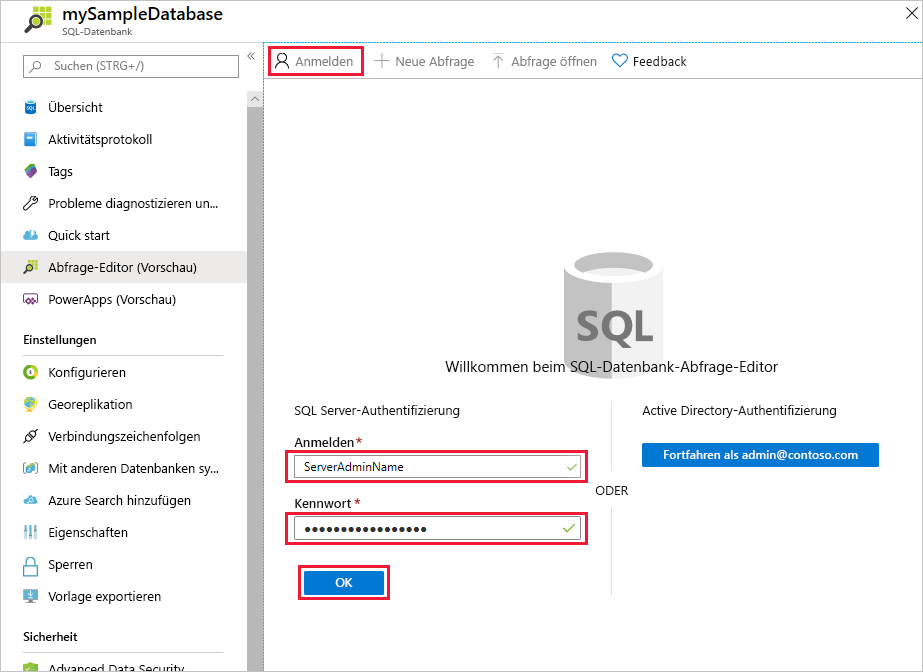
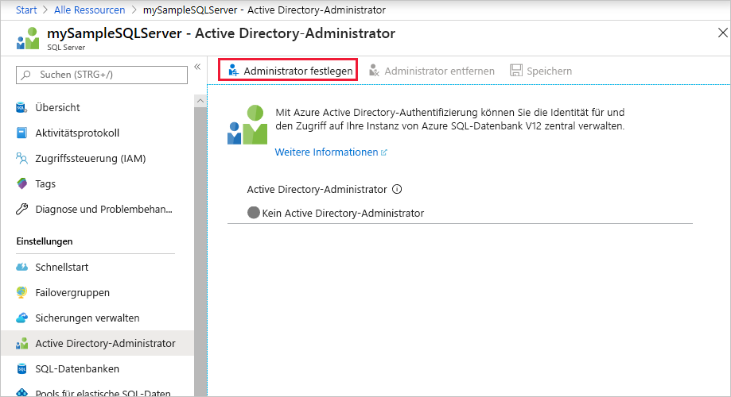
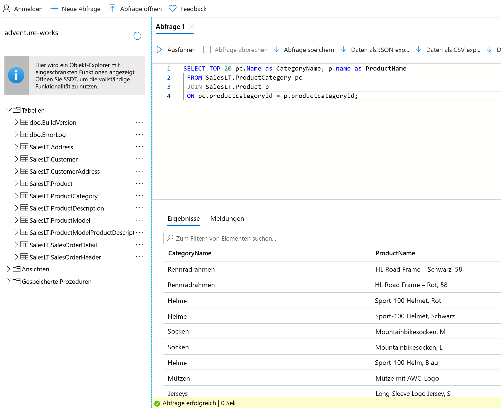

# <a name="quickstart-use-the-azure-portals-query-editor-preview-to-query-an-azure-sql-database"></a>Schnellstart: Verwenden des Abfrage-Editors (Vorschau) des Azure-Portals, um eine Azure SQL-Datenbank abzufragen
[!INCLUDE[appliesto-sqldb](../includes/appliesto-sqldb.md)]

Der Abfrage-Editor ist ein Tool im Azure-Portal zur Ausführung von SQL-Abfragen für Ihre Datenbank in Azure SQL-Datenbank oder Ihr Data Warehouse in Azure Synapse Analytics. 

In dieser Schnellstartanleitung erfahren Sie, wie Sie den Abfrage-Editor verwenden, um T-SQL-Abfragen (Transact-SQL) für eine Datenbank auszuführen.

## <a name="prerequisites"></a>Voraussetzungen

Für diese Schnellstartanleitung wird die AdventureWorksLT-Beispieldatenbank benötigt. Sollten Sie über keine Arbeitskopie der AdventureWorksLT-Beispieldatenbank in SQL-Datenbank verfügen, können Sie mithilfe der folgenden Schnellstartanleitung im Handumdrehen eine Kopie erstellen:

- [Schnellstart: Erstellen einer Datenbank in Azure SQL-Datenbank über das Azure-Portal, PowerShell oder die Azure CLI](single-database-create-quickstart.md) 

### <a name="configure-network-settings"></a>Konfigurieren der Netzwerkeinstellungen

Sollte im Abfrage-Editor der Fehler *Durch Ihre lokalen Netzwerkeinstellungen werden möglicherweise Abfragen vom Abfrage-Editor verhindert. Klicken Sie hier, um Anweisungen zum Konfigurieren der Netzwerkeinstellungen zu erhalten.* oder der Fehler *Mit dem Server konnte keine Verbindung hergestellt werden. Dies weist möglicherweise auf ein Problem mit der lokalen Firewallkonfiguration oder Ihren Netzwerkproxyeinstellungen hin.* auftreten, berücksichtigen Sie die folgende wichtige Information:

> [!IMPORTANT]
> Der Abfrage-Editor verwendet die Ports 443 und 1443 zum Kommunizieren. Vergewissern Sie sich, dass ausgehender HTTPS-Datenverkehr an diesen Ports aktiviert ist. Darüber hinaus müssen Sie [Ihre ausgehende IP-Adresse den Firewallzulassungsregeln des Servers hinzufügen](firewall-create-server-level-portal-quickstart.md), um auf Ihre Datenbanken und Data Warehouses zugreifen zu können.


## <a name="open-the-sql-database-query-editor"></a>Öffnen des SQL-Datenbank-Abfrage-Editors

1. Melden Sie sich beim [Azure-Portal](https://portal.azure.com/) an, und wählen Sie die Datenbank aus, die Sie abfragen möchten.

2. Wählen Sie im Menü **SQL-Datenbank** die Option **Abfrage-Editor (Vorschau)** aus.

    


## <a name="establish-a-connection-to-the-database"></a>Herstellen einer Verbindung mit der Datenbank

Sie sind zwar bereits beim Portal angemeldet, für den Zugriff auf die Datenbank müssen aber dennoch Anmeldeinformationen angegeben werden. Für die Verbindungsherstellung mit der Datenbank können Sie die SQL-Authentifizierung oder Azure Active Directory verwenden.

### <a name="connect-using-sql-authentication"></a>Herstellen einer Verbindung per SQL-Authentifizierung

1. Geben Sie auf der Seite **Anmeldung** unter **SQL Server-Authentifizierung** im Feld **Anmeldename** einen Anmeldenamen und im Feld **Kennwort** ein Kennwort für einen Benutzer mit Zugriff auf die Datenbank ein. Verwenden Sie im Zweifelsfall den Anmeldenamen und das Kennwort für den Serveradministrator des Datenbankservers.

    

2. Klicken Sie auf **OK**.


### <a name="connect-using-azure-active-directory"></a>Herstellen einer Verbindung mit Azure Active Directory

Wenn Sie einen Azure Active Directory-Administrator (Azure AD) konfigurieren, können Sie eine einzelne Identität verwenden, um sich beim Azure-Portal und bei Ihrer Datenbank anzumelden. Wenn Sie die Datenbankverbindung unter Verwendung von Azure AD herstellen möchten, führen Sie die unten beschriebenen Schritte aus, um einen Azure AD-Administrator für Ihre SQL Server-Instanz zu konfigurieren.

> [!NOTE]
> * E-Mail-Konten (etwa „outlook.com“, „gmail.com“, „yahoo.com“ usw.) werden noch nicht als Azure AD-Administratoren unterstützt. Stellen Sie sicher, dass Sie einen Benutzer auswählen, der entweder nativ in Azure AD erstellt oder in einen Azure AD-Verbund eingefügt wurde.
> * Die Azure AD-Administratoranmeldung funktioniert nicht bei Konten, für die die zweistufige Authentifizierung aktiviert ist.

#### <a name="set-an-active-directory-admin-for-the-server"></a>Festlegen eines Active Directory-Administrators für den Server

1. Wählen Sie im Azure-Portal Ihre SQL Server-Instanz aus.

2. Wählen Sie im Menü **SQL Server** die Option **Active Directory-Administrator** aus.

3. Wählen Sie auf der Symbolleiste der Seite **Active Directory-Administrator** die Option **Administrator festlegen** und anschließend den gewünschten Benutzer oder die gewünschte Gruppe als Azure AD-Administrator aus.

    

4. Geben Sie auf der Seite **Administrator hinzufügen** im Suchfeld einen Benutzer oder eine Gruppe ein, nach dem bzw. nach der Sie suchen möchten, und wählen Sie ihn bzw. sie als Administrator aus. Wählen Sie anschließend die Schaltfläche **Auswählen** aus.

5. Wählen Sie auf der Symbolleiste der Seite **Active Directory-Administrator** der SQL Server-Instanz die Option **Speichern** aus.

### <a name="connect-to-the-database"></a>Herstellen der Verbindung mit der Datenbank

6. Wählen Sie im Menü **SQL Server** die Option **SQL-Datenbanken** und anschließend Ihre Datenbank aus.

7. Wählen Sie im Menü **SQL-Datenbank** die Option **Abfrage-Editor (Vorschau)** aus. Auf der **Anmeldeseite** wird für Azure AD-Administratoren unter **Active Directory-Authentifizierung** eine Meldung mit dem Hinweis angezeigt, dass sie angemeldet wurden. Wählen Sie dann die Schaltfläche **Als *\<your user or group ID>* fortsetzen** aus. Sollte auf der Seite angezeigt werden, dass Sie sich nicht erfolgreich angemeldet haben, muss die Seite möglicherweise aktualisiert werden.

## <a name="query-a-database-in-sql-database"></a>Abfragen einer Datenbank in SQL-Datenbank

Die folgenden Beispielabfragen sollten erfolgreich für die AdventureWorksLT-Beispieldatenbank ausgeführt werden.

### <a name="run-a-select-query"></a>Ausführen einer SELECT-Abfrage

1. Fügen Sie die folgende Abfrage im Abfrage-Editor ein:

   ```sql
    SELECT TOP 20 pc.Name as CategoryName, p.name as ProductName
    FROM SalesLT.ProductCategory pc
    JOIN SalesLT.Product p
    ON pc.productcategoryid = p.productcategoryid;
   ```

2. Wählen Sie **Ausführen** aus, und sehen Sie sich dann die Ausgabe im Bereich **Ergebnisse** an.

   

3. Sie können die Abfrage optional als SQL-Datei speichern oder die zurückgegebenen Daten als JSON-, CSV- oder XML-Datei exportieren.

### <a name="run-an-insert-query"></a>Ausführen einer INSERT-Abfrage

Führen Sie die folgende T-SQL-Anweisung vom Typ [INSERT](/sql/t-sql/statements/insert-transact-sql/) aus, um in der Tabelle `SalesLT.Product` ein neues Produkt hinzuzufügen.

1. Ersetzen Sie die vorherige Abfrage durch diese.

    ```sql
    INSERT INTO [SalesLT].[Product]
           ( [Name]
           , [ProductNumber]
           , [Color]
           , [ProductCategoryID]
           , [StandardCost]
           , [ListPrice]
           , [SellStartDate]
           )
    VALUES
           ('myNewProduct'
           ,123456789
           ,'NewColor'
           ,1
           ,100
           ,100
           ,GETDATE() );
   ```


2. Wählen Sie **Ausführen**, um eine neue Zeile in die Tabelle `Product` einzufügen. Im Bereich **Nachrichten** wird folgende Meldung angezeigt: **Abfrage erfolgreich: Betroffene Zeilen: 1**.


### <a name="run-an-update-query"></a>Ausführen einer UPDATE-Abfrage

Führen Sie die folgende T-SQL-Anweisung vom Typ [UPDATE](/sql/t-sql/queries/update-transact-sql/) aus, um Ihr neues Produkt zu ändern.

1. Ersetzen Sie die vorherige Abfrage durch diese.

   ```sql
   UPDATE [SalesLT].[Product]
   SET [ListPrice] = 125
   WHERE Name = 'myNewProduct';
   ```

2. Wählen Sie **Ausführen**, um die angegebene Zeile in der Tabelle `Product` zu aktualisieren. Im Bereich **Nachrichten** wird folgende Meldung angezeigt: **Abfrage erfolgreich: Betroffene Zeilen: 1**.

### <a name="run-a-delete-query"></a>Ausführen einer DELETE-Abfrage

Führen Sie die folgende T-SQL-Anweisung vom Typ [DELETE](/sql/t-sql/statements/delete-transact-sql/) aus, um das neue Produkt zu entfernen.

1. Ersetzen Sie die vorherige Abfrage durch diese:

   ```sql
   DELETE FROM [SalesLT].[Product]
   WHERE Name = 'myNewProduct';
   ```

2. Wählen Sie **Ausführen**, um die angegebene Zeile in der Tabelle `Product` zu löschen. Im Bereich **Nachrichten** wird folgende Meldung angezeigt: **Abfrage erfolgreich: Betroffene Zeilen: 1**.


## <a name="query-editor-considerations"></a>Aspekte des Abfrage-Editors

Bei der Verwendung des Abfrage-Editors sind ein paar Dinge zu beachten:

* Der Abfrage-Editor verwendet die Ports 443 und 1443 zum Kommunizieren. Vergewissern Sie sich, dass ausgehender HTTPS-Datenverkehr an diesen Ports aktiviert ist. Sie müssen auch Ihre ausgehende IP-Adresse den Firewallzulassungsregeln des Servers hinzufügen, um auf Ihre Datenbanken und Data Warehouses zugreifen zu können.

* Bei einer Private Link-Verbindung kann der Abfrage-Editor verwendet werden, ohne dass die Client-IP-Adresse in der Firewall von SQL-Datenbank hinzugefügt werden muss.

* Durch Drücken von **F5** wird die Seite des Abfrage-Editors aktualisiert, und aktuell bearbeitete Abfragen gehen verloren.

* Das Herstellen einer Verbindung mit der `master`-Datenbank wird vom Abfrage-Editor nicht unterstützt.

* Bei der Abfrageausführung gilt ein Timeout von fünf Minuten.

* Der Abfrage-Editor unterstützt für geografische Datentypen nur die zylindrische Projektion.

* IntelliSense wird für Datenbanktabellen und -sichten nicht unterstützt. Der Editor unterstützt jedoch AutoVervollständigen für Namen, die schon einmal eingegeben wurden.


## <a name="next-steps"></a>Nächste Schritte

Weitere Informationen zur Unterstützung von Transact-SQL (T-SQL) in Azure SQL-Datenbank finden Sie unter [Auflösen von Transact-SQL-Unterschieden während der Migration zur SQL-Datenbank](transact-sql-tsql-differences-sql-server.md).
