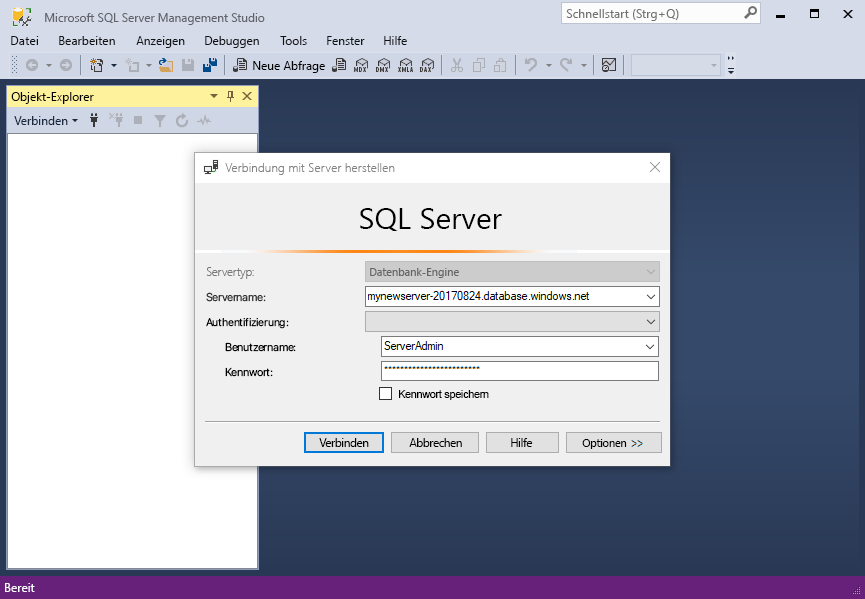
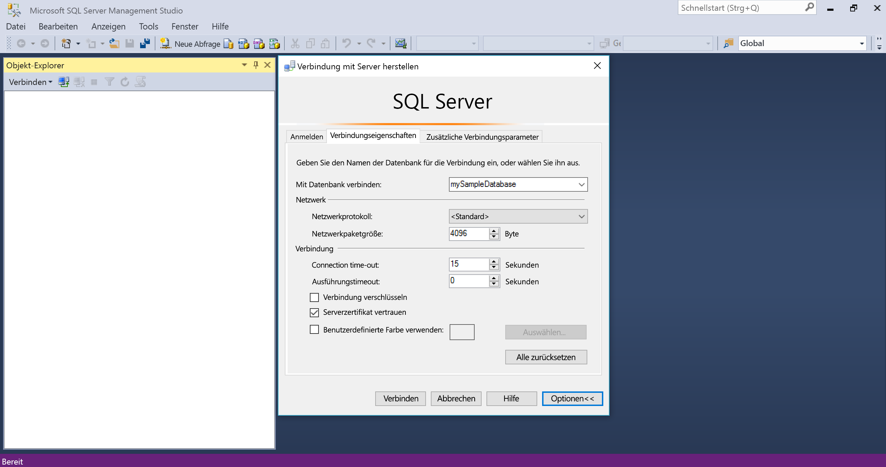
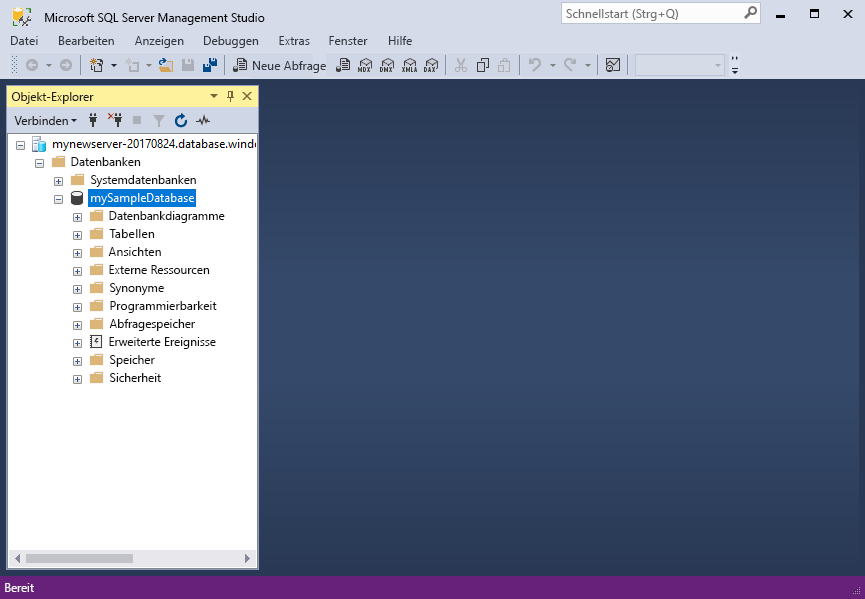
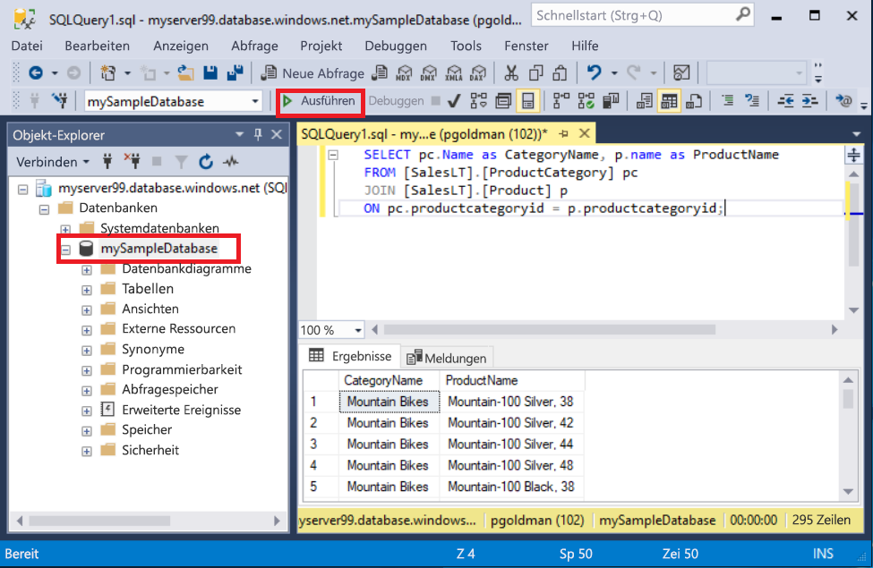
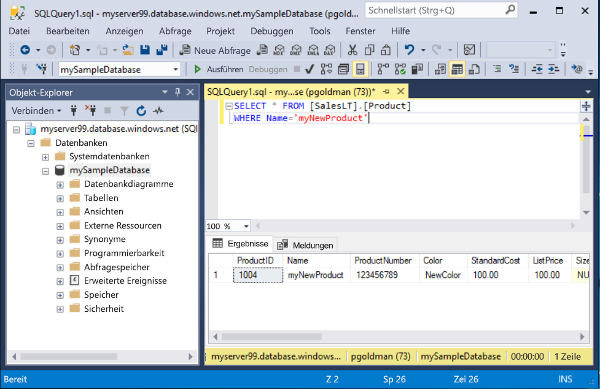

# <a name="quickstart-use-ssms-to-connect-to-and-query-azure-sql-database-or-azure-sql-managed-instance"></a>Schnellstart: Verwenden von SSMS zum Herstellen einer Verbindung mit Azure SQL-Datenbank oder Azure SQL Managed Instance und Ausführen von Abfragen
[!INCLUDE[appliesto-sqldb-sqlmi](../includes/appliesto-sqldb-sqlmi.md)]

In dieser Schnellstartanleitung erfahren Sie, wie Sie mithilfe von SQL Server Management Studio (SSMS) eine Verbindung mit Azure SQL-Datenbank oder Azure SQL Managed Instance herstellen und Abfragen ausführen.

## <a name="prerequisites"></a>Voraussetzungen

Für diese Schnellstartanleitung ist Folgendes erforderlich:

- [SQL Server Management Studio (SSMS)](/sql/ssms/download-sql-server-management-studio-ssms/).

- Eine Datenbank in Azure SQL-Datenbank In den folgenden Schnellstartanleitungen erfahren Sie jeweils, wie Sie eine Datenbank in Azure SQL-Datenbank erstellen und anschließend konfigurieren:

  | Aktion | SQL-Datenbank | Verwaltete SQL-Instanz | SQL Server auf Azure-VMs |
  |:--- |:--- |:---|:---|
  | Erstellen| [Portal](single-database-create-quickstart.md) | [Portal](../managed-instance/instance-create-quickstart.md) | [Portal](../virtual-machines/windows/sql-vm-create-portal-quickstart.md)
  || [BEFEHLSZEILENSCHNITTSTELLE (CLI)](scripts/create-and-configure-database-cli.md) | [BEFEHLSZEILENSCHNITTSTELLE (CLI)](https://medium.com/azure-sqldb-managed-instance/working-with-sql-managed-instance-using-azure-cli-611795fe0b44) |
  || [PowerShell](scripts/create-and-configure-database-powershell.md) | [PowerShell](../managed-instance/scripts/create-configure-managed-instance-powershell.md) | [PowerShell](../virtual-machines/windows/sql-vm-create-powershell-quickstart.md)
  | Konfigurieren | [IP-Firewallregel auf Serverebene](firewall-create-server-level-portal-quickstart.md)| [Verbindung von einem virtuellen Computer](../managed-instance/connect-vm-instance-configure.md)|
  |||[Verbindung von einer lokalen Ressource](../managed-instance/point-to-site-p2s-configure.md) | [Connect to SQL Server (Herstellen einer Verbindung mit SQL Server)](../virtual-machines/windows/sql-vm-create-portal-quickstart.md)
  |Laden der Daten|Laden von Adventure Works gemäß Schnellstartanleitung|[Wiederherstellen von Wide World Importers](../managed-instance/restore-sample-database-quickstart.md) | [Wiederherstellen von Wide World Importers](../managed-instance/restore-sample-database-quickstart.md) |
  |||Wiederherstellen oder Importieren von Adventure Works über eine [BACPAC-Datei](database-import.md) von [GitHub](https://github.com/Microsoft/sql-server-samples/tree/master/samples/databases/adventure-works)| Wiederherstellen oder Importieren von Adventure Works über eine [BACPAC-Datei](database-import.md) von [GitHub](https://github.com/Microsoft/sql-server-samples/tree/master/samples/databases/adventure-works)|
  |||

  > [!IMPORTANT]
  > Die Skripts in diesem Artikel sind für die Adventure Works-Datenbank geschrieben. Bei einer verwalteten Instanz müssen Sie entweder die Adventure Works-Datenbank in eine Instanzdatenbank importieren oder die Skripts in diesem Artikel zur Verwendung der Wide World Importers-Datenbank anpassen.

Wenn Sie einfach nur einige Ad-hoc-Abfragen ohne SSMS-Installation ausführen möchten, verwenden Sie die Anleitung [Schnellstart: Abfragen einer Datenbank in Azure SQL-Datenbank mithilfe des Abfrage-Editors im Azure-Portal](connect-query-portal.md).

## <a name="get-server-connection-information"></a>Ermitteln von Serververbindungsinformationen

Rufen Sie die Verbindungsinformationen ab, die Sie zum Herstellen einer Verbindung mit Ihrer Datenbank benötigen. Für diese Schnellstartanleitung benötigen Sie den vollqualifizierten [Server](logical-servers.md)- oder Hostnamen, den Datenbanknamen und die Anmeldeinformationen.

1. Melden Sie sich beim [Azure-Portal](https://portal.azure.com/) an.

2. Navigieren Sie zu der **Datenbank** oder **verwalteten Instanz**, die Sie abfragen möchten.

3. Auf der Seite **Übersicht** finden Sie den vollqualifizierten Servernamen für die Datenbank in SQL-Datenbank neben **Servername** oder den vollqualifizierten Servernamen (oder die IP-Adresse) für eine verwaltete Instanz in SQL Managed Instance bzw. für eine SQL Server-Instanz auf einem virtuellen Computer neben **Host**. Um den Namen des Servers oder Hosts zu kopieren, zeigen Sie darauf, und wählen Sie das Symbol **Kopieren** aus.

> [!NOTE]
> Verbindungsinformationen für SQL Server auf einem virtuellen Azure-Computer finden Sie unter [Herstellen einer Verbindung mit SQL Server](../virtual-machines/windows/sql-vm-create-portal-quickstart.md#connect-to-sql-server).

## <a name="connect-to-your-database"></a>Verbinden mit der Datenbank

[!INCLUDE[ssms-connect-azure-ad](../includes/ssms-connect-azure-ad.md)]

Stellen Sie in SSMS eine Verbindung mit Ihrem Server her.

> [!IMPORTANT]
> Ein Server lauscht an Port 1433. Um von hinter einer Unternehmensfirewall eine Verbindung mit einem Server herzustellen, muss dieser Port der Firewall geöffnet sein.

1. Öffnen Sie SSMS.

2. Das Dialogfeld **Mit Server verbinden** wird angezeigt. Geben Sie Folgendes ein:

   | Einstellung      | Vorgeschlagener Wert    | BESCHREIBUNG |
   | ------------ | ------------------ | ----------- |
   | **Servertyp** | Datenbank-Engine | Erforderlicher Wert. |
   | **Servername** | Der vollqualifizierte Servername | Etwa: **servername.database.windows.net**. |
   | **Authentifizierung** | SQL Server-Authentifizierung | In diesem Tutorial wird die SQL-Authentifizierung verwendet. |
   | **Anmeldung** | Benutzer-ID des Serveradministratorkontos | Die Benutzer-ID des Serveradministratorkontos, das zum Erstellen des Servers verwendet wird. |
   | **Kennwort** | Kennwort des Serveradministratorkontos | Das zum Erstellen des Servers verwendete Kennwort des Serveradministratorkontos. |
   ||||

     

> [!NOTE]
> In diesem Tutorial wird SQL Server-Authentifizierung verwendet.

3. Wählen Sie im Dialogfeld **Mit Server verbinden** **Optionen** aus. Wählen Sie im Dropdownmenü **Mit Datenbank verbinden** **mySampleDatabase** aus. Im Rahmen der unter [Voraussetzungen](#prerequisites) angegebenen Schnellstartanleitung wird eine AdventureWorksLT-Datenbank namens „mySampleDatabase“ erstellt. Sollte Ihre Arbeitskopie der AdventureWorks-Datenbank einen anderen Namen haben als „mySampleDatabase“, wählen Sie stattdessen den anderen Namen aus.

     

4. Wählen Sie **Verbinden**. Die Objekt-Explorer-Fenster wird geöffnet.

5. Erweitern Sie zum Anzeigen der Objekte der Datenbank **Datenbanken** und anschließend Ihren Datenbankknoten.

     

## <a name="query-data"></a>Daten abfragen

Führen Sie diesen [SELECT](/sql/t-sql/queries/select-transact-sql/)-Transact-SQL-Code aus, um die 20 wichtigsten Produkte nach Kategorie abzufragen.

1. Klicken Sie im Objekt-Explorer mit der rechten Maustaste auf **mySampleDatabase**, und wählen Sie **Neue Abfrage** aus. Ein neues Abfragefenster mit einer Verbindung mit Ihrer Datenbank wird geöffnet.

2. Fügen Sie im Abfragefenster die folgende SQL-Abfrage ein:

   ```sql
   SELECT pc.Name as CategoryName, p.name as ProductName
   FROM [SalesLT].[ProductCategory] pc
   JOIN [SalesLT].[Product] p
   ON pc.productcategoryid = p.productcategoryid;
   ```

3. Wählen Sie auf der Symbolleiste **Ausführen** aus, um die Abfrage auszuführen und Daten aus den Tabellen `Product` und `ProductCategory` abzurufen.

    

### <a name="insert-data"></a>Einfügen von Daten

Führen Sie diesen [INSERT](/sql/t-sql/statements/insert-transact-sql/)-Transact-SQL-Code aus, um in der Tabelle `SalesLT.Product` ein neues Produkt zu erstellen.

1. Ersetzen Sie die vorherige Abfrage durch diese.

   ```sql
   INSERT INTO [SalesLT].[Product]
           ( [Name]
           , [ProductNumber]
           , [Color]
           , [ProductCategoryID]
           , [StandardCost]
           , [ListPrice]
           , [SellStartDate] )
     VALUES
           ('myNewProduct'
           ,123456789
           ,'NewColor'
           ,1
           ,100
           ,100
           ,GETDATE() );
   ```

2. Wählen Sie die Option **Ausführen**, um in der Tabelle `Product` eine neue Zeile einzufügen. Im Bereich **Nachrichten** wird **(1 Zeile betroffen)** angezeigt.

#### <a name="view-the-result"></a>Anzeigen des Ergebnisses

1. Ersetzen Sie die vorherige Abfrage durch diese.

   ```sql
   SELECT * FROM [SalesLT].[Product]
   WHERE Name='myNewProduct'
   ```

2. Wählen Sie **Execute**(Ausführen). Das folgende Ergebnis wird angezeigt:

   

### <a name="update-data"></a>Aktualisieren von Daten

Führen Sie diesen [UPDATE](/sql/t-sql/queries/update-transact-sql)-Transact-SQL-Code aus, um Ihr neues Produkt zu ändern.

1. Ersetzen Sie die vorherige Abfrage durch diese, die den neuen, zuvor erstellten Datensatz zurückgibt:

   ```sql
   UPDATE [SalesLT].[Product]
   SET [ListPrice] = 125
   WHERE Name = 'myNewProduct';
   ```

2. Wählen Sie **Ausführen**, um die angegebene Zeile in der Tabelle `Product` zu aktualisieren. Im Bereich **Nachrichten** wird **(1 Zeile betroffen)** angezeigt.

### <a name="delete-data"></a>Löschen von Daten

Führen Sie diesen [DELETE](/sql/t-sql/statements/delete-transact-sql/)-Transact-SQL-Code aus, um Ihr neues Produkt zu entfernen.

1. Ersetzen Sie die vorherige Abfrage durch diese.

   ```sql
   DELETE FROM [SalesLT].[Product]
   WHERE Name = 'myNewProduct';
   ```

2. Wählen Sie **Ausführen**, um die angegebene Zeile in der Tabelle `Product` zu löschen. Im Bereich **Nachrichten** wird **(1 Zeile betroffen)** angezeigt.

## <a name="next-steps"></a>Nächste Schritte

- Informationen zu SSMS finden Sie unter [SQL Server Management Studio](/sql/ssms/sql-server-management-studio-ssms/).
- Informationen zum Herstellen einer Verbindung sowie zum Abfragen mithilfe des Azure-Portals finden Sie unter [Verbinden und Abfragen mit dem SQL-Abfrage-Editor des Azure-Portals](connect-query-portal.md).
- Informationen zum Herstellen einer Verbindung mit Visual Studio finden Sie unter [Verbinden und Abfragen mit Visual Studio Code](connect-query-vscode.md).
- Informationen zum Herstellen einer Verbindung und Senden von Abfragen mit .NET finden Sie unter [Verbinden und Abfragen mit .NET](connect-query-dotnet-visual-studio.md).
- Informationen zum Herstellen einer Verbindung und Senden von Abfragen mit PHP finden Sie unter [Verbinden und Abfragen mit PHP](connect-query-php.md).
- Informationen zum Herstellen einer Verbindung und Senden von Abfragen mit Node.js finden Sie unter [Verbinden und Abfragen mit Node.js](connect-query-nodejs.md).
- Informationen zum Herstellen einer Verbindung und Senden von Abfragen mit Java finden Sie unter [Verbinden und Abfragen mit Java](connect-query-java.md).
- Informationen zum Herstellen einer Verbindung und Senden von Abfragen mit Python finden Sie unter [Verbinden und Abfragen mit Python](connect-query-python.md).
- Informationen zum Herstellen einer Verbindung und Senden von Abfragen mit Ruby finden Sie unter [Verbinden und Abfragen mit Ruby](connect-query-ruby.md).
