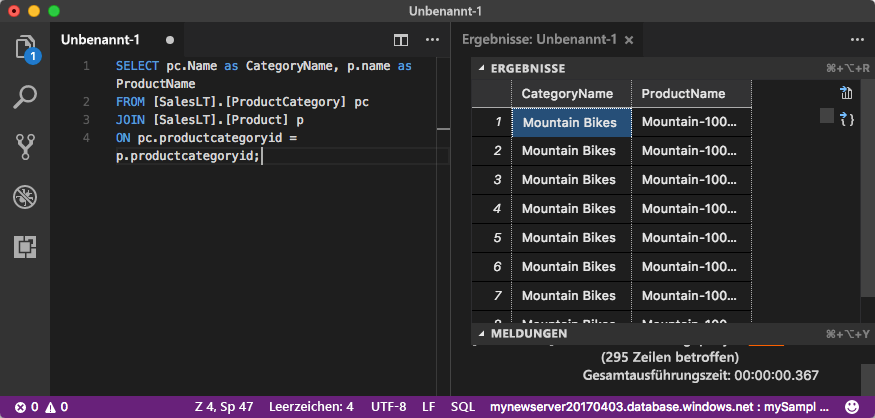

# <a name="quickstart-use-visual-studio-code-to-connect-and-query"></a>Schnellstart: Verbinden und Abfragen mit Visual Studio Code 
[!INCLUDE[appliesto-sqldb-sqlmi](../includes/appliesto-sqldb-sqlmi.md)]

[Visual Studio Code](https://code.visualstudio.com/docs) ist ein grafischer Code-Editor für Linux, MacOS und Windows. Er unterstützt Erweiterungen, einschließlich der [MSSQL-Erweiterung](https://aka.ms/mssql-marketplace) zum Abfragen einer SQL Server-Instanz, von Azure SQL-Datenbank, Azure SQL Managed Instance und einer Datenbank in Azure Synapse Analytics. In dieser Schnellstartanleitung verwenden Sie Visual Studio Code zum Herstellen einer Verbindung mit Azure SQL-Datenbank oder Azure SQL Managed Instance und führen anschließend Transact-SQL-Anweisungen aus, um Daten abzufragen, einzufügen, zu aktualisieren und zu löschen.

## <a name="prerequisites"></a>Voraussetzungen

- Eine Datenbank in Azure SQL-Datenbank oder Azure SQL Managed Instance In den folgenden Schnellstartanleitungen erfahren Sie jeweils, wie Sie eine Datenbank in Azure SQL-Datenbank erstellen und anschließend konfigurieren:

  | Aktion | Azure SQL-Datenbank | Verwaltete Azure SQL-Instanz |
  |:--- |:--- |:---|
  | Erstellen| [Portal](single-database-create-quickstart.md) | [Portal](../managed-instance/instance-create-quickstart.md) |
  || [BEFEHLSZEILENSCHNITTSTELLE (CLI)](scripts/create-and-configure-database-cli.md) | [BEFEHLSZEILENSCHNITTSTELLE (CLI)](https://medium.com/azure-sqldb-managed-instance/working-with-sql-managed-instance-using-azure-cli-611795fe0b44) |
  || [PowerShell](scripts/create-and-configure-database-powershell.md) | [PowerShell](../managed-instance/scripts/create-configure-managed-instance-powershell.md) |
  | Konfigurieren | [IP-Firewallregel auf Serverebene](firewall-create-server-level-portal-quickstart.md)| [Verbindung von einem virtuellen Computer](../managed-instance/connect-vm-instance-configure.md)|
  |||[Verbindungen von lokalen Computern](../managed-instance/point-to-site-p2s-configure.md)
  |Laden der Daten|Laden von Adventure Works gemäß Schnellstartanleitung|[Wiederherstellen von Wide World Importers](../managed-instance/restore-sample-database-quickstart.md)
  |||Wiederherstellen oder Importieren von Adventure Works über eine [BACPAC-Datei](database-import.md) von [GitHub](https://github.com/Microsoft/sql-server-samples/tree/master/samples/databases/adventure-works)|
  |||

  > [!IMPORTANT]
  > Die Skripts in diesem Artikel sind für die Adventure Works-Datenbank geschrieben. Bei einer verwalteten SQL-Instanz müssen Sie entweder die Adventure Works-Datenbank in eine Instanzdatenbank importieren oder die Skripts in diesem Artikel zur Verwendung der Wide World Importers-Datenbank anpassen.

## <a name="install-visual-studio-code"></a>Installieren von Visual Studio Code

Stellen Sie sicher, dass Sie die neueste Version von [Visual Studio Code](https://code.visualstudio.com/Download) installiert und die [mssql-Erweiterung](https://aka.ms/mssql-marketplace) geladen haben. Eine Installationsanleitung für die MSSQL-Erweiterung finden Sie unter [Installieren von Visual Studio Code](/sql/linux/sql-server-linux-develop-use-vscode#install-and-start-visual-studio-code) und [MSSQL für Visual Studio Code](https://marketplace.visualstudio.com/items?itemName=ms-mssql.mssql).

## <a name="configure-visual-studio-code"></a>Konfigurieren von Visual Studio Code

### <a name="macos"></a>**macOS**

Für macOS müssen Sie OpenSSL installieren, da dies eine Voraussetzung für .NET Core ist. .NET Core wird von der mssql-Erweiterung verwendet. Öffnen Sie Ihr Terminal, und geben Sie die folgenden Befehle ein, um **brew** und **OpenSSL** zu installieren.

```bash
ruby -e "$(curl -fsSL https://raw.githubusercontent.com/Homebrew/install/master/install)"
brew update
brew install openssl
mkdir -p /usr/local/lib
ln -s /usr/local/opt/openssl/lib/libcrypto.1.0.0.dylib /usr/local/lib/
ln -s /usr/local/opt/openssl/lib/libssl.1.0.0.dylib /usr/local/lib/
```

### <a name="linux-ubuntu"></a>**Linux (Ubuntu)**

Keine besondere Konfiguration erforderlich.

### <a name="windows"></a>**Windows**

Keine besondere Konfiguration erforderlich.

## <a name="get-server-connection-information"></a>Ermitteln von Serververbindungsinformationen

Ermitteln Sie die Verbindungsinformationen, die Sie zum Herstellen einer Verbindung mit Azure SQL-Datenbank benötigen. In den weiteren Verfahren benötigen Sie den vollqualifizierten Server- oder Hostnamen, den Datenbanknamen und die Anmeldeinformationen.

1. Melden Sie sich beim [Azure-Portal](https://portal.azure.com/) an.

2. Navigieren Sie zur Seite **SQL-Datenbanken** oder **Verwaltete SQL-Instanzen**.

3. Auf der Seite **Übersicht** finden Sie den vollqualifizierten Servernamen für SQL-Datenbank neben **Servername** oder den vollqualifizierten Servernamen für SQL Managed Instance neben **Host**. Um den Namen des Servers oder Hosts zu kopieren, zeigen Sie darauf, und wählen Sie das Symbol **Kopieren** aus.

## <a name="set-language-mode-to-sql"></a>Festlegen des Sprachmodus auf SQL

Legen Sie den Sprachmodus in Visual Studio Code auf **SQL** fest, um die Verwendung von mssql-Befehlen und T-SQL IntelliSense zu ermöglichen.

1. Öffnen Sie ein neues Visual Studio Code-Fenster.

2. Drücken Sie **STRG**+**N**. Eine neue Nur-Text-Datei wird geöffnet.

3. Wählen Sie in der unteren rechten Ecke der Statusleiste **Nur Text** aus.

4. Wählen Sie im dann geöffneten Dropdownmenü **Sprachmodus auswählen** **SQL** aus.

## <a name="connect-to-your-database"></a>Verbinden mit der Datenbank

Verwenden Sie Visual Studio Code, um eine Verbindung mit dem Server herzustellen.

> [!IMPORTANT]
> Stellen Sie vor dem Fortfahren sicher, dass Sie über alle Informationen zu Server und Anmeldung verfügen. Wenn Sie mit dem Eingeben der Informationen für das Verbindungsprofil begonnen haben und zu Visual Studio Code wechseln, müssen Sie mit dem Erstellen des Profils neu beginnen.

1. Drücken Sie in Visual Studio Code die Tastenkombination **STRG+UMSCHALT+P** (oder **F1**), um die Befehlspalette zu öffnen.

2. Wählen Sie **MS SQL:Connect** aus, und drücken Sie die **EINGABETASTE**.

3. Wählen Sie **Verbindungsprofil erstellen** aus.

4. Befolgen Sie die Eingabeaufforderungen, um die Verbindungseigenschaften für das neue Verbindungsprofil anzugeben. Drücken Sie nach dem Angeben der einzelnen Werte die **EINGABETASTE**, um fortzufahren.

   | Eigenschaft       | Vorgeschlagener Wert | BESCHREIBUNG |
   | ------------ | ------------------ | ------------------------------------------------- |
   | **Servername** | Der vollqualifizierte Servername | Der Name sollte etwa wie folgt lauten: **mynewserver20170313.database.windows.net**. |
   | **Datenbankname** | mySampleDatabase | Die Datenbank für die Verbindung. |
   | **Authentifizierung** | SQL-Anmeldung| In diesem Tutorial wird die SQL-Authentifizierung verwendet. |
   | **Benutzername** | Benutzername | Der Benutzername des Serveradministratorkontos, das zum Erstellen des Servers verwendet wird. |
   | **Kennwort (SQL-Anmeldung)** | Kennwort | Das Kennwort des Serveradministratorkontos, das zum Erstellen des Servers verwendet wird. |
   | **Kennwort speichern** | Ja oder Nein | Wählen Sie **Ja** aus, wenn Sie das Kennwort nicht jedes Mal erneut eingeben möchten. |
   | **Namen für dieses Profil eingeben** | Ein Profilname, z.B. **mySampleProfile** | Ein gespeichertes Profil beschleunigt die Verbindungsherstellung bei nachfolgenden Anmeldungen. |

   Bei erfolgreicher Ausführung wird eine Benachrichtigung angezeigt, dass Ihr Profil erstellt und verbunden ist.

## <a name="query-data"></a>Daten abfragen

Führen Sie die folgende [SELECT](/sql/t-sql/queries/select-transact-sql)-Transact-SQL-Anweisung aus, um die 20 wichtigsten Produkte nach Kategorie abzufragen.

1. Fügen Sie im Editor-Fenster die folgende SQL-Abfrage ein.

   ```sql
   SELECT pc.Name as CategoryName, p.name as ProductName
   FROM [SalesLT].[ProductCategory] pc
   JOIN [SalesLT].[Product] p
   ON pc.productcategoryid = p.productcategoryid;
   ```

2. Drücken Sie **STRG**+**UMSCHALT**+**E**, um die Abfrage auszuführen und Ergebnisse aus den Tabellen `Product` und `ProductCategory` anzuzeigen.

    

## <a name="insert-data"></a>Einfügen von Daten

Führen Sie die folgende [INSERT](/sql/t-sql/statements/insert-transact-sql)-Transact-SQL-Anweisung aus, um ein neues Produkt in der Tabelle `SalesLT.Product` hinzuzufügen.

1. Ersetzen Sie die vorherige Abfrage durch diese.

   ```sql
   INSERT INTO [SalesLT].[Product]
        ( [Name]
        , [ProductNumber]
        , [Color]
        , [ProductCategoryID]
        , [StandardCost]
        , [ListPrice]
        , [SellStartDate]
        )
     VALUES
        ('myNewProduct'
        ,123456789
        ,'NewColor'
        ,1
         ,100
         ,100
         ,GETDATE() );
   ```

2. Drücken Sie **STRG**+**UMSCHALT**+**E** zum Einfügen einer neuen Zeile in Tabelle `Product`.

## <a name="update-data"></a>Aktualisieren von Daten

Führen Sie die folgende [UPDATE](/sql/t-sql/queries/update-transact-sql)-Transact-SQL-Anweisung aus, um das hinzugefügte Produkt zu aktualisieren.

1. Ersetzen Sie die vorherige Abfrage durch diese:

   ```sql
   UPDATE [SalesLT].[Product]
   SET [ListPrice] = 125
   WHERE Name = 'myNewProduct';
   ```

2. Drücken Sie **STRG**+**UMSCHALT**+**E**, um die angegebene Zeile in der Tabelle `Product` zu aktualisieren.

## <a name="delete-data"></a>Löschen von Daten

Führen Sie die folgende [DELETE](/sql/t-sql/statements/delete-transact-sql)-Transact-SQL-Anweisung aus, um das neue Produkt zu entfernen.

1. Ersetzen Sie die vorherige Abfrage durch diese:

   ```sql
   DELETE FROM [SalesLT].[Product]
   WHERE Name = 'myNewProduct';
   ```

2. Drücken Sie **STRG**+**UMSCHALT**+**E**, um die angegebene Zeile in der Tabelle `Product` zu löschen.

## <a name="next-steps"></a>Nächste Schritte

- Informationen zum Verbinden und Abfragen mit SQL Server Management Studio (SSMS) finden Sie unter [Schnellstart: Verwenden von SQL Server Management Studio zum Herstellen einer Verbindung mit einer Datenbank in Azure SQL-Datenbank und zum Abfragen von Daten](connect-query-ssms.md).
- Informationen zum Verbinden und Abfragen mit dem Azure-Portal finden Sie unter [Schnellstart: Azure-Portal: Verwenden des SQL-Abfrage-Editors zum Verbinden und Abfragen von Daten](connect-query-portal.md).
- Im [Blogpost zum Erstellen einer Datenbank-IDE mit der MSSQL-Erweiterung](/archive/msdn-magazine/2017/june/data-points-visual-studio-code-create-a-database-ide-with-mssql-extension) finden Sie einen MSDN Magazine-Artikel zum Verwenden von Visual Studio Code.