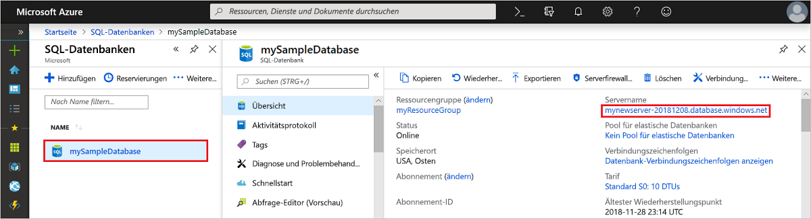
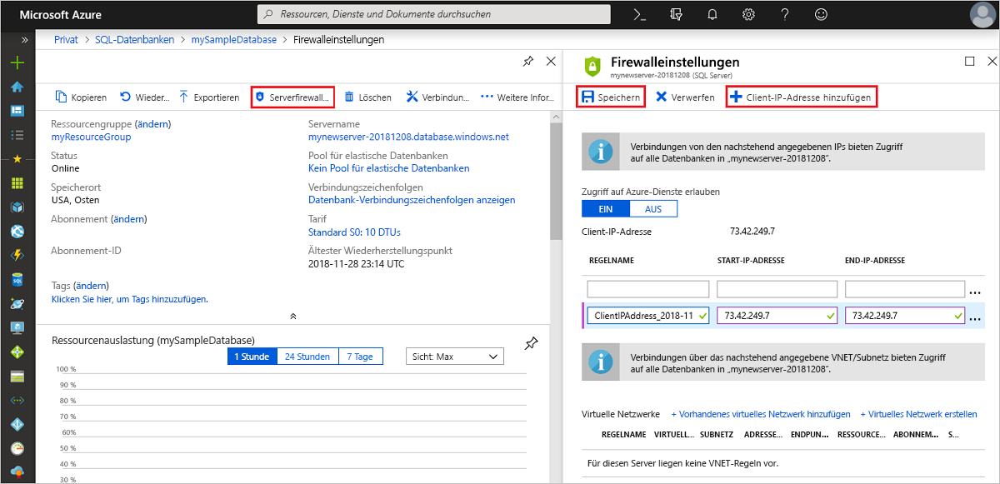

# Schnellstart: Erstellen einer Firewallregel auf Serverebene mit dem Azure-Portal
[!INCLUDE[appliesto-sqldb](../includes/appliesto-sqldb.md)]

In dieser Schnellstartanleitung erfahren Sie Schritt für Schritt, wie Sie über das Azure-Portal eine [Firewallregel auf Serverebene](firewall-configure.md) in Azure SQL-Datenbank erstellen, um eine Verbindung mit [logischen SQL-Servern](logical-servers.md), Einzeldatenbanken und Pools für elastische Datenbanken (und den darin enthaltenen Datenbanken) herzustellen. Eine Firewallregel ist erforderlich, um eine Verbindung über andere Azure-Ressourcen und über lokale Ressourcen herstellen zu können. Firewallregeln auf Serverebene gelten nicht für Azure SQL Managed Instance.

## Voraussetzungen

In dieser Schnellstartanleitung werden als Ausgangspunkt die Ressourcen verwendet, die unter [Quickstart: Create a single database in Azure SQL Database using the Azure portal](single-database-create-quickstart.md) (Schnellstart: Erstellen einer Einzeldatenbank in Azure SQL-Datenbank mit dem Azure-Portal) erstellt werden.

## Melden Sie sich auf dem Azure-Portal an.

Melden Sie sich beim [Azure-Portal](https://portal.azure.com/) an.

## Erstellen einer IP-Firewallregel auf Serverebene

 Von SQL-Datenbank wird eine Firewall auf Serverebene für Einzel- und Pooldatenbanken erstellt. Diese Firewall verhindert, dass Clientanwendungen eine Verbindung mit dem Server oder einer seiner Datenbanken herstellen, sofern Sie keine IP-Firewallregel erstellen, mit der die Firewall geöffnet wird. Für eine Verbindung über eine IP-Adresse, die sich außerhalb von Azure befindet, müssen Sie eine Firewallregel für eine bestimmte IP-Adresse oder für einen Bereich von Adressen erstellen, über die eine Verbindung möglich sein soll. Weitere Informationen zu IP-Firewallregeln auf Server- und Datenbankebene finden Sie im Thema zu [IP-Firewallregeln auf Serverebene und Datenbankebene](firewall-configure.md).

> [!NOTE]
> Azure SQL-Datenbank kommuniziert über Port 1433. Wenn Sie versuchen, eine Verbindung über ein Unternehmensnetzwerk herzustellen, wird ausgehender Datenverkehr über Port 1433 von der Firewall Ihres Netzwerks unter Umständen nicht zugelassen. In diesem Fall können Sie nur dann eine Verbindung mit Ihrem Server herstellen, wenn Ihre IT-Abteilung Port 1433 öffnet.
> [!IMPORTANT]
> Bei Verwendung der Firewallregel 0.0.0.0 können alle Azure-Dienste die Firewall auf Serverebene passieren und versuchen, über den Server eine Verbindung mit einer Datenbank herzustellen.

Führen Sie die hier angegebenen Schritte aus, um eine IP-Firewallregel auf Serverebene für die IP-Adresse Ihres Clients zu erstellen und um externe Verbindungen durch die Azure SQL-Datenbank-Firewall nur für Ihre IP-Adresse zuzulassen.

1. Wählen Sie nach Abschluss der [Datenbankbereitstellung](#prerequisites) im Menü auf der linken Seite **SQL-Datenbanken** und dann auf der Seite **SQL-Datenbanken** die Option **mySampleDatabase** aus. Die Übersichtsseite für Ihre Datenbank wird geöffnet, die den vollqualifizierten Servernamen (z.B. **mynewserver20170824.database.windows.net**) und Optionen für die weitere Konfiguration enthält.

2. Kopieren Sie diesen vollqualifizierten Servernamen, damit Sie ihn beim Herstellen der Verbindung mit Ihrem Server und den zugehörigen Datenbanken in anderen Schnellstartanleitungen verwenden können.

   

3. Wählen Sie in der Symbolleiste die Option **Serverfirewall festlegen**. Die Seite **Firewalleinstellungen** für den Server wird geöffnet.

   

4. Wählen Sie auf der Symbolleiste die Option **Client-IP-Adresse hinzufügen**, um Ihre aktuelle IP-Adresse einer neuen IP-Firewallregel auf Serverebene hinzuzufügen. Eine IP-Firewallregel auf Serverebene kann Port 1433 für eine einzelne IP-Adresse oder einen Bereich von IP-Adressen öffnen.

   > [!IMPORTANT]
   > Standardmäßig ist der Zugriff über die Azure SQL-Datenbank-Firewall für alle Azure-Dienste deaktiviert. Wählen Sie auf dieser Seite **EIN** aus, wenn Sie den Zugriff für alle Azure-Dienste aktivieren möchten.
   >

5. Wählen Sie **Speichern** aus. Für Ihre aktuelle IP-Adresse wird eine IP-Firewallregel auf Serverebene erstellt, und auf dem Server wird der Port 1433 geöffnet.

6. Schließen Sie die Seite **Firewalleinstellungen**.

Sie können über diese IP-Adresse jetzt eine Verbindung mit dem Server und den dazugehörigen Datenbanken herstellen. Verwenden Sie hierfür SQL Server Management Studio oder ein anderes Tool Ihrer Wahl sowie das zuvor erstellte Serveradministratorkonto.

## Bereinigen von Ressourcen

Speichern Sie diese Ressourcen, um unter [Nächste Schritte](#next-steps) zu erfahren, wie Sie eine Verbindung herstellen und Ihre Datenbank mit verschiedenen Methoden abfragen. Sie können die Ressourcen, die Sie im Rahmen dieser Schnellstartanleitung erstellt haben, aber auch wieder löschen. Gehen Sie hierzu wie folgt vor:

1. Wählen Sie im Azure-Portal im Menü auf der linken Seite die Option **Ressourcengruppen** und dann **myResourceGroup**.
2. Wählen Sie auf der Seite mit Ihrer Ressourcengruppe die Option **Löschen**, geben Sie im Textfeld **myResourceGroup** ein, und wählen Sie anschließend **Löschen**.

## Nächste Schritte

- Nachdem Sie nun über eine Datenbank verfügen, können Sie mit Ihren bevorzugten Tools oder Sprachen [eine Verbindung herstellen und Abfragen ausführen](connect-query-content-reference-guide.md). Dazu zählen auch:
  - [Verbinden und Abfragen mit SQL Server Management Studio (SSMS)](connect-query-ssms.md)
  - [Verbinden und Abfragen mit Azure Data Studio](/sql/azure-data-studio/quickstart-sql-database?toc=/azure/sql-database/toc.json)
- Informationen zum Entwerfen Ihrer ersten Datenbank, zum Erstellen von Tabellen und zum Einfügen von Daten finden Sie in diesen Tutorials:
  - [Tutorial: Entwurf Ihrer ersten Azure SQL-Datenbank mithilfe von SSMS](design-first-database-tutorial.md)
  - [Tutorial: Entwerfen einer Azure SQL-Datenbank und Herstellen einer Verbindung für diese mit C# und ADO.NET](design-first-database-csharp-tutorial.md)
