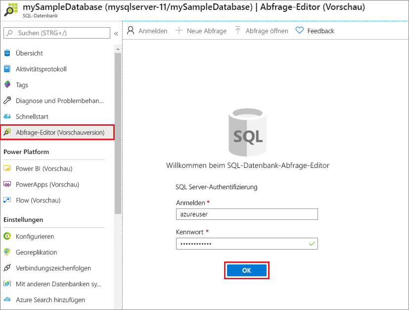
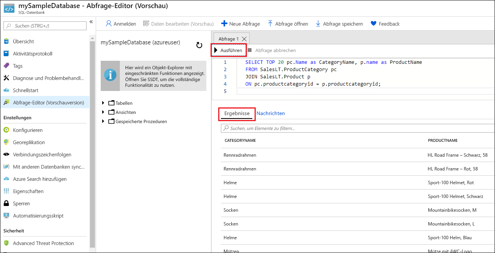

# <a name="quickstart-create-an-azure-sql-database-single-database"></a>Schnellstart: Erstellen einer Azure SQL-Einzeldatenbank

In dieser Schnellstartanleitung verwenden Sie das Azure-Portal, ein PowerShell-Skript oder ein Azure CLI-Skript, um eine Einzeldatenbank in Azure SQL-Datenbank zu erstellen. Anschließend fragen Sie die Datenbank mit dem **Abfrage-Editor** im Azure-Portal ab.

Eine [Einzeldatenbank](single-database-overview.md) ist die schnellste und einfachste Option für Azure SQL-Datenbank. Sie verwalten eine Einzeldatenbank auf einem [Server](logical-servers.md), der sich in einer [Azure-Ressourcengruppe](../../active-directory-b2c/overview.md) in einer angegebenen Region befindet. In dieser Schnellstartanleitung erstellen Sie eine neue Ressourcengruppe und einen Server für die neue Datenbank.

Sie können eine Einzeldatenbank auf der *bereitgestellten* oder der *serverlosen* Computeebene erstellen. Für eine bereitgestellte Datenbank wird vorab eine festgelegte Menge an Computeressourcen zugeordnet, einschließlich CPU und Arbeitsspeicher, und es werden zwei [Kaufmodelle](purchasing-models.md) verwendet. In dieser Schnellstartanleitung wird eine bereitgestellte Datenbank mit dem [vCore-basierten](service-tiers-vcore.md) Kaufmodell erstellt, aber Sie können auch ein [DTU-basiertes](service-tiers-dtu.md) Modell auswählen.

Die serverlose Computeebene ist nur für das vCore-basierte Kaufmodell verfügbar und umfasst einen automatisch skalierten Bereich mit Computeressourcen, einschließlich CPU und Arbeitsspeicher. Informationen zum Erstellen einer Einzeldatenbank auf der serverlosen Computeebene finden Sie unter [Erstellen einer serverlosen Datenbank](serverless-tier-overview.md#create-a-new-database-in-the-serverless-compute-tier).

## <a name="prerequisite"></a>Voraussetzung

- Ein aktives Azure-Abonnement. Falls Sie nicht über ein Abonnement verfügen, können Sie ein [kostenloses Konto erstellen](https://azure.microsoft.com/free/).

## <a name="create-a-single-database"></a>Erstellen einer Einzeldatenbank

[!INCLUDE [sql-database-create-single-database](../includes/sql-database-create-single-database.md)]

## <a name="query-the-database"></a>Abfragen der Datenbank

Nach der Erstellung der Datenbank können Sie den integrierten **Abfrage-Editor** im Azure-Portal verwenden, um eine Verbindung mit der Datenbank herzustellen und die Daten abzufragen.

1. Suchen Sie im Portal nach **SQL-Datenbanken**, und wählen Sie den Eintrag aus. Wählen Sie anschließend in der Liste Ihre Datenbank aus.
1. Wählen Sie auf der Seite **SQL-Datenbank** für Ihre Datenbank im Menü auf der linken Seite die Option **Abfrage-Editor (Vorschau)** aus.
1. Geben Sie Ihre Serveradministrator-Anmeldeinformationen ein, und wählen Sie **OK** aus.

   

1. Geben Sie die folgende Abfrage im Bereich **Abfrage-Editor** ein.

   ```sql
   SELECT TOP 20 pc.Name as CategoryName, p.name as ProductName
   FROM SalesLT.ProductCategory pc
   JOIN SalesLT.Product p
   ON pc.productcategoryid = p.productcategoryid;
   ```

1. Klicken Sie auf **Ausführen**, und sehen Sie sich dann die Abfrageergebnisse im Bereich **Ergebnisse** an.

   

1. Schließen Sie die Seite **Abfrage-Editor**, und klicken Sie auf **OK**, um Ihre nicht gespeicherten Änderungen zu verwerfen, wenn Sie dazu aufgefordert werden.

## <a name="clean-up-resources"></a>Bereinigen von Ressourcen

Behalten Sie die Ressourcengruppe, den Server und die Einzeldatenbank für die nächsten Schritte bei, und informieren Sie sich darüber, wie Sie für Ihre Datenbank mit unterschiedlichen Methoden die Verbindungsherstellung und Abfragen durchführen.

Wenn Sie die Verwendung dieser Ressourcen beendet haben, können Sie die erstellte Ressourcengruppe löschen. Hierbei werden auch der Server und die darin enthaltene Einzeldatenbank gelöscht.

### <a name="the-azure-portal"></a>[Azure-Portal](#tab/azure-portal)

Löschen Sie **myResourceGroup** und alle zugehörigen Ressourcen wie folgt über das Azure-Portal:

1. Suchen Sie im Portal nach **Ressourcengruppen**, und wählen Sie die Option aus. Wählen Sie anschließend in der Liste die Option **myResourceGroup** aus.
1. Wählen Sie auf der Ressourcengruppenseite die Option **Ressourcengruppe löschen** aus.
1. Geben Sie unter **Geben Sie den Ressourcengruppennamen ein** den Namen *myResourceGroup* ein, und wählen Sie anschließend **Löschen** aus.

### <a name="the-azure-cli"></a>[Die Azure-CLI](#tab/azure-cli)

Führen Sie den folgenden Azure CLI-Befehl für den Namen Ihrer Ressourcengruppe aus, um die Ressourcengruppe und alle zugehörigen Ressourcen zu löschen:

```azurecli-interactive
az group delete --name <your resource group>
```

### <a name="powershell"></a>[PowerShell](#tab/azure-powershell)

Führen Sie das folgende PowerShell-Cmdlet für den Namen Ihrer Ressourcengruppe aus, um die Ressourcengruppe und alle zugehörigen Ressourcen zu löschen:

```azurepowershell-interactive
Remove-AzResourceGroup -Name <your resource group>
```

---

## <a name="next-steps"></a>Nächste Schritte

Führen Sie für Ihre Datenbank die [Verbindungsherstellung und Abfragen](connect-query-content-reference-guide.md) mit unterschiedlichen Tools und Sprachen durch:
> [!div class="nextstepaction"]
> [Verbinden und Abfragen mit SQL Server Management Studio (SSMS)](connect-query-ssms.md)
>
> [Verbinden und Abfragen mit Azure Data Studio](/sql/azure-data-studio/quickstart-sql-database?toc=/azure/sql-database/toc.json)
 