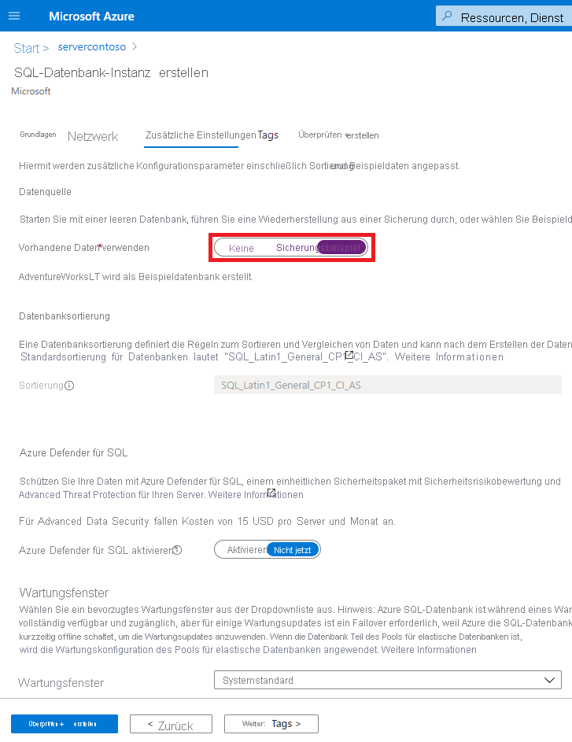

# <a name="quickstart-create-an-azure-sql-database-single-database"></a>Schnellstart: Erstellen einer Azure SQL-Einzeldatenbank

In dieser Schnellstartanleitung erstellen Sie über das Azure-Portal, mithilfe eines PowerShell-Skripts oder eines Azure CLI-Skripts eine [Einzeldatenbank](single-database-overview.md). Anschließend fragen Sie die Datenbank mit dem **Abfrage-Editor** im Azure-Portal ab.


## <a name="prerequisite"></a>Voraussetzung

- Ein aktives Azure-Abonnement. Falls Sie nicht über ein Abonnement verfügen, können Sie ein [kostenloses Konto erstellen](https://azure.microsoft.com/free/).

## <a name="create-a-single-database"></a>Erstellen einer Einzeldatenbank

In dieser Schnellstartanleitung wird eine Einzeldatenbank im [serverlosen Computetarif](serverless-tier-overview.md) erstellt.

# <a name="portal"></a>[Portal](#tab/azure-portal)

Zum Erstellen einer Einzeldatenbank im Azure-Portal beginnt diese Schnellstartanleitung auf der Seite „Azure SQL“.

1. Navigieren Sie zur Seite [SQL-Bereitstellungsoption auswählen](https://portal.azure.com/#create/Microsoft.AzureSQL).
1. Behalten Sie unter **SQL-Datenbanken** für **Einzeldatenbank** den festgelegten Wert **Ressourcentyp** bei, und wählen Sie **Erstellen** aus.

   

1. Wählen Sie auf der Registerkarte **Grundeinstellungen** des Formulars **SQL-Datenbank erstellen** unter **Projektdetails** das gewünschte **Abonnement** für Azure aus.
1. Wählen Sie bei **Ressourcengruppe** die Option **Neu erstellen** aus, geben Sie *myResourceGroup* ein, und wählen Sie **OK** aus.
1. Geben Sie für *Datenbankname* den Namen **mySampleDatabase** ein.
1. Wählen Sie unter **Server** die Option **Neu erstellen** aus, und füllen Sie das Formular **Neuer Server** mit den folgenden Werten aus:
   - **Servername**: Geben Sie *mysqlserver* ein, und fügen Sie einige weitere Zeichen hinzu, um einen eindeutigen Wert zu erhalten. Wir können keinen exakten Servernamen zur Verwendung angeben, weil Servernamen für alle Server in Azure global eindeutig sein müssen (und nicht nur innerhalb eines Abonnements eindeutig sind). Geben Sie also beispielsweise „mysqlserver12345“ ein. Dann werden Sie vom Portal informiert, ob dieser Server verfügbar ist oder nicht.
   - **Serveradministratoranmeldung**: Geben Sie *azureuser* ein.
   - **Kennwort**: Geben Sie ein geeignetes Kennwort ein, und wiederholen Sie die Eingabe im Feld **Kennwort bestätigen**.
   - **Standort**: Wählen Sie in der Dropdownliste einen Standort aus.

   Klicken Sie auf **OK**.

1. Behalten Sie für **Möchten Sie einen Pool für elastische SQL-Datenbanken verwenden?** den Wert **Nein** bei.
1. Wählen Sie unter **Compute + Speicher** die Option **Datenbank konfigurieren** aus.
1. Weil in dieser Schnellstartanleitung eine serverlose Datenbank verwendet wird, wählen Sie **Serverlos** und dann **Anwenden** aus. 

      

1. Klicken Sie auf **Weiter: Netzwerk** aus (im unteren Bereich der Seite).

   

1. Wählen Sie auf der Registerkarte **Netzwerk** als **Konnektivitätsmethode** die Option **Öffentlicher Endpunkt** aus.
1. Legen Sie bei **Firewallregeln** die Option **Aktuelle Client-IP-Adresse hinzufügen** auf **Ja** fest. Behalten Sie für **Azure-Diensten und -Ressourcen den Zugriff auf diese Servergruppe gestatten** den Wert **Nein** bei.
1. Klicken Sie auf **Weiter: Zusätzliche Einstellungen** aus (im unteren Bereich der Seite).

   
  

1. Wählen Sie auf der Registerkarte **Zusätzliche Einstellungen** im Abschnitt **Datenquelle** unter **Vorhandene Daten verwenden** die Option **Beispiel** aus. Dadurch wird eine AdventureWorksLT-Beispieldatenbank erstellt, sodass es einige Tabellen und Daten, die Sie abfragen und mit denen Sie experimentieren können, im Gegensatz zu einer leeren Datenbank gibt.
1. Wählen Sie unten auf der Seite die Option **Überprüfen + erstellen** aus:

   

1. Wählen Sie nach Überprüfung auf der Seite **Überprüfen + erstellen** die Option **Erstellen**aus.

# <a name="azure-cli"></a>[Azure-Befehlszeilenschnittstelle](#tab/azure-cli)

## <a name="launch-azure-cloud-shell"></a>Starten von Azure Cloud Shell

Azure Cloud Shell ist eine kostenlose interaktive Shell, mit der Sie die Schritte in diesem Artikel ausführen können. Sie verfügt über allgemeine vorinstallierte Tools und ist für die Verwendung mit Ihrem Konto konfiguriert. 

Wählen Sie zum Öffnen von Cloud Shell oben rechts in einem Codeblock einfach die Option **Ausprobieren**. Sie können Cloud Shell auch auf einer separaten Browserregisterkarte starten, indem Sie zu [https://shell.azure.com](https://shell.azure.com) navigieren. Wählen Sie **Kopieren** aus, um die Blöcke mit dem Code zu kopieren. Fügen Sie ihn anschließend in Cloud Shell ein, und drücken Sie die **EINGABETASTE**, um ihn auszuführen.

## <a name="set-parameter-values"></a>Festlegen von Parameterwerten

Mit den folgenden Werten werden in nachfolgenden Befehlen die Datenbank und die erforderlichen Ressourcen erstellt. Servernamen müssen innerhalb von Azure global eindeutig sein, damit die Funktion „$RANDOM“ zum Erstellen des Servernamens verwendet werden kann. Ersetzen Sie die Werte „0.0.0.0“ im IP-Adressbereich entsprechend ihrer spezifischen Umgebung.

```azurecli-interactive
# Set the resource group name and location for your server
resourceGroupName=myResourceGroup
location=eastus

# Set an admin login and password for your database
adminlogin=azureuser
password=Azure1234567!

# Set a server name that is unique to Azure DNS (<server_name>.database.windows.net)
serverName=server-$RANDOM

# Set the ip address range that can access your database
startip=0.0.0.0
endip=0.0.0.0
```

## <a name="create-a-resource-group"></a>Erstellen einer Ressourcengruppe

Erstellen Sie mithilfe des Befehls [az group create](/cli/azure/group) eine Ressourcengruppe. Eine Azure-Ressourcengruppe ist ein logischer Container, in dem Azure-Ressourcen bereitgestellt und verwaltet werden. Im folgenden Beispiel wird eine Ressourcengruppe mit dem Namen *myResourceGroup* am Standort *eastus* erstellt:

```azurecli-interactive
az group create --name $resourceGroupName --location $location
```

## <a name="create-a-server"></a>Erstellen eines Servers

Erstellen Sie einen Server mit dem Befehl [az sql server create](/cli/azure/sql/server).

```azurecli-interactive
az sql server create \
    --name $serverName \
    --resource-group $resourceGroupName \
    --location $location  \
    --admin-user $adminlogin \
    --admin-password $password
```


## <a name="configure-a-firewall-rule-for-the-server"></a>Konfigurieren einer Firewallregel für den Server

Erstellen Sie eine Firewallregel mit dem Befehl [az sql server firewall-rule create](/cli/azure/sql/server/firewall-rule).

```azurecli-interactive
az sql server firewall-rule create \
    --resource-group $resourceGroupName \
    --server $serverName \
    -n AllowYourIp \
    --start-ip-address $startip \
    --end-ip-address $endip
```


## <a name="create-a-single-database"></a>Erstellen einer Einzeldatenbank

Erstellen Sie eine Datenbank mit dem Befehl [az sql db create](/cli/azure/sql/db). Der folgende Code erstellt


```azurecli-interactive
az sql db create \
    --resource-group $resourceGroupName \
    --server $serverName \
    --name mySampleDatabase \
    --sample-name AdventureWorksLT \
    --edition GeneralPurpose \
    --compute-model Serverless \
    --family Gen5 \
    --capacity 2
```


# <a name="powershell"></a>[PowerShell](#tab/azure-powershell)

Sie können eine Ressourcengruppe, einen Server und eine Einzeldatenbank mithilfe von Windows PowerShell erstellen.

## <a name="launch-azure-cloud-shell"></a>Starten von Azure Cloud Shell

Azure Cloud Shell ist eine kostenlose interaktive Shell, mit der Sie die Schritte in diesem Artikel ausführen können. Sie verfügt über allgemeine vorinstallierte Tools und ist für die Verwendung mit Ihrem Konto konfiguriert. 

Wählen Sie zum Öffnen von Cloud Shell oben rechts in einem Codeblock einfach die Option **Ausprobieren**. Sie können Cloud Shell auch auf einer separaten Browserregisterkarte starten, indem Sie zu [https://shell.azure.com](https://shell.azure.com) navigieren. Wählen Sie **Kopieren** aus, um die Blöcke mit dem Code zu kopieren. Fügen Sie ihn anschließend in Cloud Shell ein, und drücken Sie die **EINGABETASTE**, um ihn auszuführen.

## <a name="set-parameter-values"></a>Festlegen von Parameterwerten

Mit den folgenden Werten werden in nachfolgenden Befehlen die Datenbank und die erforderlichen Ressourcen erstellt. Servernamen müssen innerhalb von Azure global eindeutig sein, damit das Cmdlet „Get-Random“ zum Erstellen des Servernamens verwendet werden kann. Ersetzen Sie die Werte „0.0.0.0“ im IP-Adressbereich entsprechend ihrer spezifischen Umgebung.

```azurepowershell-interactive
   # Set variables for your server and database
   $resourceGroupName = "myResourceGroup"
   $location = "eastus"
   $adminLogin = "azureuser"
   $password = "Azure1234567!"
   $serverName = "mysqlserver-$(Get-Random)"
   $databaseName = "mySampleDatabase"

   # The ip address range that you want to allow to access your server
   $startIp = "0.0.0.0"
   $endIp = "0.0.0.0"

   # Show randomized variables
   Write-host "Resource group name is" $resourceGroupName
   Write-host "Server name is" $serverName
```


## <a name="create-resource-group"></a>Ressourcengruppe erstellen

Erstellen Sie mit [New-AzResourceGroup](/powershell/module/az.resources/new-azresourcegroup) eine Azure-Ressourcengruppe. Eine Ressourcengruppe ist ein logischer Container, in dem Azure-Ressourcen bereitgestellt und verwaltet werden.

```azurepowershell-interactive
   Write-host "Creating resource group..."
   $resourceGroup = New-AzResourceGroup -Name $resourceGroupName -Location $location -Tag @{Owner="SQLDB-Samples"}
   $resourceGroup
```


## <a name="create-a-server"></a>Erstellen eines Servers

Erstellen Sie einen Server mit dem Cmdlet [New-AzSqlServer](/powershell/module/az.sql/new-azsqlserver).

```azurepowershell-interactive
  Write-host "Creating primary server..."
   $server = New-AzSqlServer -ResourceGroupName $resourceGroupName `
      -ServerName $serverName `
      -Location $location `
      -SqlAdministratorCredentials $(New-Object -TypeName System.Management.Automation.PSCredential `
      -ArgumentList $adminLogin, $(ConvertTo-SecureString -String $password -AsPlainText -Force))
   $server
```

## <a name="create-a-firewall-rule"></a>Erstellen einer Firewallregel

Erstellen Sie eine Serverfirewallregel mit dem Cmdlet [New-AzSqlServerFirewallRule](/powershell/module/az.sql/new-azsqlserverfirewallrule).

```azurepowershell-interactive
   Write-host "Configuring server firewall rule..."
   $serverFirewallRule = New-AzSqlServerFirewallRule -ResourceGroupName $resourceGroupName `
      -ServerName $serverName `
      -FirewallRuleName "AllowedIPs" -StartIpAddress $startIp -EndIpAddress $endIp
   $serverFirewallRule
```


## <a name="create-a-single-database"></a>Erstellen einer Einzeldatenbank

Erstellen Sie eine Einzeldatenbank mit dem Cmdlet [New-AzSqlDatabase](/powershell/module/az.sql/new-azsqldatabase).

```azurepowershell-interactive
   Write-host "Creating a gen5 2 vCore serverless database..."
   $database = New-AzSqlDatabase  -ResourceGroupName $resourceGroupName `
      -ServerName $serverName `
      -DatabaseName $databaseName `
      -Edition GeneralPurpose `
      -ComputeModel Serverless `
      -ComputeGeneration Gen5 `
      -VCore 2 `
      -MinimumCapacity 2 `
      -SampleName "AdventureWorksLT"
   $database
```

---


## <a name="query-the-database"></a>Abfragen der Datenbank

Nach der Erstellung der Datenbank können Sie mithilfe des **Abfrage-Editors (Vorschau)** im Azure-Portal eine Verbindung mit der Datenbank herstellen und die Daten abfragen.

1. Suchen Sie im Portal nach **SQL-Datenbanken**, und wählen Sie den Eintrag aus. Wählen Sie anschließend in der Liste Ihre Datenbank aus.
1. Wählen Sie auf der Seite für Ihre Datenbank im Menü auf der linken Seite die Option **Abfrage-Editor (Vorschau)** aus.
1. Geben Sie Ihre Serveradministrator-Anmeldeinformationen ein, und wählen Sie **OK** aus.

   

1. Geben Sie die folgende Abfrage im Bereich **Abfrage-Editor** ein.

   ```sql
   SELECT TOP 20 pc.Name as CategoryName, p.name as ProductName
   FROM SalesLT.ProductCategory pc
   JOIN SalesLT.Product p
   ON pc.productcategoryid = p.productcategoryid;
   ```

1. Klicken Sie auf **Ausführen**, und sehen Sie sich dann die Abfrageergebnisse im Bereich **Ergebnisse** an.

   

1. Schließen Sie die Seite **Abfrage-Editor**, und klicken Sie auf **OK**, um Ihre nicht gespeicherten Änderungen zu verwerfen, wenn Sie dazu aufgefordert werden.

## <a name="clean-up-resources"></a>Bereinigen von Ressourcen

Behalten Sie die Ressourcengruppe, den Server und die Einzeldatenbank für die nächsten Schritte bei, und informieren Sie sich darüber, wie Sie für Ihre Datenbank mit unterschiedlichen Methoden die Verbindungsherstellung und Abfragen durchführen.

Wenn Sie die Verwendung dieser Ressourcen beendet haben, können Sie die erstellte Ressourcengruppe löschen. Hierbei werden auch der Server und die darin enthaltene Einzeldatenbank gelöscht.

### <a name="portal"></a>[Portal](#tab/azure-portal)

Löschen Sie **myResourceGroup** und alle zugehörigen Ressourcen wie folgt über das Azure-Portal:

1. Suchen Sie im Portal nach **Ressourcengruppen**, und wählen Sie die Option aus. Wählen Sie anschließend in der Liste die Option **myResourceGroup** aus.
1. Wählen Sie auf der Ressourcengruppenseite die Option **Ressourcengruppe löschen** aus.
1. Geben Sie unter **Geben Sie den Ressourcengruppennamen ein** den Namen *myResourceGroup* ein, und wählen Sie anschließend **Löschen** aus.

### <a name="azure-cli"></a>[Azure-Befehlszeilenschnittstelle](#tab/azure-cli)

Führen Sie den folgenden Azure CLI-Befehl für den Namen Ihrer Ressourcengruppe aus, um die Ressourcengruppe und alle zugehörigen Ressourcen zu löschen:

```azurecli-interactive
az group delete --name $resourceGroupName
```

### <a name="powershell"></a>[PowerShell](#tab/azure-powershell)

Führen Sie das folgende PowerShell-Cmdlet für den Namen Ihrer Ressourcengruppe aus, um die Ressourcengruppe und alle zugehörigen Ressourcen zu löschen:

```azurepowershell-interactive
Remove-AzResourceGroup -Name $resourceGroupName
```

---

## <a name="next-steps"></a>Nächste Schritte

Führen Sie für Ihre Datenbank die [Verbindungsherstellung und Abfragen](connect-query-content-reference-guide.md) mit unterschiedlichen Tools und Sprachen durch:
> [!div class="nextstepaction"]
> [Verbinden und Abfragen mit SQL Server Management Studio (SSMS)](connect-query-ssms.md)
>
> [Verbinden und Abfragen mit Azure Data Studio](/sql/azure-data-studio/quickstart-sql-database?toc=/azure/sql-database/toc.json)

Möchten Sie Ihre Cloudausgaben optimieren und somit Geld sparen?

> [!div class="nextstepaction"]
> [Beginnen mit der Kostenanalyse mit Cost Management](https://docs.microsoft.com/azure/cost-management-billing/costs/quick-acm-cost-analysis?WT.mc_id=costmanagementcontent_docsacmhorizontal_-inproduct-learn)
