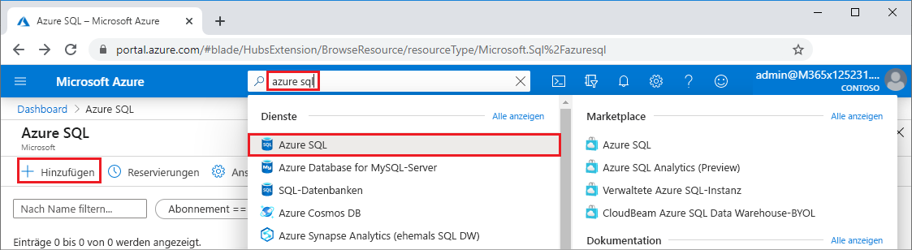
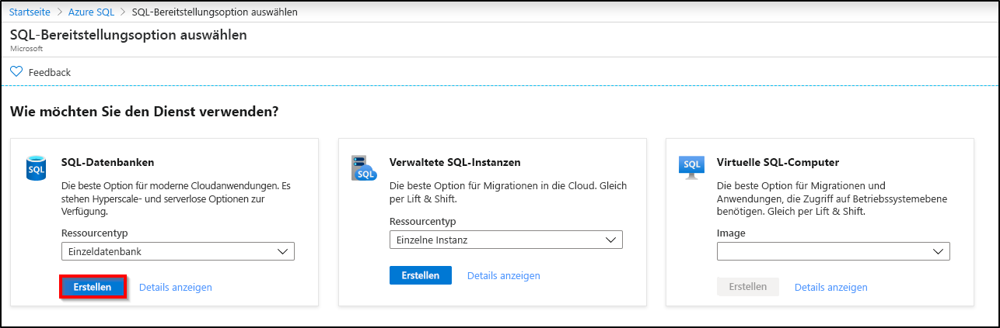
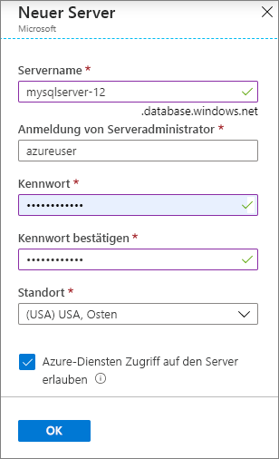
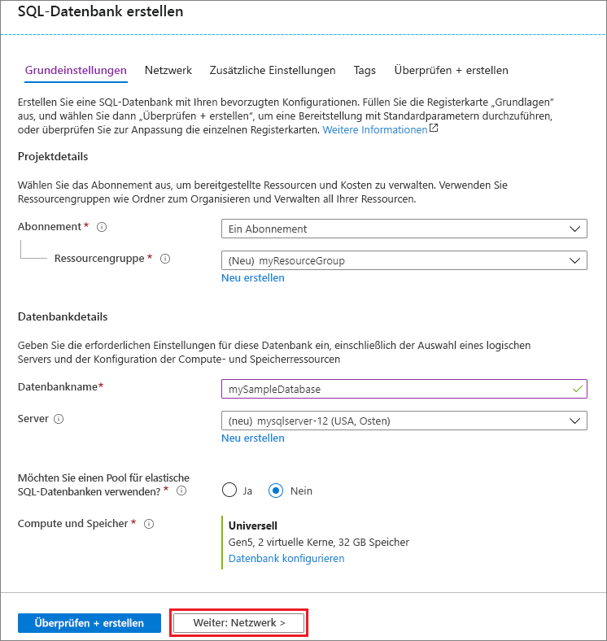
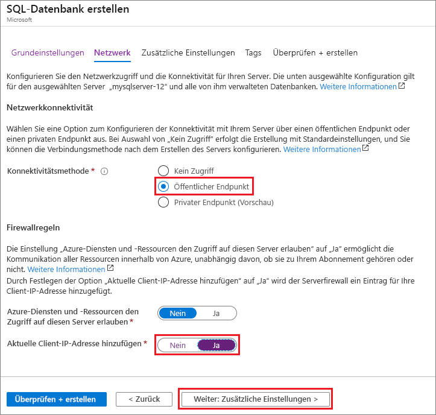
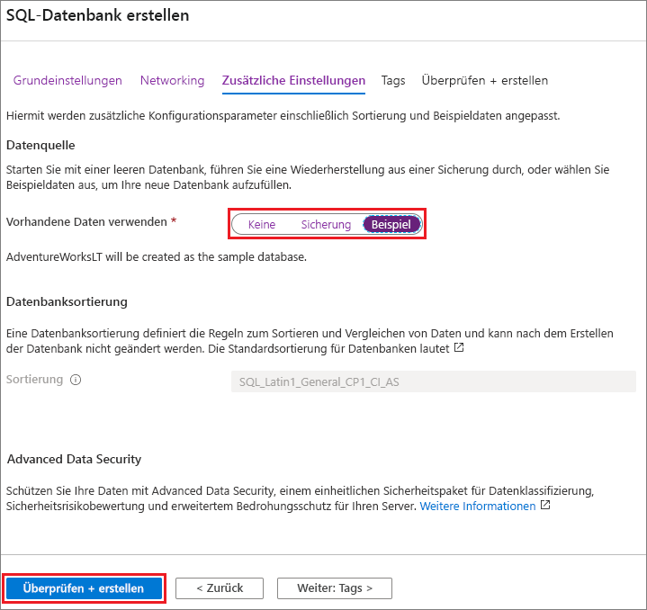

In diesem Schritt werden ein [logischer SQL-Server](../database/logical-servers.md) und eine [Einzeldatenbank](../database/single-database-overview.md) mit AdventureWorksLT-Beispieldaten erstellt. Sie können die Datenbank über Menüs und Bildschirme des Azure-Portals erstellen oder die Azure-Befehlszeilenschnittstelle oder ein PowerShell-Skript in Azure Cloud Shell verwenden.

Alle Methoden beinhalten die Einrichtung einer Firewallregel auf Serverebene, um die öffentliche IP-Adresse des Computers zuzulassen, den Sie für den Zugriff auf den Server verwenden. Weitere Informationen zum Erstellen von Firewallregeln auf Serverebene finden Sie unter [Schnellstart: Erstellen einer Firewallregel auf Serverebene für Einzel- und Pooldatenbanken über das Azure-Portal](../database/firewall-create-server-level-portal-quickstart.md). Sie können auch Firewallregeln auf Datenbankebene festlegen. Weitere Informationen finden Sie unter [sp_set_database_firewall_rule (Azure SQL-Datenbank)](/sql/relational-databases/system-stored-procedures/sp-set-database-firewall-rule-azure-sql-database).

# <a name="portal"></a>[Portal](#tab/azure-portal)

So erstellen Sie eine Ressourcengruppe, einen Server und eine Einzeldatenbank über das Azure-Portal:

1. Melden Sie sich beim [Portal](https://portal.azure.com) an.
1. Suchen Sie mithilfe der Suchleiste nach **Azure SQL**, und wählen Sie die entsprechende Option aus.
1. Wählen Sie auf der Seite **Azure SQL** die Option **Hinzufügen** aus.

   

1. Wählen Sie auf der Seite **SQL-Bereitstellungsoption auswählen** die Kachel **SQL-Datenbanken** und unter **Ressourcentyp** die Option **Einzeldatenbank** aus. Wenn Sie weitere Informationen zu den verschiedenen Datenbanken anzeigen möchten, wählen Sie **Details anzeigen** aus.
1. Klicken Sie auf **Erstellen**.

   

1. Wählen Sie auf der Registerkarte **Grundeinstellungen** des Formulars **SQL-Datenbank erstellen** unter **Projektdetails** das korrekte **Abonnement** für Azure aus (sofern erforderlich).
1. Wählen Sie unter **Ressourcengruppe** die Option **Neu erstellen** aus, geben Sie *myResourceGroup* ein, und wählen Sie **OK** aus.
1. Geben Sie unter **Datenbankdetails** für **Datenbankname** den Namen *mySampleDatabase* ein.
1. Wählen Sie unter **Server** die Option **Neu erstellen** aus, und füllen Sie das Formular **Neuer Server** wie folgt aus:
   - **Servername**: Geben Sie *mysqlserver* und einige weitere Zeichen ein, um einen eindeutigen Wert zu erhalten.
   - **Serveradministratoranmeldung**: Geben Sie *azureuser* ein.
   - **Kennwort**: Geben Sie ein geeignetes Kennwort ein, und wiederholen Sie die Eingabe im Feld **Kennwort bestätigen**.
   - **Standort**: Wählen Sie in der Dropdownliste einen Standort aus (beispielsweise **(USA) USA, Osten**).

   Klicken Sie auf **OK**.

   

   Notieren Sie sich die Serveradministratoranmeldung und das Kennwort, damit Sie sich beim Server und bei den Datenbanken anmelden können. Sollten Sie Ihre Anmeldeinformationen vergessen, können Sie nach der Datenbankerstellung auf der Seite **SQL Server** die Anmelde-ID abrufen oder das Kennwort zurücksetzen. Wählen Sie zum Öffnen der Seite **SQL Server** auf der Seite **Übersicht** für die Datenbank den Servernamen aus.

1. Wenn Sie die Standardeinstellungen neu konfigurieren möchten, wählen Sie unter **Compute + Speicher** die Option **Datenbank konfigurieren** aus.

   Auf der Seite **Konfigurieren** haben Sie folgende Möglichkeiten:
   - Sie können **Computetarif** von **Bereitgestellt** in **Serverlos** ändern.
   - Sie können die Einstellungen für **Virtuelle Kerne** und **Maximale Datengröße** überprüfen und ändern.
   - Sie können **Konfiguration ändern** auswählen, um die Hardwaregeneration zu ändern.

   Wählen Sie abschließend **Anwenden** aus, um Ihre Änderungen zu speichern.

1. Klicken Sie auf **Weiter: Netzwerk** aus (im unteren Bereich der Seite).

   

1. Wählen Sie auf der Registerkarte **Netzwerk** unter **Konnektivitätsmethode** die Option **Öffentlicher Endpunkt** aus.
1. Legen Sie unter **Firewallregeln** die Option **Aktuelle Client-IP-Adresse hinzufügen** auf **Ja** fest.
1. Klicken Sie auf **Weiter: Zusätzliche Einstellungen** aus (im unteren Bereich der Seite).

   
  
   Weitere Informationen zu Firewalleinstellungen finden Sie unter [Netzwerkzugriffssteuerung für Azure SQL-Datenbank und Data Warehouse](../database/network-access-controls-overview.md) sowie unter [Was ist ein privater Endpunkt in Azure?](../database/private-endpoint-overview.md).

1. Wählen Sie auf der Registerkarte **Zusätzliche Einstellungen** im Abschnitt **Datenquelle** unter **Vorhandene Daten verwenden** die Option **Beispiel** aus.
1. Aktivieren Sie optional [Azure Defender für SQL](../database/azure-defender-for-sql.md).
1. Legen Sie optional das [Wartungsfenster](../database/maintenance-window.md) fest, damit die geplante Wartung zum optimalen Zeitpunkt für die Datenbank ausgeführt wird.
1. Wählen Sie am unteren Rand der Seite die Option **Bewerten + erstellen** aus.

   

1. Überprüfen Sie die Einstellungen, und wählen Sie anschließend **Erstellen** aus.

# <a name="azure-cli"></a>[Azure-Befehlszeilenschnittstelle](#tab/azure-cli)

Sie können eine Azure-Ressourcengruppe, einen Server und eine Einzeldatenbank mithilfe der Azure-Befehlszeilenschnittstelle (Azure CLI) erstellen. Wenn Sie Azure Cloud Shell nicht verwenden möchten, [installieren Sie die Azure-Befehlszeilenschnittstelle](/cli/azure/install-azure-cli) auf Ihrem Computer.

Wenn Sie das folgende Codebeispiel in Azure Cloud Shell ausführen möchten, wählen Sie auf der Titelleiste des Codebeispiels die Option **Ausprobieren** aus. Wählen Sie auf der Titelleiste des Codebeispiels die Option **Kopieren** aus, und fügen Sie das Codebeispiel in das Cloud Shell-Fenster ein, nachdem Cloud Shell geöffnet wurde. Ersetzen Sie `<Subscription ID>` im Code durch Ihre Azure-Abonnement-ID, und ersetzen Sie für `$startip` und `$endip` den Wert `0.0.0.0` durch die öffentliche IP-Adresse des verwendeten Computers.

Befolgen Sie die Anweisungen auf dem Bildschirm, um sich bei Azure anzumelden und den Code auszuführen.

Azure Cloud Shell kann auch direkt über das Azure-Portal verwendet werden. Wählen Sie hierzu auf der oberen Leiste das Cloud Shell-Symbol aus.

   

Wenn Sie Cloud Shell zum ersten Mal im Portal verwenden, wählen Sie im Dialogfeld **Willkommen** die Option **Bash** aus. In nachfolgenden Sitzungen wird die Azure-Befehlszeilenschnittstelle in einer Bash-Umgebung verwendet. Alternativ können Sie **Bash** auf der Cloud Shell-Steuerleiste auswählen.

Der folgende Azure CLI-Code erstellt eine Ressourcengruppe, einen Server, eine Einzeldatenbank und eine IP-Firewallregel auf Serverebene für den Zugriff auf den Server. Notieren Sie sich den Namen der generierten Ressourcengruppe und des generierten Servers, um diese Ressourcen später verwalten zu können.

```azurecli-interactive
#!/bin/bash

# Sign in to Azure and set execution context (if necessary)
az login
az account set --subscription <Subscription ID>

# Set the resource group name and location for your server
resourceGroupName=myResourceGroup-$RANDOM
location=westus2

# Set an admin login and password for your database
adminlogin=azureuser
password=Azure1234567

# Set a server name that is unique to Azure DNS (<server_name>.database.windows.net)
servername=server-$RANDOM

# Set the ip address range that can access your database
startip=0.0.0.0
endip=0.0.0.0

# Create a resource group
az group create \
    --name $resourceGroupName \
    --location $location

# Create a server in the resource group
az sql server create \
    --name $servername \
    --resource-group $resourceGroupName \
    --location $location  \
    --admin-user $adminlogin \
    --admin-password $password

# Configure a server-level firewall rule for the server
az sql server firewall-rule create \
    --resource-group $resourceGroupName \
    --server $servername \
    -n AllowYourIp \
    --start-ip-address $startip \
    --end-ip-address $endip

# Create a gen5 2 vCore database in the server
az sql db create \
    --resource-group $resourceGroupName \
    --server $servername \
    --name mySampleDatabase \
    --sample-name AdventureWorksLT \
    --edition GeneralPurpose \
    --family Gen5 \
    --capacity 2 \
```

Im obigen Code werden folgende Azure CLI-Befehle verwendet:

| Get-Help | BESCHREIBUNG |
|---|---|
| [az account set](/cli/azure/account#az_account_set) | Legt ein Abonnement als aktuelles aktives Abonnement fest. |
| [az group create](/cli/azure/group#az_group_create) | Erstellt eine Ressourcengruppe, in der alle Ressourcen gespeichert sind. |
| [az sql server create](/cli/azure/sql/server#az_sql_server_create) | Erstellt einen Server, der Datenbanken und Pools für elastische Datenbanken hostet. |
| [az sql server firewall-rule create](/cli/azure/sql/server/firewall-rule##az_sql_server_firewall_rule_create) | Erstellt eine Firewallregel auf Serverebene. |
| [az sql db create](/cli/azure/sql/db#az_sql_db_create) | Erstellt eine Datenbank. |

Weitere Azure CLI-Beispiele für Azure SQL-Datenbank finden Sie [hier](../database/az-cli-script-samples-content-guide.md).

# <a name="powershell"></a>[PowerShell](#tab/azure-powershell)

Sie können eine Ressourcengruppe, einen Server und eine Einzeldatenbank mithilfe von Windows PowerShell erstellen. Wenn Sie Azure Cloud Shell nicht verwenden möchten, [installieren Sie das Azure PowerShell-Modul](/powershell/azure/install-az-ps).

[!INCLUDE [updated-for-az](../../../includes/updated-for-az.md)]

Wenn Sie das folgende Codebeispiel in Azure Cloud Shell ausführen möchten, wählen Sie auf der Titelleiste des Codes die Option **Ausprobieren** aus. Wählen Sie auf der Titelleiste des Codebeispiels die Option **Kopieren** aus, und fügen Sie das Codebeispiel in das Cloud Shell-Fenster ein, nachdem Cloud Shell geöffnet wurde. Ersetzen Sie `<Subscription ID>` im Code durch Ihre Azure-Abonnement-ID, und ersetzen Sie für `$startIp` und `$endIp` den Wert `0.0.0.0` durch die öffentliche IP-Adresse des verwendeten Computers.

Befolgen Sie die Anweisungen auf dem Bildschirm, um sich bei Azure anzumelden und den Code auszuführen.

Azure Cloud Shell kann auch direkt über das Azure-Portal verwendet werden. Wählen Sie hierzu auf der oberen Leiste das Cloud Shell-Symbol aus.

   

Wenn Sie Cloud Shell zum ersten Mal im Portal verwenden, wählen Sie im Dialogfeld **Willkommen** die Option **PowerShell** aus. In nachfolgenden Sitzungen wird PowerShell verwendet. Alternativ können Sie PowerShell auf der Cloud Shell-Steuerleiste auswählen.

Der folgende PowerShell-Code erstellt eine Azure-Ressourcengruppe, einen Server, eine Einzeldatenbank und eine Firewallregel für den Zugriff auf den Server. Notieren Sie sich den Namen der generierten Ressourcengruppe und des generierten Servers, um diese Ressourcen später verwalten zu können.

   ```powershell-interactive
   # Set variables for your server and database
   $subscriptionId = '<SubscriptionID>'
   $resourceGroupName = "myResourceGroup-$(Get-Random)"
   $location = "West US"
   $adminLogin = "azureuser"
   $password = "Azure1234567"
   $serverName = "mysqlserver-$(Get-Random)"
   $databaseName = "mySampleDatabase"

   # The ip address range that you want to allow to access your server
   $startIp = "0.0.0.0"
   $endIp = "0.0.0.0"

   # Show randomized variables
   Write-host "Resource group name is" $resourceGroupName
   Write-host "Server name is" $serverName

   # Connect to Azure
   Connect-AzAccount

   # Set subscription ID
   Set-AzContext -SubscriptionId $subscriptionId

   # Create a resource group
   Write-host "Creating resource group..."
   $resourceGroup = New-AzResourceGroup -Name $resourceGroupName -Location $location -Tag @{Owner="SQLDB-Samples"}
   $resourceGroup

   # Create a server with a system wide unique server name
   Write-host "Creating primary server..."
   $server = New-AzSqlServer -ResourceGroupName $resourceGroupName `
      -ServerName $serverName `
      -Location $location `
      -SqlAdministratorCredentials $(New-Object -TypeName System.Management.Automation.PSCredential `
      -ArgumentList $adminLogin, $(ConvertTo-SecureString -String $password -AsPlainText -Force))
   $server

   # Create a server firewall rule that allows access from the specified IP range
   Write-host "Configuring firewall for primary server..."
   $serverFirewallRule = New-AzSqlServerFirewallRule -ResourceGroupName $resourceGroupName `
      -ServerName $serverName `
      -FirewallRuleName "AllowedIPs" -StartIpAddress $startIp -EndIpAddress $endIp
   $serverFirewallRule

   # Create General Purpose Gen4 database with 1 vCore
   Write-host "Creating a gen5 2 vCore database..."
   $database = New-AzSqlDatabase  -ResourceGroupName $resourceGroupName `
      -ServerName $serverName `
      -DatabaseName $databaseName `
      -Edition GeneralPurpose `
      -VCore 2 `
      -ComputeGeneration Gen5 `
      -MinimumCapacity 2 `
      -SampleName "AdventureWorksLT"
   $database
   ```

Im obigen Code werden folgende PowerShell-Cmdlets verwendet:

| Get-Help | Notizen |
|---|---|
| [New-AzResourceGroup](/powershell/module/az.resources/new-azresourcegroup) | Erstellt eine Ressourcengruppe, in der alle Ressourcen gespeichert sind. |
| [New-AzSqlServer](/powershell/module/az.sql/new-azsqlserver) | Erstellt einen Server, der Datenbanken und Pools für elastische Datenbanken hostet. |
| [New-AzSqlServerFirewallRule](/powershell/module/az.sql/new-azsqlserverfirewallrule) | Erstellt eine Firewallregel auf Serverebene für einen Server. |
| [New-AzSqlDatabase](/powershell/module/az.sql/new-azsqldatabase) | Erstellt eine Datenbank. |

Weitere Azure PowerShell-Beispiele für Azure SQL-Datenbank finden Sie [hier](../database/powershell-script-content-guide.md).

---
