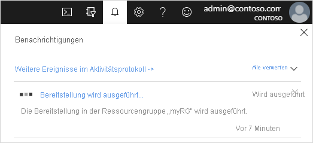
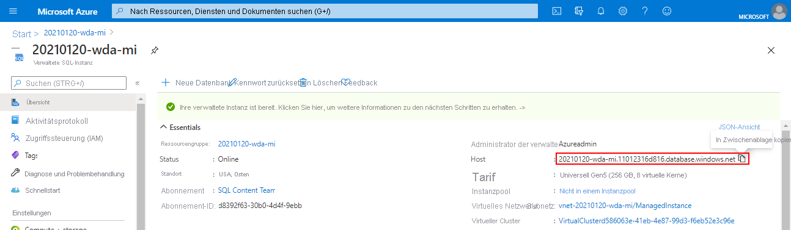

# Schnellstart: Erstellen einer verwalteten Azure SQL-Instanz
[!INCLUDE[appliesto-sqlmi](../includes/appliesto-sqlmi.md)]

In dieser Schnellstartanleitung erfahren Sie, wie Sie eine [verwaltete Azure SQL-Instanz](sql-managed-instance-paas-overview.md) im Azure-Portal erstellen.

> [!IMPORTANT]
> Informationen zu Einschränkungen finden Sie in den Abschnitten [Unterstützte Regionen](resource-limits.md#supported-regions) und [Unterstützte Abonnementtypen](resource-limits.md#supported-subscription-types).

## Erstellen einer verwalteten Azure SQL-Instanz

Führen Sie zum Erstellen einer SQL Managed Instance die folgenden Schritte aus: 

### Melden Sie sich auf dem Azure-Portal an.

Wenn Sie kein Azure-Abonnement besitzen, können Sie ein [kostenloses Konto erstellen](https://azure.microsoft.com/free/).

1. Melden Sie sich beim [Azure-Portal](https://portal.azure.com/) an.
1. Wählen Sie im Azure-Portal im Menü links die Option **Azure SQL** aus. Falls **Azure SQL** nicht in der Liste aufgeführt ist, sollten Sie **Alle Dienste** auswählen und anschließend im Suchfeld den Suchbegriff **Azure SQL** eingeben.
1. Wählen Sie **+Hinzufügen** aus, um die Seite **SQL-Bereitstellungsoption auswählen** zu öffnen. Sie können weitere Informationen zu Azure SQL Managed Instance anzeigen, indem Sie auf der Kachel **Verwaltete SQL-Instanzen** die Option **Details anzeigen** auswählen.
1. Klicken Sie auf **Erstellen**.

   

4. Verwenden Sie die Registerkarten im Bereitstellungsformular **Verwaltete Azure SQL-Instanz erstellen**, um die erforderlichen und optionalen Informationen hinzuzufügen. In den folgenden Abschnitten werden diese Registerkarten beschrieben.

### Registerkarte „Grundlagen“

- Geben Sie auf der Registerkarte **Grundlagen** die erforderlichen Informationen ein. Hierbei handelt es sich um die mindestens erforderlichen Informationen, die zum Bereitstellen einer verwalteten SQL-Instanz benötigt werden.

   

   Nutzen Sie die Tabelle unten als Referenz für die Informationen, die auf dieser Registerkarte erforderlich sind.

   | Einstellung| Vorgeschlagener Wert | Beschreibung |
   | ------ | --------------- | ----------- |
   | **Abonnement** | Ihr Abonnement | Ein Abonnement, mit dem Sie die Berechtigung zum Erstellen neuer Ressourcen erhalten |
   | **Ressourcengruppe** | Eine neue oder vorhandene Ressourcengruppe.|Gültige Ressourcengruppennamen finden Sie unter [Naming rules and restrictions](/azure/architecture/best-practices/resource-naming) (Benennungsregeln und Einschränkungen).|
   | **Name der verwalteten Instanz** | Ein gültiger Name|Gültige Namen finden Sie unter [Benennungskonventionen](/azure/architecture/best-practices/resource-naming).|
   | **Region** |Region, in der Sie die verwaltete Instanz erstellen möchten|Informationen zu Regionen finden Sie unter [Azure-Regionen](https://azure.microsoft.com/regions/).|
   | **Administratoranmeldung für verwaltete Instanz** | Ein beliebiger gültiger Benutzername | Gültige Namen finden Sie unter [Benennungskonventionen](/azure/architecture/best-practices/resource-naming). Verwenden Sie nicht „serveradmin“. Hierbei handelt es sich um eine reservierte Rolle auf Serverebene.|
   | **Kennwort** | Ein gültiges Kennwort| Das Kennwort muss mindestens 16 Zeichen lang sein und die [definierten Anforderungen an die Komplexität](../../virtual-machines/windows/faq.md#what-are-the-password-requirements-when-creating-a-vm) erfüllen.|

- Wählen Sie **Verwaltete Instanz konfigurieren** aus, um die Größe für die Compute- und Speicherressourcen anzugeben und sich die Tarife anzusehen. Verwenden Sie die Schieberegler oder Textfelder, um die Speichermenge und die Anzahl von virtuellen Kernen anzugeben. Wählen Sie abschließend **Anwenden** aus, um Ihre Auswahl zu speichern. 

   

| Einstellung| Vorgeschlagener Wert | Beschreibung |
| ------ | --------------- | ----------- |
| **Dienstebene** | Wählen Sie eine der Optionen aus. | Wählen Sie basierend auf Ihrem Szenario eine der folgenden Optionen aus:   <ul><li>**Universell**: Für die meisten Produktionsworkloads geeignet (Standardoption).</li><li>**Unternehmenskritisch**: Konzipiert für Workloads mit geringer Latenz und für hohe Resilienz gegenüber Ausfällen und schnelle Failover.</li></ul> Weitere Informationen finden Sie unter [Dienstebenen für Azure SQL-Datenbank und Azure SQL Managed Instance](../../azure-sql/database/service-tiers-general-purpose-business-critical.md) und [Übersicht über Ressourcenlimits für Azure SQL Managed Instance](../../azure-sql/managed-instance/resource-limits.md).|
| **Hardwaregeneration** | Wählen Sie eine der Optionen aus. | Die Hardwaregeneration definiert im Allgemeinen die Compute- und Arbeitsspeicherlimits sowie weitere Eigenschaften, die sich auf die Leistung der Workload auswirken. **Gen5** ist die Standardeinstellung.|
| **Computemodell mit virtuellen Kernen** | Wählen Sie eine Option aus. | Virtuelle Kerne repräsentieren die genaue Menge an Computeressourcen, die für Ihre Workload immer bereitgestellt werden. Standardmäßig werden **acht virtuelle Kerne** bereitgestellt.|
| **Speicher in GB** | Wählen Sie eine Option aus. | Wählen Sie die Speichergröße in GB anhand der erwarteten Datenmenge aus. Wenn Sie vorhandene Daten aus einer lokalen Umgebung oder auf unterschiedlichen Cloudplattformen migrieren, helfen Ihnen die Informationen unter [Migrationsübersicht: SQL Server zu SQL Managed Instance](../../azure-sql/migration-guides/managed-instance/sql-server-to-managed-instance-overview.md) weiter.|
| **Azure-Hybridvorteil** | Aktivieren Sie die Option (falls zutreffend). | Dient zum Nutzen einer vorhandenen Lizenz für Azure. Weitere Informationen finden Sie unter [Azure-Hybridvorteil: Azure SQL-Datenbank und verwaltete SQL-Instanzen](../../azure-sql/azure-hybrid-benefit.md). |
| **Redundanz für Sicherungsspeicher** | Wählen Sie **Georedundanter Sicherungsspeicher** aus. | Speicherredundanz in Azure für Sicherungsspeicher. Beachten Sie, dass dieser Wert nach dem Festlegen nicht mehr geändert werden kann. Georedundanter Sicherungsspeicher ist die Standardeinstellung und die empfohlene Option, obwohl Zonen- und lokale Redundanz mehr Flexibilität in Bezug auf die Kosten und Datenresidenz in nur einer Region ermöglichen. Weitere Informationen finden Sie unter [Redundanz für Sicherungsspeicher](../database/automated-backups-overview.md?tabs=managed-instance#backup-storage-redundancy).|

- Sie können **Überprüfen + erstellen** auswählen, um Ihre Auswahl vor dem Erstellen einer verwalteten SQL-Instanz zu überprüfen. Sie können auch Netzwerkoptionen konfigurieren, indem Sie **Weiter: Netzwerk** aus.

### Registerkarte „Netzwerk“

- Geben Sie auf der Registerkarte **Netzwerk** optionale Informationen ein. Wenn Sie diese Informationen weglassen, werden im Portal die Standardeinstellungen angewendet.

   

   Nutzen Sie die Tabelle unten als Referenz für die Informationen, die auf dieser Registerkarte erforderlich sind.

   | Einstellung| Vorgeschlagener Wert | BESCHREIBUNG |
   | ------ | --------------- | ----------- |
   | **Virtuelles Netzwerk** | Wählen Sie entweder **Neues virtuelles Netzwerk erstellen** oder ein gültiges virtuelles Netzwerk und ein Subnetz aus.| Wenn ein Netzwerk oder Subnetz nicht verfügbar ist, muss es [modifiziert werden, um die Netzwerkanforderungen zu erfüllen](vnet-existing-add-subnet.md), bevor Sie es als Ziel für die neue verwaltete Instanz auswählen. Informationen zu den Anforderungen für das Konfigurieren der Netzwerkumgebung für Azure SQL Managed Instance finden Sie unter [Konfigurieren eines virtuellen Netzwerks für Azure SQL Managed Instance](connectivity-architecture-overview.md). |
   | **Verbindungstyp** | Wählen Sie zwischen einem Proxy und einer Umleitung als Verbindungstyp.|Weitere Informationen zu Verbindungstypen finden Sie unter [Verbindungstyp für eine verwaltete Azure SQL-Instanz](../database/connectivity-architecture.md#connection-policy).|
   | **Öffentlicher Endpunkt**  | Wählen Sie **Deaktivieren** aus. | Sie müssen diese Option aktivieren, damit über den öffentlichen Datenendpunkt auf eine verwaltete Instanz zugegriffen werden kann. | 
   | **Zugriff erlauben von** (wenn **Öffentlicher Endpunkt** aktiviert ist) | Wählen Sie **Kein Zugriff** aus.  |Im Portal können Sie eine Sicherheitsgruppe mit einem öffentlichen Endpunkt konfigurieren.     Wählen Sie basierend auf Ihrem Szenario eine der folgenden Optionen aus:   <ul> <li>**Azure-Dienste**: Wir empfehlen Ihnen die Nutzung dieser Option, wenn Sie über Power BI oder einen anderen mehrinstanzenfähigen Dienst eine Verbindung herstellen. </li> <li> **Internet**: Verwenden Sie diese Option zu Testzwecken, wenn Sie schnell eine verwaltete Instanz einrichten möchten. Von der Verwendung in Produktionsumgebungen raten wir ab. </li> <li> **Kein Zugriff**: Mit dieser Option wird eine Sicherheitsregel vom Typ **Ablehnen** erstellt. Ändern Sie diese Regel, um zu ermöglichen, dass über einen öffentlichen Endpunkt auf eine verwaltete Instanz zugegriffen wird. </li> </ul>   Weitere Informationen zur Sicherheit öffentlicher Endpunkte finden Sie unter [Sicheres Verwenden einer verwalteten Azure SQL-Instanz mit einem öffentlichen Endpunkt](public-endpoint-overview.md).|

- Wählen Sie **Überprüfen + erstellen** aus, um Ihre Auswahl vor dem Erstellen einer verwalteten Instanz zu überprüfen. Sie können auch weitere benutzerdefinierte Einstellungen konfigurieren, indem Sie **Weiter: Zusätzliche Einstellungen**.

### Zusätzliche Einstellungen

- Geben Sie auf der Registerkarte **Zusätzliche Einstellungen** optionale Informationen ein. Wenn Sie diese Informationen weglassen, werden im Portal die Standardeinstellungen angewendet.

   

   Nutzen Sie die Tabelle unten als Referenz für die Informationen, die auf dieser Registerkarte erforderlich sind.

   | Einstellung| Vorgeschlagener Wert | BESCHREIBUNG |
   | ------ | --------------- | ----------- |
   | **Sortierung** | Wählen Sie die Sortierung aus, die Sie für Ihre verwaltete Instanz verwenden möchten. Wenn Sie Datenbanken von SQL Server migrieren, überprüfen Sie die Quellsortierung mit `SELECT SERVERPROPERTY(N'Collation')`, und verwenden Sie diesen Wert.| Informationen zu Sortierungen finden Sie unter [Festlegen oder Ändern der Serversortierung](/sql/relational-databases/collations/set-or-change-the-server-collation).|   
   | **Zeitzone** | Wählen Sie die Zeitzone aus, die von der verwalteten Instanz verwendet wird.|Weitere Informationen finden Sie unter [Zeitzone in einer verwalteten Azure SQL-Datenbank-Instanz (Vorschauversion)](timezones-overview.md).|
   | **Als sekundären Failoverserver verwenden** | Wählen Sie **Ja** aus. | Aktivieren Sie diese Option, um die verwaltete Instanz als sekundäre Failovergruppe zu verwenden.|
   | **Primäre verwaltete SQL-Instanz** (wenn **Als sekundären Failoverserver verwenden** auf **Ja** festgelegt ist) | Wählen Sie eine vorhandene primäre verwaltete Instanz aus, die in dieselbe DNS-Zone wie die von Ihnen erstellte verwaltete Instanz eingebunden wird. | Mit diesem Schritt wird die Konfiguration der Failovergruppe nach der Erstellung aktiviert. Weitere Informationen finden Sie im [Tutorial: Hinzufügen einer verwalteten Instanz zu einer Failovergruppe](failover-group-add-instance-tutorial.md).|

- Wählen Sie **Überprüfen + erstellen** aus, um Ihre Auswahl vor dem Erstellen einer verwalteten Instanz zu überprüfen. Oder konfigurieren Sie Azure-Tags, indem Sie **Weiter: Tags** auswählen (empfohlen).

### `Tags`

- Fügen Sie den Ressourcen in Ihrer Azure Resource Manager-Vorlage (ARM-Vorlage) Tags hinzu. [Tags](../../azure-resource-manager/management/tag-resources.md) helfen Ihnen dabei, Ihre Ressourcen logisch zu organisieren. Die Tagwerte werden in Kostenberichten angezeigt und ermöglichen andere Verwaltungsaktivitäten per Tag. 

- Wir empfehlen Ihnen, zumindest Folgendes zu erwägen: Versehen Sie Ihre neue SQL Managed Instance mit dem Owner-Tag, um den Ersteller zu identifizieren, und dem Environment-Tag, um zu ermitteln, ob das System den Typ „Produktion“, „Entwicklung“ usw. hat. Weitere Informationen finden Sie unter [Entwickeln Ihrer Benennungs- und Kennzeichnungsstrategie für Azure-Ressourcen](/azure/cloud-adoption-framework/ready/azure-best-practices/naming-and-tagging).
 
- Wählen Sie **Überprüfen und erstellen** aus, um den Vorgang fortzusetzen.

## Bewerten + erstellen

1. Wählen Sie **Überprüfen + erstellen** aus, um Ihre Auswahl vor dem Erstellen einer verwalteten Instanz zu überprüfen.

   

1. Wählen Sie **Erstellen** aus, um die Bereitstellung der verwalteten Instanz zu starten.

> [!IMPORTANT]
> Die Bereitstellung einer verwalteten Instanz ist ein Vorgang mit langer Ausführungsdauer. Die Bereitstellung der ersten Instanz im Subnetz dauert normalerweise deutlich länger als die Bereitstellung in einem Subnetz, das bereits verwaltete Instanzen enthält. Informationen zur durchschnittlichen Bereitstellungsdauer finden Sie unter [Übersicht über die Verwaltungsvorgänge für Azure SQL Managed Instance](management-operations-overview.md#duration).

## Überwachen des Bereitstellungsstatus

1. Wählen Sie das Symbol **Benachrichtigungen** aus, um den Status der Bereitstellung anzuzeigen.

   

1. Wählen Sie in der Benachrichtigung **Die Bereitstellung wird ausgeführt** aus, um das Fenster für die verwaltete SQL-Instanz zu öffnen und den Bereitstellungsstatus weiter zu überwachen. 

> [!TIP]
> - Falls Sie Ihren Webbrowser geschlossen haben oder sich nicht mehr auf dem Bildschirm mit der Anzeige des Bereitstellungsstatus befinden, können Sie den Bereitstellungsvorgang über die **Übersichtsseite** der verwalteten Instanz oder mit PowerShell oder der Azure CLI überwachen. Weitere Informationen finden Sie unter [Überwachen von Vorgängen](management-operations-monitor.md#monitor-operations). 
> - Sie können den Bereitstellungsprozess über das Azure-Portal, PowerShell bzw. die Azure CLI oder andere Tools mit der REST-API abbrechen. Weitere Informationen finden Sie unter [Abbrechen von Verwaltungsvorgängen für Azure SQL Managed Instance](management-operations-cancel.md).

> [!IMPORTANT]
> - Der Start der SQL Managed Instance-Erstellung kann sich verzögern, wenn andere Vorgänge vorhanden sind, die sich auf die Erstellung auswirken. Dazu zählen Wiederherstellungs- oder Skalierungsvorgänge mit langer Ausführungszeit für andere verwaltete Instanzen im gleichen Subnetz. Weitere Informationen finden Sie unter [Wechselseitige Auswirkungen von Verwaltungsvorgängen](management-operations-overview.md#management-operations-cross-impact).
> - Sie müssen über **Leseberechtigungen** für die Ressourcengruppe verfügen, um den Status für die Erstellung von verwalteten Instanzen abrufen zu können. Falls Sie nicht über diese Berechtigung verfügen oder sie während der Erstellung der verwalteten SQL-Instanz widerrufen, kann dies dazu führen, dass Azure SQL Managed Instance in der Liste mit den bereitgestellten Ressourcengruppen nicht angezeigt wird.
>

## Anzeigen von erstellten Ressourcen

Nach erfolgreicher Bereitstellung einer verwalteten Instanz können Sie erstellte Ressourcen so anzeigen:

1. Öffnen Sie die Ressourcengruppe für Ihre verwaltete Instanz. 

   

## Anzeigen und Optimieren von Netzwerkeinstellungen

Untersuchen Sie die folgenden Punkte, um Netzwerkeinstellungen zu optimieren (optional):

1. Wählen Sie in der Liste mit den Ressourcen die Routingtabelle aus, um das erstellte Objekt mit der benutzerdefinierten Routingtabelle (UDR) zu überprüfen.

2. Sehen Sie sich in der Routingtabelle die Einträge für das Leiten von Datenverkehr aus dem bzw. im virtuellen Netzwerk von Azure SQL Managed Instance an. Wenn Sie Ihre Routingtabelle manuell erstellen oder konfigurieren, sollten Sie diese Einträge in der Routingtabelle der verwalteten SQL-Instanz erstellen.

   

    Öffnen Sie zum Ändern oder Hinzufügen von Routen in den Einstellungen der Routingtabelle die Option **Routen**.

3. Wechseln Sie zurück zur Ressourcengruppe, und wählen Sie das erstellte Objekt für die Netzwerksicherheitsgruppe (NSG) aus.

4. Überprüfen Sie die Eingangs- und Ausgangssicherheitsregeln. 

   

    Öffnen Sie zum Ändern oder Hinzufügen von Regeln in den Einstellungen für die Netzwerksicherheitsgruppe die Optionen **Eingangssicherheitsregeln** und **Ausgangssicherheitsregeln**.

> [!IMPORTANT]
> Wenn Sie einen öffentlichen Endpunkt für Azure SQL Managed Instance konfiguriert haben, müssen Sie Ports öffnen, damit der Netzwerkdatenverkehr Verbindungen mit Azure SQL Managed Instance aus dem öffentlichen Internet zulässt. Weitere Informationen finden Sie unter [Konfigurieren eines öffentlichen Endpunkts für Azure SQL Managed Instance](public-endpoint-configure.md#allow-public-endpoint-traffic-on-the-network-security-group).
>

## Abrufen von Verbindungsdetails zur verwalteten SQL-Instanz

Wenn Sie eine Verbindung mit Azure SQL Managed Instance herstellen möchten, führen Sie die folgenden Schritte aus, um den Hostnamen und den vollqualifizierten Domänennamen (FQDN) abzurufen:

1. Wechseln Sie zurück zur Ressourcengruppe, und wählen Sie das erstellte SQL Managed Instance-Objekt aus.

2. Suchen Sie auf der Registerkarte **Übersicht** nach der Eigenschaft **Host**. Kopieren Sie den Hostnamen für die verwaltete Instanz in die Zwischenablage, um ihn in der nächsten Schnellstartanleitung verwenden zu können, indem Sie auf die Schaltfläche **In Zwischenablage kopieren** klicken.

   

   Der kopierte Wert stellt einen vollqualifizierten Domänennamen (FQDN) dar, mit dem eine Verbindung mit einer verwalteten SQL-Instanz hergestellt werden kann. Er ähnelt der folgenden Beispieladresse: *your_host_name.a1b2c3d4e5f6.database.windows.net*.

## Nächste Schritte

Informieren Sie sich, wie eine Verbindung mit Azure SQL Managed Instance hergestellt wird:
- Eine Übersicht über die Verbindungsoptionen für Anwendungen finden Sie unter [Verbinden Ihrer Anwendungen mit der verwalteten SQL-Instanz](connect-application-instance.md).
- Eine Schnellstartanleitung, die zeigt, wie Sie eine Verbindung zwischen einem virtuellen Azure-Computer und Azure SQL Managed Instance herstellen, finden Sie unter [Konfigurieren einer Verbindung zu einem virtuellen Azure-Computer](connect-vm-instance-configure.md).
- Eine Schnellstartanleitung, die zeigt, wie Sie von einem lokalen Clientcomputer über eine Point-to-Site-Verbindung eine Verbindung mit Azure SQL Managed Instance herstellen, finden Sie unter [Konfigurieren einer Point-to-Site-Verbindung](point-to-site-p2s-configure.md).

Wiederherstellen einer vorhandenen SQL Server-Datenbank aus einer lokalen Instanz in Azure SQL Managed Instance: 
- Verwenden Sie zur Wiederherstellung auf der Grundlage einer Datenbanksicherungsdatei [Azure Database Migration Service für die Migration](../../dms/tutorial-sql-server-to-managed-instance.md). 
- Verwenden Sie zur Wiederherstellung auf der Grundlage einer Datenbanksicherungsdatei den Befehl [T-SQL RESTORE](restore-sample-database-quickstart.md).

Informationen zur erweiterten Überwachung der Datenbankleistung der verwalteten SQL-Instanz mit integrierten Problembehandlungsfunktionen finden Sie unter [Überwachen einer verwalteten Azure SQL-Instanz mithilfe von Azure SQL-Analyse](../../azure-monitor/insights/azure-sql.md).