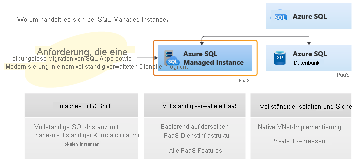

# Was ist Azure SQL Managed Instance?
[!INCLUDE[appliesto-sqlmi](../includes/appliesto-sqlmi.md)]

Azure SQL Managed Instance ist der intelligente, skalierbare, cloudbasierte Datenbankdienst, der die breiteste Kompatibilität mit der SQL Server-Datenbank-Engine mit allen Vorzügen einer vollständig verwalteten und stets aktuellen Platform-as-a-Service kombiniert. Azure SQL Managed Instance zeichnet sich durch nahezu uneingeschränkte Kompatibilität mit der aktuellen SQL Server-Datenbank-Engine (Enterprise Edition) aus. Darüber hinaus bietet der Dienst eine native Implementierung eines [virtuellen Netzwerks (VNET)](../../virtual-network/virtual-networks-overview.md) zur Behebung allgemeiner Sicherheitsrisiken sowie ein vorteilhaftes [Geschäftsmodell](https://azure.microsoft.com/pricing/details/sql-database/) für SQL Server-Bestandskunden. Über SQL Managed Instance können bestehende SQL Server-Kunden ihre lokalen Anwendungen mit minimalen Änderungen an den Anwendungen und Datenbanken per Lift & Shift zur Cloud migrieren. Gleichzeitig behält SQL Managed Instance alle PaaS-Funktionen (automatisches Patchen und automatische Versionsupdates, [automatische Sicherungen](../database/automated-backups-overview.md), [Hochverfügbarkeit](../database/high-availability-sla.md)) bei, die den Verwaltungsaufwand und die Gesamtkosten drastisch reduzieren.

Wenn Sie noch nicht mit Azure SQL Managed Instance vertraut sind, sehen Sie sich das Video zu *Azure SQL Managed Instance* aus der detaillierten [Azure SQL-Videoserie](https://channel9.msdn.com/Series/Azure-SQL-for-Beginners?WT.mc_id=azuresql4beg_azuresql-ch9-niner) an:
> [!VIDEO https://channel9.msdn.com/Series/Azure-SQL-for-Beginners/Azure-SQL-Managed-Instance-Overview-6-of-61/player]

> [!IMPORTANT]
> Eine Liste der Regionen, in denen SQL Managed Instance derzeit verfügbar ist, finden Sie unter [Unterstützte Regionen](resource-limits.md#supported-regions).

In der folgenden Abbildung sind die wichtigsten Features von SQL Managed Instance dargestellt:

Azure SQL Managed Instance ist für Kunden konzipiert, die eine große Anzahl von Apps aus einer selbst erstellten oder über ISVs bereitgestellten lokalen Umgebung oder IaaS-Umgebung mit möglichst geringem Migrationsaufwand in eine vollständig verwaltete PaaS-Cloudumgebung migrieren möchten. Unter Verwendung des vollständig automatisierten [Azure Data Migration Service](../../dms/tutorial-sql-server-to-managed-instance.md#create-an-azure-database-migration-service-instance) können Kunden ihre vorhandenen SQL Server-Instanzen per Lift & Shift zu einer SQL Managed Instance-Instanz migrieren, die Kompatibilität mit SQL Server und vollständige Isolation von Kundeninstanzen mit nativer VNET-Unterstützung bietet.  Mit Software Assurance können Sie Ihre vorhandenen Lizenzen mit dem [Azure-Hybridvorteil für SQL Server](https://azure.microsoft.com/pricing/hybrid-benefit/) zu ermäßigten Preisen gegen eine SQL Managed Instance-Instanz austauschen. Eine SQL Managed Instance-Instanz ist das optimale Cloudmigrationsziel für SQL Server-Instanzen, die hohe Sicherheit und eine umfangreiche Programmieroberfläche voraussetzen.

## Wichtige Features und Funktionen

SQL Managed Instance kombiniert die besten Features aus Azure SQL-Datenbank und der SQL Server-Datenbank-Engine.

> [!IMPORTANT]
> SQL Managed Instance wird mit allen Features der neuesten Version von SQL Server ausgeführt – einschließlich Onlinevorgängen, automatischer Plankorrekturen und anderer Leistungsverbesserungen für Unternehmen. Einen Vergleich der verfügbaren Features finden Sie unter [Funktionsvergleich: Azure SQL Managed Instance im Vergleich mit SQL Server](../database/features-comparison.md).

| **PaaS-Vorteile** | **Geschäftskontinuität** |
| --- | --- |
|Kein Kauf und keine Verwaltung von Hardware  Kein zusätzlicher Aufwand für die Verwaltung der zugrunde liegenden Infrastruktur  Schnelle Bereitstellung und Dienstskalierung  Automatische Patches und Versionsupgrades  Integration in andere PaaS-Datendienste |Betriebszeit-SLA von 99,99 %   Integrierte [Hochverfügbarkeit](../database/high-availability-sla.md)  Schutz der Daten durch [automatische Sicherungen](../database/automated-backups-overview.md)  Vom Kunden konfigurierbare Aufbewahrungsdauer für Sicherungen  Vom Benutzer initiierte [Sicherungen](https://docs.microsoft.com/sql/t-sql/statements/backup-transact-sql?view=azuresqldb-mi-current&preserve-view=true)  [Point-in-Time-Datenbankwiederherstellung](../database/recovery-using-backups.md#point-in-time-restore) |
|**Sicherheit und Konformität** | **Verwaltung**|
|Isolierte Umgebung ([VNET-Integration](connectivity-architecture-overview.md), Dienst mit einzelnem Mandanten, dedizierte Compute- und Speicherressourcen)  [Transparent Data Encryption (TDE)](https://docs.microsoft.com/sql/relational-databases/security/encryption/transparent-data-encryption-azure-sql) [Azure Active Directory-Authentifizierung (Azure AD)](../database/authentication-aad-overview.md) mit einmaligem Anmelden   <a href="/sql/t-sql/statements/create-login-transact-sql?view=azuresqldb-mi-current">Azure AD-Serverprinzipale (Anmeldungen)</a>   Gleiche Kompatibilitätsstandards wie für Azure SQL-Datenbank  [SQL-Überwachung](auditing-configure.md)  [Advanced Threat Protection für Azure SQL-Datenbank](threat-detection-configure.md) |Azure Resource Manager-API zur Automatisierung der Dienstbereitstellung und -skalierung  Funktionen des Azure-Portals für die manuelle Dienstbereitstellung und -skalierung  Data Migration Service

> [!IMPORTANT]
> Azure SQL Managed Instance wurde anhand einer Reihe von Konformitätsstandards zertifiziert. Weitere Informationen finden Sie in den [Microsoft Azure Complianceangeboten](https://servicetrust.microsoft.com/ViewPage/MSComplianceGuideV3?command=Download&downloadType=Document&downloadId=44bbae63-bf4d-4e3b-9d3d-c96fb25ec363&tab=7027ead0-3d6b-11e9-b9e1-290b1eb4cdeb&docTab=7027ead0-3d6b-11e9-b9e1-290b1eb4cdeb_FAQ_and_White_Papers), wo unter **SQL-Datenbank** die aktuelle Liste der Compliancezertifizierungen für SQL Managed Instance aufgeführt wird.

Die wichtigsten Features von SQL Managed Instance sind in der folgenden Tabelle angegeben:

|Funktion | BESCHREIBUNG|
|---|---|
| SQL Server-Version/-Build | SQL Server-Datenbank-Engine (letzte stabile Version) |
| Verwaltete automatisierte Sicherungen | Ja |
| Integrierte Überwachung und Metriken von Instanzen und Datenbanken | Ja |
| Automatische Softwarepatches | Ja |
| Neueste Features der Datenbank-Engine | Ja |
| Anzahl der Datendateien (ROWS) pro Datenbank | Mehrere |
| Anzahl der Protokolldateien (LOG) pro Datenbank | 1 |
| VNET – Azure Resource Manager-Bereitstellung | Ja |
| VNET – Klassisches Bereitstellungsmodell | Nein |
| Portal-Unterstützung | Ja|
| Integrierter Integrationsdienst (SSIS) | Nein – SSIS ist Teil von [Azure Data Factory PaaS](https://docs.microsoft.com/azure/data-factory/tutorial-deploy-ssis-packages-azure) |
| Integrierter Analysedienst (SSAS) | Nein – SSAS ist ein separater [PaaS](https://docs.microsoft.com/azure/analysis-services/analysis-services-overview) |
| Integrierter Berichterstellungsdienst (SSRS) | Nein, verwenden Sie stattdessen [paginierte Berichte in Power BI ](https://docs.microsoft.com/power-bi/paginated-reports/paginated-reports-report-builder-power-bi), oder hosten Sie SSRS auf einer Azure-VM. In SQL Managed Instance kann SSRS nicht als Dienst ausgeführt werden. Es können jedoch mithilfe der SQL Server-Authentifizierung [SSRS-Katalogdatenbanken](https://docs.microsoft.com/sql/reporting-services/install-windows/ssrs-report-server-create-a-report-server-database#database-server-version-requirements) für einen Berichtsserver gehostet werden, der auf einer Azure-VM installiert ist. |
|||

## vCore-basiertes Kaufmodell

Das auf [virtuellen Kernen basierende Kaufmodell](../database/service-tiers-vcore.md) für SQL Managed Instance bietet Ihnen Flexibilität, Kontrolle und Transparenz sowie eine unkomplizierte Möglichkeit, Ihre lokalen Workloadanforderungen in der Cloud zu realisieren. Mit diesem Modell können Sie Computeressourcen, Arbeitsspeicher und Speicher entsprechend Ihren Workloadanforderungen ändern. Das auf virtuellen Kernen basierende Modell ermöglicht mit dem [Azure-Hybridvorteil für SQL Server](https://azure.microsoft.com/pricing/hybrid-benefit/) zudem Einsparungen von bis zu 55 Prozent.

Beim V-Kern-Modell können Sie verschiedene Hardwaregenerationen auswählen.

- **Gen4:** Logische CPUs basierend auf Intel®-Prozessoren vom Typ E5-2673 v3 (Haswell) mit 2,4 GHz, angefügtem SSD, physischen Kernen, 7 GB RAM pro Kern und Computegrößen zwischen acht und 24 virtuellen Kernen.
- **Gen5**: Logische CPUs basierend auf Intel®-Prozessoren vom Typ E5-2673 v4 (Broadwell) mit 2,3 GHz und Intel®-Prozessoren vom Typ SP-8160 (Skylake) sowie Intel®-Prozessoren vom Typ 8272CL (Cascade Lake) mit 2,5 GHz, schnellem NVMe-SSD, einem logischem Kern mit Hyperthreading und Computegrößen zwischen vier und 80 Kernen.

Weitere Informationen zu den Unterschieden zwischen Hardwaregenerationen finden Sie unter [Ressourceneinschränkungen für SQL Managed Instance](resource-limits.md#hardware-generation-characteristics).

## Dienstebenen

SQL Managed Instance ist in zwei Dienstebenen verfügbar:

- **Universell**: Entwickelt für Anwendungen mit typischen Leistungs- und E/A-Latenzanforderungen
- **Unternehmenskritisch**: Entwickelt für Anwendungen mit niedrigen E/A-Latenzanforderungen und minimalen Auswirkungen auf zugrunde liegende Wartungsvorgänge für die Workload

Beide Dienstebenen garantieren eine Verfügbarkeit von 99,99 Prozent und ermöglichen es Ihnen, die Speichergröße und Computekapazität unabhängig voneinander auszuwählen. Weitere Informationen zur Hochverfügbarkeitsarchitektur von Azure SQL Managed Instance finden Sie unter [Hochverfügbarkeit und Azure SQL Managed Instance](../database/high-availability-sla.md).

### Universelle Dienstebene

Folgende wichtige Merkmale kennzeichnen die Dienstebene „Universell“:

- Für den Großteil der Geschäftsanwendungen mit typischen Leistungsanforderungen konzipiert
- Azure Blob Storage mit hoher Leistung (8 TB)
- Integrierte [Hochverfügbarkeit](../database/high-availability-sla.md#basic-standard-and-general-purpose-service-tier-availability), die auf den zuverlässigen Diensten Azure Blob Storage und [Azure Service Fabric](../../service-fabric/service-fabric-overview.md) basiert

Weitere Informationen finden Sie unter [Speicherebene im Tarif „Universell“](https://medium.com/azure-sqldb-managed-instance/file-layout-in-general-purpose-azure-sql-managed-instance-cf21fff9c76c) und [Bewährte Methoden und Aspekte der Speicherleistung für SQL Managed Instance (Universell)](https://blogs.msdn.microsoft.com/sqlcat/2018/07/20/storage-performance-best-practices-and-considerations-for-azure-sql-db-managed-instance-general-purpose/).

Weitere Informationen zu den Unterschieden zwischen Dienstebenen finden Sie unter [Ressourceneinschränkungen für SQL Managed Instance](resource-limits.md#service-tier-characteristics).

### Dienstebene „Unternehmenskritisch“

Die Dienstebene „Unternehmenskritisch“ wurde für Anwendungen mit hohen E/A-Anforderungen konzipiert. Diese Ebene bietet dank mehrerer isolierter Replikate die höchste Resilienz gegenüber Ausfällen.

Folgende wichtige Merkmale kennzeichnen die Dienstebene „Unternehmenskritisch“:

- Konzipiert für Geschäftsanwendungen mit höchster Leistung und Hochverfügbarkeitsanforderungen
- Enthält einen äußerst schnellen lokalen SSD-Speicher (bis zu 1 TB bei Gen 4 und bis zu 4 TB bei Gen 5)
- Integrierte [Hochverfügbarkeit](../database/high-availability-sla.md#premium-and-business-critical-service-tier-availability), die auf [Always On-Verfügbarkeitsgruppen](https://docs.microsoft.com/sql/database-engine/availability-groups/windows/always-on-availability-groups-sql-server) und [Azure Service Fabric](../../service-fabric/service-fabric-overview.md) basiert
- Integriertes zusätzliches [Datenbankreplikat mit Schreibschutz](../database/read-scale-out.md), das für Berichte und andere schreibgeschützte Workloads verwendet werden kann
- [In-Memory-OLTP](../in-memory-oltp-overview.md), das für Workloads mit hohen Leistungsanforderungen verwendet werden kann  

Weitere Informationen zu den Unterschieden zwischen Dienstebenen finden Sie unter [Ressourceneinschränkungen für SQL Managed Instance](resource-limits.md#service-tier-characteristics).

## Verwaltungsvorgänge

Azure SQL Managed Instance bietet Verwaltungsvorgänge, die Sie zum automatischen Bereitstellen von neuen verwalteten Instanzen, Aktualisieren von Instanzeigenschaften und Löschen von nicht mehr benötigten Instanzen verwenden können. Eine detaillierte Erläuterung der Verwaltungsvorgänge finden Sie auf der Übersichtsseite für [Verwaltungsvorgänge für verwaltete Instanzen](management-operations-overview.md).

## Erweiterte Sicherheit und Konformität

SQL Managed Instance enthält standardmäßig erweiterte Sicherheitsfeatures, die über die Azure-Plattform und die SQL Server-Datenbank-Engine bereitgestellt werden.

### Sicherheitsisolierung

SQL Managed Instance bietet zusätzliche Sicherheitsisolation von anderen Mandanten auf der Azure-Plattform. Die Sicherheitsisolation umfasst Folgendes:

- [Native Implementierung von und Konnektivität mit virtuellen Netzwerken](connectivity-architecture-overview.md) in der lokalen Umgebung unter Verwendung von Azure ExpressRoute oder VPN Gateway
- Der SQL-Endpunkt wird in einer Standardbereitstellung nur über eine private IP-Adresse verfügbar gemacht, sodass sichere Verbindungen von privaten Azure-Netzwerken oder hybriden Netzwerken möglich sind.
- Einzelner Mandant mit dedizierter zugrunde liegender Infrastruktur (Compute, Speicher).

Das folgende Diagramm zeigt verschiedene Konnektivitätsoptionen für Ihre Anwendungen:

  

Weitere Informationen zur VNET-Integration und Durchsetzung von Netzwerkrichtlinien auf Subnetzebene finden Sie unter [VNET-Architektur für eine verwaltete Instanz](connectivity-architecture-overview.md) und [Herstellen einer Verbindung zwischen einer Anwendung und einer verwalteten Instanz](connect-application-instance.md).

> [!IMPORTANT]
> Wenn Ihre Sicherheitsanforderungen es zulassen, sollten immer mehrere verwaltete Instanzen in einem Subnetz vorhanden sein, da dieser Ansatz zusätzliche Vorteile bietet. Durch mehrere Instanzen im gleichen Subnetz wird die Wartung der Netzwerkinfrastruktur erheblich vereinfacht und die Zeit für die Instanzbereitstellung verkürzt, da eine lange Bereitstellungsdauer mit den Kosten für die Bereitstellung der ersten verwalteten Instanz in einem Subnetz korreliert.

### Sicherheitsfeatures

Azure SQL Managed Instance bietet eine Reihe von erweiterten Sicherheitsfeatures, die zum Schutz Ihrer Daten verwendet werden können.

- Die [Überwachung von SQL Managed Instance](auditing-configure.md) verfolgt Datenbankereignisse nach und schreibt sie in eine Überwachungsprotokolldatei in Ihrem Azure-Speicherkonto. Die Überwachung kann Ihnen dabei helfen, die gesetzlichen Bestimmungen einzuhalten, die Datenbankaktivität zu verstehen und Einblicke in Abweichungen und Anomalien zu erhalten, die auf geschäftsspezifische Bedenken oder mutmaßliche Sicherheitsverstöße hinweisen können.
- Datenverschlüsselung in Aktion: SQL Managed Instance schützt Ihre Daten durch die Verschlüsselung für Daten während der Übertragung mit Transport Layer Security. Neben Transport Layer Security bietet SQL Managed Instance mit [Always Encrypted](/sql/relational-databases/security/encryption/always-encrypted-database-engine) einen Schutz für vertrauliche Daten bei der Übertragung, im Ruhezustand und während der Abfrageverarbeitung. Always Encrypted schützt Sie gegen Sicherheitsverletzungen wie dem Diebstahl wichtiger Daten. Beispielsweise werden mit Always Encrypted Kreditkartennummern immer verschlüsselt in der Datenbank gespeichert, selbst während der Abfrageverarbeitung. Gleichzeitig wird autorisierten Mitarbeitern oder Anwendungen, die diese Daten verarbeiten müssen, die Entschlüsselung zum Zeitpunkt der Verwendung erlaubt.
- Mit [Advanced Threat Protection](threat-detection-configure.md) wird die [Überwachung](auditing-configure.md) vervollständigt, indem der Dienst um eine zusätzliche Security Intelligence-Ebene erweitert wird, die ungewöhnliche und eventuell schädliche Versuche, auf Datenbanken zuzugreifen oder sie zu missbrauchen, erkennt. Sie werden vor verdächtigen Aktivitäten, potenziellen Sicherheitsrisiken sowie Angriffen mit Einschleusung von SQL-Befehlen und anomalen Datenbankzugriffsmustern gewarnt. Warnungen von Advanced Threat Protection können im [Azure Security Center](https://azure.microsoft.com/services/security-center/) angezeigt werden. Sie enthalten Details zu verdächtigen Aktivitäten sowie Empfehlungen, wie die Bedrohung untersucht und abgewendet werden kann.  
- Die [dynamische Datenmaskierung](/sql/relational-databases/security/dynamic-data-masking) schränkt die Offenlegung sensibler Daten ein, indem sie für nicht berechtigte Benutzer maskiert werden. Mit der dynamischen Datenmaskierung können Sie mit minimalen Auswirkungen auf die Anwendungsschicht festlegen, wie viel von den sensiblen Daten offengelegt werden soll. Dies trägt zur Verhinderung des unbefugten Zugriffs auf sensible Daten bei. Es handelt sich um eine richtlinienbasierte Sicherheitsfunktion, die die sensiblen Daten im Resultset einer Abfrage in festgelegten Datenbankfeldern ausblendet, während die Daten in der Datenbank nicht geändert werden.
- Mithilfe der [Sicherheit auf Zeilenebene](/sql/relational-databases/security/row-level-security) (Row-Level Security, RLS) können Sie den Zugriff auf Zeilen in einer Datenbanktabelle den Merkmalen des Benutzers entsprechend steuern, der eine Abfrage ausführt (z. B. Gruppenmitgliedschaft oder Ausführungskontext). Die RLS vereinfacht das Entwerfen und Programmieren von Sicherheitsfeatures in Ihrer Anwendung. Mit RLS können Sie den Zugriff auf Datenzeilen einschränken. So können Sie beispielsweise sicherstellen, dass Mitarbeiter nur auf die Datenzeilen zugreifen können, die für ihre Abteilung relevant sind, oder den Datenzugriff ausschließlich auf die relevanten Daten beschränken.
- [Transparent Data Encryption (TDE)](/sql/relational-databases/security/encryption/transparent-data-encryption-azure-sql) verschlüsselt Datendateien von SQL Managed Instance. Dies wird als Verschlüsselung ruhender Daten bezeichnet. TDE führt die E/A-Verschlüsselung und -Entschlüsselung der Daten- und Protokolldateien in Echtzeit durch. Die Verschlüsselung verwendet einen Datenbank-Verschlüsselungsschlüssel (DEK), der im Startdatensatz der Datenbank gespeichert wird und während der Wiederherstellung zur Verfügung steht. Sie können alle Ihre Datenbanken in der verwalteten Instanz mit transparenter Datenverschlüsselung schützen. TDE ist die bewährte Verschlüsselungstechnologie für ruhende Daten in SQL Server, die für viele Compliancestandards zum Schutz vor Diebstahl von Speichermedien erforderlich ist.

Die Migration einer verschlüsselten Datenbank zu SQL Managed Instance wird über Azure Database Migration Service oder die native Wiederherstellung unterstützt. Wenn Sie planen, eine verschlüsselte Datenbank mittels nativer Wiederherstellung zu migrieren, muss das vorhandene TDE-Zertifikat von der SQL Server-Instanz zu SQL Managed Instance migriert werden. Weitere Informationen zu den Migrationsoptionen finden Sie unter [Migration von SQL Server zu SQL Managed Instance](migrate-to-instance-from-sql-server.md).

## Azure Active Directory-Integration

SQL Managed Instance unterstützt herkömmliche SQL Server-Datenbank-Engine-Anmeldungen und mit Azure AD integrierte Anmeldungen. Azure AD-Serverprinzipale (Anmeldungen) (**Public Preview**) sind eine Azure-Cloudversion von lokalen Datenbankanmeldungen, die Sie in Ihrer lokalen Umgebung verwenden. Azure AD-Serverprinzipale (Anmeldungen) ermöglichen Ihnen das Angeben von Benutzern und Gruppen von Ihrem Azure AD-Mandanten als Prinzipale, die auch tatsächlich im Bereich der Instanz liegen. So können Sie jeden Vorgang auf Instanzebene ausführen – auch datenbankübergreifende Abfragen innerhalb derselben verwalteten Instanz.

Eine neue Syntax wird eingeführt, um Azure AD-Serverprinzipale (Anmeldungen) zu erstellen: **FROM EXTERNAL PROVIDER**. Weitere Informationen zur Syntax finden Sie unter <a href="/sql/t-sql/statements/create-login-transact-sql?view=azuresqldb-mi-current">CREATE LOGIN</a>. Lesen Sie auch den Artikel [Bereitstellen eines Azure Active Directory-Administrators für SQL Managed Instance](../database/authentication-aad-configure.md#provision-azure-ad-admin-sql-managed-instance).

### Azure Active Directory-Integration und Multi-Factor Authentication

SQL Managed Instance ermöglicht über die [Azure Active Directory-Integration](../database/authentication-aad-overview.md) eine zentrale Verwaltung von Identitäten der Datenbankbenutzer und anderer Microsoft-Dienste. Diese Funktion vereinfacht die Berechtigungsverwaltung und erhöht die Sicherheit. Azure Active Directory unterstützt die [mehrstufige Authentifizierung](../database/authentication-mfa-ssms-configure.md), um die Daten- und Anwendungssicherheit zu erhöhen, während gleichzeitig einmaliges Anmelden unterstützt wird.

### Authentifizierung

Die Authentifizierung von SQL Managed Instance bezieht sich darauf, wie Benutzer ihre Identität beim Herstellen der Verbindung mit der Datenbank nachweisen. SQL Managed Instance unterstützt zwei Arten der Authentifizierung:  

- **SQL-Authentifizierung**:

  Diese Authentifizierungsmethode verwendet einen Benutzernamen und ein Kennwort.
- **Azure Active Directory-Authentifizierung**:

  Diese Authentifizierungsmethode verwendet von Azure Active Directory verwaltete Identitäten und wird für verwaltete und integrierte Domänen unterstützt. Verwenden Sie immer die Active Directory-Authentifizierung (integrierte Sicherheit), [sofern dies möglich ist](https://docs.microsoft.com/sql/relational-databases/security/choose-an-authentication-mode).

### Authorization

Autorisierung bezieht sich darauf, welche Aufgaben ein Benutzer innerhalb einer Datenbank in Azure SQL Managed Instance ausführen kann. Dies wird durch datenbankbezogene Rollenmitgliedschaften und Objektebenenberechtigungen Ihres Benutzerkontos gesteuert. SQL Managed Instance bietet die gleichen Autorisierungsfunktionen wie SQL Server 2017.

## Datenbankmigration

SQL Managed Instance zielt auf Benutzerszenarien mit einer Massenmigration der Datenbank von lokalen oder IaaS-Datenbankimplementierungen ab. SQL Managed Instance unterstützt mehrere Optionen zur Datenbankmigration:

### Sichern und Wiederherstellen  

Beim Migrationsansatz werden SQL-Sicherungen in Azure Blob Storage genutzt. In Azure Storage Blob gespeicherte Sicherungen können mithilfe des [T-SQL RESTORE-Befehls](https://docs.microsoft.com/sql/t-sql/statements/restore-statements-transact-sql?view=azuresqldb-mi-current&preserve-view=true) direkt in der verwalteten Instanz gespeichert werden.

- Eine Schnellstartanleitung zum Wiederherstellen der Standardsicherungsdatei für die Wide World Importers-Datenbank finden Sie unter [Wiederherstellen einer Datenbanksicherung in einer verwalteten Azure SQL-Datenbank-Instanz](restore-sample-database-quickstart.md). In diesem Schnellstart wird gezeigt, wie eine Sicherungsdatei in Azure Blob Storage hochgeladen und mit einem SAS-Schlüssel (Shared Access Signature) geschützt wird.
- Weitere Informationen zur Wiederherstellung über eine URL finden Sie unter [Native RESTORE FROM URL-Option](migrate-to-instance-from-sql-server.md#native-restore-from-url).

> [!IMPORTANT]
> Sicherungen von einer verwalteten Instanz können nur in einer anderen verwalteten Instanz wiederhergestellt werden. Sie können nicht in einer SQL Server-Instanz oder in Azure SQL-Datenbank wiederhergestellt werden.

### Database Migration Service

Azure Database Migration Service ist ein vollständig verwalteter Dienst, der die nahtlose Migration von mehreren Datenbankquellen zu Azure-Datenplattformen mit minimaler Ausfallzeit ermöglicht. Dieser Dienst optimiert die Aufgaben, um bestehende Drittanbieterdatenbanken und SQL Server-Datenbanken in Azure SQL-Datenbank, Azure SQL Managed Instance und SQL Server auf einer Azure-VM zu verschieben. Weitere Informationen finden Sie unter [Migrieren Ihrer lokalen Datenbank zu SQL Managed Instance mithilfe von Database Migration Service](https://aka.ms/migratetoMIusingDMS).

## Unterstützte SQL-Features

SQL Managed Instance strebt mithilfe eines gestaffelten Releaseplans eine nahezu 100 %ige Oberflächenkompatibilität mit der neuesten SQL Server-Version an. Eine Liste der Funktionen und einen Funktionsvergleich finden Sie unter [Funktionsvergleich: SQL Managed Instance](../database/features-comparison.md), und eine Liste der T-SQL-Unterschiede in SQL Managed Instance im Vergleich zu SQL Server finden Sie unter [SQL Managed Instance: T-SQL-Unterschiede gegenüber SQL Server](transact-sql-tsql-differences-sql-server.md).

SQL Managed Instance unterstützt die Abwärtskompatibilität mit SQL Server 2008-Datenbanken. Die direkte Migration von SQL Server 2005-Datenbankservern wird unterstützt, der Kompatibilitätsgrad für migrierte SQL Server 2005-Datenbanken wird auf SQL Server 2008 aktualisiert.
  
In der folgenden Abbildung ist die Oberflächenkompatibilität in SQL Managed Instance aufgeführt:  

### Hauptunterschiede zwischen einer lokalen SQL Server-Instanz und SQL Managed Instance

SQL Managed Instance ist in der Cloud immer auf dem neuesten Stand, einige Features in der SQL Server-Instanz sind also möglicherweise entweder veraltet, außer Kraft gesetzt oder weisen Alternativen auf. In bestimmten Fällen müssen Tools erkennen, dass ein bestimmtes Feature auf leicht abweichende Weise ausgeführt wird oder der Dienst in einer Umgebung ausgeführt wird, die Sie nicht vollständig steuern können.

Einige wesentliche Unterschiede:

- Die Hochverfügbarkeit ist dank einer ähnlichen Technologie wie [Always On-Verfügbarkeitsgruppen](https://docs.microsoft.com/sql/database-engine/availability-groups/windows/always-on-availability-groups-sql-server) integriert und vorkonfiguriert.
- Es gibt nur automatisierte Sicherungen und Point-in-Time-Wiederherstellungen. Kunden können `copy-only`-Sicherungen initiieren, die die automatische Sicherungskette nicht beeinträchtigen.
- Die Angabe von vollständigen physischen Pfaden wird nicht unterstützt. Daher müssen alle entsprechenden Szenarios unterschiedlich unterstützt werden: RESTORE DB unterstützt WITH MOVE nicht, CREATE DB lässt keine physischen Pfade zu, BULK INSERT kann nur mit Azure-Blobs ausgeführt werden und so weiter.
- SQL Managed Instance unterstützt die [Azure AD-Authentifizierung](../database/authentication-aad-overview.md) als Cloudalternative zur Windows-Authentifizierung.
- SQL Managed Instance verwaltet automatisch XTP-Dateigruppen und -Dateien für Datenbanken mit In-Memory-OLTP-Objekten.
- SQL Managed Instance unterstützt SQL Server Integration Services (SSIS) und kann den SSIS-Katalog (SSISDB) hosten, in dem SSIS-Pakete gespeichert werden. Der Dienst wird jedoch in einer verwalteten Azure-SSIS Integration Runtime-Instanz (IR) in Azure Data Factory (ADF) ausgeführt. Weitere Informationen finden Sie unter [Erstellen von Azure-SSIS IR in Data Factory](https://docs.microsoft.com/azure/data-factory/create-azure-ssis-integration-runtime). Informationen zum Vergleichen der SSIS-Funktionen finden Sie unter [Vergleich von SQL-Datenbank mit SQL Managed Instance](../../data-factory/create-azure-ssis-integration-runtime.md#comparison-of-sql-database-and-sql-managed-instance).

### Verwaltungsfunktionen

Dank SQL Managed Instance muss ein Systemadministrator weniger Zeit für Verwaltungsaufgaben aufwenden, da der Dienst diese für ihn ausführt oder vereinfacht. Beispiele sind die [Installation und Patches des Betriebssystems und des RDBMS](../database/high-availability-sla.md), die [dynamische Größenänderung und Konfiguration von Instanzen](../database/single-database-scale.md), [Sicherungen](../database/automated-backups-overview.md), [Datenbankreplikationen](replication-between-two-instances-configure-tutorial.md) (einschließlich Systemdatenbanken), die [Konfiguration der Hochverfügbarkeit](../database/high-availability-sla.md) und der Integrität und die [Leistungsüberwachung](../../azure-monitor/insights/azure-sql.md) der Datenströme.

Weitere Informationen finden Sie in einer [Liste der unterstützten und nicht unterstützten SQL Managed Instance-Features](../database/features-comparison.md) und unter [T-SQL-Unterschiede zwischen SQL Managed Instance und SQL Server](transact-sql-tsql-differences-sql-server.md).

### Programmgesteuertes Identifizieren einer verwalteten Instanz

In der folgenden Tabelle sind verschiedene Eigenschaften aufgeführt, auf die über Transact-SQL zugegriffen werden kann und über die Sie ermitteln können, ob Ihre Anwendung mit SQL Managed Instance ausgeführt wird, und mit denen Sie wichtige Eigenschaften abrufen können.

|Eigenschaft|Wert|Comment|
|---|---|---|
|`@@VERSION`|Microsoft SQL Azure (RTM) - 12.0.2000.8 2018-03-07 Copyright (C) 2018 Microsoft Corporation|Dieser Wert ist mit dem Wert in SQL-Datenbank identisch. Dies gibt **nicht** SQL-Engine-Version 12 (SQL Server 2014) an. SQL Managed Instance führt immer die neueste stabile SQL-Engine-Version aus, die mindestens der neuesten verfügbaren RTM-Version von SQL Server entspricht.  |
|`SERVERPROPERTY ('Edition')`|SQL Azure|Dieser Wert ist mit dem Wert in SQL-Datenbank identisch.|
|`SERVERPROPERTY('EngineEdition')`|8|Durch diesen Wert wird eine verwaltete Instanz eindeutig identifiziert.|
|`@@SERVERNAME`, `SERVERPROPERTY ('ServerName')`|Vollständiger DNS-Instanzname im folgenden Format: `<instanceName>`.`<dnsPrefix>`.database.windows.net, wobei `<instanceName>` der vom Kunden angegebene Name und `<dnsPrefix>` der automatisch generierte Teil des Namens ist, der die Eindeutigkeit des globalen DNS-Namens gewährleistet (z.B. „wcus17662feb9ce98“)|Beispiel: meine-verwaltete-instanz.wcus17662feb9ce98.database.windows.net|

## Nächste Schritte

- Im [Schnellstarthandbuch](instance-create-quickstart.md) erfahren Sie, wie Sie Ihre erste verwaltete Instanz erstellen.
- Eine Liste der Features und einen Funktionsvergleich finden Sie unter [Allgemeine SQL-Features](../database/features-comparison.md).
- Weitere Informationen zur VNET-Konfiguration finden Sie unter [Konfigurieren eines VNET für SQL Managed Instance](connectivity-architecture-overview.md).
- Eine Schnellstartanleitung, in der eine verwaltete Instanz erstellt und eine Datenbank aus einer Sicherungsdatei wiederhergestellt wird, finden Sie unter [Erstellen einer verwalteten Azure SQL-Datenbank-Instanz](instance-create-quickstart.md).
- Ein Tutorial zur Verwendung des Azure Database Migration Service für die Migration finden Sie unter [SQL Managed Instance-Migration mithilfe des Database Migration Service](../../dms/tutorial-sql-server-to-managed-instance.md).
- Informationen zur erweiterten Überwachung der Datenbankleistung von SQL Managed Instance mit integrierten Problembehandlungsfunktionen finden Sie unter [Überwachen von Azure SQL-Datenbank mithilfe von Azure SQL-Analyse (Vorschauversion)](../../azure-monitor/insights/azure-sql.md).
- Preisinformationen finden Sie unter [Preise für SQL-Datenbank](https://azure.microsoft.com/pricing/details/sql-database/managed/).
