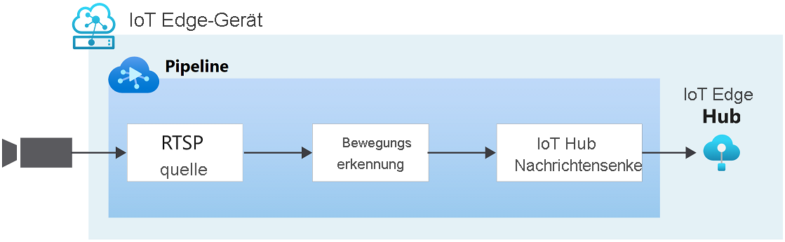

# Schnellstart: Erkennen von Bewegung und Ausgeben von Ereignissen

In dieser Schnellstartanleitung werden die ersten Schritte mit Azure Video Analyzer erläutert. Dabei werden ein virtueller Azure-Computer als IoT Edge-Gerät und ein simulierter Livevideostream verwendet. Nach dem Ausführen der Setupschritte können Sie einen simulierten Livevideostream über eine Videopipeline ausführen, mit der Bewegungen im Stream erkannt und gemeldet werden. Das folgende Diagramm enthält eine grafische Darstellung dieser Pipeline.

> [!div class="mx-imgBorder"]
> :::image type="content" source="./media/get-started-detect-motion-emit-events/motion-detection.svg" alt-text="Bewegungserkennung":::

::: zone pivot="programming-language-csharp"
[!INCLUDE [header](includes/detect-motion-emit-events-quickstart/csharp/header.md)]
::: zone-end

::: zone pivot="programming-language-python"
[!INCLUDE [header](includes/detect-motion-emit-events-quickstart/python/header.md)]
::: zone-end

## Voraussetzungen

::: zone pivot="programming-language-csharp"
[!INCLUDE [prerequisites](./includes/common-includes/csharp-prerequisites.md)]
::: zone-end

::: zone pivot="programming-language-python"
[!INCLUDE [prerequisites](./includes/common-includes/python-prerequisites.md)]
::: zone-end

## Einrichten von Azure-Ressourcen

[!INCLUDE [resources](./includes/common-includes/azure-resources.md)]

## Überblick

In diesem Diagramm ist der Signalfluss dieser Schnellstartanleitung dargestellt. Ein [Edge-Modul](https://github.com/Azure/video-analyzer/tree/main/edge-modules/sources/rtspsim-live555) simuliert eine IP-Kamera, die einen RTSP-Server (Real-Time Streaming Protocol) hostet. Der Knoten einer [RTSP-Quelle](pipeline.md#rtsp-source) ruft den Videofeed von diesem Server ab und sendet Videoframes an den Knoten des [Bewegungserkennungsprozessors](pipeline.md#motion-detection-processor). Mithilfe des Verarbeitungsknotens für die Bewegungserkennung können Sie Bewegungen in Live-Videosignalen erkennen. Er untersucht eingehende Video-Einzelbilder und bestimmt, ob im Video Bewegungen abgebildet sind. Wenn eine Bewegung erkannt wird, leitet er das Videobild an den nächsten Knoten in der Pipeline weiter und gibt ein Ereignis aus. Abschließend werden alle ausgegebenen Ereignisse an die IoT Hub-Nachrichtensenke gesendet, wo sie über IoT Hub veröffentlicht werden.

## Einrichten der Entwicklungsumgebung

::: zone pivot="programming-language-csharp"
[!INCLUDE [setup development environment](./includes/set-up-dev-environment/csharp/csharp-set-up-dev-env.md)]
::: zone-end

::: zone pivot="programming-language-python"
[!INCLUDE [setup development environment](./includes/set-up-dev-environment/python/python-set-up-dev-env.md)]
::: zone-end

## Überprüfen des Beispielvideos

::: zone pivot="programming-language-csharp"
[!INCLUDE [review-sample-video](./includes/detect-motion-emit-events-quickstart/csharp/review-sample-video.md)]
::: zone-end

::: zone pivot="programming-language-python"
[!INCLUDE [review-sample-video](./includes/detect-motion-emit-events-quickstart/python/review-sample-video.md)]
::: zone-end

## Untersuchen der Beispieldateien

::: zone pivot="programming-language-csharp"
[!INCLUDE [examine-sample-files](./includes/detect-motion-emit-events-quickstart/csharp/examine-sample-files.md)]
::: zone-end

::: zone pivot="programming-language-python"
[!INCLUDE [examine-sample-files](./includes/detect-motion-emit-events-quickstart/python/examine-sample-files.md)]
::: zone-end

## Generieren und Bereitstellen des Bereitstellungsmanifests

::: zone pivot="programming-language-csharp"
[!INCLUDE [generate-deploy-deployment-manifest](./includes/detect-motion-emit-events-quickstart/csharp/generate-deploy-deployment-manifest.md)]
::: zone-end

::: zone pivot="programming-language-python"
[!INCLUDE [generate-deploy-deployment-manifest](./includes/detect-motion-emit-events-quickstart/python/generate-deploy-deployment-manifest.md)]
::: zone-end

## Vorbereiten der Überwachung von Ereignissen

::: zone pivot="programming-language-csharp"
[!INCLUDE [prepare-monitor-events](./includes/detect-motion-emit-events-quickstart/csharp/prepare-monitor-events.md)]
::: zone-end

::: zone pivot="programming-language-python"
[!INCLUDE [prepare-monitor-events](./includes/detect-motion-emit-events-quickstart/python/prepare-monitor-events.md)]
::: zone-end

## Ausführen des Beispielprogramms

::: zone pivot="programming-language-csharp"
[!INCLUDE [run-sample-program](./includes/detect-motion-emit-events-quickstart/csharp/run-sample-program.md)]
::: zone-end

::: zone pivot="programming-language-python"
[!INCLUDE [run-sample-program](./includes/detect-motion-emit-events-quickstart/python/run-sample-program.md)]
::: zone-end

## Interpretieren von Ergebnissen

::: zone pivot="programming-language-csharp"
[!INCLUDE [interpret-results](includes/detect-motion-emit-events-quickstart/csharp/interpret-results.md)]
::: zone-end

::: zone pivot="programming-language-python"
[!INCLUDE [interpret-results](includes/detect-motion-emit-events-quickstart/python/interpret-results.md)]
::: zone-end

## Bereinigen von Ressourcen

Falls Sie auch die anderen Schnellstartanleitungen durcharbeiten möchten, sollten Sie die von Ihnen erstellten Ressourcen beibehalten. Navigieren Sie andernfalls im Azure-Portal zu Ihren Ressourcengruppen, wählen Sie die Ressourcengruppe aus, unter der Sie diese Schnellstartanleitung ausgeführt haben, und löschen Sie dann alle Ressourcen.

## Nächste Schritte

- Arbeiten Sie die Schnellstartanleitung zum [Analysieren von Livevideos mit Ihrem eigenen Modell](analyze-live-video-use-your-model-http.md) durch, in der beschrieben wird, wie Sie KI auf Livevideofeeds anwenden.
- Zusätzliches für fortgeschrittene Benutzer:

  - Verwenden Sie eine [IP-Kamera](https://en.wikipedia.org/wiki/IP_camera) mit RTSP-Unterstützung anstelle des RTSP-Simulators. IP-Kameras, die RTSP unterstützen, finden Sie auf der [Seite mit den ONVIF-konformen Produkten](https://www.onvif.org/conformant-products/). Suchen Sie nach Geräten, die mit den Profilen G, S oder T konform sind.
  - Verwenden Sie ein AMD64- oder x64-Linux-Gerät anstelle einer Linux-VM in Azure. Dieses Gerät muss sich im gleichen Netzwerk befinden wie die IP-Kamera. Befolgen Sie die Anleitung unter [Installieren der Azure IoT Edge-Runtime unter Linux](../../iot-edge/how-to-install-iot-edge.md?preserve-view=true&view=iotedge-2020-11). Befolgen Sie anschließend die Anleitung unter [Schnellstart: Bereitstellen Ihres ersten IoT Edge-Moduls auf einem virtuellen Linux-Gerät](../../iot-edge/quickstart-linux.md?preserve-view=true&view=iotedge-2020-11), um das Gerät für Azure IoT Hub zu registrieren.