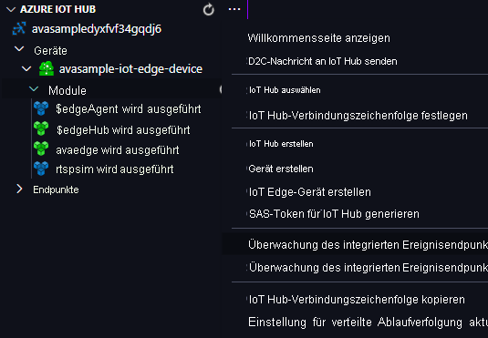

Sie verwenden das Video Analyzer-Edge-Modul, um Bewegungen im eingehenden Livevideostream zu erkennen und Ereignisse an IoT Hub zu senden. Führen Sie zum Anzeigen dieser Ereignisse die folgenden Schritte aus:

1. Öffnen Sie in Visual Studio Code den Explorer-Bereich, und suchen Sie links unten nach „Azure IoT Hub“.
1. Erweitern Sie den Knoten **Geräte**.
1. Klicken Sie mit der rechten Maustaste auf **avasample-iot-edge-device**, und wählen Sie **Start Monitoring Built-in Event Endpoint** (Überwachung des integrierten Ereignisendpunkts starten) aus.

   

> [!NOTE]
> Unter Umständen werden Sie aufgefordert, für die IoT Hub-Instanz die Informationen zum integrierten Endpunkt anzugeben. Sie erhalten diese Informationen, indem Sie im Azure-Portal zu Ihrer IoT Hub-Instanz navigieren und im linken Navigationsbereich nach der Option **Integrierte Endpunkte** suchen. Klicken Sie darauf, und suchen Sie im Abschnitt **Event Hub-kompatibler Endpunkt** nach dem **Event Hub-kompatiblen Endpunkt**. Kopieren und verwenden Sie den im Feld enthaltenen Text. Der Endpunkt sieht in etwa wie folgt aus:  `Endpoint=sb://iothub-ns-xxx.servicebus.windows.net/;SharedAccessKeyName=iothubowner;SharedAccessKey=XXX;EntityPath=<IoT Hub name>`
