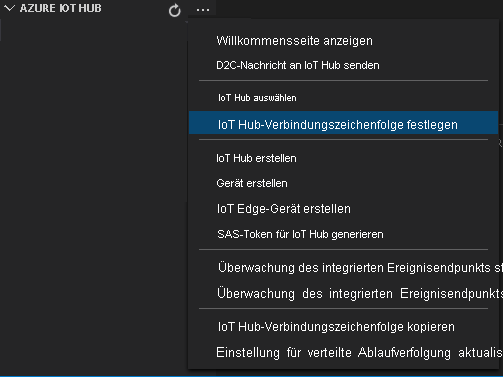
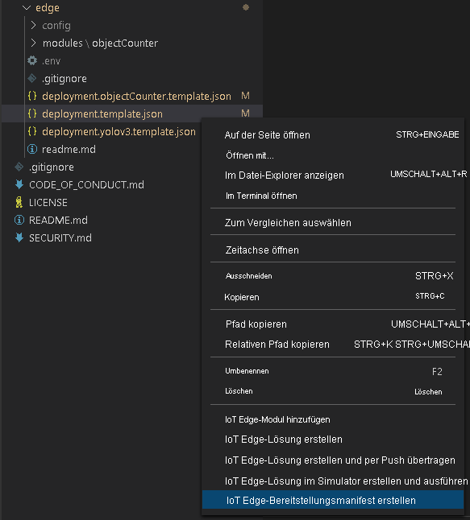

Mit dem Bereitstellungsmanifest wird definiert, welche Module auf einem Edgegerät bereitgestellt werden. Darüber hinaus werden auch die Konfigurationseinstellungen für diese Module definiert.

Führen Sie die folgenden Schritte aus, um das Manifest auf der Grundlage der Vorlagendatei zu generieren und dann auf dem Edgegerät bereitzustellen.

1. Öffnen Sie Visual Studio Code.
1. Wählen Sie neben dem Bereich **AZURE IOT HUB** das Symbol **Weitere Aktionen** aus, um die IoT Hub-Verbindungszeichenfolge festzulegen. Sie können die Zeichenfolge aus der Datei _src/cloud-to-device-console-app/appsettings.json_ kopieren.

    

    [!INCLUDE [provide-builtin-endpoint](../../common-includes/provide-builtin-endpoint.md)]
1. Klicken Sie mit der rechten Maustaste auf **src/edge/deployment.template.json**, und klicken Sie dann auf **IoT Edge-Bereitstellungsmanifest generieren**.

    

    Mit dieser Aktion sollte eine Manifestdatei mit dem Namen _deployment.amd64.json_ im Ordner _src/edge/config_ erstellt werden.
1. Klicken Sie mit der rechten Maustaste auf **src/edge/config/deployment.amd64.json**, und wählen Sie **Create Deployment for Single Device** (Bereitstellung für einzelnes Gerät erstellen) und dann den Namen Ihres Edgegeräts aus.

    
1. Wählen Sie bei Anzeige der Aufforderung zum Auswählen eines IoT Hub-Geräts im Dropdownmenü die Option **avasample-iot-edge-device** aus.
1. Aktualisieren Sie nach ungefähr 30 Sekunden unten links im Fenster den Dienst „Azure IoT Hub“. Das Edge-Gerät zeigt nun die folgenden bereitgestellten Module an:

    - Azure Video Analyzer (Modulname `avaedge`)
    - RTSP-Simulator (Real-Time Streaming Protocol) (Modulname: `rtspsim`)
