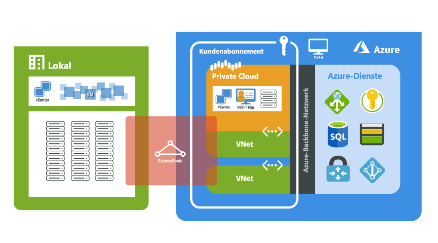

# Was ist Azure VMware Solution?

Azure VMware Solution bietet private Clouds mit vSphere-Clustern, die auf dedizierter Bare-Metal-Azure-Infrastruktur basieren. Die Bereitstellung muss mindestens drei Hosts umfassen. Später können nacheinander weitere Host hinzugefügt werden. Pro Cluster sind bis zu 16 Hosts möglich.  Alle bereitgestellten privaten Clouds verfügen über vCenter Server, vSAN, vSphere und NSX-T. Sie können Workloads aus Ihren lokalen Umgebungen migrieren, neue virtuelle Computer (virtual machines, VMs) bereitstellen und Azure-Dienste über Ihre privaten Clouds nutzen.

Bei Azure VMware Solution handelt es sich um eine von VMware geprüfte Lösung, deren Erweiterungen und Upgrades kontinuierlich geprüft und getestet werden. Infrastruktur und Software für private Clouds werden von Microsoft verwaltet und gepflegt. Dadurch können Sie sich ganz auf die Entwicklung und Ausführung von Workloads in Ihren privaten Clouds konzentrieren. 

Das Diagramm zeigt die Adjazenz zwischen privaten Clouds und VNETs in Azure, Azure-Diensten und lokalen Umgebungen. Der Netzwerkzugriff von privaten Clouds auf Azure-Dienste oder VNETs ermöglicht eine SLA-basierte Integration von Azure-Dienstendpunkten. Über ExpressRoute Global Reach wird Ihre lokale Umgebung mit Ihrer privaten Azure VMware Solution-Cloud verbunden. 

## Hosts, Cluster und private Clouds

Private Azure VMware Solution-Clouds und Cluster basieren auf einem hyperkonvergenten Bare-Metal-Azure-Infrastrukturhost. Die High-End-Hosts verfügen über 576 GB RAM sowie über duale Intel-Prozessoren mit 18 Kernen und 2,3 GHz. Die HE-Hosts sind mit zwei vSAN-Datenträgergruppen mit einer vSAN-Rohkapazitätsebene von 15,36 TB (SSD) und einer vSAN-Cacheebene mit 3,2 TB (NVMe) ausgestattet.

Neue private Clouds werden über das Azure-Portal oder mithilfe der Azure-Befehlszeilenschnittstelle bereitgestellt.

## Netzwerk

[!INCLUDE [avs-networking-description](includes/azure-vmware-solution-networking-description.md)]

Weitere Informationen finden Sie in den [Netzwerkkonzepten](concepts-networking.md).

## Zugriff und Sicherheit

Zur Verbesserung der Sicherheit wird von privaten Azure VMware Solution-Clouds die rollenbasierte Zugriffssteuerung von vSphere verwendet. vSphere-SSO-LDAP-Funktionen können in Azure Active Directory integriert werden. Weitere Informationen finden Sie in den [Zugriffs- und Identitätskonzepten](concepts-identity.md).  

Die vSAN-Verschlüsselung ruhender Daten ist standardmäßig aktiviert und dient zum Schutz des vSAN-Datenspeichers. Weitere Informationen finden Sie in den [Speicherkonzepten](concepts-storage.md).

## Verwaltung des Host- und Softwarelebenszyklus

Durch regelmäßige Upgrades der privaten Azure VMware Solution-Cloud und der VMware-Software wird gewährleistet, dass die Sicherheit, Stabilität und Features Ihrer privaten Clouds immer auf dem neuesten Stand sind. Weitere Informationen finden Sie unter [Azure VMware Solution: Updates und Upgrades für private Clouds](concepts-upgrades.md).

## Überwachen Ihrer privaten Cloud

Nach der Bereitstellung von Azure VMware Solution in Ihrem Abonnement werden automatisch [Azure Monitor-Protokolle](../azure-monitor/overview.md) generiert. 

In Ihrer privaten Cloud haben Sie folgende Möglichkeiten:
- Sammeln von Protokollen auf jedem Ihrer virtuellen Computer
- [Herunterladen und Installieren des MMA-Agents](../azure-monitor/agents/log-analytics-agent.md#installation-options) auf virtuellen Linux- und Windows-Computern
- Aktivieren der [Azure-Diagnoseerweiterung](../azure-monitor/agents/diagnostics-extension-overview.md)
- [Erstellen und Ausführen neuer Abfragen](../azure-monitor/logs/data-platform-logs.md#log-queries)
- Ausführen der gleichen Abfragen, die Sie auch sonst auf Ihren virtuellen Computern ausführen

Überwachungsmuster innerhalb von Azure VMware Solution sind mit virtuellen Azure-Computern auf der IaaS-Plattform vergleichbar. Weitere Informationen und Anleitungen finden Sie unter [Überwachen von virtuellen Azure-Computern mit Azure Monitor](../azure-monitor/vm/monitor-vm-azure.md).

## Nächste Schritte

Machen Sie sich als Nächstes mit zentralen [Konzepten privater Clouds und Cluster](concepts-private-clouds-clusters.md) vertraut.

<!-- LINKS - external -->

<!-- LINKS - internal -->
[concepts-private-clouds-clusters]: ./concepts-private-clouds-clusters.md
