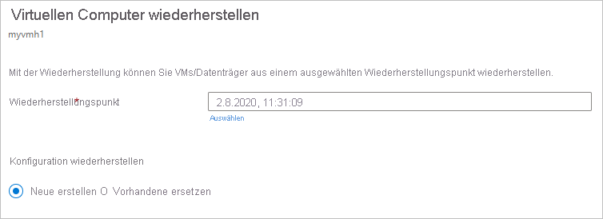
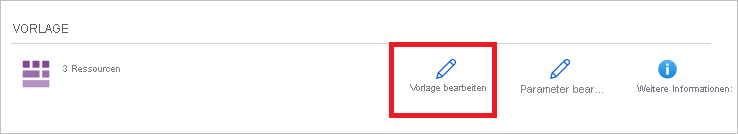
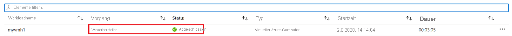

# <a name="how-to-restore-azure-vm-data-in-azure-portal"></a>Wiederherstellen von Azure-VM-Daten im Azure-Portal

Dieser Artikel beschreibt, wie Sie Azure VM-Daten aus den Wiederherstellungspunkten wiederherstellen können, die in [Azure Backup](backup-overview.md) Recovery Services-Tresoren gespeichert sind.

## <a name="restore-options"></a>Wiederherstellungsoptionen

Azure Backup bietet eine Reihe von Möglichkeiten zum Wiederherstellen einer VM.

**Wiederherstellungsoptionen** | **Details**
--- | ---
**Erstellen eines neuen virtuellen Computers** | Sie können schnell eine einfache VM erstellen und können Sie über einen Wiederherstellungspunkt betriebsbereit machen.<br/><br/> Sie können einen Namen für die VM angeben, die Ressourcengruppe und das virtuelle Netzwerk (VNet) auswählen, in dem sie platziert werden soll, und ein Speicherkonto für die wiederhergestellte VM angeben. Die neue VM muss in derselben Region wie die Quell-VM erstellt werden.<br><br>Wenn eine VM-Wiederherstellung fehlschlägt, weil in der angegebenen Region von Azure keine Azure-VM-SKU verfügbar war oder ein anderes Problem auftrat, stellt Azure Backup die Datenträger trotzdem in der angegebenen Ressourcengruppe wieder her.
**Datenträger wiederherstellen** | Stellt einen VM-Datenträger wieder her, der dann zum Erstellen einer neuen VM verwendet werden kann.<br/><br/> Azure Backup bietet eine Vorlage, mit der Sie eine VM anpassen und erstellen können. <br/><br> Der Wiederherstellungsauftrag generiert eine Vorlage, die Sie herunterladen und verwenden können, um benutzerdefinierte VM-Einstellungen festzulegen und eine VM zu erstellen.<br/><br/> Die Datenträger werden in die von Ihnen angegebene Ressourcengruppe kopiert.<br/><br/> Alternativ können Sie den Datenträger an eine vorhandene VM anhängen oder mit PowerShell eine neue VM erstellen.<br/><br/> VM anpassen, Konfigurationseinstellungen hinzufügen möchten, die zum Zeitpunkt der Sicherung nicht vorhanden waren, oder Einstellungen hinzufügen möchten, die mithilfe der Vorlage oder von PowerShell konfiguriert werden müssen.
**Vorhandene ersetzen** | Sie können einen Datenträger wiederherstellen und damit einen Datenträger auf der vorhandenen VM ersetzen.<br/><br/> Der aktuelle virtuelle Computer muss jedoch vorhanden sein. Wenn dieser gelöscht wurde, kann diese Option nicht verwendet werden.<br/><br/> Vor dem Ersetzen des Datenträgers erstellt Azure Backup eine Momentaufnahme der vorhandenen VM und speichert sie im von Ihnen Stagingspeicherort. Vorhandene Datenträger, die mit der VM verbunden sind, werden durch den ausgewählten Wiederherstellungspunkt ersetzt.<br/><br/> Die Momentaufnahme wird in den Tresor kopiert und entsprechend der Aufbewahrungsrichtlinie beibehalten. <br/><br/> Nach dem Ersetzungsvorgang für den Datenträger wird der ursprüngliche Datenträger in der Ressourcengruppe beibehalten. Sie können die ursprünglichen Datenträger manuell löschen, wenn sie nicht mehr benötigt werden. <br/><br/>„Vorhandene ersetzen“ wird für nicht verschlüsselte verwaltete VMs unterstützt, einschließlich VMs, [die mithilfe benutzerdefinierter Images erstellt wurden](https://azure.microsoft.com/resources/videos/create-a-custom-virtual-machine-image-in-azure-resource-manager-with-powershell/). Für klassische VMs wird die Option nicht unterstützt.<br/><br/> Wenn der Wiederherstellungspunkt mehr oder weniger Datenträger als die aktuelle VM aufweist, dann spiegelt die Anzahl der Datenträger im Wiederherstellungspunkt nur die VM-Konfiguration wieder.<br><br> „Vorhandene ersetzen“ wird auch für VMs mit verknüpften Ressourcen unterstützt, z. B. [benutzerseitig zugewiesene verwaltete Identität](../active-directory/managed-identities-azure-resources/overview.md) oder [Key Vault](../key-vault/general/overview.md).
**Regionsübergreifend (sekundäre Region)** | Die regionsübergreifende Wiederherstellung kann verwendet werden, um virtuelle Azure-Computer in der sekundären Region wiederherzustellen, bei der es sich um eine [gepaarte Azure-Region](../best-practices-availability-paired-regions.md#what-are-paired-regions) handelt.<br><br> Wenn die Sicherung in der sekundären Region durchgeführt wird, können Sie alle Azure-VMs für den ausgewählten Wiederherstellungspunkt wiederherstellen.<br><br> Dieses Feature ist für die folgenden Optionen verfügbar:<br> <li> [Erstellen eines virtuellen Computers](#create-a-vm) <br> <li> [Wiederherstellen von Datenträgern](#restore-disks) <br><br> Die Option [Vorhandene Datenträger ersetzen](#replace-existing-disks) wird derzeit nicht unterstützt.<br><br> Berechtigungen<br> Der Wiederherstellungsvorgang in der sekundären Region kann von Sicherungsadministratoren und App-Administratoren durchgeführt werden.

> [!NOTE]
> Sie können auch bestimmte Dateien und Ordner auf einer Azure-VM wiederherstellen. [Weitere Informationen](backup-azure-restore-files-from-vm.md)

## <a name="storage-accounts"></a>Speicherkonten

Einige Details zu Speicherkonten:

- **Virtuellen Computer erstellen:** Wenn Sie einen neuen virtuellen Computer erstellen, wird er im von Ihnen angegebenen Speicherkonto platziert.
- **Datenträger wiederherstellen**: Wenn Sie einen Datenträger wiederherstellen, wird er in das von Ihnen angegebene Speicherkonto kopiert. Der Wiederherstellungsauftrag generiert eine Vorlage, die Sie herunterladen und verwenden können, um benutzerdefinierte VM-Einstellungen festzulegen. Diese Vorlage wird im angegebenen Speicherkonto platziert.
- **Datenträger ersetzen**: Wenn Sie einen Datenträger auf einem vorhandenen virtuellen Computer ersetzen, erstellt Azure Backup eine Momentaufnahme von diesem Computer, bevor der Datenträger ersetzt wird. Die Momentaufnahme wird auch als Hintergrundprozess über die Datenübertragung in den Recovery Services Tresor kopiert. Nachdem die Momentaufnahmenphase abgeschlossen ist, wird der Vorgang zum Ersetzen von Datenträgern ausgelöst. Nach dem Vorgang zum Ersetzen von Datenträgern verbleiben die Datenträger der Azure-Quell-VM in der für den Vorgang angegebenen Ressourcengruppe, und die VHDs werden im angegebenen Speicherkonto gespeichert. Sie können diese VHDs und Datenträger löschen oder beibehalten.
- **Standort des Speicherkontos**: Das Speicherkonto muss sich in derselben Region wie der Tresor befinden. Nur diese Konten werden angezeigt. Wenn es am Standort keine Speicherkonten gibt, müssen Sie ein Konto erstellen.
- **Storage type** (Speichertyp): Blobspeicher wird nicht unterstützt.
- **Speicherredundanz**: Der zonenredundante Speicher (Zone Redundant Storage, ZRS) wird nicht unterstützt. Die Informationen zu Replikation und Redundanz für das Konto stehen hinter in Klammern hinter dem Kontonamen.
- **Storage Premium**:
  - Beim Wiederherstellen von Nicht-Premium-VMs werden Storage Premium-Konten nicht unterstützt.
  - Beim Wiederherstellen von verwalteten VMs werden Storage Premium-Konten, die mit Netzwerkregeln konfiguriert wurden, nicht unterstützt.

## <a name="before-you-start"></a>Vorbereitung

Stellen Sie zum Wiederherstellen einer VM (bzw. zum Erstellen einer neuen VM) sicher, dass Sie über die richtigen [Berechtigungen](backup-rbac-rs-vault.md#mapping-backup-built-in-roles-to-backup-management-actions) der rollenbasierten Zugriffssteuerung von Azure (Role-Based Access Control, Azure RBAC) für den Vorgang „VM wiederherstellen“ verfügen.

Wenn dies nicht zutrifft, können Sie [einen Datenträger wiederherstellen](#restore-disks) und anschließend [mithilfe der Vorlage](#use-templates-to-customize-a-restored-vm), die im Rahmen des Wiederherstellungsvorgangs generiert wurde, eine neue VM erstellen.

[!INCLUDE [backup-center.md](../../includes/backup-center.md)]

## <a name="select-a-restore-point"></a>Auswählen eines Wiederherstellungspunkts

1. Wählen Sie in dem Tresor, der der wiederherzustellenden VM zugeordnet ist, die Option **Sicherungselemente** > **Virtuelle Azure-Computer** aus.
1. Wählen Sie einen virtuellen Computer aus. Standardmäßig werden im VM-Dashboard die Wiederherstellungspunkte der letzten 30 Tage angezeigt. Sie können Wiederherstellungspunkte anzeigen, die älter als 30 Tage sind, oder nach Wiederherstellungspunkten filtern, die auf Daten, Zeitbereichen und verschiedenen Arten von Momentaufnahmen basieren.
1. Wählen Sie die Option **Virtuellen Computer wiederherstellen** aus, um die VM wiederherzustellen.

    

1. Wählen Sie einen Wiederherstellungspunkt für die Wiederherstellung aus.

## <a name="choose-a-vm-restore-configuration"></a>Auswählen einer Konfiguration für die VM-Wiederherstellung

1. Wählen Sie in **Virtuellen Computer wiederherstellen** eine Wiederherstellungsoption aus:
    - **Neue erstellen**: Verwenden Sie diese Option, wenn Sie eine neue VM erstellen möchten. Sie können eine VM mit einfachen Einstellungen erstellen oder einen Datenträger wiederherstellen und eine benutzerdefinierte VM erstellen.
    - **Vorhandene ersetzen**: Verwenden Sie diese Option, wenn Sie Datenträger auf einer vorhandenen VM ersetzen möchten.

        

1. Geben Sie die Einstellungen für die ausgewählte Wiederherstellungsoption an.

## <a name="create-a-vm"></a>Erstellen einer VM

Als eine der [Wiederherstellungsoptionen](#restore-options) können Sie von einem Wiederherstellungspunkt aus schnell eine VM mit Grundeinstellungen erstellen.

1. Wählen Sie unter **Virtuellen Computer wiederherstellen** > **Neu erstellen** > **Wiederherstellungstyp** die Option **Virtuellen Computer erstellen** aus.
1. Geben Sie unter **Name des virtuellen Computers** einen virtuellen Computer an, der nicht im Abonnement vorhanden ist.
1. Wählen Sie unter **Ressourcengruppe** eine vorhandene Ressourcengruppe für den neuen virtuellen Computer aus, oder erstellen Sie eine neue Ressourcengruppe mit einem global eindeutigen Namen. Wenn Sie einen Namen zuweisen, der bereits vorhanden ist, weist Azure der Gruppe denselben Namen wie der VM zu.
1. Wählen Sie unter **Virtuelles Netzwerk** das virtuelle Netzwerk aus, in das der virtuelle Computer platziert wird. Alle dem Abonnement zugeordneten VNETs werden angezeigt. Wählen Sie das Subnetz aus. Das erste Subnetz wird standardmäßig ausgewählt.
1. Geben Sie unter **Stagingspeicherort** das Speicherkonto für die VM an. [Weitere Informationen](#storage-accounts)

    

1. Wählen Sie **Wiederherstellen** aus, um den Wiederherstellungsvorgang zu starten.

## <a name="restore-disks"></a>Wiederherstellen von Datenträgern

Als eine der [Wiederherstellungsoptionen](#restore-options) können einen Datenträger aus einem Wiederherstellungspunkt erstellen. Anschließend können Sie für den Datenträger die folgenden Aktionen durchführen:

- Verwenden Sie die Vorlage, die während des Wiederherstellungsvorgangs generiert wurde, um Einstellungen anzupassen und die Bereitstellung der VM auszulösen. Bearbeiten Sie die Standardeinstellungen für die Vorlage, und übermitteln Sie die Vorlage für die Bereitstellung des virtuellen Computers.
- [Fügen Sie wiederhergestellte Datenträger](../virtual-machines/windows/attach-managed-disk-portal.md) an eine vorhandene VM an.
- [Erstellen Sie eine neue VM](./backup-azure-vms-automation.md#create-a-vm-from-restored-disks) aus den wiederhergestellten Datenträgern mit PowerShell.

1. Wählen Sie unter **Konfiguration wiederherstellen** > **Neu erstellen** > **Wiederherstellungstyp** die Option **Datenträger wiederherstellen** aus.
1. Wählen Sie unter **Ressourcengruppe** eine vorhandene Ressourcengruppe für den wiederhergestellten Datenträger aus, oder erstellen Sie eine neue Ressourcengruppe mit einem global eindeutigen Namen.
1. Geben Sie unter **Stagingspeicherort** das Speicherkonto an, in das die virtuellen Festplatten kopiert werden sollen. [Weitere Informationen](#storage-accounts)

    

1. Wählen Sie **Wiederherstellen** aus, um den Wiederherstellungsvorgang zu starten.

Wenn Ihr virtueller Computer verwaltete Datenträger verwendet und Sie die Option **Virtuellen Computer erstellen** auswählen, wird Azure Backup das angegebene Speicherkonto nicht verwenden. In den Fällen **Wiederherstellen von Datenträgern** und **Sofortige Wiederherstellung** wird das Speicherkonto nur zum Speichern der Vorlage verwendet. Verwaltete Datenträger werden in der angegebenen Ressourcengruppe erstellt.
Wenn Ihr virtueller Computer nicht verwaltete Datenträger verwendet, werden diese als Blobs für das Speicherkonto wiederhergestellt.

### <a name="use-templates-to-customize-a-restored-vm"></a>Verwenden von Vorlagen zum Anpassen eines wiederhergestellten virtuellen Computers

Nachdem der Datenträger wiederhergestellt wurde, verwenden Sie die Vorlage, die im Rahmen der Wiederherstellung erstellt wurde, um eine neue VM anzupassen und zu erstellen:

1. Wählen Sie unter **Sicherungsaufträge** den entsprechenden Wiederherstellungsauftrag aus.

1. Klicken Sie unter **Wiederherstellen** auf **Vorlage bereitstellen**, um die Vorlagenbereitstellung zu initiieren.

    

1. Um die in der Vorlage angegebene VM-Einstellung anzupassen, wählen Sie **Vorlage bearbeiten** aus. Wenn Sie weitere Anpassungen hinzufügen möchten, wählen Sie **Parameter bearbeiten** aus.
    - [Erfahren Sie mehr](../azure-resource-manager/templates/deploy-portal.md#deploy-resources-from-custom-template) zum Bereitstellen von Ressourcen aus einer benutzerdefinierten Vorlage.
    - [Erfahren Sie mehr](../azure-resource-manager/templates/template-syntax.md) zum Erstellen von Vorlagen.

   

1. Geben Sie die benutzerdefinierten Werte für die VM ein, akzeptieren Sie die **Geschäftsbedingungen**, und wählen Sie **Kaufen** aus.

   

## <a name="replace-existing-disks"></a>Ersetzen vorhandener Datenträger

Als eine der [Wiederherstellungsoptionen](#restore-options) können Sie einen vorhandenen VM-Datenträger durch den ausgewählten Wiederherstellungspunkt ersetzen. [Schauen Sie sich alle Wiederherstellungsoptionen an](#restore-options).

1. Wählen Sie unter **Konfiguration wiederherstellen** die Option **Vorhandene ersetzen** aus.
1. Wählen Sie unter **Wiederherstellungstyp** die Option **Datenträger wiederherstellen**. Dies ist der Wiederherstellungspunkt, der zum Ersetzen vorhandener VM-Datenträger verwendet wird.
1. Geben Sie unter **Stagingspeicherort** an, wo Momentaufnahmen der aktuellen verwalteten Datenträger während des Wiederherstellungsvorgangs gespeichert werden sollen. [Weitere Informationen](#storage-accounts)

   

## <a name="cross-region-restore"></a>Regionsübergreifende Wiederherstellung

Als eine der [Wiederherstellungsoptionen](#restore-options) ermöglicht die regionsübergreifende Wiederherstellung (CRR) die Wiederherstellung von virtuellen Azure-Computern in einer sekundären Region, bei der es sich um ein gepaarte Azure-Region handelt.

Informationen zum Integrieren des Features während der Vorschau finden Sie im Abschnitt [Bevor Sie beginnen](./backup-create-rs-vault.md#set-cross-region-restore).

Um festzustellen, ob CRR aktiviert ist, befolgen Sie die Anweisungen unter [Konfigurieren der regionsübergreifenden Wiederherstellung](backup-create-rs-vault.md#configure-cross-region-restore).

### <a name="view-backup-items-in-secondary-region"></a>Anzeigen von Sicherungselementen in der sekundären Region

Wenn CRR aktiviert ist, können Sie die Sicherungselemente in der sekundären Region anzeigen.

1. Navigieren Sie im Portal zu **Recovery Services-Tresor** > **Sicherungselemente**.
1. Wählen Sie **Sekundäre Region** aus, um die Elemente in der sekundären Region anzuzeigen.

>[!NOTE]
>In der Liste werden nur Sicherungsverwaltungstypen angezeigt, die das CRR-Feature unterstützen. Derzeit ist nur die Unterstützung der Wiederherstellung von Daten aus sekundären Regionen in einer sekundären Region zulässig.


### <a name="restore-in-secondary-region"></a>Wiederherstellen in der sekundären Region

Die Benutzeroberfläche zur Wiederherstellung in der sekundären Region ähnelt der Benutzerumgebung für die Wiederherstellung in der primären Region. Wenn Sie Details im Bereich „Wiederherstellungskonfiguration“ festlegen, um Ihre Wiederherstellung zu konfigurieren, werden Sie aufgefordert, nur die Parameter der sekundären Region anzugeben.


- Informationen zum Wiederherstellen und Erstellen eines virtuellen Computers finden Sie unter [Erstellen eines virtuellen Computers](#create-a-vm).
- Informationen zum Wiederherstellen als Datenträger finden Sie unter [Wiederherstellen von Datenträgern](#restore-disks).

>[!NOTE]
>
>- Nachdem die Wiederherstellung ausgelöst wurde und sich in der Datenübertragungsphase befindet, kann der Wiederherstellungsauftrag nicht abgebrochen werden.
>- Das Feature zur regionsübergreifenden Wiederherstellung stellt Azure VMs mit aktivierten CMKs (customer-managed keys, kundenseitig verwaltete Schlüssel), die nicht in einem Recovery Services-Tresor mit aktivierten CMKs gesichert sind, als VMs ohne aktivierte CMKs in der sekundären Region wieder her.
>- Die für die Wiederherstellung in der Sekundärregion erforderlichen Azure-Rollen sind die gleichen wie in der Primärregion.

### <a name="monitoring-secondary-region-restore-jobs"></a>Überwachen von Wiederherstellungsaufträgen für die sekundäre Regionen

1. Navigieren Sie im Portal zu **Recovery Services-Tresor** > **Sicherungsaufträge**.
1. Wählen Sie **Sekundäre Region** aus, um die Elemente in der sekundären Region anzuzeigen.

    

## <a name="restoring-unmanaged-vms-and-disks-as-managed"></a>Wiederherstellen nicht verwalteter VMs und Datenträger als verwaltet

Während der Wiederherstellung erhalten Sie eine Option zum Wiederherstellen [nicht verwalteter Datenträger](../storage/common/storage-disaster-recovery-guidance.md#azure-unmanaged-disks) als [verwaltete Datenträger](../virtual-machines/managed-disks-overview.md). Standardmäßig werden die nicht verwalteten VM/Datenträger auch als nicht verwaltete VM/Datenträger wiederhergestellt. Wenn Sie sie jedoch als verwaltete VMs/Datenträger wiederherstellen möchten, ist dies jetzt möglich. Diese Wiederherstellungen werden nicht in der Momentaufnahmenphase ausgelöst, sondern nur in der Tresorphase. Diese Funktion ist für nicht verwaltete verschlüsselte VMs nicht verfügbar.


## <a name="restore-vms-with-special-configurations"></a>Wiederherstellen von VMs mit besonderen Konfigurationen

Es gibt eine Reihe von häufigen Szenarien, in denen Sie möglicherweise VMs wiederherstellen müssen.

**Szenario** | **Leitfaden**
--- | ---
**Wiederherstellen von VM mit dem Vorteil der Hybridnutzung** | Wenn eine Windows-VM die [Lizenzierung für die Vorteile der Hybridnutzeung (HUB)](../virtual-machines/windows/hybrid-use-benefit-licensing.md) verwendet, stellen Sie die Datenträger wieder her, und erstellen Sie eine neue VM mit der bereitgestellten Vorlage (wobei **Lizenztyp** auf **Windows_Server** festgelegt ist) oder PowerShell.  Diese Einstellung kann auch nach dem Erstellen des virtuellen Computers angewendet werden.
**Wiederherstellen einer VM während einer Azure-Datencenter-Notfallwiederherstellung** | Wenn der Tresor GRS verwendet und das primäre Rechenzentrum für die VM ausfällt, unterstützt Azure Backup die Wiederherstellung von gesicherten VMs im gekoppelten Rechenzentrum. Sie wählen ein Speicherkonto im gekoppelten Rechenzentrum aus, und stellen es wie gewohnt wieder her. Azure Backup verwendet den Computedienst der gekoppelten Region, um die wiederhergestellte VM zu erstellen. Erfahren Sie mehr über die [Resilienz von Rechenzentren](/azure/architecture/resiliency/recovery-loss-azure-region).<br><br> Wenn der Tresor den Replikationstyp GRS verwendet, können Sie das neue Feature [Regionsübergreifende Wiederherstellung](#cross-region-restore) auswählen. Dadurch wird bei einem vollständigen oder teilweisen Ausfall (und auch ohne jegliches Ausfallszenario) die Wiederherstellung in einer zweiten Region ermöglicht.
**Bare-Metal-Wiederherstellung** | Der Hauptunterschied zwischen Azure-VMs und lokalen Hypervisoren ist, dass keine VM-Konsole in Azure verfügbar ist. Eine Konsole ist für bestimmte Szenarien erforderlich, z.B. zur Wiederherstellung mithilfe einer Sicherung vom Typ „Bare-Metal-Recovery“ (BMR). Die VM-Wiederherstellung aus dem Tresor ist jedoch ein vollständiger Ersatz für BMR.
**Wiederherstellen von VMs mit speziellen Netzwerkkonfigurationen** | Spezielle Netzwerkkonfigurationen beinhalten VMs mit internem oder externem Lastausgleich, mit mehreren NICS oder mehreren reservierten IP-Adressen. Diese VMs können Sie mit der [Option zum Wiederherstellen von Datenträgern](#restore-disks) wiederherstellen. Diese Option kopiert die VHDs in das angegebene Speicherkonto, und Sie können dann gemäß Ihrer Konfiguration eine VM mit einem [internen](../load-balancer/quickstart-load-balancer-standard-internal-powershell.md) oder [externen](../load-balancer/quickstart-load-balancer-standard-public-powershell.md) Lastenausgleich, [mehreren NICS](../virtual-machines/windows/multiple-nics.md) oder [mehreren reservierten IP-Adressen](../virtual-network/virtual-network-multiple-ip-addresses-powershell.md) erstellen.
**Netzwerksicherheitsgruppe (NSG) für Netzwerkadapter oder Subnetz** | Die Azure-VM-Sicherung unterstützt die Sicherung und Wiederherstellung von NSG-Informationen auf Vnet-, Subnetz- und NIC-Ebene.
**Zonenkonfigurierte angeheftete VMs** | Wenn Sie einen an eine Zone angehefteten virtuellen Azure-Computer (mit Azure Backup) sichern, können Sie ihn in derselben Zone wiederherstellen, der er angeheftet war. [Weitere Informationen](../availability-zones/az-overview.md)
**Wiederherstellen eines virtuellen Computers in einer beliebigen Verfügbarkeitsgruppe** | Beim Wiederherstellen eines virtuellen Computers über das Portal gibt es keine Möglichkeit, eine Verfügbarkeitsgruppe auszuwählen. Für eine wiederhergestellte VM gibt es keine Verfügbarkeitsgruppe. Falls Sie aber die Option „Datenträger wiederherstellen“ verwenden, können Sie [eine Verfügbarkeitsgruppe](../virtual-machines/windows/tutorial-availability-sets.md) angeben, wenn Sie eine VM vom Datenträger aus mithilfe der bereitgestellten Vorlage oder von PowerShell erstellen.
**Wiederherstellen spezieller VMs wie SQL-VMs** | Wenn Sie eine SQL-VM mithilfe der Azure-VM-Sicherung sichern und dann die Option zum Wiederherstellen der VM verwenden oder eine VM nach dem Wiederherstellen von Datenträgern erstellen, muss die neu erstellte VM beim SQL-Anbieter registriert werden. Die Vorgehensweise ist [hier](../azure-sql/virtual-machines/windows/sql-agent-extension-manually-register-single-vm.md?tabs=azure-cli%2cbash) beschrieben. Dadurch wird die wiederhergestellte VM in eine SQL-VM konvertiert.

### <a name="restore-domain-controller-vms"></a>Wiederherstellen von virtuellen Computern mit Domänencontroller

**Szenario** | **Leitfaden**
--- | ---
**Wiederherstellen einer einzelnen Domänencontroller-VM in einer einzelnen Domäne** | Stellen Sie die VM wie jede andere VM wieder her. Beachten Sie dabei Folgendes:<br/><br/> Aus Active Directory-Sicht entspricht die Azure-VM beliebigen anderen VMs.<br/><br/> Der Verzeichnisdienste-Wiederherstellungsmodus (Directory Services Restore Mode, DSRM) ist ebenfalls verfügbar, sodass alle Active Directory-Wiederherstellungsszenarien realisierbar sind. [Weitere Informationen](#post-restore-steps) zu den Überlegungen zum Sichern und Wiederherstellen virtualisierter Domänencontroller.
**Wiederherstellen mehrerer Domänencontroller-VMs in einer einzelnen Domäne** | Wenn andere Domänencontroller in derselben Domäne über das Netzwerk erreicht werden können, kann der Domänencontroller wie ein beliebiger virtueller Computer wiederhergestellt werden. Wenn es sich um den letzten verbleibenden Domänencontroller in der Domäne handelt oder eine Wiederherstellung in einem isolierten Netzwerk erfolgt, muss ein Vorgang zur [Wiederherstellung der Gesamtstruktur](/windows-server/identity/ad-ds/manage/ad-forest-recovery-single-domain-in-multidomain-recovery) ausgeführt werden.
**Wiederherstellen einer einzelnen Domänencontroller-VM in einer Konfiguration mit mehreren Domänen** |  Wiederherstellen der Datenträger und Erstellen einer VM [mithilfe von PowerShell](backup-azure-vms-automation.md#restore-the-disks)  
**Wiederherstellen mehrerer Domänen in einer Gesamtstruktur** | Wir empfehlen eine [Wiederherstellung der Gesamtstruktur](/windows-server/identity/ad-ds/manage/ad-forest-recovery-single-domain-in-multidomain-recovery).

Weitere Informationen finden Sie unter [Sichern und Wiederherstellen von Active Directory-Domänencontrollern](active-directory-backup-restore.md).

## <a name="track-the-restore-operation"></a>Nachverfolgen des Wiederherstellungsvorgangs

Nachdem Sie den Wiederherstellungsvorgang ausgelöst haben, erstellt der Sicherungsdienst einen Auftrag zum Nachverfolgen. Azure Backup zeigt Benachrichtigungen zum Auftrag im Portal an. Wenn sie nicht angezeigt werden, wählen Sie das Symbol **Benachrichtigungen** und dann **Weitere Ereignisse im Aktivitätsprotokoll** aus, um den Status des Wiederherstellungsvorgangs anzuzeigen.


 Die Wiederherstellung können Sie wie folgt nachverfolgen:

1. Um die Vorgänge für den Auftrag anzuzeigen, wählen Sie den Hyperlink für Benachrichtigungen aus. Alternativ können Sie im Tresor **Sicherungsaufträge** und dann die entsprechende VM auswählen.

    

1. Um den Fortschritt der Wiederherstellung zu überwachen, wählen Sie einen beliebigen Wiederherstellungsauftrag mit dem Status **Wird ausgeführt** aus. Damit wird die Statusanzeige mit Informationen zum Fortschritt der Wiederherstellung anzeigt:

    - **Geschätzte Dauer der Wiederherstellung**: Gibt zunächst an, wieviel Zeit benötigt wird, um den Wiederherstellungsvorgang abzuschließen. Während der Vorgang weiter ausgeführt wird, verringert sich die benötigte Zeit und erreicht schließlich 0, sobald der Wiederherstellungsvorgang abgeschlossen ist.
    - **Prozentsatz der Wiederherstellung**. Zeigt an, wie viel Prozent des Wiederherstellungsvorgangs abgeschlossen sind.
    - **Anzahl der übertragenen Bytes**: Wenn Sie die Wiederherstellung durch Erstellen einer neuen VM durchführen, werden die übertragenen Bytes im Verhältnis zur Gesamtzahl der zu übertragenden Bytes angezeigt.

## <a name="post-restore-steps"></a>Schritte nach der Wiederherstellung

Nach dem Wiederherstellen einer VM gibt es eine Reihe von Dingen zu beachten:

- Erweiterungen, die während der Konfiguration der Sicherung installiert, aber nicht aktiviert sind. Falls ein Problem auftritt, installieren Sie die Erweiterungen neu.
- Wenn die gesicherte VM eine statische IP-Adresse hatte, hat die wiederhergestellte VM eine dynamische IP-Adresse, um Konflikte zu vermeiden. Sie können [eine statische IP-Adresse zur wiederhergestellten VM hinzufügen](/powershell/module/az.network/set-aznetworkinterfaceipconfig#description).
- Für eine wiederhergestellte VM gibt es keine Verfügbarkeitsgruppe. Falls Sie aber die Option „Datenträger wiederherstellen“ verwenden, können Sie [eine Verfügbarkeitsgruppe](../virtual-machines/windows/tutorial-availability-sets.md) angeben, wenn Sie eine VM vom Datenträger aus mithilfe der bereitgestellten Vorlage oder von PowerShell erstellen.
- Bei Verwendung einer Cloud-Init-basierten Linux-Verteilung wie etwa Ubuntu wird das Kennwort aus Sicherheitsgründen nach der Wiederherstellung blockiert. Verwenden Sie zum [Zurücksetzen des Kennworts](../virtual-machines/troubleshooting/reset-password.md) die VMAccess-Erweiterung auf dem wiederhergestellten virtuellen Computer. Wir empfehlen, bei diesen Verteilungen SSH-Schlüssel zu verwenden, sodass Sie das Kennwort nach der Wiederherstellung nicht zurücksetzen müssen.
- Wenn Sie nach der Wiederherstellung nicht auf einen virtuellen Computer zugreifen können, weil die Beziehung zwischen ihm und dem Domänencontroller getrennt wurde, führen Sie die folgenden Schritte aus, um den virtuellen Computer aufzurufen:
  - Fügen Sie den Betriebssystem-Datenträger als Datenträger an eine wiederhergestellte VM an.
  - Wenn der Azure-Agent nicht reagiert, installieren Sie den VM-Agent manuell, indem Sie diesem [Link](../virtual-machines/troubleshooting/install-vm-agent-offline.md) folgen.
  - Aktivieren des Zugriffs auf die serielle Konsole auf der VM, um Befehlszeilenzugriff auf die VM zu ermöglichen

  ```cmd
    bcdedit /store <drive letter>:\boot\bcd /enum
    bcdedit /store <VOLUME LETTER WHERE THE BCD FOLDER IS>:\boot\bcd /set {bootmgr} displaybootmenu yes
    bcdedit /store <VOLUME LETTER WHERE THE BCD FOLDER IS>:\boot\bcd /set {bootmgr} timeout 5
    bcdedit /store <VOLUME LETTER WHERE THE BCD FOLDER IS>:\boot\bcd /set {bootmgr} bootems yes
    bcdedit /store <VOLUME LETTER WHERE THE BCD FOLDER IS>:\boot\bcd /ems {<<BOOT LOADER IDENTIFIER>>} ON
    bcdedit /store <VOLUME LETTER WHERE THE BCD FOLDER IS>:\boot\bcd /emssettings EMSPORT:1 EMSBAUDRATE:115200
    ```

  - Wenn die VM neu erstellt wird, setzen Sie das Konto und Kennwort des lokalen Administrators über das Azure-Portal zurück.
  - Verwenden des Zugriffs auf die serielle Konsole und CMD, um die VM von der Domäne zu trennen

    ```cmd
    cmd /c "netdom remove <<MachineName>> /domain:<<DomainName>> /userD:<<DomainAdminhere>> /passwordD:<<PasswordHere>> /reboot:10 /Force"
    ```

- Nachdem die VM getrennt und neu gestartet wurde, können Sie eine RDP-Verbindung mit der VM mit lokalen Administratoranmeldeinformationen erfolgreich herstellen und die VM erfolgreich wieder der Domäne hinzufügen.

## <a name="backing-up-restored-vms"></a>Sichern von wiederhergestellten VMs

- Wenn Sie eine VM in derselben Ressourcengruppe mit dem Namen der ursprünglich gesicherten VM wiederhergestellt haben, wird die VM nach der Wiederherstellung weiterhin gesichert.
- Wenn Sie die VM in einer anderen Ressourcengruppe wiederhergestellt haben oder einen anderen Namen für die wiederhergestellte VM angegeben haben, müssen Sie die Sicherung für die wiederhergestellte VM einrichten.

## <a name="next-steps"></a>Nächste Schritte

- Wenn während des Wiederherstellungsprozesses Probleme auftreten, lesen Sie die [Informationen](backup-azure-vms-troubleshoot.md#restore) zu häufigen Problemen und Fehlern.
- Lesen Sie nach der Wiederherstellung der VM mehr über [die Verwaltung virtueller Computer](backup-azure-manage-vms.md).
